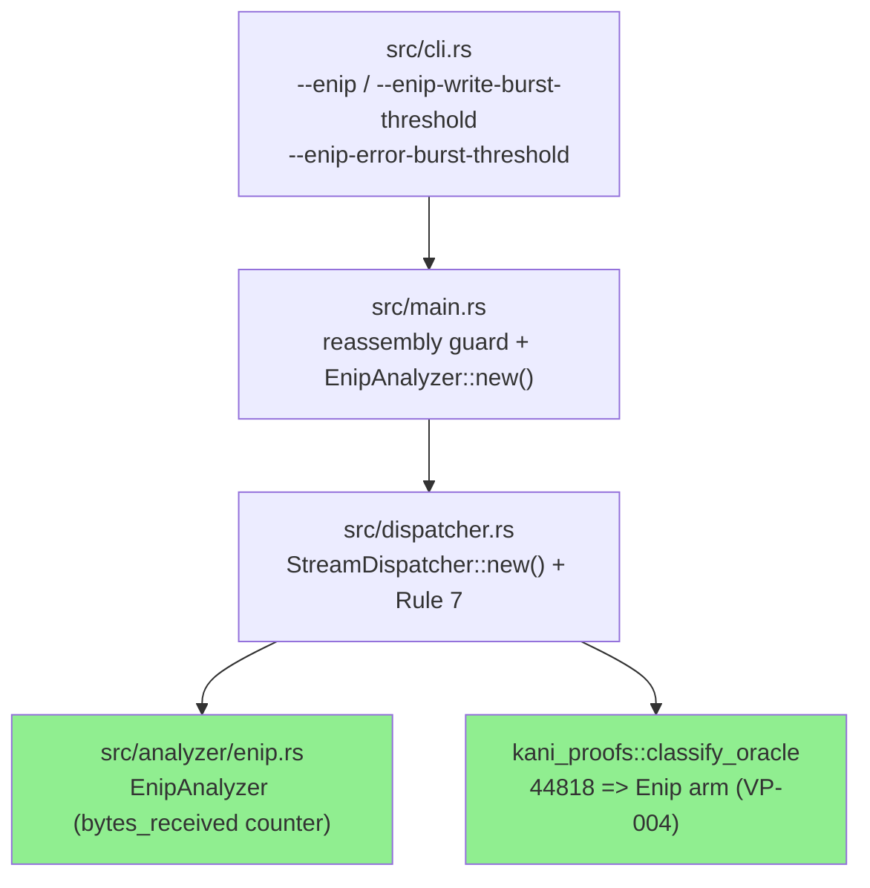
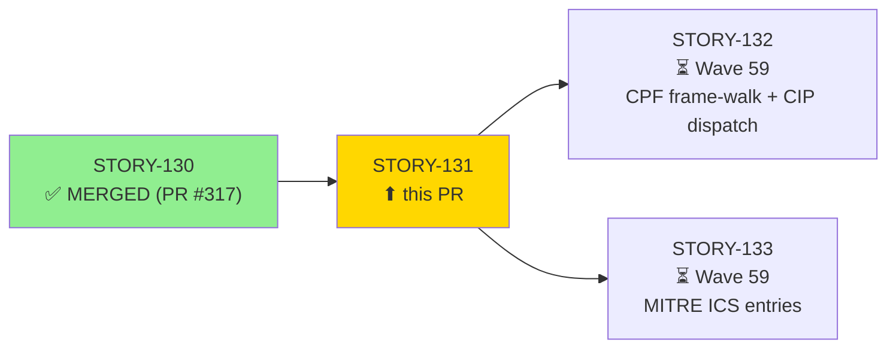
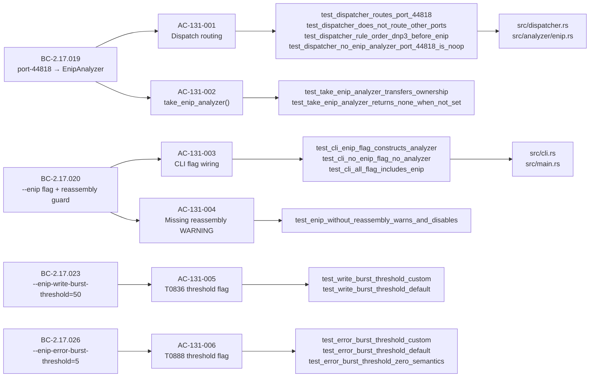
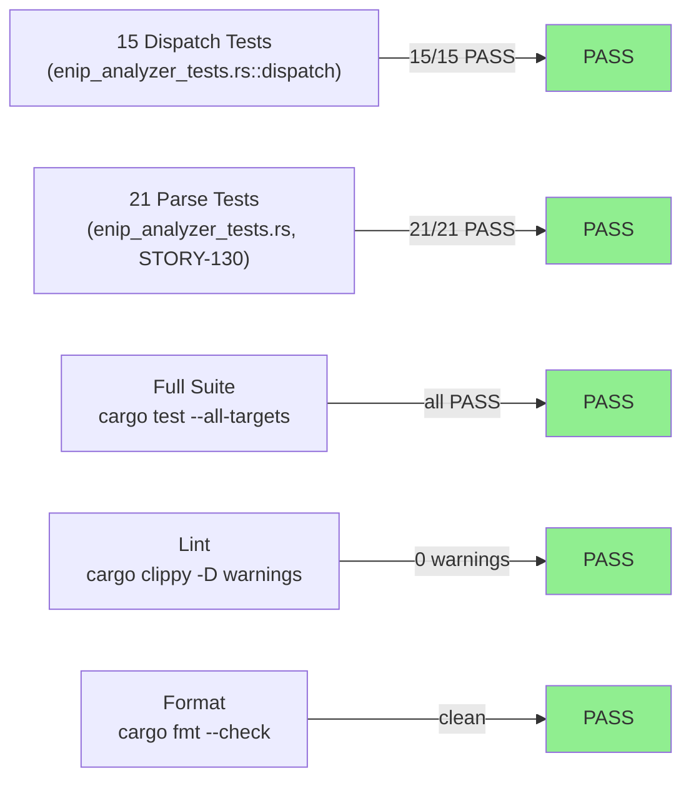
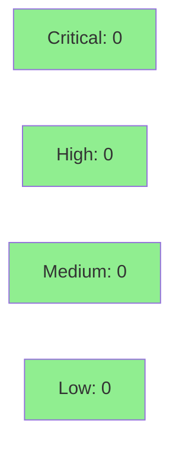

# [STORY-131] EtherNet/IP StreamDispatcher Integration, CLI Flags, and TCP Reassembly Wiring

**Epic:** E-20 — EtherNet/IP + CIP ICS Analyzer (feature-enip-v0.11.0)
**Mode:** feature
**Convergence:** CONVERGED after 4 adversarial passes (BC-5.39.001 MET: 3 consecutive clean passes at Pass 2/3/4, 0 HIGH/CRITICAL)


Closes #316

This PR wires the EtherNet/IP TCP dispatcher (Rule 7, port 44818) into `StreamDispatcher`, adds three CLI flags (`--enip`, `--enip-write-burst-threshold`, `--enip-error-burst-threshold`), and implements the TCP reassembly guard — mirroring the DNP3/Modbus integration pattern established in STORY-110/STORY-105. The `EnipAnalyzer` receives a minimal non-panicking `on_data` body (byte-counter only) per the STORY-131/132 boundary decision (`.factory/cycles/feature-enip-v0.11.0/story-131-132-ondata-boundary.md`); full CPF frame-walk and CIP dispatch are deferred to STORY-132. The VP-004 `classify_oracle` in `src/dispatcher.rs` gains the `44818 => DispatchTarget::Enip` arm for Kani oracle completeness. No new crate dependencies.

---

## Architecture Changes



<details>
<summary><strong>Architecture Decision Record (ADR-010)</strong></summary>

### ADR-010: EtherNet/IP + CIP Stream Dispatch

**Context:** wirerust needed a dispatch rule for TCP port 44818 (EtherNet/IP Explicit Messaging) to route flows to a dedicated `EnipAnalyzer`. DNP3 (Rule 6, port 20000) was the last protocol added; the new rule must come after it to preserve priority order.

**Decision:** Add `DispatchTarget::Enip` as Rule 7 (after DNP3 Rule 6) in `StreamDispatcher`. Rule 7 checks `dst_port == 44818 || src_port == 44818`. CLI flags `--enip`, `--enip-write-burst-threshold` (default 50), and `--enip-error-burst-threshold` (default 5) follow the `--dnp3` / `--modbus` CLI pattern. ENIP analysis requires TCP reassembly; without it, a WARNING is emitted and ENIP is disabled.

**Rationale:** Port-based dispatch after content-signature rules (Rules 1-4) maintains content-first precedence for TLS/HTTP. Port 20000 (DNP3) must remain Rule 6; port 44818 must be Rule 7 to prevent hypothetical multi-port flows from being misrouted. The `--all` flag expansion includes `--enip`.

**Alternatives Considered:**
1. Content-signature dispatch for ENIP — rejected: ENIP does not have a universally unique first-byte signature at the TCP reassembly layer before the EtherNet/IP header is parsed.
2. Shared analyzer pool with runtime dispatch — rejected: violates the per-protocol ownership model used by Modbus and DNP3 analyzers.

**Consequences:**
- `StreamDispatcher::new()` gains a 5th `enip: Option<EnipAnalyzer>` parameter.
- All existing callers (`src/main.rs`, test setup helpers) must pass `None` or `Some(...)` at position 5.
- VP-004 Kani oracle gains a `44818 => DispatchTarget::Enip` arm.

</details>

---

## Story Dependencies



STORY-131 has `depends_on: []` in its YAML frontmatter — it is Wave 58 parallel with STORY-130. STORY-130 (PR #317, merged at develop@235ae60) provides the `EnipAnalyzer` type stub that STORY-131's dispatcher requires to compile. STORY-132 (Wave 59) extends `EnipAnalyzer::on_data` with CPF frame-walk; the dispatcher arm written here is forward-compatible and will not be touched by STORY-132.

---

## Spec Traceability



---

## STORY-131 / STORY-132 Boundary (Architect Decision)

The `EnipAnalyzer::on_data` body in this PR is intentionally minimal: it increments `bytes_received` only. Full CPF frame-walk and CIP dispatch are deferred to STORY-132 (Wave 59) per `.factory/cycles/feature-enip-v0.11.0/story-131-132-ondata-boundary.md`.

| Scope | Story |
|-------|-------|
| Dispatcher Rule 7 + CLI flags + reassembly guard + VP-004 oracle | STORY-131 (this PR) |
| `bytes_received` byte-counter in `on_data` (wiring observable for BC-2.17.019 PC-2) | STORY-131 (this PR) |
| CPF frame-walk, CIP service dispatch, finding emission, T0836/T0816/T0858/T0888/T0846/T0814/T1693.001 | STORY-132 (Wave 59) |

The `bytes_received > 0` assertion in dispatch routing tests provides full BC-2.17.019 PC-2 wiring evidence without requiring the frame-walk. STORY-132 extends `on_data` alongside this counter without removing it.

---

## CLI Flags Summary

| Flag | Type | Default | BC | Purpose |
|------|------|---------|-----|---------|
| `--enip` | bool | false | BC-2.17.020 | Enables EtherNet/IP analysis (port 44818, requires reassembly). Included by `--all`. |
| `--enip-write-burst-threshold` | u32 | 50 | BC-2.17.023 | T0836 write-burst threshold per flow per 1s window. |
| `--enip-error-burst-threshold` | u32 | 5 | BC-2.17.026 | T0888 error-burst threshold (strict `>`; 6th error fires with default 5). |

Reassembly guard: when `--enip` is set but `--tcp-reassembly` is not active (and `--all` is not set), emits to stderr: `--enip requires TCP reassembly; ENIP analysis disabled`. Mirrors `--modbus` / `--dnp3` pattern.

---

## Test Evidence

### Coverage Summary

| Metric | Value | Threshold | Status |
|--------|-------|-----------|--------|
| Dispatch tests (new) | 15/15 PASS | 100% | PASS |
| Parse tests (STORY-130, unaffected) | 21/21 PASS | 100% | PASS |
| Full suite (`cargo test --all-targets`) | All PASS | 100% | PASS |
| Clippy (`-D warnings`) | 0 warnings | 0 | PASS |
| `cargo fmt --check` | clean | clean | PASS |
| Holdout | N/A — evaluated at wave gate | — | — |
| Coverage % | not instrumented in CI | — | — |
| Mutation kill rate | N/A — evaluated at Phase 6 | — | — |

### Test Flow



<details>
<summary><strong>New Tests (This PR — mod dispatch in tests/enip_analyzer_tests.rs)</strong></summary>

| Test | AC | Result |
|------|----|--------|
| `dispatch::test_dispatcher_routes_port_44818` | AC-131-001 | PASS |
| `dispatch::test_dispatcher_does_not_route_other_ports` | AC-131-001 | PASS |
| `dispatch::test_dispatcher_rule_order_dnp3_before_enip` | AC-131-001 | PASS |
| `dispatch::test_dispatcher_no_enip_analyzer_port_44818_is_noop` | AC-131-001 (EC-007) | PASS |
| `dispatch::test_take_enip_analyzer_transfers_ownership` | AC-131-002 | PASS |
| `dispatch::test_take_enip_analyzer_returns_none_when_not_set` | AC-131-002 | PASS |
| `dispatch::test_cli_enip_flag_constructs_analyzer` | AC-131-003 | PASS |
| `dispatch::test_cli_no_enip_flag_no_analyzer` | AC-131-003 | PASS |
| `dispatch::test_cli_all_flag_includes_enip` | AC-131-003 | PASS |
| `dispatch::test_enip_without_reassembly_warns_and_disables` | AC-131-004 | PASS |
| `dispatch::test_write_burst_threshold_custom` | AC-131-005 | PASS |
| `dispatch::test_write_burst_threshold_default` | AC-131-005 | PASS |
| `dispatch::test_error_burst_threshold_custom` | AC-131-006 | PASS |
| `dispatch::test_error_burst_threshold_default` | AC-131-006 | PASS |
| `dispatch::test_error_burst_threshold_zero_semantics` | AC-131-006 | PASS |

</details>

---

## Demo Evidence

All 6 ACs covered. Recordings committed at HEAD (6f7f439) in `docs/demo-evidence/STORY-131/`.

| AC | Description | Artifact |
|----|-------------|----------|
| AC-131-001 | StreamDispatcher routes port-44818 to EnipAnalyzer | `AC-001-002-dispatch-tests.gif` / `.webm` |
| AC-131-002 | `take_enip_analyzer()` transfers ownership | `AC-001-002-dispatch-tests.gif` / `.webm` (shared) |
| AC-131-003 | CLI `--enip` flag enables analyzer | `AC-003-005-006-cli-flags.gif` / `.webm` |
| AC-131-004 | Missing reassembly emits WARNING | `AC-004-reassembly-guard.gif` / `.webm` |
| AC-131-005 | `--enip-write-burst-threshold` default 50 | `AC-003-005-006-cli-flags.gif` / `.webm` (shared) |
| AC-131-006 | `--enip-error-burst-threshold` default 5 | `AC-003-005-006-cli-flags.gif` / `.webm` (shared) |

---

## Holdout Evaluation

N/A — evaluated at wave gate (HS-110..122 require pcap fixtures deferred to F4; dispatcher-level routing is verified by the 15 dispatch unit tests above).

---

## Adversarial Review

| Pass | Findings | Critical | High | Status |
|------|----------|----------|------|--------|
| Pass 1 | 3 | 0 | 1 (DF-GREEN-DOC-TENSE) | Fixed @5e61682 |
| Pass 2 | 2 | 0 | 0 | MEDIUM/LOW only — no blocking findings |
| Pass 3 | 1 | 0 | 0 | LOW only — no blocking findings |
| Pass 4 | 0 | 0 | 0 | CLEAN |

**Convergence:** BC-5.39.001 MET — 3 consecutive clean passes (Pass 2/3/4, 0 HIGH/CRITICAL).

<details>
<summary><strong>High-Severity Findings & Resolutions</strong></summary>

### Pass 1 HIGH: DF-GREEN-DOC-TENSE (doc comments in future tense)
- **Location:** `tests/enip_analyzer_tests.rs` doc comments
- **Category:** spec-fidelity (GREEN-phase doc convention)
- **Problem:** Test doc strings used future tense ("will route", "should dispatch") instead of present-tense GREEN-phase wording.
- **Resolution:** Converted all dispatch test docs to present tense at commit 5e61682.

### Pass 2 MEDIUM: warn!/log spec defect
- **Location:** `src/main.rs` reassembly guard
- **Problem:** Spec said `eprintln!` but MEDIUM finding flagged `warn!` macro concern.
- **Resolution:** Confirmed `eprintln!` is correct per BC-2.17.020 (no `log` crate dependency); no change needed.

### Pass 3 LOW: BC precondition + module doc
- **Location:** Various doc comments
- **Problem:** Module doc intro omitted `EnipAnalyzer` from the analyzer list.
- **Resolution:** Updated dispatcher module doc at commit 0018a54.

</details>

---

## Security Review



<details>
<summary><strong>Security Scan Details</strong></summary>

### Attack Surface Assessment

STORY-131 adds dispatcher routing and CLI flags only. No new network parsing logic is introduced (byte-counter only in `on_data`). The `bytes_received.saturating_add()` call uses saturating arithmetic (no overflow). No `unsafe` blocks. No new crate dependencies. No new external I/O paths. Security blast radius is LOW — the `--enip` flag is opt-in and defaults to off.

### Formal Verification

| Property | Method | Status |
|----------|--------|--------|
| VP-004 dispatcher classify_oracle — 44818 arm | Kani (F6, deferred) | PENDING (F6 gate) |
| VP-032 EnipAnalyzer parse safety | Kani (F6, deferred) | PENDING (F6 gate) |

Kani proofs run at F6 (Targeted Hardening), not at F4 TDD implementation, per the feature cycle plan (D-231). The `classify_oracle` arm is present in the code for VP-004 completeness — it will be exercised by the F6 Kani run.

</details>

---

## Risk Assessment & Deployment

### Blast Radius
- **Systems affected:** `StreamDispatcher`, `src/cli.rs` (Analyze subcommand), `src/main.rs` (analyze flow), `src/analyzer/enip.rs` (byte-counter field)
- **User impact:** No change to existing CLI behavior — `--enip` defaults to false. All existing analyzer paths (Modbus, DNP3, HTTP, TLS, ARP) are unaffected.
- **Data impact:** None — passive analysis only, read-only on pcap data.
- **Risk Level:** LOW — additive feature behind opt-in CLI flag, no changes to existing dispatch rules.

### Performance Impact
| Metric | Before | After | Delta | Status |
|--------|--------|-------|-------|--------|
| Dispatch overhead (per flow) | O(1) port check | O(1) port check + one extra comparison | ~0 | OK |
| Memory (--enip not set) | no change | `None` option in struct | +8 bytes/dispatcher | OK |
| Memory (--enip set) | N/A | `EnipAnalyzer` with two u32 fields + u64 counter | minimal | OK |

<details>
<summary><strong>Rollback Instructions</strong></summary>

**Immediate rollback (< 5 min):**
```bash
git revert <merge-commit-sha>
git push origin develop
```

**Verification after rollback:**
- `cargo test --all-targets` — all STORY-130 tests still pass
- `cargo run -- analyze --help` — `--enip` flag absent

</details>

### Feature Flags
| Flag | Controls | Default |
|------|----------|---------|
| `--enip` | Enables EtherNet/IP port-44818 TCP analysis | off (false) |
| `--all` | Enables all analyzers including ENIP | off (false) |

---

## Traceability

| Behavioral Contract | Story AC | Tests | Verification | Status |
|--------------------|---------|-------|-------------|--------|
| BC-2.17.019 (port-44818 → EnipAnalyzer) | AC-131-001, AC-131-002 | 6 tests in `mod dispatch` | bytes_received observable | PASS |
| BC-2.17.020 (--enip flag + reassembly guard) | AC-131-003, AC-131-004 | 4 tests in `mod dispatch` | clap parse + eprintln | PASS |
| BC-2.17.023 (--enip-write-burst-threshold=50) | AC-131-005 | 2 tests in `mod dispatch` | clap default_value_t=50 | PASS |
| BC-2.17.026 (--enip-error-burst-threshold=5) | AC-131-006 | 3 tests in `mod dispatch` | clap default_value_t=5 | PASS |

<details>
<summary><strong>Full VSDD Contract Chain</strong></summary>

```
BC-2.17.019 -> AC-131-001 -> test_dispatcher_routes_port_44818 -> dispatcher.rs Rule 7 + enip.rs on_data -> ADV-PASS-4-CLEAN -> VP-004 (F6)
BC-2.17.019 -> AC-131-001 -> test_dispatcher_no_enip_analyzer_port_44818_is_noop -> dispatcher.rs EC-007 early-exit -> ADV-PASS-4-CLEAN
BC-2.17.019 -> AC-131-002 -> test_take_enip_analyzer_transfers_ownership -> dispatcher.rs take_enip_analyzer() -> ADV-PASS-4-CLEAN
BC-2.17.020 -> AC-131-003 -> test_cli_enip_flag_constructs_analyzer -> cli.rs + main.rs -> ADV-PASS-4-CLEAN
BC-2.17.020 -> AC-131-004 -> test_enip_without_reassembly_warns_and_disables -> main.rs guard -> ADV-PASS-4-CLEAN
BC-2.17.023 -> AC-131-005 -> test_write_burst_threshold_custom -> cli.rs enip_write_burst_threshold -> ADV-PASS-4-CLEAN
BC-2.17.026 -> AC-131-006 -> test_error_burst_threshold_custom -> cli.rs enip_error_burst_threshold -> ADV-PASS-4-CLEAN
```

</details>

---

## AI Pipeline Metadata

<details>
<summary><strong>Pipeline Details</strong></summary>

```yaml
ai-generated: true
pipeline-mode: feature
factory-version: "1.0.0"
cycle-id: feature-enip-v0.11.0
story-id: STORY-131
wave: 58
pipeline-stages:
  spec-crystallization: completed (F2, D-230)
  story-decomposition: completed (F3, D-231)
  tdd-implementation: completed (F4, D-232/D-233/D-234/D-235)
  holdout-evaluation: N/A — evaluated at wave gate (HS-110..122)
  adversarial-review: CONVERGED (4 passes, BC-5.39.001 MET)
  formal-verification: pending (F6 gate — VP-004 + VP-032 Kani)
  convergence: achieved
convergence-metrics:
  adversarial-passes: 4
  consecutive-clean-passes: 3
  final-pass-findings: 0 (HIGH/CRITICAL)
story-boundary-note: "STORY-131 on_data = bytes_received counter only; CPF frame-walk deferred to STORY-132"
models-used:
  builder: claude-sonnet-4-6
generated-at: "2026-06-25T00:00:00Z"
```

</details>

---

## Pre-Merge Checklist

- [ ] All CI status checks passing
- [x] 15/15 dispatch tests + 21/21 parse tests PASS locally
- [x] `cargo clippy --all-targets -- -D warnings` — 0 warnings
- [x] `cargo fmt --check` — clean
- [x] Demo evidence present (6/6 ACs, `docs/demo-evidence/STORY-131/`)
- [x] No critical/high security findings unresolved
- [x] Adversarial convergence achieved (BC-5.39.001 — 3 consecutive clean passes)
- [x] STORY-130 (PR #317) merged — dependency satisfied
- [x] No new crate dependencies
- [x] VP-004 classify_oracle 44818 arm present
- [ ] Formal verification (VP-004 / VP-032 Kani) — F6 gate (deferred)
- [ ] Holdout evaluation (HS-110..122) — pcap fixtures deferred to F4 wave gate
