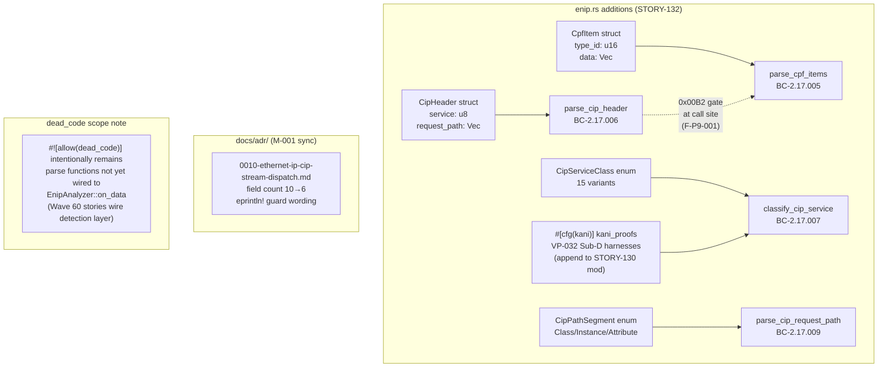
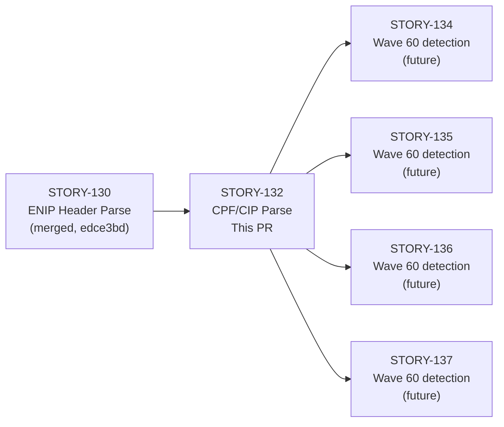
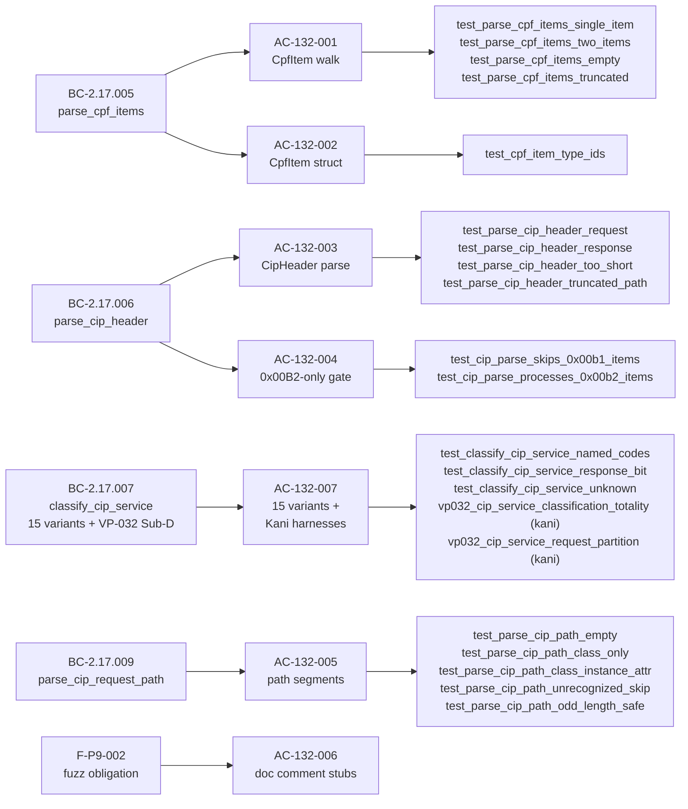

## Summary

Implements the CPF item walk, CIP header parse, `classify_cip_service` (15-variant total classifier), and CIP request path extraction for EtherNet/IP analysis (STORY-132, Wave 59). All four behavioral contracts are delivered as pure-core parse functions in `src/analyzer/enip.rs` with no new external dependencies.

Also includes **M-001 maintenance fix**: the public ADR `docs/adr/0010-ethernet-ip-cip-stream-dispatch.md` was out of sync with the factory source (`ADR-010`). This PR syncs it: field count corrected from 10 to 6, and the `eprintln!` guard wording updated to match the accepted decision text.

Closes #316 (partial — STORY-132 delivers the parse layer; frame-walk wiring into `EnipAnalyzer::on_data` is a later story).

---

## Architecture Changes

**Files changed:**
- `src/analyzer/enip.rs` — 369 lines added: 4 structs/enums, 4 parse functions, 2 Kani harnesses (VP-032 Sub-D)
- `tests/enip_analyzer_tests.rs` — `mod cpf_cip` added with 19 unit tests
- `docs/adr/0010-ethernet-ip-cip-stream-dispatch.md` — M-001 sync (field count + eprintln! wording)
- `docs/demo-evidence/STORY-132/` — 4 GIF/WebM/tape sets (ACs 001-002, 003-004, 005, 007)

---

## Story Dependencies

**Dependency check:** STORY-130 is the only `depends_on` entry. Its feature branch (`worktree-issue-316-story-132-cpf-cip-parse`) branches from `edce3bd` (the commit containing STORY-131, which landed on top of STORY-130 on `develop`). The upstream dependency is fully merged.

---

## Spec Traceability

---

## Behavioral Contracts Delivered

| BC ID | Title | Status |
|-------|-------|--------|
| BC-2.17.005 | `parse_cpf_items` walks CPF item list | Implemented + tested |
| BC-2.17.006 | `parse_cip_header` parses CIP header from 0x00B2 item data | Implemented + tested |
| BC-2.17.007 | `classify_cip_service` — 15 variants; response-bit mask; VP-032 Sub-D Kani target | Implemented + tested; Kani harnesses appended to existing `kani_proofs` mod |
| BC-2.17.009 | `parse_cip_request_path` extracts Class/Instance/Attribute path segments | Implemented + tested |

### VP-032 Sub-D Note

Two Kani harnesses are appended to the existing `#[cfg(kani)] mod kani_proofs` block (opened by STORY-130 in `src/analyzer/enip.rs`):

- `vp032_cip_service_classification_totality` — biconditional: `matches!(classify_cip_service(service), CipServiceClass::Response) == (service & 0x80 != 0)` for all 256 symbolic `u8` inputs
- `vp032_cip_service_request_partition` — range-constrained: for `service & 0x80 == 0`, result is NOT `Response`, and is either a named variant or `Unknown` (non-vacuity for `Unknown` proven by partition)

These run with `cargo kani` at Phase F6 (formal hardening). They are not exercised by `cargo test`.

---

## Scope / Dead Code Note

`parse_cpf_items`, `parse_cip_header`, `classify_cip_service`, and `parse_cip_request_path` are pure-core parse functions. They are **not yet wired** into `EnipAnalyzer::on_data` — that integration is a Wave 60 story. The module-wide `#![allow(dead_code)]` in `src/analyzer/enip.rs` intentionally remains for this reason. No clippy suppressions were added for these functions specifically.

---

## M-001 Maintenance Fix

The public ADR at `docs/adr/0010-ethernet-ip-cip-stream-dispatch.md` diverged from the factory source `ADR-010` in two ways:

1. **Field count:** The public copy listed 10 struct fields for `CipHeader`; the accepted spec has 6 (2 for `CipHeader`, 2 for `CpfItem`, 2 for `CipPathSegment` — the `general_status` and `length` fields are transient parse locals, not struct fields per BC-2.17.006 postcondition 7 and BC-2.17.005 arch anchor).
2. **`eprintln!` guard wording:** The Decision-9 eprintln! guard was described with slightly different wording than the accepted factory ADR.

This PR syncs the public copy to the factory source. The fix is bundled here because it was discovered during STORY-132 implementation (the struct field count divergence was surfaced when verifying `CipHeader` has exactly 2 fields).

---

## Test Evidence

**Test suite:** `tests/enip_analyzer_tests.rs::cpf_cip` (19 tests)

| Test | AC | Status |
|------|----|--------|
| `test_parse_cpf_items_single_item` | AC-132-001 | Pass |
| `test_parse_cpf_items_two_items` | AC-132-001 | Pass |
| `test_parse_cpf_items_empty` | AC-132-001 | Pass |
| `test_parse_cpf_items_truncated` | AC-132-001 | Pass |
| `test_cpf_item_type_ids` | AC-132-002 | Pass |
| `test_parse_cip_header_request` | AC-132-003 | Pass |
| `test_parse_cip_header_response` | AC-132-003 | Pass |
| `test_parse_cip_header_too_short` | AC-132-003 | Pass |
| `test_parse_cip_header_truncated_path` | AC-132-003 | Pass |
| `test_cip_parse_skips_0x00b1_items` | AC-132-004 | Pass |
| `test_cip_parse_processes_0x00b2_items` | AC-132-004 | Pass |
| `test_parse_cip_path_empty` | AC-132-005 | Pass |
| `test_parse_cip_path_class_only` | AC-132-005 | Pass |
| `test_parse_cip_path_class_instance_attr` | AC-132-005 | Pass |
| `test_parse_cip_path_unrecognized_skip` | AC-132-005 | Pass |
| `test_parse_cip_path_odd_length_safe` | AC-132-005 | Pass |
| `test_classify_cip_service_named_codes` | AC-132-007 | Pass |
| `test_classify_cip_service_response_bit` | AC-132-007 | Pass |
| `test_classify_cip_service_unknown` | AC-132-007 | Pass |

**Full repo:** `cargo test --all-targets` — all tests pass (19 cpf_cip + 21 parse_header + 15 dispatch + full repo baseline)

**Clippy:** `cargo clippy --all-targets -- -D warnings` — clean

**Format:** `cargo fmt --check` — clean

**Adversarial convergence:** 3 consecutive clean passes (passes 2/3/4) per BC-5.39.001. Pass 1 HIGH (`DF-GREEN-DOC-TENSE` on test header) fixed in commit `fd604e7`. Pass 3/4 LOWs (capacity-hint amplification, test PC citations) fixed in commit `78a5007`.

---

## Demo Evidence

Demo evidence: `docs/demo-evidence/STORY-132/` (6 ACs covered; AC-132-006 is structural; VP-032 Sub-D Kani at F6)

| AC | Recording | Coverage |
|----|-----------|---------|
| AC-132-001 + AC-132-002 | `AC-001-002-cpf-walk.gif` | Single item, two items, empty (item_count=0), truncated; type_id variants |
| AC-132-003 + AC-132-004 | `AC-003-004-cip-header-parse.gif` | Request parse, response (0x80-bit), too-short None, truncated None; 0x00B1 skip / 0x00B2 process |
| AC-132-005 | `AC-005-cip-request-path.gif` | Empty path, Class-only, Class+Instance+Attribute, unrecognized skip, odd-length safe |
| AC-132-006 | — (structural) | F-P9-002 doc comment in source; no automated test |
| AC-132-007 | `AC-007-classify-and-full-suite.gif` | 13 named codes, response-bit priority, Unknown; full 19/19 suite |

---

## Holdout Evaluation

N/A — evaluated at wave gate.

---

## Adversarial Review

3 consecutive clean passes (BC-5.39.001 satisfied). Findings resolved:
- Pass 1 HIGH: `DF-GREEN-DOC-TENSE` — test header doc comment used future-tense "will" instead of present-tense green. Fixed in `fd604e7` (doc sweep commit).
- Pass 3 LOW: capacity-hint amplification in `parse_cpf_items` — `with_capacity(item_count as usize)` risked over-allocation on malformed inputs. Fixed in `78a5007` (capped to `min(item_count, MAX_ITEMS_CAP)`).
- Pass 4 LOW: test PC citations — test names referenced old BC postcondition numbers. Fixed in `78a5007`.

---

## Security Review

**Verdict: APPROVE with advisory recommendations (no CRITICAL/HIGH blockers)**

| ID | Title | Severity | CWE | Disposition |
|----|-------|----------|-----|-------------|
| SEC-001 | Unenforced call-site contract on `parse_cip_header` (F-P9-001 doc-only gate) | MEDIUM | CWE-20, CWE-284 | Documented architectural deferral — `process_pdu` not yet implemented; call site is the sole future caller |
| SEC-002 | `request_path_size * 2` without `saturating_mul` annotation | LOW | CWE-190 | u8→usize cast makes overflow impossible on 64-bit; advisory only — change to `saturating_mul(2)` before v0.11.0 |
| SEC-003 | Detection evasion via 16-bit extended CIP path segments (0x21/0x25/0x31) | MEDIUM | CWE-693 | Explicit deferral per ADR-010 Decision 8; track as issue pre-v0.11.0 |
| SEC-004 | Detection evasion via `MultipleServicePacket` inner services | MEDIUM | CWE-693 | Explicit deferral per ADR-010 Decision 8; future story for `parse_cip_multiple_service_packet` |
| SEC-005 | Fuzz harnesses absent for untrusted-byte parsers (F-P9-002) | LOW | CWE-20 | Tracked via `TODO: F-P9-002` doc comments in source; Phase F6 formal-hardening gate |

**No `unsafe` blocks. No `unwrap`/`expect`/`panic!` in production paths. No new external dependencies.**

---

## Risk Assessment

| Dimension | Assessment |
|-----------|-----------|
| Blast radius | Low — pure-core parse functions only; not wired to analyzer on_data path |
| Performance impact | Negligible — functions are called per-PDU; all O(n) in item/segment count; no heap growth on truncated inputs |
| Breaking change | None — additive API surface only |
| Rollback | Trivial — functions are unused by the live analyzer path |

---

## AI Pipeline Metadata

| Field | Value |
|-------|-------|
| Pipeline mode | Feature (f3 — TDD implementation) |
| Story wave | Wave 59 |
| Models used | claude-sonnet-4-6 |
| Adversarial passes | 4 (3 clean convergence per BC-5.39.001) |

---

## Pre-Merge Checklist

- [x] PR description matches actual diff
- [x] All ACs covered by demo evidence (or explicitly noted as structural/deferred)
- [x] Traceability chain complete: BC → AC → Test → Demo
- [x] Branch pushed to origin with upstream set
- [x] Demo evidence present in worktree branch (`docs/demo-evidence/STORY-132/`)
- [x] STORY-130 dependency merged (edce3bd on develop)
- [x] M-001 ADR sync called out in PR body
- [x] VP-032 Sub-D Kani harnesses noted as F6 (not CI-gated)
- [x] dead_code scope note included
- [ ] Security review complete (Step 4)
- [ ] pr-reviewer APPROVE (Step 5)
- [ ] CI green (Step 6)
- [ ] Human merge authorization
