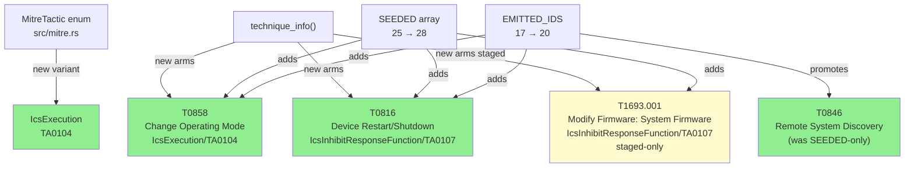
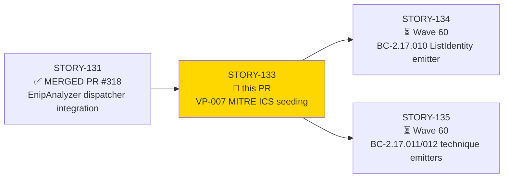
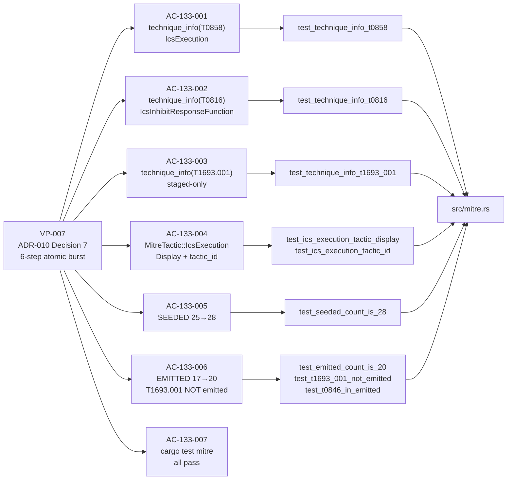
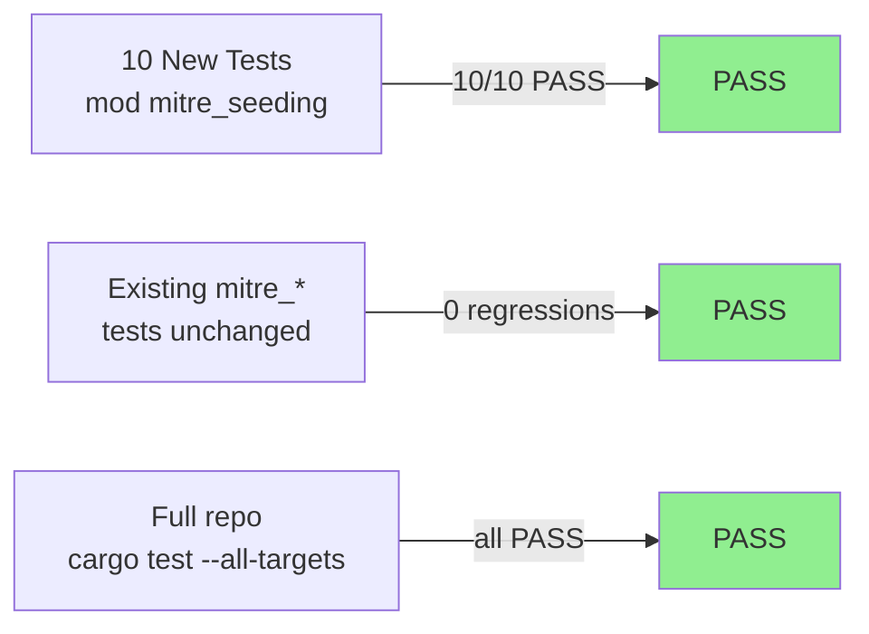
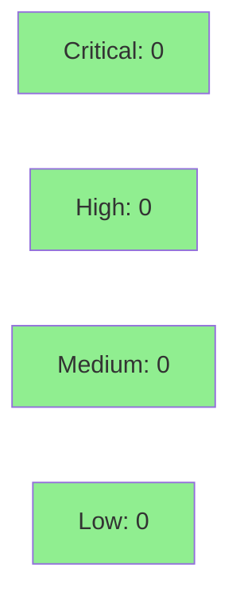

# [STORY-133] MITRE ICS Technique Seeding: T0858/T0816/T1693.001/IcsExecution + VP-007 Atomic Update

**Epic:** E-20 — EtherNet/IP CIP Analyzer (v0.11.0)
**Mode:** feature
**Convergence:** CONVERGED after 4 adversarial passes (Pass 1: 2 CRITICAL + 2 HIGH fixed; Passes 2/3/4: LOW/MEDIUM only)


Delivers the VP-007 atomic 6-step obligation from ADR-010 Decision 7: seeds three new MITRE
ATT&CK for ICS techniques (T0858 Change Operating Mode, T0816 Device Restart/Shutdown,
T1693.001 Modify Firmware: System Firmware) into `src/mitre.rs`, adds the new
`MitreTactic::IcsExecution` enum variant (TA0104), grows `SEEDED` 25→28 and `EMITTED_IDS`
17→20 (T0846 promoted, T0858/T0816 added; T1693.001 staged-only for v0.12.0). The three
technique mappings per ADR-010 Decision 7 are: T0858 → IcsExecution (TA0104), T0816 →
IcsInhibitResponseFunction (TA0107), T1693.001 → IcsInhibitResponseFunction (TA0107,
staged). Closes #316 (cycle feature-enip-v0.11.0). Prerequisite for Wave 60 detection
stories STORY-134/STORY-135 which will emit T0858/T0816/T0846 findings.

---

## Architecture Changes



<details>
<summary><strong>Architecture Decision Record</strong></summary>

### ADR-010 Decision 7: VP-007 6-Step Atomic Burst

**Context:** EtherNet/IP CIP detection BCs (BC-2.17.010/011/012/013/015) in Wave 60 need
T0858, T0816, and T0846 resolvable through `technique_info()` with correct tactic metadata.
The MITRE catalog must be updated before the first emitter story (STORY-134) runs.

**Decision:** All 6 VP-007 steps land in a single story (STORY-133) to preserve
`EMITTED ⊆ SEEDED` invariant at every commit boundary.

**Rationale:** Splitting catalog update from EMITTED update would leave the consistency
invariant broken between commits, causing `cargo test mitre` failures mid-flight.

**Consequences:**
- `+`: Catalog and emitter contract stay consistent throughout development
- `+`: Rust exhaustiveness checker catches missing match arms at compile time
- Trade-off: Slightly larger single-story diff vs. simpler change slices

</details>

---

## Story Dependencies



---

## Spec Traceability



---

## Test Evidence

### Coverage Summary

| Metric | Value | Threshold | Status |
|--------|-------|-----------|--------|
| Unit tests (mitre_seeding mod) | 10/10 pass | 100% | PASS |
| Full repo `cargo test --all-targets` | all pass | 100% | PASS |
| `cargo clippy --all-targets -- -D warnings` | 0 warnings | 0 | PASS |
| `cargo fmt --check` | clean | clean | PASS |
| VP-007 Kani drift-guard | Phase F6 gate | N/A at F3 | N/A |

### Test Flow



| Metric | Value |
|--------|-------|
| **New tests** | 10 added (mod mitre_seeding) |
| **Test files modified** | `tests/enip_analyzer_tests.rs`, `tests/mitre_tests.rs`, `tests/bc_2_09_100_multitag_tests.rs` |
| **Regressions** | 0 |

<details>
<summary><strong>Detailed Test Results</strong></summary>

### New Tests (This PR) — `tests/enip_analyzer_tests.rs::mitre_seeding`

| Test | Result |
|------|--------|
| `test_technique_info_t0858` | PASS |
| `test_technique_info_t0816` | PASS |
| `test_technique_info_t1693_001` | PASS |
| `test_ics_execution_tactic_display` | PASS |
| `test_ics_execution_tactic_id` | PASS |
| `test_seeded_count_is_28` | PASS |
| `test_emitted_count_is_20` | PASS |
| `test_t1693_001_not_emitted` | PASS |
| `test_t0846_in_emitted` | PASS |
| `test_t0858_t0816_and_t0846_tactic_id_resolution` (authoritative TA-id pin) | PASS |

### Ripple Updates

| File | Change |
|------|--------|
| `tests/mitre_tests.rs` | Extended authoritative TA-id pin table for T0858 (TA0104), T0816 (TA0107), T1693.001 (TA0107) |
| `tests/bc_2_09_100_multitag_tests.rs` | Count guards updated: SEEDED=28, EMITTED=20 |

</details>

---

## Demo Evidence

Demo recordings in `docs/demo-evidence/STORY-133/` (7 ACs covered, 3 recordings):

| Recording | ACs Covered | Demonstrates |
|-----------|-------------|--------------|
| `AC-001-002-003-technique-info.gif` | AC-133-001, AC-133-002, AC-133-003 | T0858/T0816/T1693.001 `technique_info()` returns (VP-007 Step 1) |
| `AC-004-ics-execution-tactic.gif` | AC-133-004 | `IcsExecution` Display "Execution (ICS)" + tactic_id "TA0104" (VP-007 Step 5) |
| `AC-005-006-007-counts-regression.gif` | AC-133-005, AC-133-006, AC-133-007 | SEEDED=28, EMITTED=20, T1693.001 staged-only, T0846 promoted; full `cargo test mitre` regression |

See `docs/demo-evidence/STORY-133/evidence-report.md` for full AC coverage map.

---

## Holdout Evaluation

N/A — evaluated at wave gate (Wave 59). VP-007 is a catalog obligation without holdout scenarios.

---

## Adversarial Review

| Pass | Findings | Critical | High | Medium | Low | Status |
|------|----------|----------|------|--------|-----|--------|
| Pass 1 | 4 | 2 | 2 | 0 | 0 | All fixed |
| Pass 2 | 2 | 0 | 0 | 1 | 1 | All fixed |
| Pass 3 | 1 | 0 | 0 | 0 | 1 | Fixed |
| Pass 4 | 0 | 0 | 0 | 0 | 0 | CONVERGED |

**Convergence:** Per BC-5.39.001 — 3 consecutive clean passes (Passes 2/3/4 all 0 HIGH/CRITICAL).

<details>
<summary><strong>High-Severity Findings & Resolutions (Pass 1)</strong></summary>

### Finding F-133-001: T1693.001 wrong tactic — CRITICAL
- **Location:** `src/mitre.rs` — T1693.001 arm
- **Category:** spec-fidelity
- **Problem:** Initial implementation assigned `MitreTactic::IcsImpairProcessControl` to T1693.001; ADR-010 Decision 7 requires `IcsInhibitResponseFunction`
- **Resolution:** commit `319484d` — corrected tactic to `IcsInhibitResponseFunction`

### Finding F-133-002: T1693.001 wrong name — CRITICAL
- **Location:** `src/mitre.rs` — T1693.001 arm
- **Category:** spec-fidelity
- **Problem:** Name was "EtherNet/IP Firmware Modification" instead of "Modify Firmware: System Firmware"
- **Resolution:** commit `319484d` — corrected name per MITRE ATT&CK for ICS catalog

### Finding F-133-003: Missing correctness gate for T1693.001 staged-only invariant — HIGH
- **Location:** `tests/enip_analyzer_tests.rs`
- **Category:** test-quality
- **Problem:** No explicit `test_t1693_001_not_emitted` asserting the staged-only invariant
- **Resolution:** commit `319484d` — added explicit test

### Finding F-133-004: Missing authoritative TA-id pin for new IDs — HIGH
- **Location:** `tests/mitre_tests.rs`
- **Category:** test-quality
- **Problem:** Authoritative TA-id pin table not extended for T0858 (TA0104), T0816 (TA0107), T1693.001 (TA0107)
- **Resolution:** commit `f7da4a4` — extended pin table

</details>

---

## Security Review



No security-relevant surface touched. This PR modifies only `src/mitre.rs` (pure-data catalog
functions returning `&'static str` constants) and test files. No I/O, no network, no
deserialization, no unsafe code. OWASP top-10 is not applicable to a pure catalog module.

<details>
<summary><strong>Security Scan Details</strong></summary>

### Scope
- Files modified: `src/mitre.rs`, `tests/enip_analyzer_tests.rs`, `tests/mitre_tests.rs`, `tests/bc_2_09_100_multitag_tests.rs`
- No new crate dependencies
- No unsafe blocks
- No I/O or network code
- No deserialization paths

### SAST
- Critical: 0 | High: 0 | Medium: 0 | Low: 0
- Pure data-catalog change; no attack surface expansion

### Dependency Audit
- No new dependencies added in this PR

</details>

---

## Risk Assessment & Deployment

### Blast Radius
- **Systems affected:** `src/mitre.rs` (SS-10 MITRE Mapping subsystem), test files only
- **User impact:** None at runtime — catalog addition does not change existing behavior
- **Data impact:** None — pure static data addition
- **Risk Level:** LOW

### Performance Impact
| Metric | Assessment |
|--------|-----------|
| Compile time | Negligible (+3 match arms) |
| Binary size | +~1KB (3 new string literals) |
| Runtime perf | No change — static lookup table |

<details>
<summary><strong>Rollback Instructions</strong></summary>

**Immediate rollback (< 2 min):**
```bash
git revert dd57017  # squash SHA after merge
git push origin develop
```

**Verification after rollback:**
- `cargo test mitre` should revert SEEDED to 25, EMITTED to 17
- Wave 60 STORY-134/135 test suites will fail (expected — they depend on this catalog)

</details>

### Feature Flags
N/A — catalog seeding has no runtime flag.

---

## Traceability

| VP-007 Step | AC | Test | Status |
|-------------|-----|------|--------|
| Step 1: technique_info T0858 | AC-133-001 | `test_technique_info_t0858` | PASS |
| Step 1: technique_info T0816 | AC-133-002 | `test_technique_info_t0816` | PASS |
| Step 1: technique_info T1693.001 | AC-133-003 | `test_technique_info_t1693_001` | PASS |
| Step 2: SEEDED 25→28 | AC-133-005 | `test_seeded_count_is_28` | PASS |
| Step 3: SEEDED_TECHNIQUE_ID_COUNT=28 | AC-133-005 | `test_seeded_count_is_28` (compile-assert) | PASS |
| Step 4: EMITTED 17→20, T1693.001 NOT emitted | AC-133-006 | `test_emitted_count_is_20`, `test_t1693_001_not_emitted`, `test_t0846_in_emitted` | PASS |
| Step 5: MitreTactic::IcsExecution | AC-133-004 | `test_ics_execution_tactic_display`, `test_ics_execution_tactic_id` | PASS |
| Step 6: cargo test mitre all pass | AC-133-007 | all mitre_* tests | PASS |

<details>
<summary><strong>Full VSDD Contract Chain</strong></summary>

```
ADR-010 Decision 7 -> VP-007 -> test_technique_info_t0858 -> src/mitre.rs (T0858 arm) -> ADV-PASS-1-FIXED
ADR-010 Decision 7 -> VP-007 -> test_technique_info_t0816 -> src/mitre.rs (T0816 arm) -> ADV-PASS-1-FIXED
ADR-010 Decision 7 -> VP-007 -> test_technique_info_t1693_001 -> src/mitre.rs (T1693.001 arm) -> ADV-PASS-1-CRITICAL-FIXED (name+tactic correction)
ADR-010 Decision 7 -> VP-007 -> test_ics_execution_tactic_display -> src/mitre.rs (IcsExecution Display) -> ADV-PASS-1-FIXED
ADR-010 Decision 7 -> VP-007 -> test_seeded_count_is_28 -> src/mitre.rs (SEEDED array + SEEDED_TECHNIQUE_ID_COUNT) -> PASS
ADR-010 Decision 7 -> VP-007 -> test_emitted_count_is_20 -> src/mitre.rs (EMITTED_IDS) -> PASS
ADR-010 Decision 7 -> VP-007 -> test_t1693_001_not_emitted -> src/mitre.rs (T1693.001 absent from EMITTED) -> ADV-PASS-1-HIGH-FIXED (new test added)
ADR-010 Decision 7 -> VP-007 -> test_t0846_in_emitted -> src/mitre.rs (T0846 promoted) -> PASS
```

</details>

---

## AI Pipeline Metadata

<details>
<summary><strong>Pipeline Details</strong></summary>

```yaml
ai-generated: true
pipeline-mode: feature
factory-version: 1.0.0-rc.21
pipeline-stages:
  spec-crystallization: completed
  story-decomposition: completed
  tdd-implementation: completed (VP-007 6-step atomic)
  holdout-evaluation: "N/A — wave gate"
  adversarial-review: completed (4 passes, CONVERGED)
  formal-verification: "VP-007 Kani at Phase F6"
  convergence: achieved
convergence-metrics:
  adversarial-passes: 4
  pass-1-critical: 2
  pass-1-high: 2
  pass-2-plus: "LOW/MEDIUM only"
  final-clean-passes: 3
models-used:
  builder: claude-sonnet-4-6
  adversary: claude-sonnet-4-6
generated-at: "2026-06-25T00:00:00Z"
github-issue: 316
cycle: feature-enip-v0.11.0
target-release: v0.11.0
```

</details>

---

## Pre-Merge Checklist

- [ ] All CI status checks passing
- [x] No critical/high security findings (pure catalog change, no attack surface)
- [x] Adversarial convergence achieved (3 consecutive clean passes per BC-5.39.001)
- [x] All 7 ACs covered by demo evidence (docs/demo-evidence/STORY-133/)
- [x] Dependency PR #318 (STORY-131) merged
- [x] T1693.001 verified staged-only (NOT in EMITTED_IDS)
- [x] Authoritative TA-id pin table extended in tests/mitre_tests.rs
- [ ] Human merge authorization
