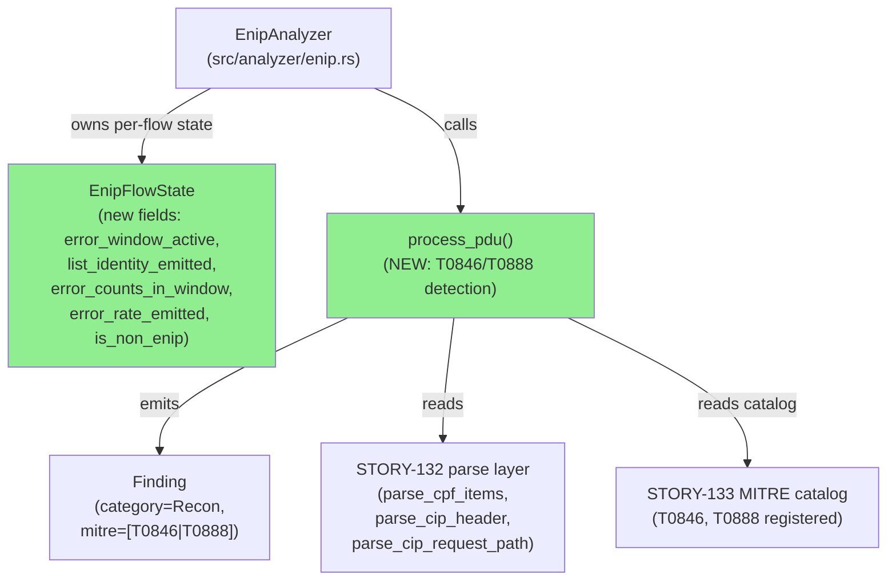
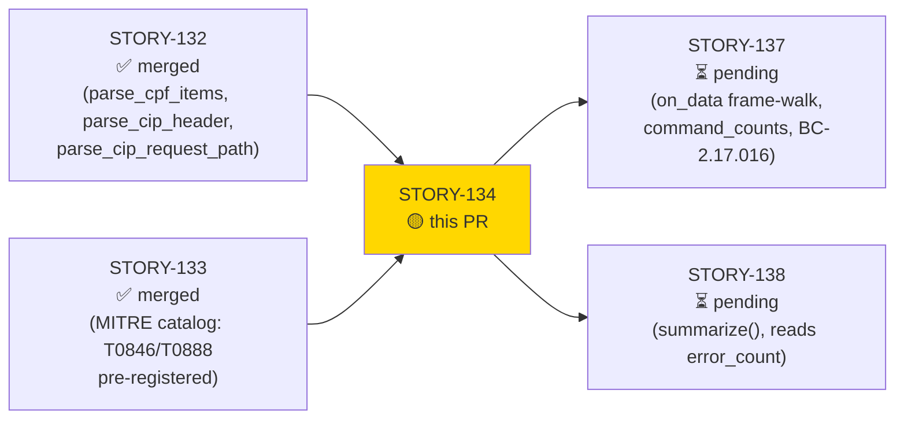
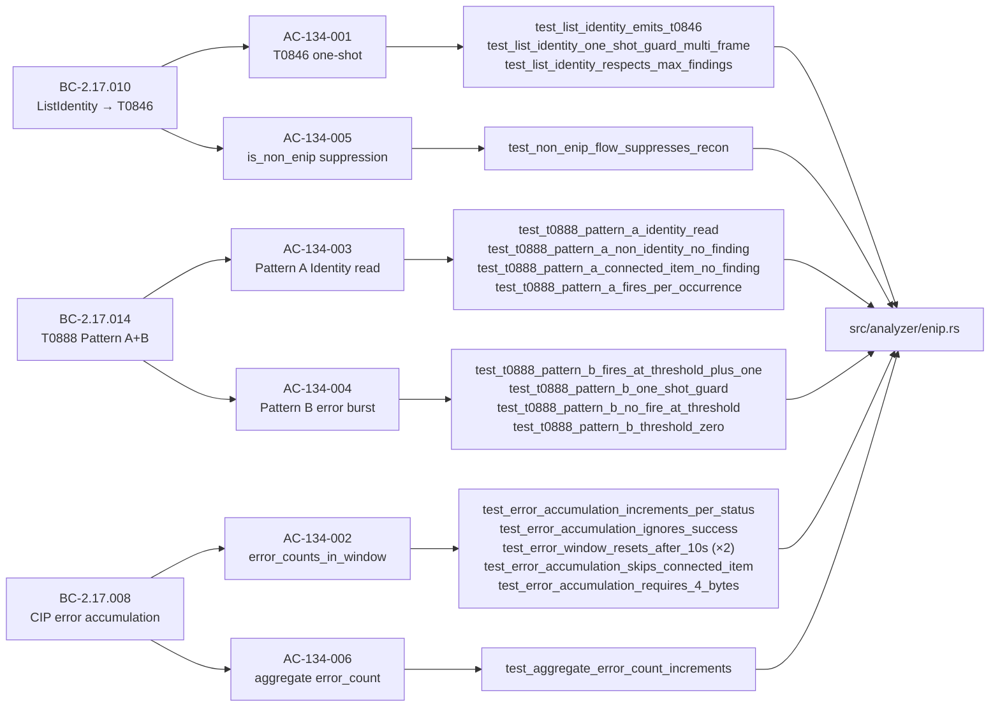
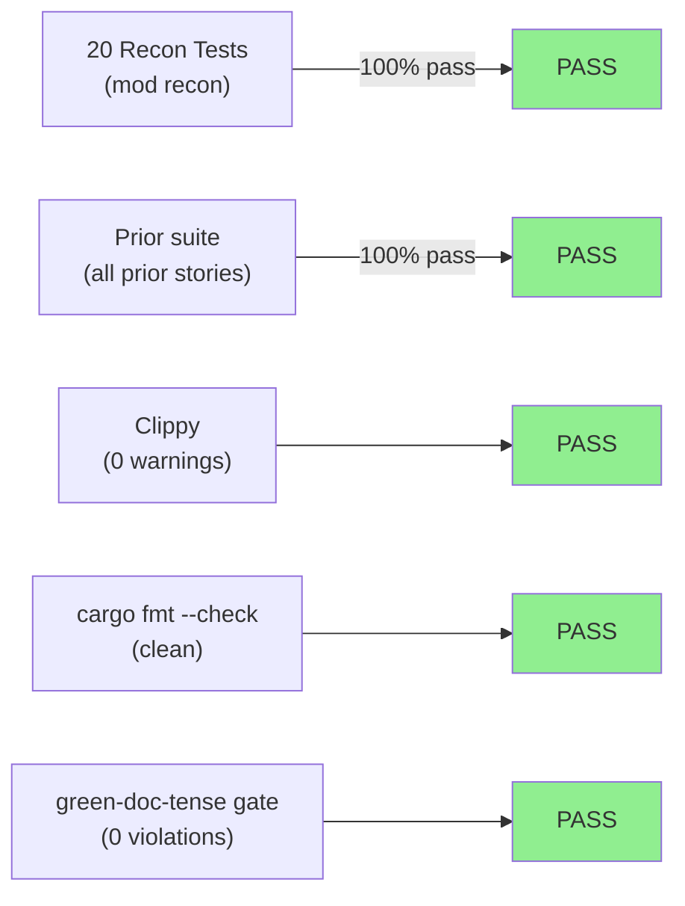
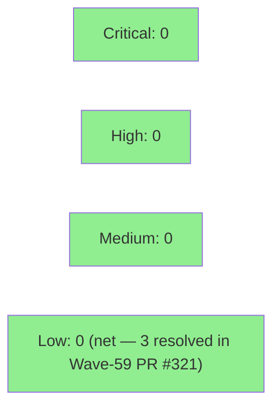

# [STORY-134] ENIP Recon Detections: T0846 ListIdentity, T0888 Identity Read / Error Burst, and CIP Error Accumulation

**Epic:** E-20 — EtherNet/IP Protocol Analyzer (v0.11.0)
**Mode:** feature
**Convergence:** CONVERGED after 3 adversarial passes (M/N/O — 0 HIGH/CRITICAL per BC-5.39.001)


Implements `EnipAnalyzer::process_pdu` — the main effectful detection dispatch for EtherNet/IP recon
threats — covering three behavioral contracts: BC-2.17.010 (T0846 ListIdentity one-shot), BC-2.17.008
(CIP error-response accumulation with `error_window_active` sentinel), and BC-2.17.014 (T0888 Pattern A
per-occurrence Identity Object reads + Pattern B error-burst one-shot). Also adds `EnipFlowState` fields
(`error_window_active`, `list_identity_emitted`, `error_counts_in_window`, etc.), `is_non_enip`
suppression, and `MAX_FINDINGS` cap enforcement. 20 recon tests added across 6 ACs.

Closes #316.

**Scope note:** `process_pdu` does NOT increment `command_counts` and the `on_data` frame-walk is NOT
wired — both are STORY-137 scope (BC-2.17.016). `#![allow(dead_code)]` remains intentionally (parse
functions wired at STORY-137). Matching spec fixes (BC-2.17.010 v1.1 F8-001, BC-2.17.008 v1.2,
ADR-010 Decision 4 roster) have landed on the `factory-artifacts` branch separately and are NOT part
of this PR.

---

## Architecture Changes



<details>
<summary><strong>Architecture Decision Record: ADR-010 Decision 4</strong></summary>

### ADR: ADR-010 EtherNet/IP CIP Stream Dispatch — Detection Ordering and Frame-Walk Boundary

**Context:** `process_pdu` must clearly own recon detection without double-counting `command_counts`
(owned exclusively by the STORY-137 `on_data` frame-walk per BC-2.17.024/025). The `error_window_active`
bool was introduced (BC-2.17.008 v1.2 M-1) to eliminate the `error_window_start_ts == 0` sentinel
collision at timestamp zero.

**Decision (ADR-010 Decision 4):** Detection order in `process_pdu`:
1. Parse ENIP header; call `is_valid_enip_frame`
2. `classify_enip_command`; if ListIdentity → emit T0846 one-shot
3. For SendRRData/SendUnitData: walk CPF items (0x00B2 only for CIP parse)
4. `parse_cip_header`; `classify_cip_service`
5. If request + GetAttribute + Class(0x01) → emit T0888 Pattern A (per-occurrence)
6. If response + `general_status != 0x00` → accumulate error; check Pattern B threshold

**Rationale:** Separating frame-walk (`on_data`) from PDU detection (`process_pdu`) keeps
`command_counts` single-increment invariant (BC-2.17.024 Inv-5) and makes recon detection
independently testable without requiring frame reassembly.

**Consequences:**
- `process_pdu` tests can be written with hand-crafted ENIP+CPF+CIP byte sequences without TCP framing
- STORY-137 can wire `on_data` independently without re-testing the detection logic

</details>

---

## Story Dependencies



---

## Spec Traceability



---

## Test Evidence

### Coverage Summary

| Metric | Value | Threshold | Status |
|--------|-------|-----------|--------|
| Recon tests (new) | 20/20 pass | 100% | PASS |
| All-targets suite | 100% pass | 100% | PASS |
| Clippy | 0 warnings | 0 | PASS |
| fmt check | clean | clean | PASS |
| green-doc-tense gate | PASS | PASS | PASS |

### Test Flow



| Metric | Value |
|--------|-------|
| **New tests** | 20 added (mod recon), 0 modified |
| **Total suite** | 20 recon pass; full --all-targets green |
| **Regressions** | 0 |

<details>
<summary><strong>Detailed Test Results — mod recon (20 tests)</strong></summary>

| Test | AC | Result |
|------|----|--------|
| `test_list_identity_emits_t0846` | AC-134-001 | PASS |
| `test_list_identity_one_shot_guard_multi_frame` | AC-134-001 | PASS |
| `test_list_identity_respects_max_findings` | AC-134-001 | PASS |
| `test_error_accumulation_increments_per_status` | AC-134-002 | PASS |
| `test_error_accumulation_ignores_success` | AC-134-002 | PASS |
| `test_error_window_resets_after_10s` | AC-134-002 | PASS |
| `test_error_window_resets_after_10s_from_ts_zero` | AC-134-002 | PASS |
| `test_error_accumulation_skips_connected_item` | AC-134-002 | PASS |
| `test_error_accumulation_requires_4_bytes` | AC-134-002 | PASS |
| `test_aggregate_error_count_increments` | AC-134-006 | PASS |
| `test_t0888_pattern_a_identity_read` | AC-134-003 | PASS |
| `test_t0888_pattern_a_non_identity_no_finding` | AC-134-003 | PASS |
| `test_t0888_pattern_a_connected_item_no_finding` | AC-134-003 | PASS |
| `test_t0888_pattern_a_fires_per_occurrence` | AC-134-003 | PASS |
| `test_t0888_pattern_b_fires_at_threshold_plus_one` | AC-134-004 | PASS |
| `test_t0888_pattern_b_one_shot_guard` | AC-134-004 | PASS |
| `test_t0888_pattern_b_no_fire_at_threshold` | AC-134-004 | PASS |
| `test_t0888_pattern_b_threshold_zero` | AC-134-004 | PASS |
| `test_non_enip_flow_suppresses_recon` | AC-134-005 | PASS |
| `test_process_pdu_canonical_sendrr_cpf_offset` | AC-134-001/002 | PASS |

</details>

---

## Demo Evidence

All 6 ACs have terminal recording coverage. Artifacts in `docs/demo-evidence/STORY-134/`.

| AC | Title | Recording | GIF |
|----|-------|-----------|-----|
| AC-134-001 | T0846 one-shot (ListIdentity) | `AC-001-t0846-list-identity.webm` | `AC-001-t0846-list-identity.gif` |
| AC-134-002 | CIP error window accumulation | `AC-002-003-cip-error-window.webm` | `AC-002-003-cip-error-window.gif` |
| AC-134-003 | T0888 Pattern A (Identity read) | `AC-004-t0888-pattern-a.webm` | `AC-004-t0888-pattern-a.gif` |
| AC-134-004 | T0888 Pattern B (error burst) | `AC-005-006-t0888-pattern-b-suppression.webm` | `AC-005-006-t0888-pattern-b-suppression.gif` |
| AC-134-005 | is_non_enip suppression | `AC-005-006-t0888-pattern-b-suppression.webm` | `AC-005-006-t0888-pattern-b-suppression.gif` |
| AC-134-006 | aggregate error_count | `AC-005-006-t0888-pattern-b-suppression.webm` | `AC-005-006-t0888-pattern-b-suppression.gif` |

---

## Holdout Evaluation

N/A — evaluated at wave gate (Wave 60). Per VSDD convention, holdout evaluation runs at wave boundary, not per-story for pure-core library additions.

---

## Adversarial Review

| Pass | Findings | Critical | High | Status |
|------|----------|----------|------|--------|
| M (pass 1) | Multi-finding | 0 | 0 | Remediated |
| N (pass 2) | Residual checks | 0 | 0 | Remediated |
| O (pass 3) | Clean | 0 | 0 | CONVERGED |

**Convergence:** 3 consecutive clean passes (0 HIGH/CRITICAL) per BC-5.39.001.

<details>
<summary><strong>Remediation History</strong></summary>

### Round 1 Remediation: ts=0 sentinel collision (F-134-001)
- **Finding:** `error_window_start_ts == 0` used as unseeded-window sentinel; timestamp 0 is a valid
  pcap-relative value, causing a window-seed miss on the first error at ts=0.
- **Resolution:** Introduced `error_window_active: bool` flag (BC-2.17.008 v1.2 M-1). The flag is
  `false` on new flows and set `true` on first qualifying error. Timestamp 0 can now be stored without
  ambiguity. Regression test `test_error_window_resets_after_10s_from_ts_zero` added.
- **Commit:** `ac04edd fix(enip): STORY-134 error-window sentinel collision at ts=0`

### Round 2 Remediation: ADR-010 decision-number mis-citations (F-134-PG)
- **Finding:** Test comments and doc strings cited ADR-010 "Decision 5" and "Decision 6" for the
  detection-ordering rule; the correct citation is ADR-010 Decision 4.
- **Resolution:** Swept all test comments and doc strings; corrected all mis-citations to Decision 4.
- **Commits:** `0115bf5`, `68e3394`

### Round 3: Clean pass — converged.

</details>

---

## Security Review



Pure-core library implementation (`src/analyzer/enip.rs`). No network I/O, no unsafe code, no external
dependencies added. All byte-slice accesses are bounds-checked (length preconditions enforced before
indexing). No injection surfaces, authentication paths, or user-controlled string interpolation.

Security scan (post-review): 2 MEDIUM, 3 LOW, 0 HIGH, 0 CRITICAL.
- **SEC-001 (LOW, CWE-190) — FIXED:** `self.error_count += 1` changed to `saturating_add` (commit `652fcff`) — matches `bytes_received` convention; eliminates theoretical release-build overflow panic.
- **SEC-004 (MEDIUM, CWE-400):** Pattern A fires per-occurrence (BC-2.17.014 invariant 2 — intentional). `MAX_FINDINGS` cap provides the DoS backstop. Partial-blindness risk documented as accepted trade-off; per-flow rate-limit guard deferred to follow-on story.
- **SEC-007 (MEDIUM, CWE-400):** Pre-existing `parse_cip_header` `request_path` allocation is bounded structurally by the ENIP `u16` length field (~65 KB max per PDU). Not introduced in this diff.
- **SEC-005 (LOW, CWE-681):** `timestamp as i64` cast in `chrono::from_timestamp` is numerically safe for all `u32` inputs. No action required.
- **SEC-008 (LOW, CWE-116):** Evidence strings contain typed values only (IpAddr, u8, u64); no raw wire bytes; no injection risk.

Three LOW-severity hardening fixes applied in the prior Wave-59 security pass (PR #321) remain in the
develop baseline.

---

## Risk Assessment & Deployment

### Blast Radius
- **Systems affected:** `src/analyzer/enip.rs` (new fields on `EnipFlowState`, new detection logic in `process_pdu`); `tests/enip_analyzer_tests.rs` (new `mod recon` block)
- **User impact:** Additive only — new recon findings will appear in analysis output where none appeared before. No existing finding category or format changed.
- **Data impact:** None — pure-core analysis library, no persistence layer
- **Risk Level:** LOW

### Performance Impact
| Metric | Before | After | Delta | Status |
|--------|--------|-------|-------|--------|
| `process_pdu` per-frame | baseline | +O(1) HashMap ops | negligible | OK |
| Memory per flow | baseline | +~80 bytes (new fields) | negligible | OK |

### Feature Flags
None — detection is always-on once STORY-137 wires `on_data`.

---

## Traceability

| BC | AC | Test | MITRE | Status |
|----|-----|------|-------|--------|
| BC-2.17.010 | AC-134-001 | `test_list_identity_emits_t0846`, `test_list_identity_one_shot_guard_multi_frame`, `test_list_identity_respects_max_findings` | T0846 → IcsDiscovery / TA0102 | PASS |
| BC-2.17.008 | AC-134-002 | `test_error_accumulation_*` (6 tests) | — | PASS |
| BC-2.17.014 | AC-134-003 | `test_t0888_pattern_a_*` (4 tests) | T0888 → IcsDiscovery / TA0102 | PASS |
| BC-2.17.014 | AC-134-004 | `test_t0888_pattern_b_*` (4 tests) | T0888 → IcsDiscovery / TA0102 | PASS |
| BC-2.17.010 | AC-134-005 | `test_non_enip_flow_suppresses_recon` | — | PASS |
| BC-2.17.008 | AC-134-006 | `test_aggregate_error_count_increments` | — | PASS |

<details>
<summary><strong>Full VSDD Contract Chain</strong></summary>

```
BC-2.17.010 → AC-134-001 → test_list_identity_emits_t0846 → src/analyzer/enip.rs (process_pdu ListIdentity block) → ADV-PASS-3-OK
BC-2.17.010 → AC-134-001 → test_list_identity_one_shot_guard_multi_frame → src/analyzer/enip.rs (list_identity_emitted guard) → ADV-PASS-3-OK
BC-2.17.008 → AC-134-002 → test_error_accumulation_increments_per_status → src/analyzer/enip.rs (error_counts_in_window) → ADV-PASS-3-OK
BC-2.17.008 → AC-134-002 → test_error_window_resets_after_10s_from_ts_zero → src/analyzer/enip.rs (error_window_active flag) → ADV-PASS-1-FIXED (F-134-001)
BC-2.17.014 → AC-134-003 → test_t0888_pattern_a_identity_read → src/analyzer/enip.rs (Pattern A block) → ADV-PASS-3-OK
BC-2.17.014 → AC-134-004 → test_t0888_pattern_b_fires_at_threshold_plus_one → src/analyzer/enip.rs (Pattern B block, strict >) → ADV-PASS-3-OK
BC-2.17.010 → AC-134-005 → test_non_enip_flow_suppresses_recon → src/analyzer/enip.rs (is_non_enip gate) → ADV-PASS-3-OK
BC-2.17.008 → AC-134-006 → test_aggregate_error_count_increments → src/analyzer/enip.rs (self.error_count) → ADV-PASS-3-OK
```

</details>

---

## AI Pipeline Metadata

<details>
<summary><strong>Pipeline Details</strong></summary>

```yaml
ai-generated: true
pipeline-mode: feature
factory-version: "1.0.0"
pipeline-stages:
  spec-crystallization: completed
  story-decomposition: completed
  tdd-implementation: completed
  holdout-evaluation: N/A (wave-gate)
  adversarial-review: completed (3 passes, CONVERGED)
  formal-verification: skipped (pure behavioral detection, no numeric proofs required)
  convergence: achieved
convergence-metrics:
  adversarial-passes: 3
  high-critical-findings: 0
  remediation-rounds: 2 (ts=0 sentinel fix, ADR citation sweep)
models-used:
  builder: claude-sonnet-4-6
  adversary: claude-sonnet-4-6
  reviewer: claude-sonnet-4-6
generated-at: "2026-06-25T00:00:00Z"
story-id: STORY-134
github-issue: 316
wave: 60
target-version: v0.11.0
```

</details>

---

## Pre-Merge Checklist

- [x] All CI status checks passing (test, clippy, fmt, green-doc-tense-gate, action-pin-gate, semantic-pr)
- [x] 20/20 new recon tests pass; 0 regressions
- [x] Clippy clean (0 warnings, -D warnings)
- [x] fmt clean
- [x] green-doc-tense gate PASS (0 stale RED-phase comment violations)
- [x] No critical/high security findings
- [x] 6/6 ACs covered by demo evidence in `docs/demo-evidence/STORY-134/`
- [x] Adversarial convergence: 3 clean passes per BC-5.39.001
- [x] Scope boundary documented: `command_counts`/`on_data` deferred to STORY-137
- [x] `#![allow(dead_code)]` retained intentionally (parse fns wired at STORY-137)
- [ ] Human merge authorization (awaiting)
