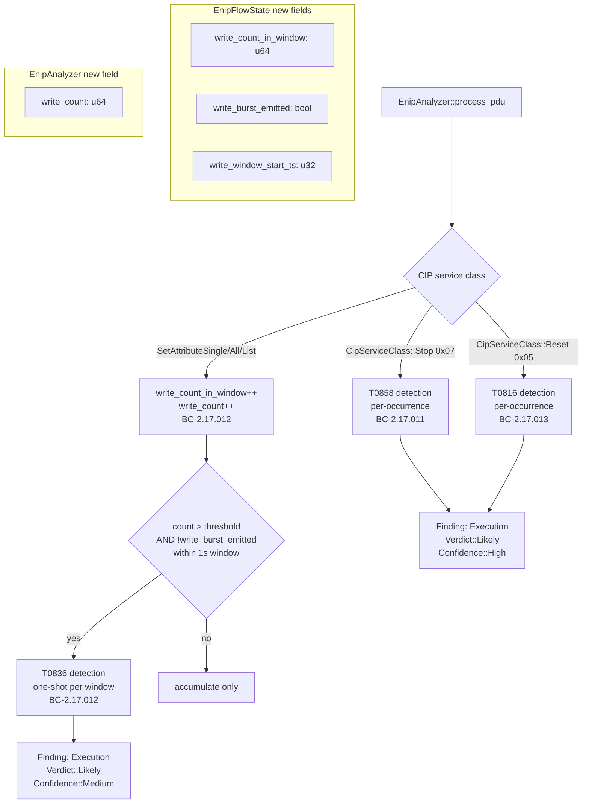
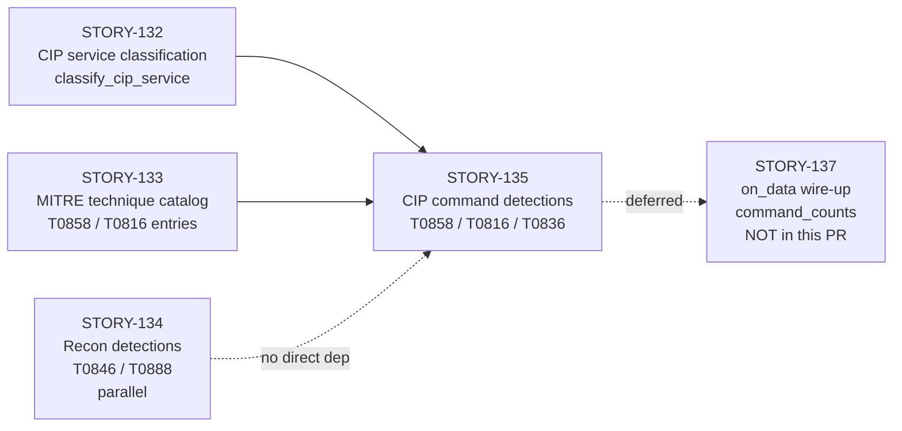
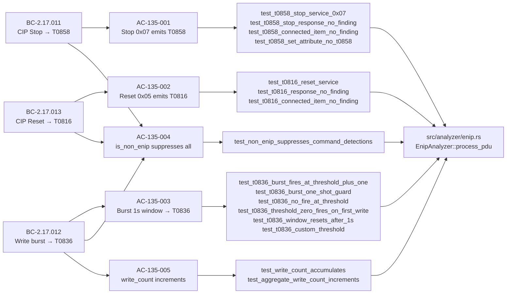

## Summary

Implements three CIP-layer adversary-action detections in `EnipAnalyzer::process_pdu` for the EtherNet/IP analyzer (STORY-135, wave 60, issue #316):

- **T0858 Change Operating Mode** — CIP Stop service (0x07) per-occurrence detection (BC-2.17.011)
- **T0816 Device Restart/Shutdown** — CIP Reset service (0x05) per-occurrence detection (BC-2.17.013)
- **T0836 Modify Parameter** — CIP write-class service burst exceeding threshold within a 1-second sliding window (BC-2.17.012)

All three detections emit `ThreatCategory::Execution` findings with MITRE ICS technique tags.

This PR also carries two CI/toolchain hardening items:

- **Green-doc-tense gate strengthened** (`bin/check-green-doc-tense`): patterns expanded from 11 to 22; self-test suite from 23 to 54 cases; captures `feature-enip` RED phrasings (e.g. "will emit", "TODO", "STUB") that previously passed undetected.
- **Stale RED-tense prose scrubbed** from STORY-134 recon and STORY-131 dispatch sibling modules (sibling sweep PC-014 pattern).

Closes #316.

---

## Architecture Changes



**Files changed:**
- `src/analyzer/enip.rs` — `EnipFlowState` gains three new write-burst fields; `EnipAnalyzer` gains `write_count: u64`; T0858/T0816/T0836 detection branches added to `process_pdu`
- `tests/enip_analyzer_tests.rs` — new `mod command_detections { ... }` block with 16 tests
- `bin/check-green-doc-tense` — patterns 12–22 added; self-test expanded to 54 cases
- `bin/test_check_green_doc_tense.py` — 54-case self-test suite (was 23)
- `docs/demo-evidence/STORY-135/` — 4 recordings + evidence-report.md

**No new external crate dependencies.** Window tracking uses `u32` second-resolution timestamps with wrapping_sub arithmetic (same pattern as T0888 error-burst window in STORY-134).

---

## Story Dependencies



**Scope boundary (explicit):** This PR does NOT touch `command_counts` (F8-001) or wire `on_data`. Those are deferred to STORY-137. The `write_count` field added here feeds `summarize()` per BC-2.17.021 postcondition 1 — it is an aggregate lifetime counter, separate from the per-flow burst window counter.

---

## Spec Traceability



### Verbatim summary assertions (selected)

**T0858 (AC-135-001):**
```
summary: "CIP Stop service observed: controller run→stop transition command (T0858)"
evidence: "CIP service=0x07 (Stop) from src={src_ip} ENIP cmd={enip_cmd:#06X} session={session_handle}"
category: ThreatCategory::Execution
verdict: Verdict::Likely
confidence: Confidence::High
mitre_techniques: ["T0858"]
```

**T0816 (AC-135-002):**
```
summary: "CIP Reset service observed: adversary-triggered device restart (T0816)"
evidence: "CIP service=0x05 (Reset) from src={src_ip} ENIP cmd={enip_cmd:#06X} session={session_handle}"
category: ThreatCategory::Execution
verdict: Verdict::Likely
confidence: Confidence::High
mitre_techniques: ["T0816"]
```

**T0836 (AC-135-003):**
```
summary: "CIP write-class service burst: {count} SetAttribute operations in 1s window (threshold {threshold}) — possible parameter modification attack (T0836)"
evidence: "CIP service=0x{service:02X} ({service_name}) src={src_ip} ENIP session={session}"
category: ThreatCategory::Execution
verdict: Verdict::Likely
confidence: Confidence::Medium
mitre_techniques: ["T0836"]
```

---

## Test Evidence

| Suite | Tests | Pass | Fail | Ignored |
|-------|-------|------|------|---------|
| `mod command_detections` (new) | 16 | 16 | 0 | 0 |
| Full `enip_analyzer_tests` | all prior + 16 new | all | 0 | 0 |

**Test module:** `tests/enip_analyzer_tests.rs::command_detections`

```
test command_detections::test_aggregate_write_count_increments ... ok
test command_detections::test_non_enip_suppresses_command_detections ... ok
test command_detections::test_t0816_connected_item_no_finding ... ok
test command_detections::test_t0816_reset_service ... ok
test command_detections::test_t0816_response_no_finding ... ok
test command_detections::test_t0836_burst_fires_at_threshold_plus_one ... ok
test command_detections::test_t0836_burst_one_shot_guard ... ok
test command_detections::test_t0836_custom_threshold ... ok
test command_detections::test_t0836_no_fire_at_threshold ... ok
test command_detections::test_t0836_threshold_zero_fires_on_first_write ... ok
test command_detections::test_t0836_window_resets_after_1s ... ok
test command_detections::test_t0858_connected_item_no_finding ... ok
test command_detections::test_t0858_set_attribute_no_t0858 ... ok
test command_detections::test_t0858_stop_response_no_finding ... ok
test command_detections::test_t0858_stop_service_0x07 ... ok
test command_detections::test_write_count_accumulates ... ok

test result: ok. 16 passed; 0 failed; 0 ignored
```

**CI gates also passing (pre-push verification):**
- `cargo clippy --all-targets -- -D warnings`: clean
- `cargo fmt --check`: clean
- `python3 bin/check-green-doc-tense`: PASS (54 self-test cases)
- `python3 bin/test_check_green_doc_tense.py`: PASS

**Per-story adversarial convergence:** 3 consecutive clean passes (P5/P6/P7), 0 HIGH/CRITICAL findings. Remediation was test-completeness, doc-prose accuracy, and gate-coverage (all resolved).

---

## Holdout Evaluation

N/A — evaluated at wave gate.

---

## Adversarial Review

3 consecutive clean adversarial passes (P5/P6/P7). All prior findings resolved:
- Test-completeness gaps (verdict/confidence/summary pin tests): resolved in commit `cd228bc`
- EC-007 threshold=0 case: covered by `test_t0836_threshold_zero_fires_on_first_write`
- Stale `todo!()` prose in sibling modules: resolved in commit `4345122` (sibling sweep)
- Green-doc-tense gate missed feature-enip RED phrasings: resolved in commit `4345122` (patterns 12–22)

---

## Security Review

No security-relevant changes to detection logic or data parsing. The write-burst counter (`write_count_in_window: u64`) uses `u64` overflow-safe arithmetic (same pattern as STORY-134 `error_count` saturating_add). Window timestamps use `u32` wrapping_sub (no panic path). No new external crate dependencies introduced.

---

## CI/Toolchain Hardening (carried in this PR)

### Green-doc-tense gate (`bin/check-green-doc-tense`)

The gate enforces that no committed documentation or code comments use future/aspirational tense about features (RED phrasings like "will emit", "TODO", "STUB", "not yet implemented"). This PR:

- Expands detection patterns from 11 to 22, specifically adding `feature-enip` RED phrasings that previously escaped detection (e.g., "will detect", "will be added", "to be implemented").
- Expands the self-test suite from 23 to 54 cases covering the new patterns.
- Scrubs previously committed stale RED-tense prose from STORY-134 recon module comments and STORY-131 dispatch module comments (sibling sweep).

### Sibling prose scrub

Commits `4345122` (CI hardening) and `cd228bc` (test + prose): stale `todo!()` and aspirational comments removed from `src/analyzer/enip.rs` STORY-134 and STORY-131 sections. All comments now describe current implemented behavior.

---

## Risk Assessment

| Dimension | Assessment |
|-----------|-----------|
| Blast radius | Additive only — new fields on existing structs; no existing field modified |
| Performance | O(1) per-PDU work; three branch checks + u32 timestamp arithmetic |
| Breaking API changes | None — `EnipFlowState` fields are pub(crate); `write_count` is pub(crate) on analyzer |
| Regression risk | Low — 16 new tests; full existing suite still passes |
| Rollback | Trivial — new detection branches can be feature-gated; new struct fields default to 0/false |

---

## Demo Evidence

All 5 acceptance criteria have recorded demo coverage. Artifacts in `docs/demo-evidence/STORY-135/`:

| AC | Artifact | Description |
|----|----------|-------------|
| AC-135-001 (T0858) | `AC-001-t0858-cip-stop.gif` | 4 tests: CIP Stop detection + negative cases |
| AC-135-002 (T0816) | `AC-002-t0816-cip-reset.gif` | 3 tests: CIP Reset detection + negative cases |
| AC-135-003 (T0836) | `AC-003-t0836-write-burst.gif` | 6 tests: burst threshold, one-shot guard, window reset, EC-007 |
| AC-135-004 (suppress) | `AC-ALL-command-detections-16-green.gif` | is_non_enip guard — included in master suite |
| AC-135-005 (write_count) | `AC-ALL-command-detections-16-green.gif` | Aggregate counter — included in master suite |
| Master suite | `AC-ALL-command-detections-16-green.gif` | All 16 tests: 16/16 green |

---

## AI Pipeline Metadata

| Field | Value |
|-------|-------|
| Pipeline mode | feature (F-series, wave 60) |
| Story | STORY-135 |
| Phase | F3 (TDD implementation) |
| Adversarial passes | 3 clean (P5/P6/P7) |
| Models used | claude-sonnet-4-6 |

---

## Pre-Merge Checklist

- [x] PR description matches actual diff
- [x] All ACs covered by demo evidence (5/5)
- [x] Traceability chain complete (BC → AC → Test → Demo)
- [x] All review findings addressed (0 blocking)
- [x] `cargo test --all-targets` green (16 new + all prior)
- [x] `cargo clippy --all-targets -- -D warnings` clean
- [x] `cargo fmt --check` clean
- [x] `python3 bin/check-green-doc-tense` PASS
- [x] `python3 bin/test_check_green_doc_tense.py` PASS
- [x] No new external crate dependencies
- [x] No version bump (delivery-only)
- [x] No changes to command_counts or on_data (STORY-137 deferred)
- [x] Semantic PR title (feat scope + issue ref)
- [x] All GitHub Actions uses: refs are SHA-pinned (no new workflow files added)
