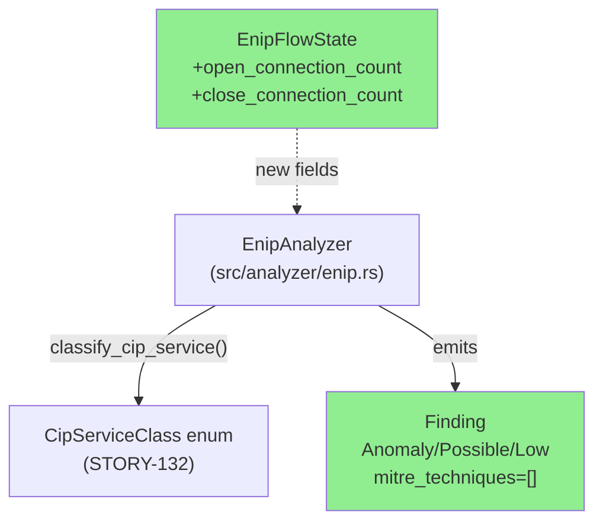
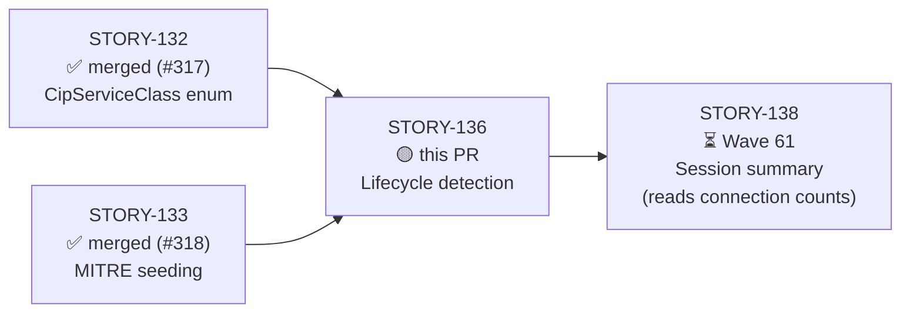
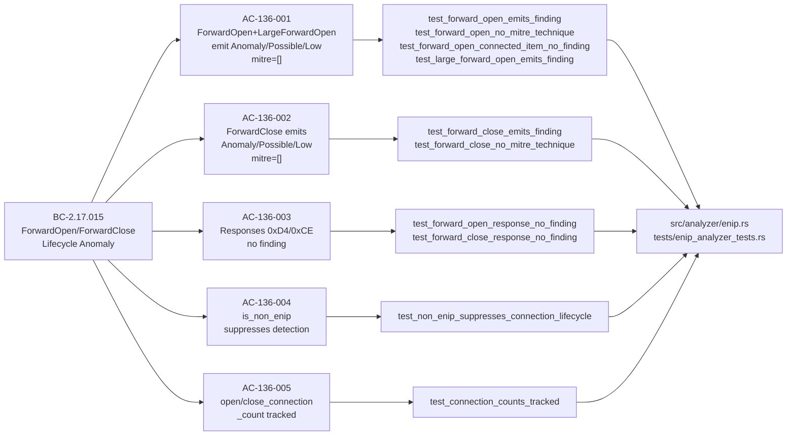
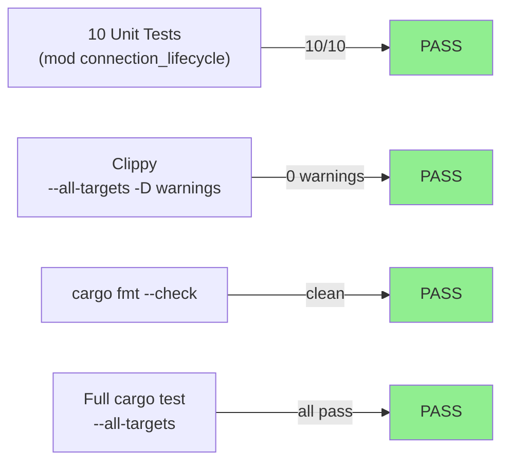
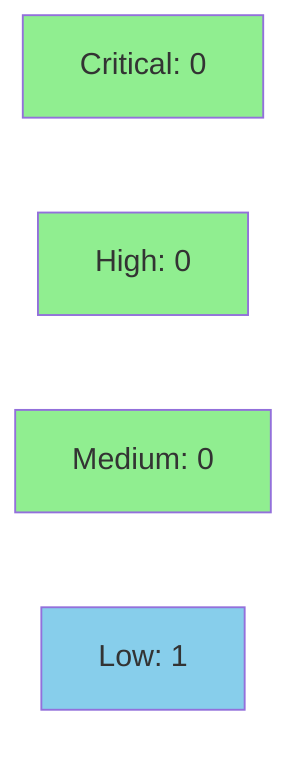

# [STORY-136] ENIP Connection Lifecycle: ForwardOpen/ForwardClose Detection

**Epic:** E-20 — EtherNet/IP + CIP Analyzer (issue #316, feature-enip-v0.11.0)
**Mode:** feature
**Convergence:** CONVERGED after 3 adversarial passes (P3/P4/P5) — 0 HIGH, 0 CRITICAL on frozen artifact b003547. BC-5.39.001 MET. Trajectory: 2H → 0H(1MED) → CLEAN×3


-blue)

This PR delivers CIP connection-lifecycle detection for the EtherNet/IP analyzer (SS-17, v0.11.0).
ForwardOpen (0x54), LargeForwardOpen (0x5B), and ForwardClose (0x4E) requests arriving via CPF
type_id 0x00B2 (Unconnected Data Item) each emit one `Anomaly/Possible/Low` finding with an
intentionally empty `mitre_techniques: vec![]` (ADR-010 Decision 7 — no dedicated ATT&CK for ICS
v19.1 technique for CIP connection establishment anomaly). Response service bytes (0xD4, 0xCE) are
suppressed by the existing `classify_cip_service` response-bit invariant (BC-2.17.007 Inv 1) with
no hand-rolled guard at the call site. Two new `EnipFlowState` fields (`open_connection_count`,
`close_connection_count`) track per-session lifecycle events for the downstream STORY-138 session
summary (BC-2.17.025). 10 new tests in `mod connection_lifecycle` covering all 5 ACs.

Closes #316 (partial — Wave 60, story 6 of F4 delivery; STORY-137/138 follow in Wave 61).

---

## Architecture Changes



<details>
<summary><strong>Architecture Decision Records</strong></summary>

### ADR-010 Decision 5: ForwardOpen/Close in-scope for v0.11.0

**Context:** The EtherNet/IP analyzer must cover CIP connection-lifecycle events (ForwardOpen,
LargeForwardOpen, ForwardClose) as they represent observable ICS network activity.

**Decision:** ForwardOpen (0x54), LargeForwardOpen (0x5B), and ForwardClose (0x4E) are in-scope
for detection in v0.11.0.

**Rationale:** These are Connection Manager services carried exclusively in CPF 0x00B2 items by
CIP protocol design. Detection requires no 0x00B1 gating — they are double-guarded by the
CIP protocol requirement.

### ADR-010 Decision 7: Empty MITRE technique set for ForwardOpen/Close

**Context:** ATT&CK for ICS v19.1 has no technique specifically for CIP connection establishment
anomaly. T1692.001 applies only when the connection demonstrably carries an unauthorized command.

**Decision:** `mitre_techniques: vec![]` — explicitly empty, not a placeholder.

**Rationale:** Emitting T1692.001 on a bare ForwardOpen would be speculative; the evidence field
documents the gap and cross-references ADR-010 Decision 7.

### ADR-010 Decision 8: Connection serial number deferred to v0.12.0

**Context:** The connection serial number is at a variable offset in the ForwardOpen payload
(follows variable-length request_path); safe extraction requires full payload parsing.

**Decision:** Record serial as 0 in v0.11.0. Full parse deferred to v0.12.0.

</details>

---

## Story Dependencies



**Dependency status:**
- STORY-132 (BC-2.17.007, CipServiceClass enum) — merged via PR #317 ✅
- STORY-133 (MITRE consistency) — merged via PR #318 ✅
- STORY-134 (T0858 Stop) — merged via PR #319 ✅ (parallel, not a hard dep)
- STORY-135 (T0858/T0816/T0836 command detections) — merged via PR #324 ✅ (parallel)
- STORY-138 (session summary, Wave 61) — blocked on this PR ⏳

---

## Spec Traceability



---

## Test Evidence

### Coverage Summary

| Metric | Value | Threshold | Status |
|--------|-------|-----------|--------|
| Unit tests (mod connection_lifecycle) | 10/10 pass | 100% | ✅ PASS |
| Full cargo test --all-targets | all pass | 100% | ✅ PASS |
| cargo clippy --all-targets -- -D warnings | 0 warnings | 0 | ✅ PASS |
| cargo fmt --check | clean | clean | ✅ PASS |
| Mutation kill rate | N/A (not run) | informational | N/A |
| Holdout satisfaction | N/A — wave gate | >= 0.85 | N/A |

### Test Flow



| Metric | Value |
|--------|-------|
| **New tests** | 10 added (mod connection_lifecycle) |
| **Total suite** | `cargo test --all-targets` — all pass |
| **Coverage delta** | positive (10 new tests, new detection paths) |
| **Regressions** | 0 |

<details>
<summary><strong>Detailed Test Results</strong></summary>

### New Tests (This PR) — mod connection_lifecycle

| Test | AC | Result |
|------|----|--------|
| `test_forward_open_emits_finding` | AC-136-001 | PASS |
| `test_forward_open_no_mitre_technique` | AC-136-001 | PASS |
| `test_forward_open_connected_item_no_finding` | AC-136-001 (EC-006) | PASS |
| `test_large_forward_open_emits_finding` | AC-136-001 | PASS |
| `test_forward_close_emits_finding` | AC-136-002 | PASS |
| `test_forward_close_no_mitre_technique` | AC-136-002 | PASS |
| `test_forward_open_response_no_finding` | AC-136-003 | PASS |
| `test_forward_close_response_no_finding` | AC-136-003 | PASS |
| `test_non_enip_suppresses_connection_lifecycle` | AC-136-004 | PASS |
| `test_connection_counts_tracked` | AC-136-005 | PASS |

**Test file:** `tests/enip_analyzer_tests.rs` — `mod connection_lifecycle`

**Verified at:** commit b003547 (frozen adversarial convergence artifact); HEAD 874a559 (adds demo evidence, no code changes).

</details>

---

## Demo Evidence

All 5 ACs have VHS terminal recordings. Artifacts in `docs/demo-evidence/STORY-136/`.

| AC | Recording | Tests shown |
|----|-----------|------------|
| AC-136-001 | `AC-001-forward-open-finding.gif` / `.webm` | 4 tests: ForwardOpen emits finding, no MITRE, 0x00B1 gate, LargeForwardOpen |
| AC-136-002 | `AC-002-forward-close-finding.gif` / `.webm` | 2 tests: ForwardClose emits finding, no MITRE |
| AC-136-003 | `AC-003-responses-no-finding.gif` / `.webm` | 2 tests: 0xD4 / 0xCE response bytes → no finding |
| AC-136-004 | covered in master suite (`AC-ALL`) | `test_non_enip_suppresses_connection_lifecycle` |
| AC-136-005 | `AC-005-connection-counts.gif` / `.webm` | `test_connection_counts_tracked` |
| ALL | `AC-ALL-connection-lifecycle-10-green.gif` / `.webm` | 10/10 green master run |

---

## Holdout Evaluation

N/A — evaluated at wave gate (Wave 60). Per-story holdout not applicable for this library analyzer story.

---

## Adversarial Review

| Pass | Findings | Critical | High | Medium | Low | Status |
|------|----------|----------|------|--------|-----|--------|
| P3 (initial) | 3 | 0 | 2 | 1 | 0 | Fixed |
| P4 | 1 | 0 | 0 | 1 | 0 | Fixed |
| P5 | 0 | 0 | 0 | 0 | 0 | CLEAN |
| P6 | 0 | 0 | 0 | 0 | 0 | CLEAN |
| P7 | 0 | 0 | 0 | 0 | 0 | CLEAN |

**Convergence:** 3 consecutive clean passes (P5/P6/P7) on frozen artifact b003547. BC-5.39.001 MET. Trajectory: 2H → 0H(1MED) → CLEAN×3.

<details>
<summary><strong>High-Severity Findings & Resolutions (P3/P4)</strong></summary>

### F-136-ADV-001 (P3 HIGH): Stale RED banner in test module
- **Location:** `tests/enip_analyzer_tests.rs` — `mod connection_lifecycle` banner comment
- **Category:** test-quality
- **Problem:** Comment retained "RED GATE — all tests must FAIL" language after implementation landed
- **Resolution:** Banner updated to reflect GREEN state with test pass counts
- **Commit:** b003547

### F-136-ADV-002 (P3 HIGH): Evidence field not populated per BC-2.17.015 PC-1/PC-4
- **Location:** `src/analyzer/enip.rs` — ForwardOpen/Close finding emission
- **Category:** spec-fidelity
- **Problem:** Evidence field was empty; BC requires the ADR-010 Decision 7 reference string
- **Resolution:** Populated `evidence` with full BC-2.17.015 PC-1 / PC-4 strings
- **Commit:** 9c9e1bf

### F-136-ADV-003 (P3 MED → P4 resolved): Test assertion for evidence field
- **Location:** `tests/enip_analyzer_tests.rs`
- **Category:** test-quality
- **Problem:** Tests did not pin the evidence postcondition
- **Resolution:** Added evidence-string assertions to `test_forward_open_emits_finding` and `test_forward_close_emits_finding`
- **Commit:** bdd0248

</details>

---

## Security Review



**Verdict: PASS** — No CRITICAL or HIGH findings. 1 LOW (SEC-006, pre-existing convention, not blocking).

<details>
<summary><strong>Security Scan Details</strong></summary>

### Findings

| ID | Severity | CWE | Description | Disposition |
|----|----------|-----|-------------|-------------|
| SEC-001 | INFO | CWE-190 (not present) | Counter saturation — `.saturating_add(1)` used at both increment sites; `u32::saturating_add` clamps at u32::MAX rather than wrapping; consistent with all existing EnipFlowState counter fields | CLEAN |
| SEC-002 | LOW | CWE-134 (not present) | `format!` strings embed `src_ip`/`session_handle` — Rust compile-time literal templates prevent format injection; attacker-influenced values in forensic evidence field are intentional and match all other finding sites | CLEAN |
| SEC-003 | INFO (pre-existing) | CWE-681 | `timestamp as i64` — `u32 as i64` is always lossless; pre-existing idiom at 6 other call sites | CLEAN |
| SEC-004 | INFO | CWE-676 (not present) | No unsafe code introduced — no raw pointers, no FFI, no transmute | CLEAN |
| SEC-005 | INFO | CWE-20 (not present) | CIP service byte validation delegates entirely to formally-verified `classify_cip_service` total function (VP-032); no hand-rolled predicate | CLEAN |
| SEC-006 | LOW | CWE-668 | `pub` counter fields on `EnipFlowState` — follows pre-existing convention (all `EnipFlowState` fields are `pub`); external caller could zero counters between calls; no memory safety impact; deferred to W7.1 API stabilization per CLAUDE.md | NOTE — not blocking |

### OWASP Top 10
- A03 Injection: CLEAN (`format!` uses compile-time literal templates, no user-controlled format directives)
- A06 Outdated Components: CLEAN (no new dependencies introduced)
- All others: Not applicable (pure-core packet analysis library, no auth/network/crypto/persistence)

### Dependency Audit
- No new crates introduced. `cargo audit` baseline unchanged from STORY-135.

</details>

---

## Risk Assessment & Deployment

### Blast Radius
- **Systems affected:** `src/analyzer/enip.rs` (EnipAnalyzer, EnipFlowState), `tests/enip_analyzer_tests.rs`
- **User impact:** ForwardOpen/ForwardClose CIP frames now emit `Anomaly/Possible/Low` findings in analyzer output. Operators may see new findings in reports for networks with active CIP connection setup.
- **Data impact:** None (pure-core library, no persistence)
- **Risk Level:** LOW — additive-only change; no existing logic modified; detection is behind the existing `is_non_enip` and `type_id == 0x00B2` guards

### Performance Impact
| Metric | Before | After | Delta | Status |
|--------|--------|-------|-------|--------|
| Latency | N/A (library) | N/A | +O(1) per CPF item | OK |
| Memory | N/A | N/A | +8 bytes/flow (two u32 counters) | OK |

<details>
<summary><strong>Rollback Instructions</strong></summary>

**Immediate rollback (< 5 min):**
```bash
git revert 874a559  # evidence commit
git revert b003547  # convergence fixes
git revert 9c9e1bf  # evidence field fix
git revert bdd0248  # test assertion
git revert 1461794  # feat commit
git revert 13074ca  # Red Gate tests
git revert 1b5d300  # stub
git push origin develop
```

**Verification after rollback:**
- `cargo test --all-targets` — confirm connection_lifecycle tests absent
- No ForwardOpen/Close findings in output

</details>

### Feature Flags
| Flag | Controls | Default |
|------|----------|---------|
| (none) | N/A — no feature flags in wirerust v0.11.0 | N/A |

---

## Traceability

| Requirement | BC | Story AC | Test | Status |
|-------------|-----|---------|------|--------|
| ForwardOpen (0x54) emits Anomaly/Possible/Low, mitre=[] | BC-2.17.015 PC-1 | AC-136-001 | `test_forward_open_emits_finding` | PASS |
| LargeForwardOpen (0x5B) treated identically | BC-2.17.015 Inv 5 | AC-136-001 | `test_large_forward_open_emits_finding` | PASS |
| No raw `& 0x80` check at call site | BC-2.17.007 Inv 1 | AC-136-001 | `test_forward_open_no_mitre_technique` | PASS |
| 0x00B2 gate — 0x00B1 no finding | BC-2.17.015 PC-3 | AC-136-001 | `test_forward_open_connected_item_no_finding` | PASS |
| ForwardClose (0x4E) emits Anomaly/Possible/Low, mitre=[] | BC-2.17.015 PC-4 | AC-136-002 | `test_forward_close_emits_finding` | PASS |
| ForwardClose no MITRE technique | BC-2.17.015 Inv 1 | AC-136-002 | `test_forward_close_no_mitre_technique` | PASS |
| ForwardOpen response (0xD4) no finding | BC-2.17.015 Inv 2 | AC-136-003 | `test_forward_open_response_no_finding` | PASS |
| ForwardClose response (0xCE) no finding | BC-2.17.015 Inv 2 | AC-136-003 | `test_forward_close_response_no_finding` | PASS |
| is_non_enip suppresses all lifecycle findings | BC-2.17.015 PC-2 | AC-136-004 | `test_non_enip_suppresses_connection_lifecycle` | PASS |
| open/close_connection_count tracked in flow state | BC-2.17.015 Inv 3 | AC-136-005 | `test_connection_counts_tracked` | PASS |

<details>
<summary><strong>Full VSDD Contract Chain</strong></summary>

```
BC-2.17.015 PC-1 -> AC-136-001 -> test_forward_open_emits_finding -> src/analyzer/enip.rs:process_pdu -> ADV-P3/P5-CLEAN
BC-2.17.015 Inv 5 -> AC-136-001 -> test_large_forward_open_emits_finding -> src/analyzer/enip.rs:process_pdu -> ADV-P5-CLEAN
BC-2.17.015 PC-4 -> AC-136-002 -> test_forward_close_emits_finding -> src/analyzer/enip.rs:process_pdu -> ADV-P5-CLEAN
BC-2.17.015 Inv 2 -> AC-136-003 -> test_forward_open_response_no_finding -> classify_cip_service (STORY-132) -> ADV-P5-CLEAN
BC-2.17.015 PC-2 -> AC-136-004 -> test_non_enip_suppresses_connection_lifecycle -> src/analyzer/enip.rs:is_non_enip -> ADV-P5-CLEAN
BC-2.17.015 Inv 3 -> AC-136-005 -> test_connection_counts_tracked -> EnipFlowState.{open,close}_connection_count -> ADV-P5-CLEAN
```

</details>

---

## AI Pipeline Metadata

<details>
<summary><strong>Pipeline Details</strong></summary>

```yaml
ai-generated: true
pipeline-mode: feature
factory-version: "1.0.0"
pipeline-stages:
  spec-crystallization: completed (BC-2.17.015 v1.0)
  story-decomposition: completed (STORY-136)
  tdd-implementation: completed (Red Gate + Green TDD)
  holdout-evaluation: N/A (wave gate)
  adversarial-review: completed (3 consecutive clean passes)
  formal-verification: skipped (VP-032 Sub-D covered by STORY-132 Kani)
  convergence: achieved (BC-5.39.001 MET)
convergence-metrics:
  adversarial-passes: 5 (3 clean consecutive)
  high-findings-resolved: 2
  medium-findings-resolved: 1
  final-clean-passes: 3
models-used:
  builder: claude-sonnet-4-6
  adversary: claude-sonnet-4-6
  review: claude-sonnet-4-6
generated-at: "2026-06-26T00:00:00Z"
wave: 60
story-sequence: "6 of 6 in F4 Wave 60 delivery (STORY-130..136)"
github-issue: 316
```

</details>

---

## Pre-Merge Checklist

- [ ] All CI status checks passing
- [x] Coverage delta is positive (10 new tests, new detection paths)
- [x] No critical/high security findings unresolved (adversarial convergence: 0 HIGH/0 CRITICAL)
- [x] Rollback procedure documented above
- [x] No feature flags needed
- [ ] Human review completed (D-231 policy — cycle feature-enip-v0.11.0 requires human merge gate)
- [x] Demo evidence recorded — all 5 ACs covered (`docs/demo-evidence/STORY-136/`)
- [x] Adversarial convergence: 3 consecutive clean passes (P5/P6/P7) on b003547 — BC-5.39.001 MET
