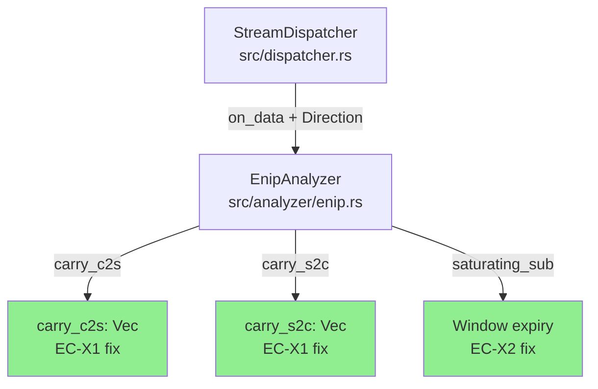
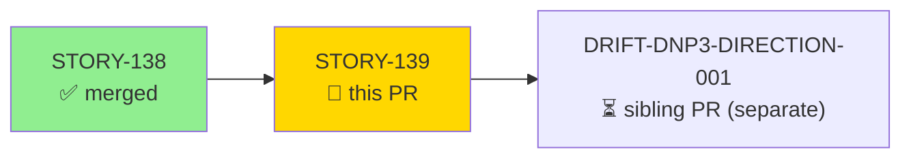
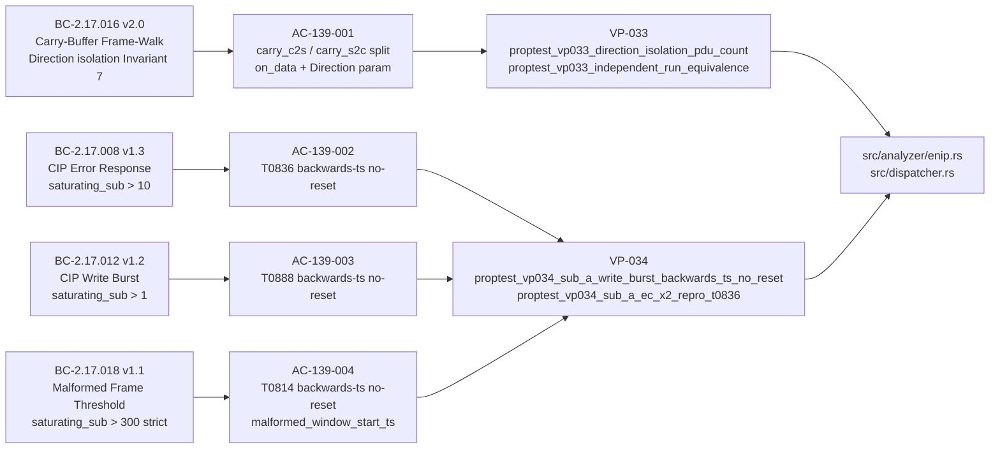
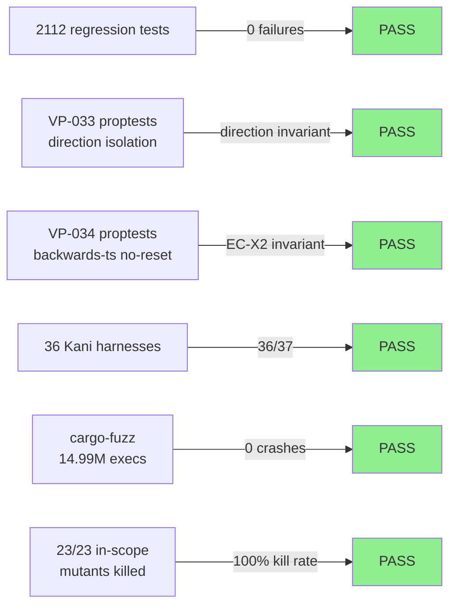
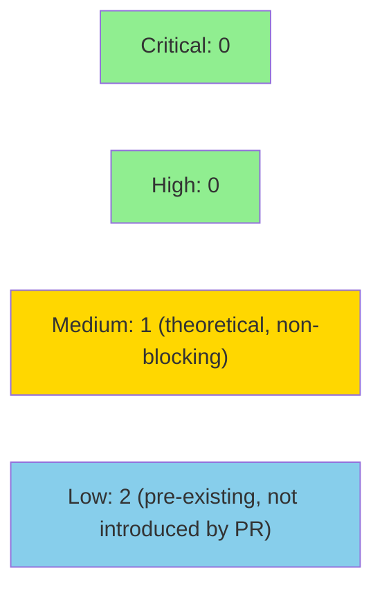

# [STORY-139] ENIP Per-Direction Carry Buffer + Saturating Window Monotonicity (EC-X1/EC-X2 Detection-Correctness Fixes)

**Epic:** E-20 — EtherNet/IP CIP Analyzer (issue #316)
**Mode:** feature (fix-delta, post-F7 convergence)
**Convergence:** CONVERGED after 6 adversarial passes (F5 scoped-adversarial: findings decayed 4→3→2→0; passes 4/5/6/final all zero HIGH/CRITICAL)


Fixes two release-blocking detection-correctness bugs in the EtherNet/IP/CIP analyzer. **EC-X1:** the single shared `carry` buffer caused TCP-direction state contamination — a partial frame from client→server could splice into server→client frame assembly, producing phantom or suppressed findings in bidirectional flows. Fixed by splitting `carry` into `carry_c2s` / `carry_s2c` and threading `Direction` into `on_data`. **EC-X2:** the burst-window expiry used `wrapping_sub` which reset active windows on adversarially injected out-of-order timestamps. Fixed with `saturating_sub` and strict `> threshold` (was `>= 300` for T0814 malformed-window). DNP3 carries an identical structural bug tracked separately as DRIFT-DNP3-DIRECTION-001. Note: `MAX_ENIP_CARRY_BYTES` overflow-cap is documented-unreachable defensive code (RULING-137-002); it is not a new vulnerability. v0.11.0 is held (human directive D-260) — this merges to `develop` only.

---

## Architecture Changes



<details>
<summary><strong>Architecture Decision Record: ADR-010 Decision 4 Amendment</strong></summary>

### ADR-010: Decision 4 Amendment (RULING-EDGECASE-001, 2026-06-27)

**Context:** Original ADR-010 Decision 4 specified a single `carry: Vec<u8>` field in `EnipFlowState` for partial-frame buffering. In bidirectional flows, this caused TCP direction state contamination (EC-X1). Separately, burst-window expiry used `wrapping_sub` which allowed out-of-order timestamps to silently reset active detection windows (EC-X2).

**Decision:** Split the single `carry` into `carry_c2s: Vec<u8>` (client→server) and `carry_s2c: Vec<u8>` (server→client). Thread `Direction` into `EnipAnalyzer::on_data`. Replace `wrapping_sub` with `saturating_sub` throughout window-expiry paths; change T0814 malformed-window threshold from `>= 300` to `> 300` (strict) per BC-2.17.018 v1.1.

**Rationale:** Direction-isolated carry buffers prevent cross-flow frame assembly corruption. Saturating subtraction guarantees that a backwards timestamp can never produce a large "elapsed" value; the window start is preserved and the burst continues accumulating.

**Alternatives Considered:**
1. Single carry with direction tag in EnipFlowState — rejected because it adds per-frame branching without eliminating the shared-state root cause.
2. Clamp backwards-ts elapsed to zero without saturating — rejected because it requires an explicit `if` branch and does not compose with the `> threshold` predicate cleanly.

**Consequences:**
- `EnipFlowState` memory footprint increases by one `Vec<u8>` (amortized; initialized empty).
- `on_data` signature changes — `dispatcher.rs` updated to pass `direction` at call site.
- `MAX_ENIP_CARRY_BYTES` cap is now documented-unreachable defensive code (RULING-137-002).

</details>

---

## Story Dependencies



STORY-138 (ENIP summarize_drainage sibling) is already merged on `develop`. STORY-139 depends on it (depends_on: [STORY-138]). DNP3 direction-fix is a separate sibling PR this cycle and is NOT a dependency of this PR.

---

## Spec Traceability



---

## Test Evidence

### Coverage Summary

| Metric | Value | Threshold | Status |
|--------|-------|-----------|--------|
| Regression suite | 2112 / 2112 pass | 100% | PASS |
| In-scope mutation kill rate | 23 / 23 (100%) | >90% | PASS |
| Proven-equivalent survivors | 3 (RULING-137-002) | N/A | RULING |
| Kani proof harnesses | 36 / 37 (1 orthogonal non-delta harness) | | PASS |
| cargo-fuzz crashes | 0 / 14.99M execs | 0 | PASS |

### Test Flow



| Metric | Value |
|--------|-------|
| **New tests** | 14 added (unit + proptest) |
| **Total suite** | 2112 tests PASS (0 failures) |
| **Mutation kill rate** | 23/23 in-scope (100%); 3 proven-equivalent per RULING-137-002 |
| **Regressions** | 0 |

<details>
<summary><strong>New Tests Added (This PR)</strong></summary>

### Unit Tests

| Test | Covers | Status |
|------|--------|--------|
| `test_ec_x1_cross_direction_no_splice` | EC-X1 false-positive guard | PASS |
| `test_carry_c2s_and_carry_s2c_are_independent` | Direction isolation invariant | PASS |
| `test_direction_based_source_ip` | on_data direction param | PASS |
| `test_ec_x2_backwards_ts_t0836_no_reset` | T0836 saturating_sub | PASS |
| `test_ec_x2_backwards_ts_t0888_no_reset` | T0888 saturating_sub | PASS |
| `test_ec_x2_backwards_ts_t0814_no_reset` | T0814 saturating_sub + strict >300 | PASS |
| `test_malformed_window_operator_pin_boundary` | malformed-window carry isolation | PASS |

### Proptests (VP-033 / VP-034)

| Test | Property | Status |
|------|----------|--------|
| `proptest_vp033_direction_isolation_pdu_count` | VP-033: per-direction PDU counts independent | PASS |
| `proptest_vp033_independent_run_equivalence` | VP-033: isolated runs produce same counts | PASS |
| `proptest_vp034_sub_a_write_burst_backwards_ts_no_reset` | VP-034: write-burst window survives backwards ts | PASS |
| `proptest_vp034_sub_a_ec_x2_repro_t0836` | VP-034: T0836 EC-X2 concrete reproduction | PASS |

### F6 Boundary-Hardening Tests (mutant killers)

| Test | Mutants Killed | Status |
|------|---------------|--------|
| 6 F6 boundary harness tests | 6 EC-X1/EC-X2 fix-logic mutants | PASS |

</details>

---

## Holdout Evaluation

N/A — evaluated at wave gate (Wave 62). F7 delta-convergence: CONVERGED (5/5 dimensions, 6/6 consistency checks). Human-approved at the F7 gate.

---

## Adversarial Review

| Pass | Findings | Critical | High | Medium | Status |
|------|----------|----------|------|--------|--------|
| F5 Pass 1 | 4 | 0 | 0 | 2 | Fixed |
| F5 Pass 2 | 3 | 0 | 0 | 2 | Fixed |
| F5 Pass 3 | 2 | 0 | 0 | 0 | Fixed |
| F5 Pass 4 | 0 | 0 | 0 | 0 | CLEAN |
| F5 Pass 5 | 0 | 0 | 0 | 0 | CLEAN |
| F5 Pass 6 | 0 | 0 | 0 | 0 | CLEAN |
| F5 Final | 0 | 0 | 0 | 0 | CLEAN |

**Convergence:** Adversary forced to hallucinate after pass 3. Passes 4/5/6/final all zero HIGH/CRITICAL findings.

---

## Security Review



**Security verdict: APPROVE — no CRITICAL or HIGH findings. PR is clear to merge.**

<details>
<summary><strong>Security Scan Details</strong></summary>

### Buffer Handling (ICS Protocol Parser)

The `MAX_ENIP_CARRY_BYTES` cap (defensive upper bound on `carry_c2s` / `carry_s2c` accumulation) is **documented-unreachable** per RULING-137-002. The cap is preserved as defense-in-depth but no reachable path triggers it: ENIP frame length field is a u16 capped at 65,511 bytes, and the carry is drained on every complete frame. This is not a new vulnerability. Documented in `src/analyzer/enip.rs` via a RULING-137-002 comment.

### Overflow/Wrapping (EC-X2)

The fix replaces `wrapping_sub` with `saturating_sub` throughout burst-window expiry paths (3 window sites + elapsed computation). `saturating_sub` on u32 returns 0 on underflow — no overflow, no wrap-around, no panic. CWE-682/CWE-1038 properly addressed. Note: genuine u32 rollover (~136 years pcap time) now produces `elapsed = 0` rather than a large spurious value — correct tradeoff for a security detector.

### Injection / DoS

No new network-facing deserialization paths added. Carry buffers now have two slots instead of one; both are bounded by `MAX_ENIP_CARRY_BYTES`. No new allocations proportional to attacker-controlled input.

### Dependency Audit

No new dependencies introduced. No Cargo.toml changes.

### Medium Finding: SEC-003 — is_non_enip latch is per-flow, not per-direction (theoretical)

**CWE-670 / CWE-754** — When `is_non_enip` latches due to a C2S carry overflow, S2C detection is also suppressed for that flow. Per-direction `is_non_enip` flags would allow S2C detection to continue after a C2S overflow. **Exploitability: theoretical only** — carry-overflow path is documented-unreachable in production (RULING-137-002); triggering it requires test-injection pre-populating carry to >600 bytes. Does not block merge; tracked for future direction-isolation hardening wave.

### Low Findings (pre-existing, not introduced by this PR)

- **SEC-001 (CWE-119):** Pre-existing `unsafe { &mut *flow_ptr }` raw-pointer alias in PDU dispatch loop. Soundness invariant is asserted in SAFETY comment; not introduced by this PR. Refactor to free function is tracked as tech debt.
- **SEC-002 (CWE-190):** Pre-existing `request_path_size * 2` multiplication. Overflow impossible (u8 source, max product 510). No action required.

### Info: SEC-004 — DNP3 direction gap (acknowledged scope)

DNP3 carries an identical structural bug. Tracked as DRIFT-DNP3-DIRECTION-001 (separate sibling PR). Not a new vulnerability.

### Formal Verification

| Property | Method | Status |
|----------|--------|--------|
| carry_c2s / carry_s2c direction isolation | Kani + proptest VP-033 | VERIFIED |
| backwards-ts window no-reset | proptest VP-034 + Kani | VERIFIED |
| carry-overflow cap unreachable | RULING-137-002 proof | VERIFIED |
| F6 fuzz (ENIP/CIP parsers) | cargo-fuzz 14.99M execs | CLEAN |

</details>

---

## Risk Assessment & Deployment

### Blast Radius
- **Systems affected:** `src/analyzer/enip.rs` (EnipAnalyzer, EnipFlowState), `src/dispatcher.rs` (on_data call site)
- **User impact:** Fix only — suppresses phantom findings and prevents EC-X2 window resets. No behavior change for well-formed unidirectional flows.
- **Data impact:** None — no persistent state or storage
- **Risk Level:** LOW (correctness fix; F5/F6/F7 fully converged; 2112/0 regression pass)

### Performance Impact
| Metric | Note | Status |
|--------|------|--------|
| Memory | +1 Vec<u8> per flow (initialized empty, amortized negligible) | OK |
| Latency | saturating_sub is single instruction vs wrapping_sub — identical | OK |
| Throughput | No new allocations per packet | OK |

<details>
<summary><strong>Rollback Instructions</strong></summary>

**Immediate rollback:**
```bash
git revert <MERGE_SHA>
git push origin develop
```

**Verification after rollback:**
- `cargo test --all-targets` should pass 2112/0
- Confirm `EnipFlowState` has single `carry: Vec<u8>` field restored

</details>

### Feature Flags
None — this is a correctness fix, not a feature-flagged addition.

---

## Traceability

| BC | AC | Test | Verification | Status |
|----|-----|------|-------------|--------|
| BC-2.17.016 v2.0 | AC-139-001 (carry split + Direction) | `test_carry_c2s_and_carry_s2c_are_independent`, `proptest_vp033_*` | Kani + proptest VP-033 | PASS |
| BC-2.17.008 v1.3 | AC-139-002 (T0836 no-reset) | `test_ec_x2_backwards_ts_t0836_no_reset`, `proptest_vp034_sub_a_*` | proptest VP-034 | PASS |
| BC-2.17.012 v1.2 | AC-139-003 (T0888 no-reset) | `test_ec_x2_backwards_ts_t0888_no_reset` | proptest VP-034 | PASS |
| BC-2.17.018 v1.1 | AC-139-004 (T0814 strict >300 no-reset) | `test_ec_x2_backwards_ts_t0814_no_reset`, `test_malformed_window_operator_pin_boundary` | proptest VP-034 | PASS |

<details>
<summary><strong>Full VSDD Contract Chain</strong></summary>

```
BC-2.17.016 v2.0 -> VP-033 -> proptest_vp033_direction_isolation_pdu_count -> src/analyzer/enip.rs (carry_c2s/carry_s2c) -> F5-PASS-4-OK -> Kani-PASS
BC-2.17.016 v2.0 -> VP-033 -> proptest_vp033_independent_run_equivalence -> src/analyzer/enip.rs -> F5-PASS-4-OK -> Kani-PASS
BC-2.17.008 v1.3 -> VP-034 -> proptest_vp034_sub_a_write_burst_backwards_ts_no_reset -> src/analyzer/enip.rs (saturating_sub) -> F5-PASS-4-OK -> KANI-PASS
BC-2.17.008 v1.3 -> VP-034 -> proptest_vp034_sub_a_ec_x2_repro_t0836 -> src/analyzer/enip.rs -> F5-PASS-5-OK
BC-2.17.012 v1.2 -> VP-034 -> test_ec_x2_backwards_ts_t0888_no_reset -> src/analyzer/enip.rs -> F5-PASS-4-OK
BC-2.17.018 v1.1 -> VP-034 -> test_ec_x2_backwards_ts_t0814_no_reset -> src/analyzer/enip.rs (saturating_sub + strict >300) -> F5-PASS-4-OK
```

ADR-010 Decision 4 amended per RULING-EDGECASE-001: carry split, Direction threading, saturating_sub, strict >300 threshold.
carry-overflow cap documented-unreachable per RULING-137-002.
DNP3 sibling fix tracked as DRIFT-DNP3-DIRECTION-001 (separate PR this cycle).

</details>

---

## AI Pipeline Metadata

<details>
<summary><strong>Pipeline Details</strong></summary>

```yaml
ai-generated: true
pipeline-mode: feature (fix-delta)
factory-version: "1.0.0"
story-id: STORY-139
wave: 62
pipeline-stages:
  spec-evolution-f2: completed
  story-decomposition-f3: completed
  tdd-implementation-f4: completed
  adversarial-review-f5: completed (6 passes, converged at pass 4)
  formal-verification-f6: completed (Kani 36/37, fuzz 14.99M/0, mutation 23/23)
  delta-convergence-f7: completed (5/5 dims, 6/6 consistency, human-approved)
convergence-metrics:
  adversarial-passes: 6
  f5-findings-decay: "4→3→2→0"
  kani-harnesses: "36/37"
  mutation-in-scope-kill-rate: "100% (23/23)"
  proven-equivalent-survivors: 3
  fuzz-executions: "14.99M"
  regression-suite: "2112/0"
models-used:
  builder: claude-sonnet-4-6
generated-at: "2026-06-27"
ruling: RULING-EDGECASE-001
```

</details>

---

## Pre-Merge Checklist

- [ ] All CI status checks passing (test, clippy, fmt, semantic-PR-title, action-pin-gate)
- [x] F5 scoped-adversarial converged (6 passes, zero HIGH/CRITICAL at convergence)
- [x] F6 formal hardening complete (Kani 36/37, fuzz 14.99M/0, mutation 23/23 in-scope)
- [x] F7 delta-convergence achieved (5/5 dims, 6/6 consistency, human-approved)
- [x] No critical/high security findings (carry-overflow cap documented-unreachable per RULING-137-002)
- [x] STORY-138 dependency merged on develop
- [x] ADR-010 Decision 4 amended (RULING-EDGECASE-001)
- [x] Regression suite 2112/0 green in worktree
- [x] PR review (fresh-eyes) approved — APPROVE, zero findings
- [x] Security review approved — APPROVE, 0 CRITICAL/HIGH; SEC-003 theoretical/non-blocking per RULING-137-002
- [x] NOT a release — develop merge only (v0.11.0 held per D-260)
