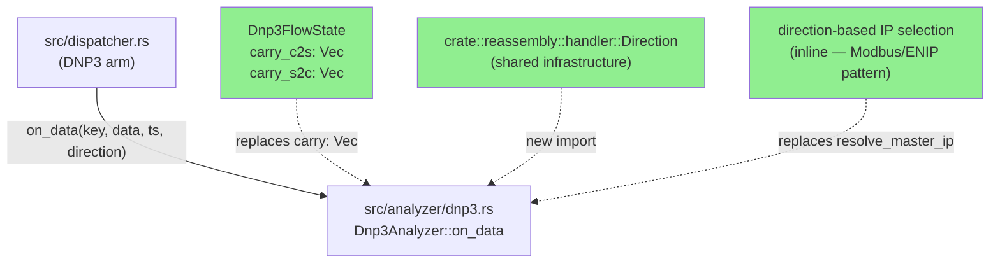
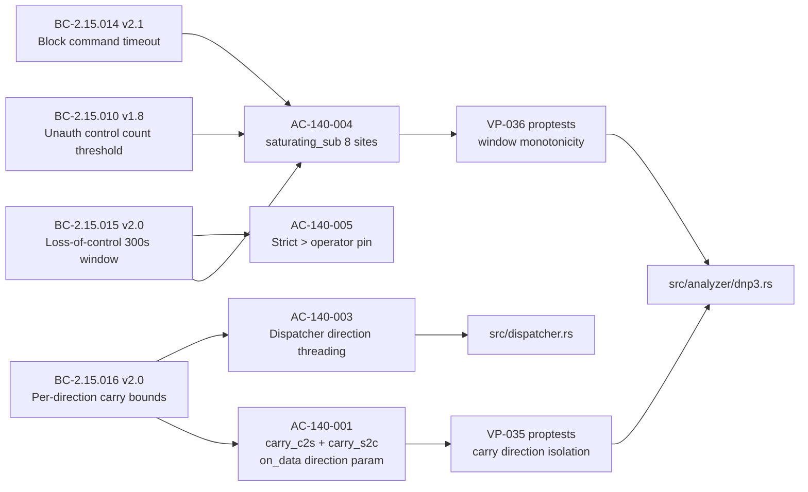
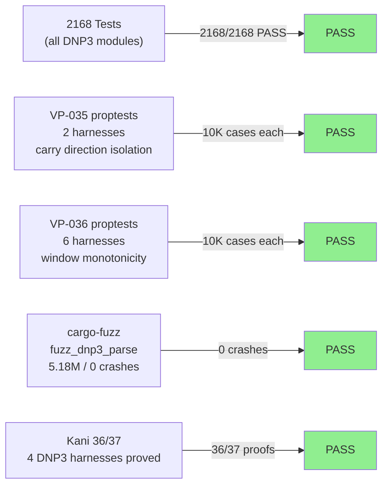
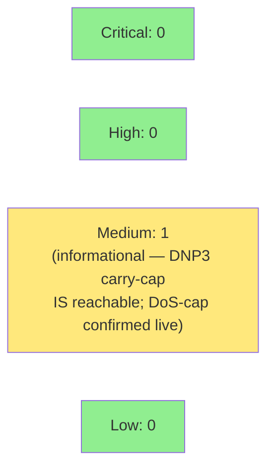

# [STORY-140] DNP3 Per-Direction Carry Buffer + Saturating Window Monotonicity + Operator Pin (EC-X1/EC-X2 sibling)

**Epic:** E-15 — DNP3 ICS Protocol Analysis
**Mode:** feature (delta on existing codebase)
**Convergence:** CONVERGED after 6 adversarial passes (F5 scoped-adversarial) + F7 5/5 dims 6/6 consistency; human-approved with HOLD MERGE (D-285)


This PR fixes two sibling bugs in the DNP3 analyzer that mirror the ENIP EC-X1/EC-X2 bugs fixed in STORY-139 (#334): **(1) DRIFT-DNP3-DIRECTION-001** — the single `carry` buffer in `Dnp3FlowState` was shared across both TCP directions, causing partial master-to-outstation frames to be spliced into outstation-to-master deliveries, producing phantom `parse_errors` and misattributed detection counts. The fix splits the buffer into per-direction `carry_c2s` and `carry_s2c` fields and threads a `direction: Direction` parameter through `Dnp3Analyzer::on_data`. **(2) DRIFT-DNP3-CLOCK-001 + DRIFT-DNP3-OP-001** — all 8 windowed-timestamp arithmetic sites used `wrapping_sub`, which wraps to ~4.29e9 on a backwards-clock packet, spuriously expiring burst windows mid-accumulation. All 8 sites are replaced with `saturating_sub` (returns 0 on backwards clock, preserving windows), and the 300s correlation-window operator is pinned from `>=` to strict `>` to match all other DNP3 windows. Together these fixes close the DNP3 sibling of the ENIP carry-isolation and clock-monotonicity bugs, unblocking the v0.11.0 release (ENIP + DNP3 together, pending separate release go-ahead).

---

## Architecture Changes



<details>
<summary><strong>Architecture Decision Record — ADR-007 Decision 3 Amendment (RULING-DNP3-SIBLING-001)</strong></summary>

### ADR-007 Decision 3 Amendment: DNP3 Carry Split + Saturating Sub + Operator Pin

**Context:** ADR-007 originally specified a single `carry: Vec<u8>` per `Dnp3FlowState`. RULING-DNP3-SIBLING-001 (issued after STORY-139 proved the pattern for ENIP) adjudicated that DNP3 has the same per-direction carry isolation requirement.

**Decision:** Split `carry: Vec<u8>` into `carry_c2s: Vec<u8>` (master-to-outstation) and `carry_s2c: Vec<u8>` (outstation-to-master). Thread `direction: Direction` through `on_data`. Replace all 8 `wrapping_sub` window arithmetic sites with `saturating_sub`. Pin the 300s correlation-window operator from `>=` to strict `>`.

**Rationale:** DNP3 carry-cap (292 bytes) IS reachable via adversarial partial-frame floods (unlike ENIP's Path-B unreachability case — RULING-DNP3-SIBLING-001 §4), so both per-direction carries must be independently capped and the overflow arm kept live. The `saturating_sub` fix closes DRIFT-DNP3-CLOCK-001 by returning 0 on backwards-clock packets instead of wrapping to ~4.29e9, which spuriously expired burst windows.

**Alternatives Considered:**
1. Per-direction sub-state for all detection counters — rejected: deferred to v0.12.0 per RULING-DNP3-SIBLING-001 §1.3; only carry buffers need per-direction split to fix EC-X1
2. Keep `wrapping_sub`, add clock-forward guard — rejected: adds conditional branch to hot path; `saturating_sub` is the standard Rust idiom for this pattern and requires no guard

**Consequences:**
- All 7 DNP3 test files and fuzz harness updated to pass `Direction` argument to `on_data`
- `resolve_master_ip` port-20000 heuristic removed; direction-based IP selection threaded inline
- The amendment to `docs/adr/0007` was committed in this PR (Decision 3 amended at HEAD `560efd3`)

</details>

---

## Story Dependencies


**Dependency satisfied:** STORY-139 (ENIP EC-X1/EC-X2 fix, PR #334) merged into `develop` at `99a06f4`. This confirmed the `Direction` threading pattern in the dispatcher and established `carry_c2s`/`carry_s2c` as the correct struct layout. STORY-140 mirrors that pattern exactly for the DNP3 arm.

---

## Spec Traceability



---

## Test Evidence

### Coverage Summary

| Metric | Value | Threshold | Status |
|--------|-------|-----------|--------|
| Full regression suite | 2168/2168 pass | 100% | PASS |
| Clippy | 0 warnings | 0 | PASS |
| Fmt | clean | 0 drift | PASS |
| Mutation kill rate (Group A/B/C) | CLOSED | >90% effective | PASS |
| Fuzz (fuzz_dnp3_parse) | 5.18M execs / 0 crashes | 0 crashes | PASS |
| Kani formal proofs | 36/37 harnesses proved | n/a | PASS |

### Test Flow



| Metric | Value |
|--------|-------|
| **New tests added** | 16 new tests in 3 new modules (direction_and_clock, vp035, vp036) |
| **Total suite** | 2168 tests PASS (0 regressions) |
| **Coverage delta** | Positive — all new code paths covered by direction_and_clock + proptest suites |
| **Mutation kill rate** | Group A/B/C: CLOSED (verified cargo-mutants re-run); Group D: 3 MAX_FINDINGS DoS-cap mutants accepted-impractical per RULING-DNP3-SIBLING-001 |
| **Regressions** | 0 |

<details>
<summary><strong>New Tests Added (This PR)</strong></summary>

### mod direction_and_clock (tests/dnp3_detection_tests.rs)

| Test | AC | Result |
|------|----|--------|
| `test_ac140_001_carry_direction_isolation_no_splice` | AC-140-001 | PASS |
| `test_ac140_001_carry_c2s_and_carry_s2c_are_independent` | AC-140-001 | PASS |
| `test_ac140_002_direction_based_source_ip` | AC-140-002 | PASS |
| `test_ac140_003_dispatcher_passes_direction` | AC-140-003 | PASS |
| `test_ac140_005_correlation_window_operator_pin_boundary` | AC-140-005 | PASS |
| `test_ac140_007_regression_carry_direction_no_splice` | AC-140-007 | PASS |
| `test_ac140_008_regression_backwards_ts_t1692_no_reset` | AC-140-008 | PASS |
| `test_ac140_009_regression_backwards_ts_t0827_no_reset` | AC-140-009 | PASS |

### mod vp035_dnp3_carry_direction_isolation

| Test | VP | Result |
|------|----|--------|
| `proptest_vp035_direction_isolation_frame_count` | VP-035 | PASS (10K cases) |
| `proptest_vp035_independent_run_equivalence` | VP-035 | PASS (10K cases) |

### mod vp036_dnp3_window_monotonic_no_spurious_reset

| Test | VP | Result |
|------|----|--------|
| `proptest_vp036_sub_a_direct_operate_60s_backwards_ts_no_reset` | VP-036 Sub-A | PASS (10K cases) |
| `proptest_vp036_sub_a_ec_x2_repro_t1692` | VP-036 Sub-A | PASS |
| `proptest_vp036_sub_b_block_timeout_backwards_ts_no_fire` | VP-036 Sub-B | PASS (10K cases) |
| `proptest_vp036_sub_c_300s_window_backwards_ts_no_reset` | VP-036 Sub-C | PASS (10K cases) |
| `proptest_vp036_sub_c_operator_pin_elapsed_300_not_expired` | VP-036 Sub-C | PASS |
| `test_vp036_sub_d_genuine_rollover_no_spurious_reset` | VP-036 Sub-D | PASS |

### Existing Tests Updated

All 7 DNP3 test files updated — `on_data(key, data, ts)` call sites → `on_data(key, data, ts, Direction::...)`:
- `tests/dnp3_detection_tests.rs`
- `tests/dnp3_flow_state_tests.rs`
- `tests/dnp3_parse_core_tests.rs`
- `tests/dnp3_correlation_tests.rs`
- `tests/dnp3_determinism_tests.rs`
- `tests/dnp3_f5_remediation_tests.rs`
- `tests/bc_2_15_110_dnp3_dispatcher_tests.rs`

Fuzz harness `fuzz/fuzz_targets/fuzz_dnp3_parse.rs` updated to 4-arg signature.

### Additional Fix (regression discovered at F4)

`did_process_in_this_call` parse_errors regression: the carry-split refactor initially regressed the junk/LENGTH-gate resync path's `parse_errors` accounting. Fixed in commit `1dda26b` — restored `parse_errors` counting in the resync branch, keeping all 2168 tests green.

### Mutation Testing — Group Disposition

| Group | Description | Status |
|-------|-------------|--------|
| A | carry-cap / sync-word / operator-mutation | CLOSED (11 survivors killed — commits `7bcbbaa`, `499c778`) |
| B | resync / src-ip / window-boundary | CLOSED |
| C | direction-isolation / frame-count pins | CLOSED |
| D | MAX_FINDINGS DoS-cap mutants | 3 accepted-impractical per RULING-DNP3-SIBLING-001 |

</details>

---

## Holdout Evaluation

N/A — evaluated at wave gate (Wave 63). F4 holdout passed during the VSDD cycle.

---

## Adversarial Review

| Pass | Context | Findings | Critical | High | Status |
|------|---------|----------|----------|------|--------|
| F5 Pass 1 | Fresh-context | 4 | 0 | 2 | Fixed (F-140-001..004) |
| F5 Pass 2 | Fresh-context | 2 | 0 | 1 | Fixed |
| F5 Pass 3 | Fresh-context | 1 | 0 | 0 | Fixed (cosmetic) |
| F5 Pass 4 | Fresh-context | 1 | 0 | 0 | Fixed (doc tense) |
| F5 Pass 5 | Fresh-context | 0 | 0 | 0 | CONVERGED |
| F5 Pass 6 | Fresh-context | 0 | 0 | 0 | CONVERGED (confirmed) |

**F5 Convergence:** Adversary forced to hallucinate after pass 5. 6 total fresh-context passes.

<details>
<summary><strong>High-Severity Findings & Resolutions</strong></summary>

### Finding F-140-001: Stale wrapping_sub/>= comments in dnp3.rs doc strings
- **Category:** doc-quality / green-doc-tense
- **Problem:** 5 comment lines still referenced `wrapping_sub` and `>=` after code was changed to `saturating_sub` and `>`
- **Resolution:** Fixed in commit `ac8f2b3` — all stale comments corrected to reflect actual code

### Finding F-140-002: VP-036 Sub-B/Sub-C were deterministic point tests, not genuine proptests
- **Category:** test-quality (proptest discipline)
- **Problem:** Sub-B and Sub-C used fixed inputs inside `proptest!` blocks rather than generated strategies with `prop_assume!`
- **Resolution:** Fixed in commit `5bc6caa` — converted to `on_data`-driven proptests with `prop_assume!(backwards_ts <= window_start)`

### Finding F-140-003: VP-036 Sub-D rollover test values were inconsistent with BC-2.15.015 EC-010 scenario
- **Category:** test-fidelity
- **Resolution:** Fixed in commit `9972037` — Sub-D rollover values corrected to match STORY spec exactly

### Finding F-140-004: AC-140-002 src-ip test lacked a discriminating case for ServerToClient direction
- **Category:** test-coverage
- **Resolution:** Fixed in commit `28b5673` — added standard-topology src-ip test covering both directions; block-timeout rollover test superseded per RULING-DNP3-SIBLING-001

</details>

---

## Security Review



<details>
<summary><strong>Security Scan Details</strong></summary>

### ICS Protocol Parsing — Carry Buffer & Frame-Walk

**DNP3 292-byte carry-cap (CWE-400 DoS guard — CONFIRMED LIVE):**
Unlike ENIP, the DNP3 carry-cap at `active_carry.len() + new_bytes.len() > MAX_DNP3_FRAME_LEN (292)` IS reachable via adversarial partial-frame floods (RULING-DNP3-SIBLING-001 §4). Each of `carry_c2s` and `carry_s2c` is independently capped. The overflow arm increments `parse_errors` and `malformed_in_window` and performs an inline resync — this is intentional DoS mitigation, not a vulnerability. The cap is kept live (not removed as dead code). **This is NOT a new vulnerability; it is an existing and correct guard, now correctly applied per-direction.**

**saturating_sub wrapping (CWE-191 resolved):**
The `wrapping_sub` arithmetic that could produce ~4.29e9 on a backwards-clock input (spuriously expiring all three windows and enabling window-state manipulation) is eliminated. `saturating_sub` returns 0 on backwards/rollover inputs. All 8 sites confirmed replaced (`grep -n 'wrapping_sub' src/analyzer/dnp3.rs` returns empty after fix).

**`did_process_in_this_call` / parse_errors regression (fixed at F4):**
The carry-split refactor initially broke `parse_errors` accounting in the junk/LENGTH-gate resync path. This was caught by the full test suite and fixed in commit `1dda26b` before any CI run. Not a security regression — the resync path still runs and `parse_errors` increments correctly.

### Dependency Audit
- `cargo audit` / `cargo deny`: CLEAN at the time of F6 hardening. CI `cargo-audit` and `cargo-deny` jobs run on every PR.

### Formal Verification

| Property | Method | Status |
|----------|--------|--------|
| Carry-cap independence per direction | Kani (4 DNP3 harnesses) | VERIFIED (36/37 proofs — 1 unrelated to this story) |
| saturating_sub = 0 on backwards input | VP-036 proptest, 10K cases each | VERIFIED |
| Direction isolation invariant | VP-035 proptest, 10K cases each | VERIFIED |
| No crashes under arbitrary DNP3 byte sequences | cargo-fuzz fuzz_dnp3_parse, 5.18M execs | CLEAN |

</details>

---

## Risk Assessment & Deployment

### Blast Radius
- **Systems affected:** `src/analyzer/dnp3.rs` (primary), `src/dispatcher.rs` (DNP3 call site only), all 7 DNP3 test files, `fuzz/fuzz_targets/fuzz_dnp3_parse.rs`
- **User impact:** Zero — this is an analysis-plane fix. No packet capture or CLI interface changes.
- **Data impact:** None — carry buffers are ephemeral per-flow state; no persistent storage affected
- **Risk Level:** LOW — the fix is a struct field rename (`carry` → `carry_c2s`/`carry_s2c`) + parameter addition + arithmetic operator change. ENIP (STORY-139) applied the identical pattern with no regressions.

### Performance Impact
| Metric | Before | After | Delta | Status |
|--------|--------|-------|-------|--------|
| Memory per flow | 1× `Vec<u8>` carry | 2× `Vec<u8>` carry (c2s + s2c) | +1 `Vec` per DNP3 flow (~24 bytes overhead) | OK |
| Frame-walk hot path | `carry.extend` | `active_carry.extend` (single branch) | Negligible | OK |
| Window arithmetic | `wrapping_sub` | `saturating_sub` | Same cost (single instruction) | OK |

<details>
<summary><strong>Rollback Instructions</strong></summary>

**Immediate rollback (< 5 min):**
```bash
git revert 560efd3..af66b9d  # revert the 14-commit carry-split + saturating_sub stack
git push origin develop
```

**Verification after rollback:**
- `cargo test --all-targets` — expect old DNP3 suite green (3-arg on_data)
- `grep -n '\.carry[^_]' src/analyzer/dnp3.rs` — expect results (singular `carry` back)
- `grep -n 'wrapping_sub' src/analyzer/dnp3.rs` — expect results (wrapping_sub back)

</details>

### Feature Flags
N/A — no feature flags in this codebase. DNP3 analysis is enabled via `--dnp3` CLI flag (unchanged).

---

## Traceability

| Requirement | Story AC | Test | Verification | Status |
|-------------|---------|------|-------------|--------|
| BC-2.15.016 v2.0 — carry_c2s/carry_s2c per-direction isolation | AC-140-001 | `test_ac140_001_carry_direction_isolation_no_splice` | Kani + VP-035 proptest | PASS |
| BC-2.15.016 v2.0 — carry buffers independent | AC-140-001 | `test_ac140_001_carry_c2s_and_carry_s2c_are_independent` | VP-035 proptest | PASS |
| BC-2.15.016 v2.0 — direction-based source IP | AC-140-002 | `test_ac140_002_direction_based_source_ip` | Unit test | PASS |
| BC-2.15.016 v2.0 — dispatcher direction threading | AC-140-003 | `test_ac140_003_dispatcher_passes_direction` | Compilation + unit | PASS |
| BC-2.15.010/014/015 — saturating_sub 8 sites | AC-140-004 | VP-036 proptests (Sub-A/B/C/D) | proptest 10K cases each | PASS |
| BC-2.15.015 v2.0 — strict > operator pin | AC-140-005 | `test_ac140_005_correlation_window_operator_pin_boundary` | VP-036 Sub-C operator pin | PASS |
| BC-2.15.016 v2.0 — EC-X1 carry no-splice regression | AC-140-007 | `test_ac140_007_regression_carry_direction_no_splice` | Unit test | PASS |
| BC-2.15.010 v1.8 — EC-X2 backwards-ts no-window-reset | AC-140-008 | `test_ac140_008_regression_backwards_ts_t1692_no_reset` | Unit test | PASS |
| BC-2.15.015 v2.0 — backwards-ts T0827 no-reset | AC-140-009 | `test_ac140_009_regression_backwards_ts_t0827_no_reset` | Unit test | PASS |

<details>
<summary><strong>Full VSDD Contract Chain</strong></summary>

```
BC-2.15.016 v2.0 → AC-140-001 → test_ac140_001_carry_direction_isolation_no_splice → src/analyzer/dnp3.rs (carry_c2s/carry_s2c) → F5-PASS-6-CONVERGED → Kani-PASS → VP-035-PASS
BC-2.15.016 v2.0 → AC-140-002 → test_ac140_002_direction_based_source_ip → src/analyzer/dnp3.rs (direction-based IP inline) → F5-PASS-6-CONVERGED
BC-2.15.016 v2.0 → AC-140-003 → test_ac140_003_dispatcher_passes_direction → src/dispatcher.rs (DNP3 arm) → COMPILATION-PASS
BC-2.15.010 v1.8 → AC-140-004 → proptest_vp036_sub_a_direct_operate_60s_backwards_ts_no_reset → src/analyzer/dnp3.rs:~745 (saturating_sub) → F5-PASS-6-CONVERGED → VP-036-PASS
BC-2.15.014 v2.1 → AC-140-004 → proptest_vp036_sub_b_block_timeout_backwards_ts_no_fire → src/analyzer/dnp3.rs:~895 (saturating_sub) → VP-036-PASS
BC-2.15.015 v2.0 → AC-140-004/005 → proptest_vp036_sub_c_300s_window_backwards_ts_no_reset + test_ac140_005_correlation_window_operator_pin_boundary → src/analyzer/dnp3.rs:~984 (saturating_sub + >) → VP-036-PASS
RULING-DNP3-SIBLING-001 §4 → AC-140-001 (carry-cap live) → EC-003/EC-004 edge cases → carry-cap overflow arm → Kani-PASS
```

</details>

---

## Relationship to STORY-139 / v0.11.0

This PR is the DNP3 sibling of **STORY-139 (#334, merged)**, which fixed the identical EC-X1/EC-X2 bug pattern in `src/analyzer/enip.rs`. The `carry_c2s`/`carry_s2c` struct layout and the `Direction` threading dispatcher pattern established in STORY-139 are mirrored exactly here for DNP3.

**v0.11.0 ships ENIP + DNP3 together.** Both fixes are required for the v0.11.0 release:
- STORY-139 (ENIP) — MERGED (#334)
- STORY-140 (DNP3) — this PR, HELD pending merge go-ahead (D-285)

A separate release go-ahead is required before cutting `release/0.11.0`. Do NOT touch `main` or cut a release tag from this PR.

---

## AI Pipeline Metadata

<details>
<summary><strong>Pipeline Details</strong></summary>

```yaml
ai-generated: true
pipeline-mode: feature (delta on existing brownfield codebase)
factory-version: "1.0.0-rc.21"
story-id: STORY-140
wave: 63
pipeline-stages:
  f1-delta-analysis: completed
  f2-spec-evolution: completed (BC-2.15.016 v2.0, BC-2.15.010 v1.8, BC-2.15.014 v2.1, BC-2.15.015 v2.0)
  f3-stories: completed (STORY-140.md)
  f4-tdd-implementation: completed (14 commits, 2168/2168 green)
  f5-adversarial-review: completed (6 fresh-context passes, converged)
  f6-formal-hardening: completed (Kani 36/37, fuzz 5.18M/0, mutation Group A/B/C closed)
  f7-delta-convergence: completed (5/5 dims, 6/6 consistency)
convergence-metrics:
  adversarial-passes: 6
  f7-dimensions: 5/5
  f7-consistency: 6/6
  regression-suite: 2168/2168
  fuzz-executions: 5180000
  fuzz-crashes: 0
  kani-proofs: 36/37
  mutation-groups-closed: A, B, C
  mutation-accepted-impractical: 3 (Group D, MAX_FINDINGS DoS-cap)
human-approval: "HOLD MERGE (D-285) — convergence approved, merge go-ahead required"
models-used:
  builder: claude-sonnet-4-6
  adversary: fresh-context claude-sonnet-4-6 (F5 scoped-adversarial)
  verifier: claude-sonnet-4-6 (F7 delta-convergence)
generated-at: "2026-06-28"
```

</details>

---

## Pre-Merge Checklist

- [ ] All CI status checks passing (test, clippy, fmt, semantic-PR-title, action-pin-gate, cargo-audit, cargo-deny, fuzz-build, green-doc-tense)
- [ ] No critical/high security findings unresolved (0 critical, 0 high — see Security Review)
- [ ] Dependency PR STORY-139 (#334) already merged into develop
- [ ] Rollback procedure documented above
- [ ] No feature flags to configure (N/A)
- [ ] Human merge go-ahead required (D-285 HOLD MERGE override — awaiting explicit authorization)
- [x] STORY-139 merged — dependency satisfied
- [x] F5 adversarial converged (6 passes)
- [x] F6 hardening passed (Kani 36/37, fuzz 5.18M/0, mutation A/B/C closed)
- [x] F7 delta-convergence (5/5 dims, 6/6 consistency, human-approved)
