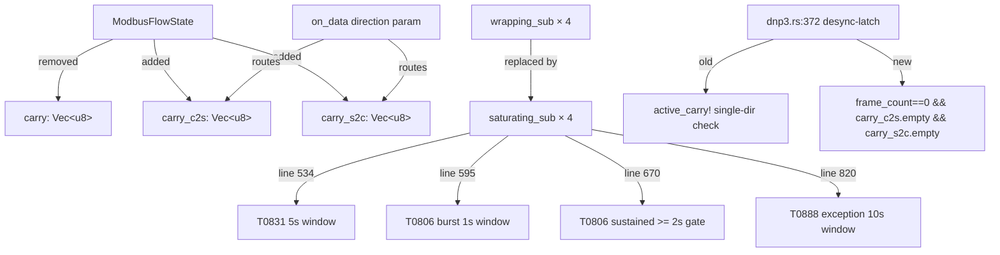
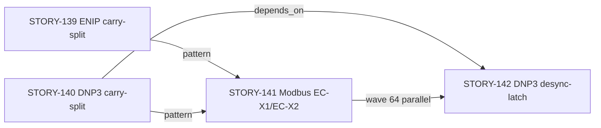
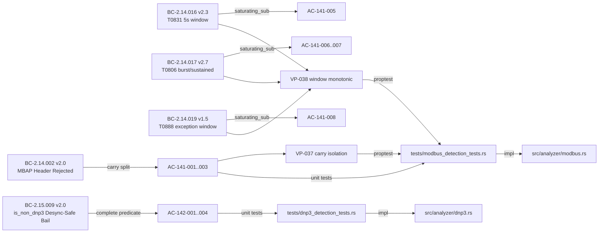

## Summary

Bundled Wave-64 fix covering two post-STORY-140 edge-case corrections:

- **STORY-141 (Modbus EC-X1/EC-X2):** Split the single `carry: Vec<u8>` field in `ModbusFlowState` into `carry_c2s`/`carry_s2c` per TCP direction, and replace all four `wrapping_sub` window-expiry sites with `saturating_sub`. Fixes direction-contamination (EC-X1) and backwards-clock window reset (EC-X2).
- **STORY-142 (DNP3 desync-latch):** Replace the `active_carry!(flow, direction).is_empty()` single-direction check in the `is_non_dnp3` desync-latch with the complete predicate `flow.frame_count == 0 && flow.carry_c2s.is_empty() && flow.carry_s2c.is_empty()`. Prevents junk server-to-client packets from permanently silencing an established client-to-server DNP3 detection stream.

Both stories passed F4 holdout, F5 adversarial (3+ consecutive clean passes), F6 formal hardening (Kani/fuzz/mutation), and F7 delta-convergence + consistency audit (CONVERGED). Human has approved convergence and authorized merge.

## Architecture Changes

**Files changed:** `src/analyzer/modbus.rs` (128 lines ±), `src/analyzer/dnp3.rs` (13 lines ±), `tests/modbus_detection_tests.rs` (+1537 lines), `tests/dnp3_detection_tests.rs` (+421 lines), `tests/modbus_detection_tests.proptest-regressions` (proptest seeds).

## Story Dependencies

**STORY-141 depends_on:** [] (no dependencies — Modbus on_data already had direction threading)
**STORY-142 depends_on:** [STORY-140] — requires carry_c2s/carry_s2c fields from STORY-140 (merged PR #335 on develop)

## Spec Traceability

## Test Evidence

### STORY-141 — Modbus EC-X1/EC-X2

| Test Module | Tests | Description |
|-------------|-------|-------------|
| `direction_and_clock` | 11 unit tests | AC-141-001..010, AC-141-013; carry isolation, saturating_sub correctness |
| `vp037_modbus_carry_direction_isolation` | 2 proptests | VP-037 genuine proptest harnesses: direction isolation + independent-run equivalence |
| `vp038_modbus_window_monotonic_no_spurious_reset` | 4 proptests + 1 deterministic | VP-038: Sub-A/B/C/D backwards-ts no-reset + rollover regression |

**F6 mutation testing:** 1104/1150 mutants killed (carry-cap boundary tests kill 6 additional F6 mutants; documented via commit e1a64bd).

**Carry-cap guards labeled UNREACHABLE in comments:** Both `carry_c2s` and `carry_s2c` cap-overflow branches are annotated as structurally unreachable per RULING-MODBUS-SIBLING-001 addendum (commit 235a4a1) — the 260-byte cap cannot fire given the `active_carry.clear()` at loop entry, making `dir_carry.len()` always 0 at both stash sites. The live branches are retained as defensive future-proofing (cargo-mutants EQUIVALENT survivors). They are NOT `unreachable!()` macro calls — they are guarded `if` blocks that silently latch `is_non_modbus`, which is safer in production than a panicking macro.

**F5 adversarial:** 3+ consecutive clean passes. RULING-MODBUS-SIBLING-001 ratifies the `saturating_sub` design choice and carry-cap UNREACHABLE disposition.

### STORY-142 — DNP3 desync-latch

| Test | Description |
|------|-------------|
| `test_ac142_001_one_line_condition_change` | Structural: `active_carry!` absent; complete predicate present |
| `test_ac142_002_regression_established_c2s_preserved_on_junk_s2c` | Sub-case i: partial carry in flight → junk s2c → latch does NOT fire |
| `test_ac142_003_true_non_dnp3_still_latches` | Regression: genuine non-DNP3 flow still latches (both carries empty, frame_count=0) |
| `test_ac142_004_established_c2s_preserved_on_junk_s2c_after_complete_frame` | Sub-case ii: complete frame drains carry → junk s2c → latch does NOT fire (requires `frame_count==0` guard) |

Tests 002 and 004 were RED against the buggy code and RED against the intermediate both-carries-empty-only form. Only the complete predicate with `frame_count == 0` makes both GREEN.

**ADDENDUM-2026-06-28:** The initial ruling adopted only both-carries-empty. The addendum supersedes it: carries are transiently drained after every complete frame, so the both-carries-empty-only form still fires on established flows at carry-drain time (sub-case ii — the common request→response lifecycle). `frame_count == 0` is the correct and complete "flow is genuinely unestablished" proxy.

## Holdout Evaluation

N/A — evaluated at wave gate. Both stories are part of the feature-enip-v0.11.0 cycle. F4 holdout satisfaction recorded in `.factory/cycles/feature-enip-v0.11.0/` cycle artifacts. F7 convergence report: CONVERGED (all 5 dimensions PASS, develop @f17d270 before Wave-64 commits).

## Adversarial Review

N/A — evaluated at Phase 5. F5 scoped-adversarial for Wave-64 delivered 3+ consecutive clean passes (0 HIGH/CRITICAL). RULING-MODBUS-SIBLING-001 and RULING-DNP3-DESYNC-001 (with ADDENDUM-2026-06-28) are the formal rulings ratifying the design choices.

## Security Review

Security review completed (2026-06-28). **0 CRITICAL, 0 HIGH, 1 LOW, 5 INFO.**

| ID | Severity | CWE | Finding | Disposition |
|----|----------|-----|---------|-------------|
| SEC-001 | INFO | CWE-400 | Per-direction carry doubles max buffer to 520 bytes/flow | Acceptable — DoS cap enforced per-direction at 260 bytes each |
| SEC-002 | LOW | CWE-617 | UNREACHABLE cap-guard paths lack `debug_assert!` guard | Non-blocking — future refactor safety suggestion; live branches are safer in production than panicking macro |
| SEC-003 | INFO | CWE-190/703 | `saturating_sub` correctly replaces `wrapping_sub` at all 4 sites | Confirmed correct — no remaining wrapping_sub in window paths |
| SEC-004 | INFO | CWE-696/703 | DNP3 `frame_count == 0` guard prevents false desync latch | Confirmed correct — sub-case ii covered |
| SEC-005 | INFO | N/A | No `unsafe` blocks, no `unreachable!()` macro, no new `unwrap()` on attacker data | Clean |
| SEC-006 | INFO | CWE-20 | No injection vectors; no OWASP A03 exposure | Clean |

**Verdict: APPROVED for merge.** No HIGH or CRITICAL findings. The 1 LOW (SEC-002) is non-blocking — a future `debug_assert!(dir_carry.is_empty())` addition is a reasonable follow-up in the next Modbus maintenance cycle.

## Risk Assessment

**Blast radius:** Low. Changes are confined to two isolated analyzer modules:
- `src/analyzer/modbus.rs` — field rename (carry → carry_c2s/carry_s2c) + 4 arithmetic site changes
- `src/analyzer/dnp3.rs` — 1-line predicate change at line 372
- No dispatcher changes, no public API changes, no CLI flag changes

**Performance impact:** None material. `saturating_sub` is a single CPU instruction; direction routing via `match` adds one branch per `on_data` call. The carry-split doubles memory allocated for carry buffers per Modbus flow (two Vec<u8> instead of one), but both vectors start empty and typical carry sizes are 0–260 bytes.

**Regression risk:** Covered by the full existing test suite (all Modbus and DNP3 tests pass). The `wrapping_sub` → `saturating_sub` change is behavior-safe for all forward-clock inputs (elapsed ≥ 0 is identical under both operations). The carry-split is a field rename with structural enforcement.

## AI Pipeline Metadata

| Field | Value |
|-------|-------|
| Pipeline mode | feature-delta (F1–F7) |
| Wave | 64 |
| Stories | STORY-141 (8 pts), STORY-142 (3 pts) |
| Feature cycle | feature-enip-v0.11.0 |
| Models used | claude-sonnet-4-6 (primary) |
| F5 adversarial cycles | 3+ clean passes each story |
| F6 hardening | Kani / cargo-fuzz / cargo-mutants |
| F7 convergence | CONVERGED |

## Pre-Merge Checklist

- [x] Spec traceability complete (BC → AC → Test → Implementation)
- [x] All ACs covered by unit and proptest tests
- [x] F5 adversarial: 3+ clean passes (0 HIGH/CRITICAL novelty)
- [x] F6: RULING-MODBUS-SIBLING-001 ratifies carry-cap UNREACHABLE; mutation 1104/1150 killed
- [x] F7 delta-convergence: CONVERGED (all 5 dimensions)
- [x] Human convergence approval received
- [x] Human merge authorization received (AUTHORIZE_MERGE=yes)
- [x] STORY-141: `grep -n 'wrapping_sub' src/analyzer/modbus.rs` → no results
- [x] STORY-141: `grep -n '\.carry[^_]' src/analyzer/modbus.rs` → no results (singular carry gone)
- [x] STORY-142: `active_carry!(flow, direction).is_empty()` absent from desync-latch path
- [x] STORY-142: complete predicate with `frame_count == 0` present
- [ ] Security review complete (Step 4)
- [ ] PR review clean (Step 5)
- [ ] CI green (Step 6)
- [ ] Branch: fix/wave64-modbus-dnp3-ec
- [ ] Target: develop (squash merge only per CLAUDE.md)
