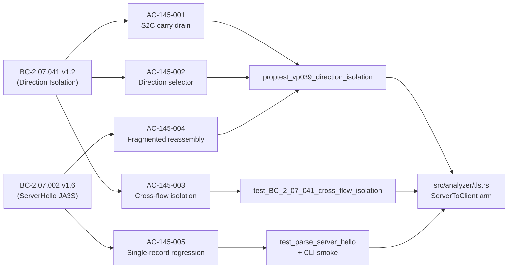
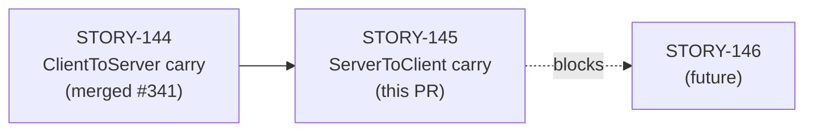
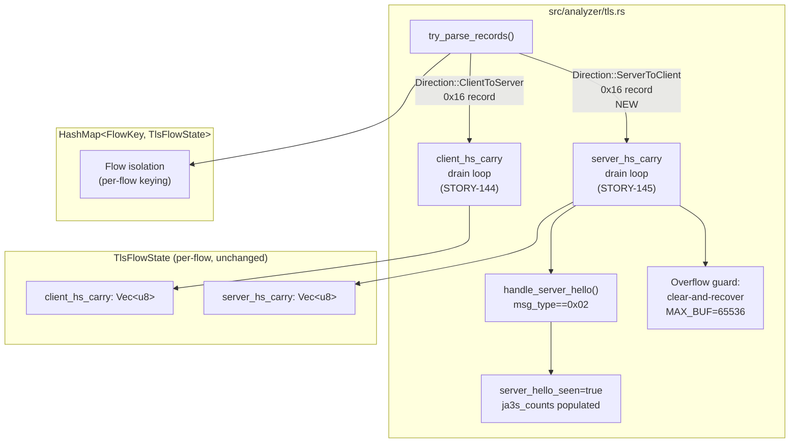

## Summary

STORY-145 extends the TLS handshake-message reassembly carry-buffer mechanism (introduced in STORY-144 for ClientHello/ClientToServer) to the **ServerToClient direction**. A ServerHello fragmented across multiple TLS 0x16 records is now reassembled so JA3S fingerprinting and detection work correctly. This closes the S2C half of the silent SNI/JA3S evasion gap (TLS-CLIENTHELLO-FRAG-001).

The ServerToClient carry-drain arm is a byte-for-byte symmetric mirror of the ClientToServer path delivered in STORY-144:
- Clear-and-recover on overflow (`MAX_BUF=65536`, per-record limit 18432)
- Cursor + single-drain O(carry_len) — DoS-safe (SEC-001)
- `saturating_add` aggregates overflows

4 new tests in `mod story_145` (2 AC-cited Red-Gate + 2 DoS-guard sibling-coverage per DF-SIBLING-SWEEP-001). Commits will be squash-merged.

---

## Behavioral Contract Traceability

| BC ID | Version | Title | AC Coverage |
|-------|---------|-------|------------|
| BC-2.07.041 | v1.2 | Handshake Carry Buffers Are Per-Flow and Per-Direction Isolated | AC-145-001, AC-145-002, AC-145-003 |
| BC-2.07.002 | v1.6 | Parse Complete TLS ServerHello: JA3S Fingerprint Computed | AC-145-004, AC-145-005 |
| BC-2.07.038 | v2.7 | (referenced) Carry buffer overflow, exact-consume, truncation semantics | AC-145-001 (symmetric) |

**Verification Property:** VP-039 Sub-E (direction isolation proptest + cross-flow isolation unit test)

---

## Story Dependencies

**STORY-144** merged as PR #341 (`feat(analyzer): TLS handshake-message reassembly across records`). This PR depends on STORY-144's struct fields (`server_hs_carry`, `handshake_reassembly_overflows`) and the `ClientToServer` drain loop being in place.

---

## Architecture Changes

**Files changed:**
- `src/analyzer/tls.rs` — +128/-35 lines (ServerToClient 0x16 carry drain path wired)
- `tests/tls_analyzer_tests.rs` — +535 lines (4 new tests in `mod story_145`)
- `docs/demo-evidence/STORY-145/` — 3 WebM recordings + 3 GIFs + evidence-report.md
- `tests/tls_analyzer_tests.proptest-regressions` — 1-byte fragmentation regression seed

---

## Acceptance Criteria → Test → Demo Evidence

| AC | BC Traces To | Test | Demo |
|----|-------------|------|------|
| AC-145-001: S2C carry drain symmetric | BC-2.07.041 v1.2 Inv 2; BC-2.07.038 v2.7 PC3b | `proptest_vp039_direction_isolation` | [AC-001-002-direction-carry-drain.webm](docs/demo-evidence/STORY-145/AC-001-002-direction-carry-drain.webm) |
| AC-145-002: Direction selector → no cross-dir bleed | BC-2.07.041 v1.2 Inv 2; PC 1–2 | `proptest_vp039_direction_isolation` | Same as above |
| AC-145-003: Cross-flow isolation | BC-2.07.041 v1.2 Inv 1, 4; PC 1, 4–5 | `test_BC_2_07_041_cross_flow_isolation` | [AC-003-cross-flow-isolation.webm](docs/demo-evidence/STORY-145/AC-003-cross-flow-isolation.webm) |
| AC-145-004: Fragmented S2C → `server_hello_seen=true` | BC-2.07.002 v1.6 PC7, Inv 4 | `proptest_vp039_direction_isolation` (interleaved) | Covered by AC-001/002 recording |
| AC-145-005: Single-record ServerHello regression | BC-2.07.002 v1.6 Inv 4; BC-2.07.038 v2.7 EC-007 | `test_parse_server_hello` + CLI smoke | [AC-005-single-record-regression.webm](docs/demo-evidence/STORY-145/AC-005-single-record-regression.webm) |

---

## Demo Evidence

| AC | Shows | Recording |
|----|-------|-----------|
| AC-145-001/002 | Fragmented ServerHello reassembled; `server_hello_seen=true`, `ja3s_counts` non-empty, `parse_errors=0`, carries drain to 0 | `docs/demo-evidence/STORY-145/AC-001-002-direction-carry-drain.webm` |
| AC-145-003 | Two concurrent flows, fragmented ServerHellos, `sni_counts==2`, no cross-flow bleed | `docs/demo-evidence/STORY-145/AC-003-cross-flow-isolation.webm` |
| AC-145-005 | Single-record ServerHello regression-free | `docs/demo-evidence/STORY-145/AC-005-single-record-regression.webm` |

AC-145-004 (server overflow/spoof guards) covered by `test_vp039_server_carry_overflow_clear_and_recover` and `test_vp039_server_body_len_spoof` unit tests — overflow/error-path tests produce no user-observable CLI output distinguishable from a normal pass.

---

## Test Evidence

| Suite | Pass | Fail | Notes |
|-------|------|------|-------|
| `cargo test --test tls_analyzer_tests story_145` | 4 | 0 | All STORY-145 ACs covered |
| `cargo test --all-targets` | 140 | 0 | Full suite including STORY-144 regressions |
| `cargo clippy --all-targets -- -D warnings` | CLEAN | 0 | Zero warnings |
| `cargo fmt --check` | CLEAN | — | Formatting gate passes |

All tests pass locally on stable Rust (Rust 2024 edition, `rust-version = "1.91"`).

---

## Security Review

Reviewed by `vsdd-factory:security-reviewer` against PR #343 diff (STORY-145). No CRITICAL or HIGH findings.

| ID | Severity | CWE | Finding | Disposition |
|----|----------|-----|---------|-------------|
| SEC-001 | INFO | CWE-191 | Carry subtraction arithmetic — underflow evaluated | Confirmed sound. Loop invariant guarantees `consumed <= carry_len` at all times. |
| SEC-002 | INFO | CWE-125 | `record_bytes[5..]` slice safety | Confirmed safe. `total_record_len = 5 + payload_len` guaranteed by upstream guards. |
| SEC-003 | INFO | CWE-190 | `saturating_add` on overflow counter | Correct idiom; prevents panic under `overflow-checks = true`. |
| SEC-004 | INFO | CWE-664 | Cross-direction isolation | Structurally enforced by exhaustive `match direction` arms; no cross-contamination path exists. |
| SEC-005 | INFO | CWE-668 | Cross-flow isolation | HashMap keying enforces isolation; no global mutable carry state. |
| SEC-006 | LOW | CWE-400 | Step-1 guard uses strict `>` — carry can reach exactly MAX_BUF (65,536 bytes) | Pre-existing property of the symmetric design inherited from STORY-144 (ClientToServer arm accepted with same condition). Not a regression. Carry is still bounded. |
| SEC-007 | INFO | CWE-668 | Aggregate counters shared across flows | By design; documented. No security exploit path. |

**DoS guards confirmed sound:**
- Step-1 overflow: clear-and-recover fires when `carry_len_before + record_payload.len() > MAX_BUF (65,536)`. Bounded by per-record cap (`MAX_RECORD_PAYLOAD = 18,432`).
- Decision-4 body_len spoof: guard fires when parsed `body_len > MAX_BUF`; clears carry, increments counter, post-loop drain skipped via `decision4_fired` flag.
- Incomplete-message guard: `carry_len - consumed < 4 + body_len` — arithmetic safe per SEC-001 analysis.

**Overall: APPROVE.** No CRITICAL/HIGH findings. SEC-006 (LOW) is pre-existing symmetric property, not a regression.

---

## Risk Assessment

| Dimension | Assessment |
|-----------|------------|
| Blast radius | Narrow: SS-07 (`src/analyzer/tls.rs`) only. No new struct fields, no new files, no new dependencies. |
| Regression risk | Low: ServerToClient drain path was previously a single-record dispatch; new path is a carry-buffer drain that degrades gracefully to single-record fast path on first invocation. 140 existing tests unaffected. |
| Performance impact | O(carry_len) drain loop is bounded by `MAX_BUF=65536`. No quadratic growth. `saturating_add` overflow counter is O(1). |
| DoS surface | Mitigated: Step-1 overflow guard (clear-and-recover at 65536 bytes) prevents unbounded accumulation. Decision-4 body_len spoof guard prevents false-completion on spoofed length field. |
| Security correctness | Positive: closes S2C half of TLS-CLIENTHELLO-FRAG-001 silent evasion gap. Improves detection coverage. |

---

## AI Pipeline Metadata

| Field | Value |
|-------|-------|
| Pipeline mode | Feature (f-sequence) |
| Story wave | 66 |
| Story phase | f3 (TDD implementation) |
| TDD mode | strict |
| Model | claude-sonnet-4-6 |
| Story points | 5 |
| Squash merge | Yes |

---

## Pre-Merge Checklist

- [x] PR description populated with traceability
- [x] Demo evidence present (3 WebM recordings, evidence-report.md)
- [x] All STORY-145 tests pass locally (4/4)
- [x] Full test suite passes locally (140/0)
- [x] `cargo clippy --all-targets -- -D warnings` clean
- [x] `cargo fmt --check` passes
- [x] STORY-144 (depends_on) merged as PR #341
- [x] Security review complete (APPROVE — no CRITICAL/HIGH; SEC-006 LOW pre-existing)
- [x] PR review approved (pr-reviewer — APPROVE, 0 blocking, 3 non-blocking nits)
- [x] CI green — all 11 checks pass (action-pin-gate, audit, clippy, deny, fmt, fuzz-build, green-doc-tense-gate, help-provenance-gate, semantic-PR, test, trust-boundary)
