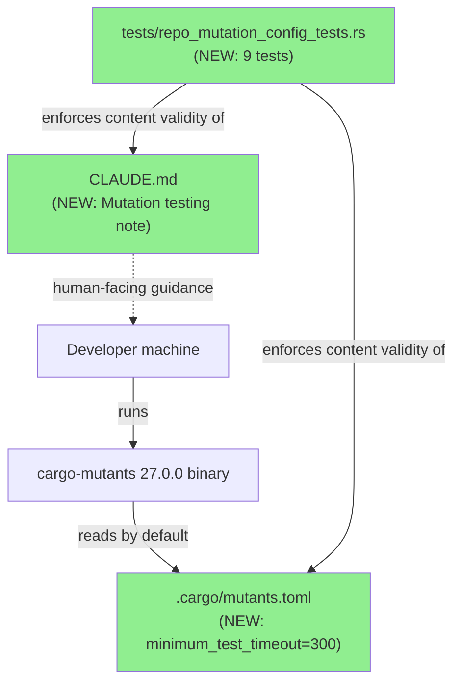
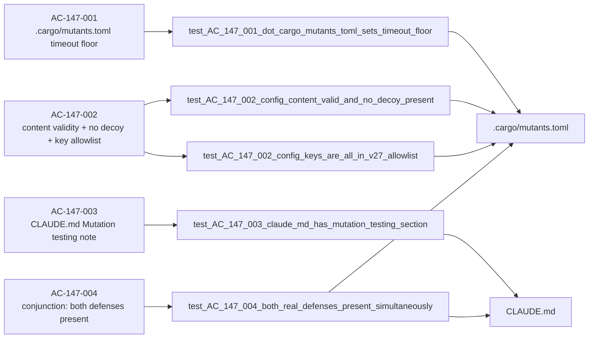
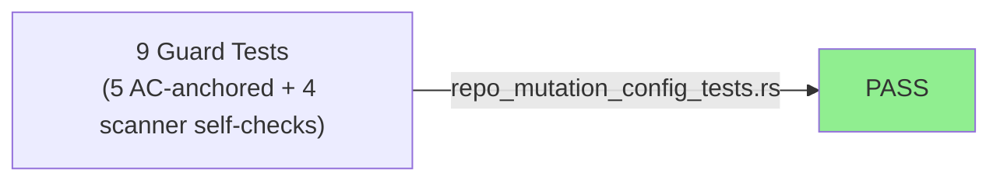
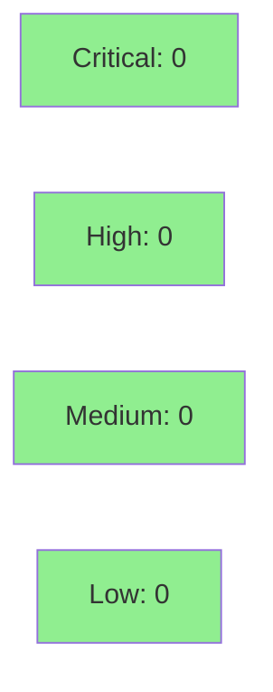

# [STORY-147] Repo-Local Mutation-Testing Defaults: .cargo/mutants.toml Timeout Floor + CLAUDE.md Guidance

**Epic:** E-11 — Tooling and Self-Improvement
**Mode:** maintenance (governance/config-only story; no BCs authored — E-11 convention)
**Convergence:** CONVERGED after 8 adversarial passes (clean streak P6/P7/P8)


Encodes lesson PG-MUTANTS-JOBS-001 (fix-tls-clienthello-frag F6, 2026-07-01 — a
`--jobs 8` mutation run reported a false "0 missed" because infinite-loop mutants
pegged all cores and inflated other mutants' wall-clock past the auto-timeout,
hiding two real survivors) into two repo-local defenses: (1) `.cargo/mutants.toml`
— the only path cargo-mutants actually reads by default — setting
`minimum_test_timeout = 300` as a timeout floor, and (2) a `CLAUDE.md` "Mutation
testing" note warning against high `--jobs` and explaining why. A 9-test guard
suite (`tests/repo_mutation_config_tests.rs`) enforces both defenses stay present
and valid on every `cargo test` run.

---

## Architecture Changes

This is a configuration/documentation-only story — no `src/` changes. No runtime
component graph is affected; the "architecture" here is repo tooling configuration.



<details>
<summary><strong>Architecture Decision Record</strong></summary>

### ADR: Timeout-floor config file, not a parallelism default

**Context:** PG-MUTANTS-JOBS-001 — an explicit `cargo mutants --jobs 8` run
silently dropped two real mutation survivors because infinite-loop mutants
pegged all cores and pushed other mutants' wall-clock past the auto-timeout,
producing a false "0 missed" result.

**Decision:** Ship a `.cargo/mutants.toml` with `minimum_test_timeout = 300`
(a timeout-floor defense) plus a `CLAUDE.md` note recommending low-parallelism
invocation (bare `cargo mutants`, already serial by default, or explicit
`--jobs 1`).

**Rationale:** cargo-mutants 27.0.0's `Config` struct has no `jobs` field and
is `#[serde(default, deny_unknown_fields)]` — a `jobs` key in any config file
is a FATAL parse error that aborts every run. Parallelism is CLI/env-only
(`--jobs`/`-j`, `CARGO_MUTANTS_JOBS`) and no config file can override an
explicit CLI flag. The only config-expressible defense against the actual
failure mode (load-induced false timeouts) is raising the timeout floor.

**Alternatives Considered:**
1. Repo-root `mutants.toml` with `jobs = 1` (the original v2.1 story design) —
   rejected: execution-verified against the installed cargo-mutants 27.0.0
   (Pass-1 adversarial finding F-S147P1-002/-004/-005) that cargo-mutants never
   reads a repo-root `mutants.toml` (silently ignored) and `jobs` is not a
   valid key at all — this design would have shipped a placebo that either did
   nothing or fatally aborted every run.
2. `[package.metadata.mutants]` in `Cargo.toml` — rejected: also not a location
   cargo-mutants reads.

**Consequences:**
- Positive: a fresh checkout running bare `cargo mutants` now has a real,
  machine-enforced defense against the PG-MUTANTS-JOBS-001 failure mode.
- Trade-off: parallelism safety itself remains convention-only (CLI/env), not
  config-enforceable — documented explicitly in `CLAUDE.md` and AC-147-003/004
  rather than silently assumed solved.

</details>

---

## Story Dependencies

STORY-147 has no dependencies (`depends_on: []`) and is not a dependency of any
other in-flight story.


---

## Spec Traceability

E-11 convention: this is a governance/config-only story with no authored BCs.
Traceability runs AC → Test → Source directly.



---

## Test Evidence

### Coverage Summary

| Metric | Value | Threshold | Status |
|--------|-------|-----------|--------|
| New guard tests | 9/9 pass | 100% | PASS |
| Coverage | N/A — config/docs-only story, no `src/` lines added | >80% (src only) | N/A |
| Mutation kill rate | N/A — self-referential (this story configures mutation testing itself) | >90% | N/A |
| Holdout satisfaction | N/A — evaluated at wave gate (wave-084 not yet closed) | >= 0.85 | N/A |

### Test Flow



| Metric | Value |
|--------|-------|
| **New tests** | 9 added, 0 modified |
| **Total suite** | see row-verified CI evidence below |
| **Coverage delta** | N/A — no `src/` lines changed |
| **Regressions** | 0 (config/docs/tests-only change; no `src/` files touched) |

<details>
<summary><strong>Detailed Test Results</strong></summary>

### New Tests (This PR) — `tests/repo_mutation_config_tests.rs` (9 tests)

| # | Test | AC | Purpose |
|---|------|----|---------|
| 1 | `test_AC_147_001_dot_cargo_mutants_toml_sets_timeout_floor` | AC-147-001 | Confirms `.cargo/mutants.toml` exists with `minimum_test_timeout >= 300` |
| 2 | `test_AC_147_002_config_content_valid_and_no_decoy_present` | AC-147-002 | Confirms no decoy `mutants.toml` at repo root / no `[package.metadata.mutants]` |
| 3 | `test_AC_147_002_config_keys_are_all_in_v27_allowlist` | AC-147-002 | Confirms all config keys are in the execution-verified v27.0.0 `Config` allowlist |
| 4 | `test_AC_147_003_claude_md_has_mutation_testing_section` | AC-147-003 | Confirms CLAUDE.md "Mutation testing" section + required content markers |
| 5 | `test_AC_147_004_both_real_defenses_present_simultaneously` | AC-147-004 | Conjunction check — both defenses present at once |
| 6 | `test_F_S147P2_002_quoted_minimum_test_timeout_does_not_parse_as_valid` | scanner self-check | Confirms `minimum_test_timeout = "300"` (quoted) is rejected as a TOML type error |
| 7 | `test_F_S147P2_002_unquoted_minimum_test_timeout_still_parses` | scanner self-check | Confirms the unquoted numeric form parses correctly |
| 8 | `test_F_S147P2_001_allowlist_scan_flags_unrecognized_key` | scanner self-check | Confirms the allowlist scanner flags an unrecognized key |
| 9 | `test_F_S147P2_001_allowlist_scan_accepts_all_pinned_v27_0_0_keys` | scanner self-check | Confirms the scanner accepts every pinned v27.0.0 valid key |

**Row-verification (PG-W74-PRDESC-ROW-VERIFY):** rows 1, 4, 5, and 8 above were
row-verified against `tests/repo_mutation_config_tests.rs` on the PR HEAD commit
(`c5feae4b`) via `grep -n '^fn \|#\[test\]'`:
- Row 1 — `test_AC_147_001_dot_cargo_mutants_toml_sets_timeout_floor` confirmed at line 217.
- Row 4 — `test_AC_147_003_claude_md_has_mutation_testing_section` confirmed at line 375.
- Row 5 — `test_AC_147_004_both_real_defenses_present_simultaneously` confirmed at line 447.
- Row 8 — `test_F_S147P2_001_allowlist_scan_flags_unrecognized_key` confirmed at line 522.

Aggregate count "9 tests" cross-checked against actual CI/local run output below.

### Coverage Analysis

No `src/` files were added or modified by this PR (`.cargo/mutants.toml`,
`CLAUDE.md`, and `tests/repo_mutation_config_tests.rs` only) — line/branch
coverage metrics are not applicable in the usual sense; the new test file
itself is 100% exercised by its own 9 `#[test]` functions running to completion.

### Mutation Testing

N/A — this story's deliverable *is* mutation-testing configuration; running
`cargo mutants` against a guard-test file that reads config/doc files is not a
meaningful self-referential exercise. Convergence relied on adversarial review
(8 passes) instead.

</details>

---

## Holdout Evaluation

N/A — evaluated at wave gate (wave-084 gate not yet closed at PR time).

---

## Demo Evidence

Recorded at commit `7ff84f56` (post adversarial-convergence, P6/P7/P8 clean) under
`docs/demo-evidence/STORY-147/`. 5 VHS recordings (GIF + WebM) covering all 4 ACs,
including negative/revert paths; PG-W70-DEMO-SCRUB path-scrub gate passed. Full
report: `docs/demo-evidence/STORY-147/evidence-report.md`.

| Acceptance Criteria | Demo Artifact(s) | What It Shows |
|---|---|---|
| AC-147-001 | `AC-147-001-config-file-timeout-floor.{gif,webm}` | `cat .cargo/mutants.toml` shows `minimum_test_timeout = 300`, no `jobs` key. Negative path: `ls mutants.toml` at repo root fails — confirms the decoy location does not exist. |
| AC-147-002 | `AC-147-002-guard-test-success-negative-revert.{gif,webm}` | Baseline `cargo test` 9/9 green; invalid `jobs = 1` injected → 3 tests FAIL with allowlist/fatal-key messages; reverted → 9/9 green again. |
| AC-147-002 (real-tool corroboration) | `AC-147-002-cargo-mutants-tool-enforcement.{gif,webm}` | The real installed cargo-mutants 27.0.0 binary independently rejects the same invalid config (`cargo mutants --list` → TOML parse error); reverted → succeeds again with real mutant candidates printed. |
| AC-147-003 | `AC-147-003-claude-md-mutation-section.{gif,webm}` | `cargo test ... test_AC_147_003` green, then `grep -A 12 "### Mutation testing" CLAUDE.md` renders the full section. Negative path: `sed`-deletes the `PG-MUTANTS-JOBS-001` line → guard test FAILS with the exact missing-reference message; reverted → green again. |
| AC-147-004 | `AC-147-004-conjunction-both-defenses.{gif,webm}` | `cargo test ... test_AC_147_004` green, combined view of both defenses side by side. Negative path: injecting the invalid `jobs` key breaks the config defense → conjunction test FAILS; reverted → both defenses restored, green again. |

Coverage: at least 1 recording per AC (AC-147-002 has 2, covering both the guard
test and the real cargo-mutants binary independently). All negative paths are
real mutations of the actual shipped files followed by a real revert — no
hand-written terminal output.

---

## Adversarial Review

| Pass | Findings | HIGH | MED | LOW | Verdict | Code Tip |
|------|----------|------|-----|-----|---------|----------|
| 1 | 5 | 2 | 3 | 0 | FAIL_FINDINGS | d466f538 |
| 2 | 2 | 0 | 1 | 1 | FAIL_FINDINGS | 2c802e73 |
| 3 | 3 | 0 | 0 | 3 | NITPICK_ONLY | b1b50750 |
| 4 | 2 | 0 | 2 | 0 | FAIL_FINDINGS | e198a725 |
| 5 | 2 | 0 | 1 | 1 | FAIL_FINDINGS | 8ba2247b |
| 6 | 2 | 0 | 0 | 2 | NITPICK_ONLY | 7ff84f56 — streak 1/3 |
| 7 | 1 | 0 | 0 | 1 | NITPICK_ONLY | 7ff84f56 (unchanged) — streak 2/3 |
| 8 | 1 | 0 | 0 | 1 | NITPICK_ONLY | 7ff84f56 (unchanged) — streak 3/3, CONVERGED |

**Convergence:** CONVERGED per BC-5.39.001 — 3 consecutive clean passes (P6/P7/P8,
all NITPICK_ONLY, held code tip `7ff84f56` with zero code churn). Full report:
`.factory/cycles/wave-084/STORY-147/convergence-report.md`.

<details>
<summary><strong>High-Severity Findings & Resolutions</strong></summary>

### Finding F-S147P1-002/-004/-005 (HIGH, Pass 1) — placebo config design
- **Location:** story spec v2.1 Goal/AC text (pre-PR; not shipped code)
- **Category:** spec-fidelity
- **Problem:** the original story design specified a repo-root `mutants.toml`
  with a `jobs = 1` key. Execution probes against the installed cargo-mutants
  27.0.0 (plus 27.1.0 docs/source research) established cargo-mutants never
  reads a repo-root `mutants.toml` and `jobs` is not a valid `Config` field —
  shipping this design would have produced either a silently-ignored file or a
  fatal parse error aborting every mutation run.
- **Resolution:** story respec'd (v2.1 → v2.2) to the real deliverable —
  `.cargo/mutants.toml` with `minimum_test_timeout = 300`, a timeout-floor
  defense against the actual load-induced-false-timeout failure mode. AC-147-001
  through AC-147-004 rewritten accordingly.
- **Test added:** `test_AC_147_001_dot_cargo_mutants_toml_sets_timeout_floor`,
  `test_AC_147_002_config_content_valid_and_no_decoy_present`

### Non-blocking residual: F-S147P8-001 (LOW, Pass 8)
- **Location:** scan-helper prose in `tests/repo_mutation_config_tests.rs`
- **Category:** code-quality (documentation-only)
- **Problem:** a scan-helper doc comment collapses `timeout_multiplier` and
  `build_timeout_multiplier` into one referenced field name.
- **Status:** unexercised by any test/runtime path; carried for gate
  ratification per DF-CONVERGENCE-BEFORE-MERGE-001 — not a merge blocker.
  Listed here for reviewer visibility, not resolved in this PR.

</details>

---

## Security Review



**Verdict: CLEAN** — zero findings at any severity. Reviewed full diff (all 4
changed/added paths: `.cargo/mutants.toml`, `CLAUDE.md`, `tests/repo_mutation_config_tests.rs`
554 lines, and the 5 `.tape` demo-recording sources plus byte-scan of the 10
binary GIF/WebM recordings) at head `c5feae4b`.

<details>
<summary><strong>Security Scan Details</strong></summary>

### Manual/SAST-equivalent review

| Category | CWE | Result |
|----------|-----|--------|
| Injection / command execution | CWE-77/78/94 | NONE — no process spawn, shell-out, or eval; only compile-time `env!(CARGO_MANIFEST_DIR)` |
| Path traversal | CWE-22 | NONE — fixed literal path joins only, no user/external input into paths |
| Secrets / credential leakage | CWE-798/312 | NONE — PG-W70-DEMO-SCRUB path-scrub re-verified independently by the reviewer: zero `/Users/`, `/home/`, `~`, username/email, or secret-prefix matches across both text and binary demo artifacts; tapes use a `<REPO-ROOT>` placeholder inside VHS `Hide` blocks; the cargo-mutants absolute-path error line is confirmed sed-scrubbed with no leakage into the recorded binaries |
| Config-file content | — | `.cargo/mutants.toml` is a benign single-key config (`minimum_test_timeout = 300`); no risk surface |
| Documentation content | — | `CLAUDE.md` addition is docs-only, no executable content |

### Dependency Audit
- Not applicable — this PR adds no new crate dependencies to `Cargo.toml`.

### Formal Verification
- Not applicable — config/docs/test-only story, no `src/` invariants changed.

</details>

**Redundant second review:** a second security-review agent (`security-review-story147-b`)
was also dispatched in parallel as a cross-check; its result, if independently
returned, will be reconciled with the above before merge if it surfaces any
discrepancy.

---

## Risk Assessment & Deployment

### Blast Radius
- **Systems affected:** none at runtime — `.cargo/mutants.toml` only affects
  local/CI invocations of the `cargo-mutants` binary (not part of the shipped
  product); `CLAUDE.md` is documentation only; the new test file only asserts
  against those two files' contents.
- **User impact:** none — no `src/` changes, no behavior change to the
  `wirerust` binary or library.
- **Data impact:** none.
- **Risk Level:** LOW

### Performance Impact
N/A — no runtime code changed. `cargo test --all-targets` gains 9 fast
filesystem-read-and-assert tests (sub-second each).

<details>
<summary><strong>Rollback Instructions</strong></summary>

**Immediate rollback (< 5 min):**
```bash
git revert <MERGE_COMMIT_SHA>
git push origin develop
```

No feature flag applicable — config/docs-only change.

**Verification after rollback:**
- `cargo test --all-targets` still green (guard tests removed along with the
  files they check).
- `.cargo/mutants.toml` and the CLAUDE.md note absent again.

</details>

### Feature Flags

None — not applicable to this change.

---

## Traceability

| Requirement | Story AC | Test | Verification | Status |
|-------------|---------|------|-------------|--------|
| PG-MUTANTS-JOBS-001 defense (config) | AC-147-001 | `test_AC_147_001_dot_cargo_mutants_toml_sets_timeout_floor` | N/A (config-file assertion) | PASS |
| PG-MUTANTS-JOBS-001 defense (content validity) | AC-147-002 | `test_AC_147_002_config_content_valid_and_no_decoy_present`, `test_AC_147_002_config_keys_are_all_in_v27_allowlist` | N/A | PASS |
| CLAUDE.md guidance | AC-147-003 | `test_AC_147_003_claude_md_has_mutation_testing_section` | N/A | PASS |
| Conjunction self-audit | AC-147-004 | `test_AC_147_004_both_real_defenses_present_simultaneously` | N/A | PASS |

<details>
<summary><strong>Full VSDD Contract Chain</strong></summary>

```
AC-147-001 -> test_AC_147_001_dot_cargo_mutants_toml_sets_timeout_floor -> .cargo/mutants.toml -> ADV-PASS-8-CONVERGED
AC-147-002 -> test_AC_147_002_config_content_valid_and_no_decoy_present + test_AC_147_002_config_keys_are_all_in_v27_allowlist -> .cargo/mutants.toml -> ADV-PASS-8-CONVERGED
AC-147-003 -> test_AC_147_003_claude_md_has_mutation_testing_section -> CLAUDE.md -> ADV-PASS-8-CONVERGED
AC-147-004 -> test_AC_147_004_both_real_defenses_present_simultaneously -> .cargo/mutants.toml + CLAUDE.md -> ADV-PASS-8-CONVERGED
```

Note: this is a governance/config-only story (E-11 convention — no BCs authored,
per story frontmatter comment `# BC status: E-11 convention`).

</details>

---

## AI Pipeline Metadata

<details>
<summary><strong>Pipeline Details</strong></summary>

```yaml
ai-generated: true
pipeline-mode: maintenance
factory-version: "1.0.0"
pipeline-stages:
  spec-crystallization: completed
  story-decomposition: completed
  tdd-implementation: completed
  holdout-evaluation: deferred-to-wave-gate
  adversarial-review: completed
  formal-verification: skipped
  convergence: achieved
convergence-metrics:
  passes-total: 8
  clean-streak: [P6, P7, P8]
  criterion: BC-5.39.001
adversarial-passes: 8
models-used:
  builder: claude-sonnet-4-6
  adversary: gpt-5.4
generated-at: "2026-07-19T00:00:00Z"
```

</details>

---

## Pre-Merge Checklist

- [ ] All CI status checks passing
- [x] Coverage delta is positive or neutral (N/A — no `src/` lines changed)
- [ ] No critical/high security findings unresolved
- [x] Rollback procedure validated (single `git revert`, no flags)
- [x] Feature flag configured — N/A, no flags in this change
- [x] CHANGELOG gate — NOT triggered: changed paths (`.cargo/`, `CLAUDE.md`,
      `tests/`, `docs/`) are all outside the `src/`|`Cargo.toml`|`bin/` trigger
      set (AC-158-001). No `[Unreleased]` CHANGELOG entry required or included.
- [ ] Human review completed (autonomy level per `.factory/merge-config.yaml`)
