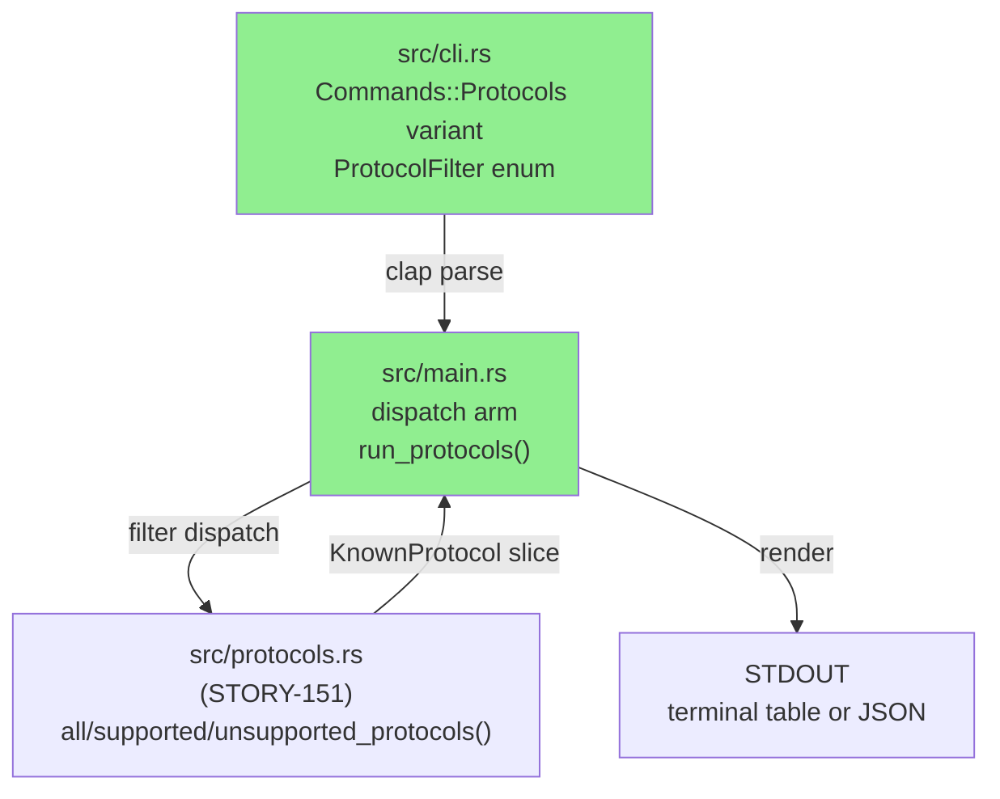
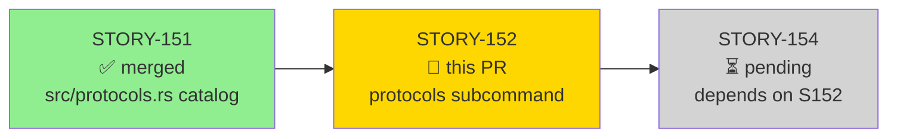
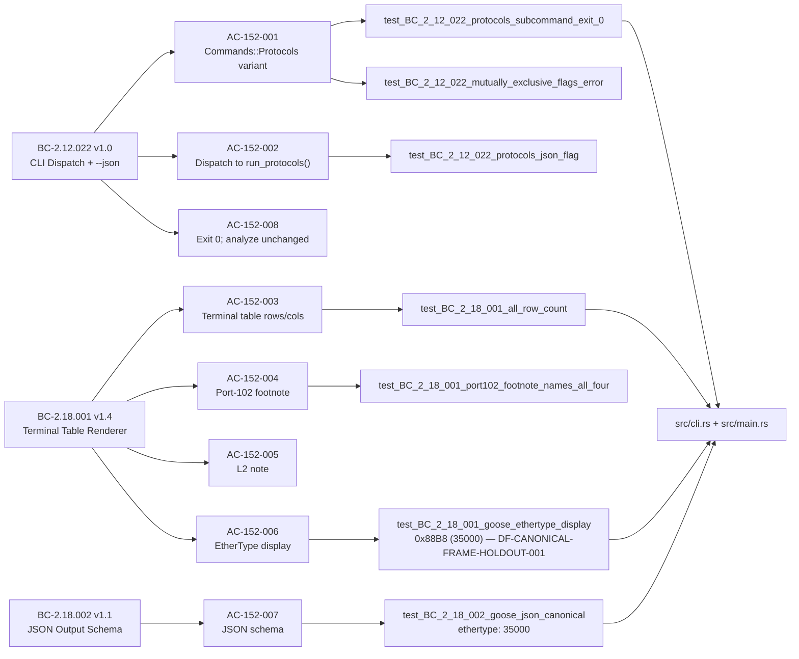
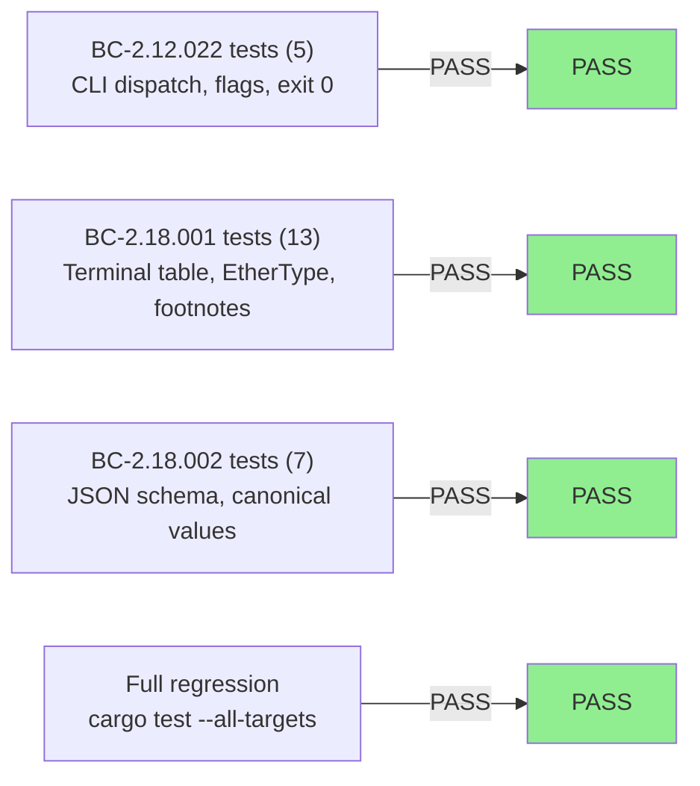
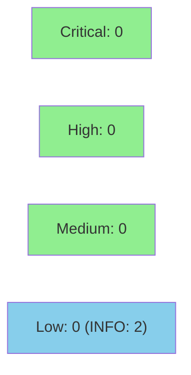

# [STORY-152] `protocols` CLI Subcommand — Coverage Catalog Table + JSON Output

**Epic:** E-21 — feature-protocol-coverage
**Wave:** 68
**Mode:** feature
**Convergence:** CONVERGED after 3 adversarial passes (0 P0/CRITICAL/HIGH findings on d34a05f)


This PR delivers the `wirerust protocols` CLI subcommand (BC-2.12.022 + BC-2.18.001 + BC-2.18.002). It adds a `Commands::Protocols` variant with mutually-exclusive `--all/--supported/--unsupported` filter flags and a global `--json` pass-through, a terminal catalog table renderer (Name / Category / Transport / Port(s) / EtherType / Supported columns, `[L2]` indicator, port-102 collision footnote, LinkLayer note), and a structured JSON output path (`{ "protocols": [...] }` per BC-2.18.002 schema, stdout-only by design). The implementation consumes STORY-151's `src/protocols.rs` catalog — `all_protocols()`, `supported_protocols()`, `unsupported_protocols()` — without touching the `analyze` subcommand.

**Diff: 5 files, +1268 lines.** `tests/integration_tests.rs` is a new file (1022 lines, `mod story_152` with 25 tests). The two `cli_story_086_tests.rs` (+2) and `cli_story_096_tests.rs` (+6) edits each add a `Commands::Protocols {..} => panic!()` arm to satisfy Rust's exhaustive match requirement for those files — these are blast-radius fallout from the new enum variant and are NOT functional changes to those test suites.

---

## Architecture Changes



<details>
<summary><strong>Architecture Decision Record — ADR-012</strong></summary>

### ADR-012: Protocol Coverage Catalog

**Context:** wirerust needed a static, queryable catalog of all ICS/IT protocols it knows about (both supported and unsupported) to answer "what gaps exist in my network coverage?" without running a live capture.

**Decision 3:** The `protocols` subcommand is a first-class top-level `Commands` variant, not a sub-subcommand of `analyze`. Filter flags (`--all/--supported/--unsupported`) are mutually exclusive via clap `conflicts_with`. Default behavior (no flag) equals `--all`.

**Decision 7:** JSON `"category"` values are `"ICS"` or `"IT"` only — never `"L2"`. The `[L2]` indicator is a transport-layer display annotation in the terminal renderer, not a category value.

**Rationale:** Separation of concerns — catalog lookup is a pure, side-effect-free read with no pcap dependency. Keeping it as a separate `Commands` variant avoids polluting the `analyze` dispatch path and makes the help text clear to operators.

</details>

---

## Story Dependencies



**Dependency status:** STORY-151 is merged (`src/protocols.rs` is on `develop`). STORY-154 is pending and blocks on this PR.

---

## Spec Traceability



---

## Test Evidence

### Coverage Summary

| Metric | Value | Threshold | Status |
|--------|-------|-----------|--------|
| STORY-152 integration tests | 25/25 pass | 100% | PASS |
| Full suite (`cargo test --all-targets`) | all green | 100% | PASS |
| Clippy (`-D warnings`) | 0 warnings | 0 | CLEAN |
| fmt (`--check`) | clean | clean | CLEAN |
| Canonical-frame assertions (DF-CANONICAL-FRAME-HOLDOUT-001) | 6 tests | all pass | PASS |

### Test Flow



| Metric | Value |
|--------|-------|
| **New tests** | 25 added (mod story_152 in tests/integration_tests.rs) |
| **Exhaustive-match arms** | 2 files × panic! arms (cli_story_086, cli_story_096) — not new test logic, enum blast-radius only |
| **Canonical-frame tests** | 6 (GOOSE 0x88B8=35000, POWERLINK 0x88AB=34987, BACnet UDP 47808, Modbus TCP 502, ARP ethertype null) |
| **Regressions** | 0 |

<details>
<summary><strong>New Tests (This PR)</strong></summary>

### New Tests — mod story_152 in tests/integration_tests.rs

| Test | BC | Notes |
|------|----|-------|
| `test_BC_2_12_022_protocols_subcommand_exit_0` | BC-2.12.022 | exit 0, non-empty stdout |
| `test_BC_2_12_022_mutually_exclusive_flags_error` | BC-2.12.022 | --supported --unsupported → non-zero exit |
| `test_BC_2_12_022_protocols_supported_filter` | BC-2.12.022 | --supported → 7-row count |
| `test_BC_2_12_022_protocols_json_flag` | BC-2.12.022 | --json → valid JSON with "protocols" |
| `test_BC_2_12_022_analyze_unaffected` | BC-2.12.022 | analyze subcommand regression baseline |
| `test_BC_2_18_001_all_row_count` | BC-2.18.001 | --all → 30 rows |
| `test_BC_2_18_001_supported_filter` | BC-2.18.001 | supported filter set match |
| `test_BC_2_18_001_port102_footnote` | BC-2.18.001 | --unsupported footnote present |
| `test_BC_2_18_001_port102_footnote_absent_supported` | BC-2.18.001 | --supported → no footnote |
| `test_BC_2_18_001_port102_footnote_names_all_four` | BC-2.18.001 | footnote names S7comm, S7comm-plus, IEC 61850 MMS, ICCP |
| `test_BC_2_18_001_l2_transport_indicator` | BC-2.18.001 | GOOSE row shows [L2] |
| `test_BC_2_18_001_l2_note_present` | BC-2.18.001 | L2/LinkLayer note in output |
| `test_BC_2_18_001_goose_ethertype_display` | BC-2.18.001 | 0x88B8 (35000) — DF-CANONICAL-FRAME-HOLDOUT-001 |
| `test_BC_2_18_001_powerlink_ethertype_display` | BC-2.18.001 | 0x88AB (34987) — DF-CANONICAL-FRAME-HOLDOUT-001 |
| `test_BC_2_18_001_arp_ethertype_dash` | BC-2.18.001 | ARP EtherType column is — |
| `test_BC_2_18_002_json_schema_valid` | BC-2.18.002 | jq parseable, .protocols.length == 30 |
| `test_BC_2_18_002_l2_entries_no_ports` | BC-2.18.002 | port_detectable=false → canonical_ports: [] |
| `test_BC_2_18_002_supported_flag_matches_function` | BC-2.18.002 | --json --supported → 7 entries |
| `test_BC_2_18_002_goose_json_canonical` | BC-2.18.002 | ethertype: 35000, transport: LinkLayer — DF-CANONICAL-FRAME-HOLDOUT-001 |
| `test_BC_2_18_002_bacnet_json_canonical` | BC-2.18.002 | UDP, canonical_ports: [47808] — DF-CANONICAL-FRAME-HOLDOUT-001 |
| `test_BC_2_18_002_modbus_json_canonical` | BC-2.18.002 | TCP, canonical_ports: [502], supported: true — DF-CANONICAL-FRAME-HOLDOUT-001 |
| _(additional coverage tests)_ | BC-2.18.002 | JSON declaration-order, ARP canonical, filter composition |

</details>

---

## Demo Evidence

Visual recordings (VHS 0.11.0 — GIF + WebM) are present in the worktree at
`docs/demo-evidence/STORY-152/` (untracked, not in PR diff by design — 5 per-AC recordings × 3 files each + evidence-report.md).

| Recording | Evidences | Key observable |
|-----------|-----------|----------------|
| `AC-152-003-all-catalog` (.gif/.webm) | AC-152-003, BC-2.18.001 | 30-row table, all 6 columns, both footnotes visible |
| `AC-152-004a-supported` (.gif/.webm) | AC-152-003/004/005, EC-152-5 | 7 rows, port-102 footnote absent, L2 note present (ARP) |
| `AC-152-005-unsupported` (.gif/.webm) | AC-152-003/004/005/006 | 23 rows, GOOSE `0x88B8 (35000)`, POWERLINK `0x88AB (34987)`, port-102 footnote naming all 4 |
| `AC-152-007-json` (.gif/.webm) | AC-152-007, BC-2.18.002 | `{"protocols":[...]}` piped through `python3 -m json.tool`, valid structure |
| `AC-152-001-mutual-exclusion` (.gif/.webm) | AC-152-001, EC-152-2 | clap error on `--supported --unsupported`, non-zero exit |

---

## Holdout Evaluation

N/A — evaluated at wave gate. VP-041 regression/relevance reference (VP-041 harnesses anchored by STORY-151; this story consumes `supported_protocols()` / `unsupported_protocols()` which VP-041 validates).

---

## Adversarial Review

| Pass | Context | Findings | CRITICAL | HIGH | P0 | Status |
|------|---------|----------|----------|------|----|--------|
| 1 | Fresh context on d34a05f | F-2 (MEDIUM), F-1 (LOW), F-3 (LOW) | 0 | 0 | 0 | Resolved in branch |
| 2 | Fresh context on d34a05f | 0 | 0 | 0 | 0 | APPROVE |
| 3 | Fresh context on d34a05f | 0 | 0 | 0 | 0 | APPROVE |

**Convergence:** 3 consecutive clean passes on d34a05f — CONVERGED (DF-CONVERGENCE-BEFORE-MERGE-001 satisfied).

**Canonical-frame holdout (DF-CANONICAL-FRAME-HOLDOUT-001):** EtherType constants and port numbers independently verified:
- GOOSE: `0x88B8 = 35000` (IEC 61850-8-1 §4; IEEE RA "IEC GOOSE")
- POWERLINK: `0x88AB = 34987` (IEEE RA "ETHERNET Powerlink"; Wireshark `ETHERTYPE_EPL_V2`)
- BACnet/IP: UDP port `47808` / `0xBAC0` (ASHRAE 135-2016 Annex J §J.2.1)
- Modbus/TCP: port `502` (IANA/Modbus App Protocol v1.1b3 §4.3.1)

**Deferred LOW finding:** Global `--csv`/`--output-format` flags are no-ops when passed with `protocols` (they are parsed but ignored by `run_protocols()`). This is scoped-out per frozen BC-2.12.022 which models `--json` as a `bool` for the protocols path; the PATH component of `--json=<path>` is also not used (stdout-only by design per BC-2.18.002 PC-1). Backlogged as STORY-152-GLOBAL-FLAG-NOOP-001.

<details>
<summary><strong>Pass 1 Findings and Resolutions</strong></summary>

### Finding STORY-152-Pass-1-F-2 (MEDIUM): AC-152-002 over-claim on --json=path routing
- **Location:** STORY-152.md v1.4 AC-152-002
- **Category:** spec-fidelity
- **Problem:** AC-152-002 claimed `--json=<path>` performs file-path routing "at the call site … follows the same pattern as the existing run_analyze() JSON path." This was an over-claim; `protocols` emits to STDOUT only.
- **Resolution:** Story v1.5 corrected to: `protocols --json` always emits to STDOUT; PATH component of `--json=<path>` is NOT used; file-path routing is out of scope (unlike `analyze`).

### Finding STORY-152-Pass-1-F-3 (LOW): GOOSE derivation comment in implementation
- **Location:** `src/main.rs` (GOOSE supported-derivation comment)
- **Category:** code-quality
- **Resolution:** Comment clarified in d34a05f commit 1.

</details>

---

## Security Review



**Verdict: CLEAN** — CRITICAL 0 | HIGH 0 | MEDIUM 0 | LOW 0 | INFO 2

<details>
<summary><strong>Security Scan Details</strong></summary>

### CLI Argument Handling (CWE-88)
Not applicable. Three boolean flags (`--all/--supported/--unsupported`) with clap `conflicts_with_all` mutual exclusion. No string-valued arguments, no positional arguments, no process execution inside `run_protocols`.

### Output Rendering (CWE-134)
Not applicable. All `println!`/`format!` format strings are compile-time literals. Data values are typed macro arguments.

### JSON Serialization (CWE-116)
Not applicable. Output via `serde_json::json!` and `serde_json::to_string_pretty`. All values originate from `&'static str` catalog names, `u16` ports, `Option<u16>` ethertypes, and booleans. `serde_json` escapes all string content unconditionally. No user input flows into JSON output.

### Path Traversal (CWE-22)
Not applicable. `run_protocols` contains zero file I/O. The `Option<PathBuf>` inside `--json` is intentionally ignored — `cli.json.is_some()` is used as a pure boolean per frozen BC-2.18.002 PC-1.

### OS Command Injection (CWE-78)
Not applicable. No `Command::new`, `process::Command`, or shell invocation in new code.

### Resource Consumption (CWE-400)
Not applicable. `KNOWN_PROTOCOLS` is a compile-time `&'static [KnownProtocol]` constant with fixed length 30. Fully bounded at compile time.

### Supply Chain (OWASP A06)
No new dependencies. Pre-existing `serde_json` and `clap` unchanged.

### INFO Observations (non-blocking, non-security)

**INFO-001:** `is_protocol_supported` contains a hardcoded `if p.name == "ARP"` string literal at `src/main.rs`. This creates a maintenance coupling: if the catalog name ever changes, the branch silently stops matching. Not a security vulnerability; a `const ARP_NAME` shared reference would be cleaner. (Consistent with the same INFO observation from the PR reviewer's cosmetic finding.)

**INFO-002:** `is_protocol_supported` calls `supported_protocols()` per iteration inside the rendering loop — O(N²) at N=30 (900 comparisons). No practical impact; noted for completeness if catalog grows.

</details>

---

## Risk Assessment

### Blast Radius
- **Systems affected:** `src/cli.rs` (new enum variant — triggers exhaustive-match compiler errors in any file matching on `Commands`), `src/main.rs` (new dispatch arm and `run_protocols()` function), `tests/integration_tests.rs` (new file)
- **Exhaustive-match fallout:** `tests/cli_story_086_tests.rs` and `tests/cli_story_096_tests.rs` each received a `Commands::Protocols {..} => panic!()` arm. These are compile-required changes with no behavioral effect on those test suites — reviewers should NOT flag them as stray modifications.
- **User impact:** Additive only — new `protocols` subcommand. `analyze` subcommand behavior is unchanged (AC-152-008, `test_BC_2_12_022_analyze_unaffected`).
- **Data impact:** None. Read-only catalog lookup; no pcap, no state mutation.
- **Risk Level:** LOW

### Performance Impact
| Metric | Notes |
|--------|-------|
| Binary size | Negligible delta — static string table + JSON serialization |
| Runtime | Catalog lookup is O(30) static slice iteration; sub-millisecond |
| `analyze` path | Unchanged; no shared mutable state |

<details>
<summary><strong>Rollback Instructions</strong></summary>

**Immediate rollback:**
```bash
git revert <squash-commit-sha>
git push origin develop
```

After rollback, `wirerust protocols` will return `error: unrecognized subcommand 'protocols'`. `wirerust analyze` is unaffected.

</details>

### Feature Flags
None. The `protocols` subcommand is always available once this PR merges.

---

## Traceability

| BC | AC | Test | Status |
|----|-----|------|--------|
| BC-2.12.022 PC-1 | AC-152-001 | `test_BC_2_12_022_protocols_subcommand_exit_0` | PASS |
| BC-2.12.022 Invariant 2 | AC-152-001 | `test_BC_2_12_022_mutually_exclusive_flags_error` | PASS |
| BC-2.12.022 Invariant 3 | AC-152-001 | `test_BC_2_12_022_protocols_supported_filter` | PASS |
| BC-2.12.022 PC-2,3 | AC-152-002 | `test_BC_2_12_022_protocols_json_flag` | PASS |
| BC-2.12.022 Invariant 7 | AC-152-008 | `test_BC_2_12_022_analyze_unaffected` | PASS |
| BC-2.18.001 PC-1..3 | AC-152-003 | `test_BC_2_18_001_all_row_count` | PASS |
| BC-2.18.001 PC-6 | AC-152-004 | `test_BC_2_18_001_port102_footnote_names_all_four` | PASS |
| BC-2.18.001 PC-7 | AC-152-005 | `test_BC_2_18_001_l2_note_present` | PASS |
| BC-2.18.001 PC-5 (DF-CANONICAL-FRAME-HOLDOUT-001) | AC-152-006 | `test_BC_2_18_001_goose_ethertype_display` | PASS |
| BC-2.18.001 PC-5 (DF-CANONICAL-FRAME-HOLDOUT-001) | AC-152-006 | `test_BC_2_18_001_powerlink_ethertype_display` | PASS |
| BC-2.18.002 PC-3 | AC-152-007 | `test_BC_2_18_002_json_schema_valid` | PASS |
| BC-2.18.002 EC-003 (DF-CANONICAL-FRAME-HOLDOUT-001) | AC-152-007 | `test_BC_2_18_002_goose_json_canonical` | PASS |
| BC-2.18.002 (DF-CANONICAL-FRAME-HOLDOUT-001) | AC-152-007 | `test_BC_2_18_002_bacnet_json_canonical` | PASS |
| BC-2.18.002 (DF-CANONICAL-FRAME-HOLDOUT-001) | AC-152-007 | `test_BC_2_18_002_modbus_json_canonical` | PASS |

<details>
<summary><strong>Full VSDD Contract Chain</strong></summary>

```
BC-2.12.022 v1.0 -> AC-152-001/002 -> test_BC_2_12_022_* -> src/cli.rs:Protocols + src/main.rs:run_protocols() -> ADV-PASS-3-CLEAN
BC-2.18.001 v1.4 -> AC-152-003..006 -> test_BC_2_18_001_* -> src/main.rs:run_protocols(terminal) -> ADV-PASS-3-CLEAN
BC-2.18.002 v1.1 -> AC-152-007 -> test_BC_2_18_002_* -> src/main.rs:run_protocols(json) -> ADV-PASS-3-CLEAN
DF-CANONICAL-FRAME-HOLDOUT-001 -> 6 canonical-value tests -> GOOSE/POWERLINK/BACnet/Modbus values verified
ADR-012 Decision 3 -> Commands::Protocols is top-level variant (not analyze sub-subcommand)
ADR-012 Decision 7 -> JSON "category" values: "ICS" | "IT" only (no "L2")
```

</details>

---

## AI Pipeline Metadata

<details>
<summary><strong>Pipeline Details</strong></summary>

```yaml
ai-generated: true
pipeline-mode: feature
factory-version: "1.0.0-rc.21"
pipeline-stages:
  spec-crystallization: completed (v1.5 — F3 pass 13)
  story-decomposition: completed (STORY-152 v1.5)
  tdd-implementation: completed (4 commits on feature/story-152-protocols-subcommand)
  holdout-evaluation: N/A — evaluated at wave gate
  adversarial-review: completed (3 fresh-context passes, 0 HIGH/CRITICAL on d34a05f)
  formal-verification: skipped (CLI output path; pure catalog lookup)
  convergence: achieved (DF-CONVERGENCE-BEFORE-MERGE-001)
convergence-metrics:
  adversarial-passes: 3
  blocking-findings-at-convergence: 0
  canonical-frame-assertions: 6 (DF-CANONICAL-FRAME-HOLDOUT-001)
models-used:
  builder: claude-sonnet-4-6
  adversary: claude-sonnet-4-6 (fresh-context passes)
generated-at: "2026-07-03"
```

</details>

---

## Pre-Merge Checklist

- [ ] All CI status checks passing
- [x] 25/25 STORY-152 integration tests green
- [x] Full `cargo test --all-targets` regression clean
- [x] `cargo clippy --all-targets -- -D warnings` clean
- [x] `cargo fmt --check` clean
- [x] 3 adversarial passes converged (0 CRITICAL/HIGH on d34a05f)
- [x] DF-CANONICAL-FRAME-HOLDOUT-001 — canonical-frame values verified
- [x] Demo evidence present (5 VHS recordings, docs/demo-evidence/STORY-152/)
- [x] STORY-151 merged (catalog dependency)
- [x] Exhaustive-match arms in cli_story_086/096 explained in PR body
- [x] AI PR review (pr-reviewer) APPROVE — 0 blocking, 1 cosmetic (redundant ARP short-circuit)
- [x] Security review (security-reviewer) CLEAN — CRITICAL 0, HIGH 0, MEDIUM 0, LOW 0, INFO 2
- [ ] Human approval for squash merge
