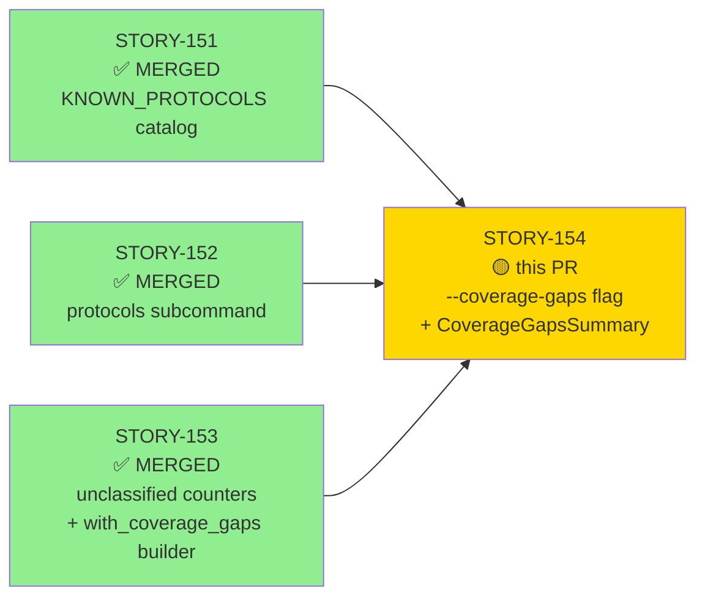
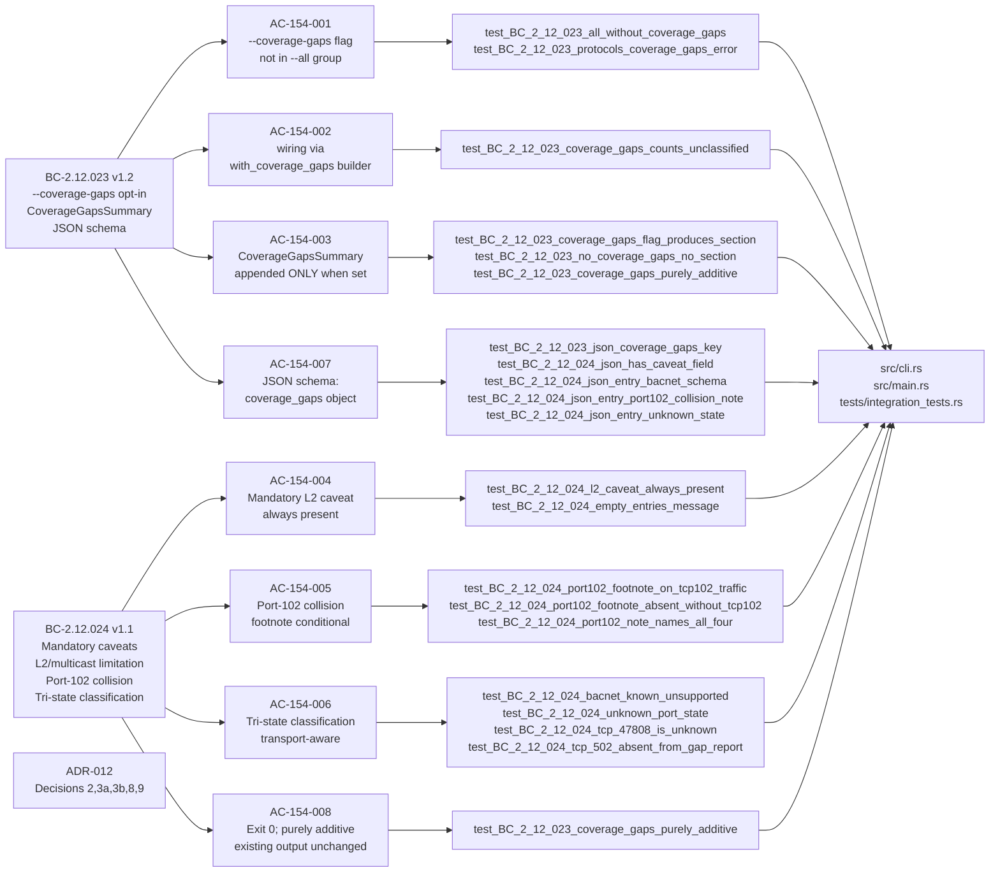
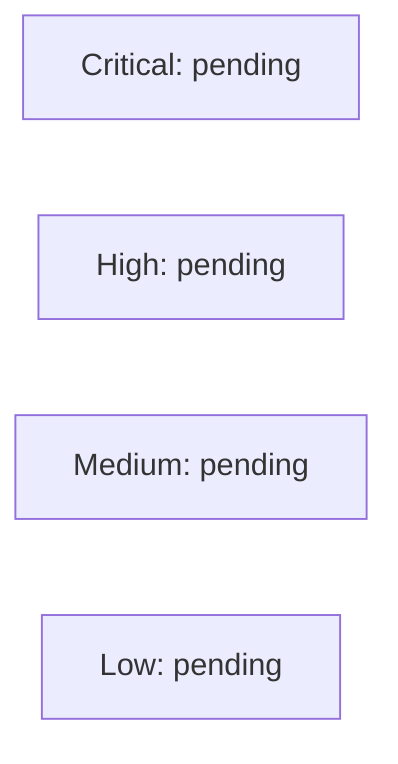

# [STORY-154] `--coverage-gaps` Opt-In Flag + `CoverageGapsSummary` Tri-State Report + Mandatory Caveats (BC-2.12.023 + BC-2.12.024)

**Epic:** E-21 — feature-protocol-coverage (FINAL F4 story, Wave 69)
**Mode:** feature
**Convergence:** CONVERGED after 3 consecutive fresh-context adversarial passes on a5f8e52 (0 P0/CRITICAL/HIGH/mis-anchor)


This PR delivers the final story of the E-21 feature-protocol-coverage feature wave. It adds an
opt-in `--coverage-gaps` CLI flag to the `analyze` subcommand that causes wirerust to track and
report unclassified TCP flows and UDP packets by (transport, port), presented as a
`CoverageGapsSummary` named section with tri-state classification
(`known-unsupported` / `unknown` / `known-supported`), a mandatory L2/multicast limitation
caveat that is always present, and a conditional port-102 collision footnote naming all four
protocols (S7comm, S7comm-plus, IEC 61850 MMS, ICCP/TASE.2) that share TCP/102 via
ISO-on-TCP/TPKT. The design is purely additive — `--coverage-gaps` is independent of
`--all`; all existing `Finding` entries and `AnalysisSummary` output are unchanged.
The PR diff is exactly 8 files: `src/cli.rs` (+4), `src/main.rs` (+438), `tests/integration_tests.rs`
(+827), and 5 crafted pcap fixtures in `tests/fixtures/` required by the integration tests
(these are legitimate committed test data, not demo artifacts).

---

## Architecture Changes

```mermaid
graph TD
    CLI["src/cli.rs\nAnalyze struct\n+coverage_gaps: bool"]
    MAIN["src/main.rs\nrun_analyze()"]
    DISP["src/dispatcher.rs\nStreamDispatcher\n(STORY-153 builder)"]
    PROTO["src/protocols.rs\nKNOWN_PROTOCOLS catalog\n(STORY-151)"]
    ENUM["ProtocolGapState\n{KnownUnsupported,Unknown,KnownSupported}"]
    LOOKUP["lookup_protocol_state()\ntransport-aware pure fn"]
    RENDER["render_coverage_gaps_summary()\neffectful stdout fn"]
    JSON["render_coverage_gaps_summary_json()\nJSON output path"]
    CONST_L2["L2_CAVEAT_TEXT const\nalways-present caveat"]
    CONST_102["PORT_102_NOTE const\nconditional collision footnote"]

    CLI -->|coverage_gaps: bool| MAIN
    MAIN -->|with_coverage_gaps(bool)| DISP
    MAIN --> LOOKUP
    LOOKUP -->|catalog lookup| PROTO
    LOOKUP -->|tri-state result| ENUM
    MAIN --> RENDER
    MAIN --> JSON
    RENDER --> CONST_L2
    RENDER --> CONST_102
    style CLI fill:#90EE90
    style ENUM fill:#90EE90
    style LOOKUP fill:#90EE90
    style RENDER fill:#90EE90
    style JSON fill:#90EE90
    style CONST_L2 fill:#90EE90
    style CONST_102 fill:#90EE90
```

<details>
<summary><strong>Architecture Decision Record — ADR-012 (relevant decisions)</strong></summary>

### ADR-012: Protocol Coverage Catalog — Coverage Gap Report Decisions

**Decision 2 (Tri-state classification):** Each gap entry is classified using a Suricata-derived vocabulary: `known-unsupported` (catalog match but not dissected), `unknown` (no catalog match), `known-supported` (catalog match AND dissected — BUG signal). Classification is transport-aware: `(Tcp, 47808)` is `unknown` even though BACnet/IP is catalogued, because BACnet is `Udp` only. LinkLayer entries never match port-keyed lookups.

**Decision 3a (L2 caveat):** The L2/multicast caveat is always present — L2 protocols have no TCP/UDP port and are structurally absent from the gap report. The constant is not configurable.

**Decision 3b (Port-102 footnote):** The TCP/102 collision footnote (naming S7comm, S7comm-plus, IEC 61850 MMS, ICCP/TASE.2) is row-specific and conditional on a non-zero count for `(Tcp, 102)`.

**Decision 8 (`--coverage-gaps` opt-in):** The flag is NOT in the `--all` expansion group. The two flags are independent. `--all` selects all analyzers; `--coverage-gaps` enables gap detection.

**Decision 9 (Named section after findings):** `CoverageGapsSummary` is appended after all `Finding` entries. It is NOT a `Finding` itself (that would pollute the MITRE-severity pipeline with infrastructure data).

**Consequences:**
- `classify()` Rule 5 always routes TCP/502 to `DispatchTarget::Modbus` — `(Tcp, 502)` can never appear in the gap report via the analyze pipeline. `known-supported` is assertable only at the pure-function/unit level.
- The `with_coverage_gaps(bool)` builder (from STORY-153) preserves all existing `StreamDispatcher::new()` call sites with zero blast radius.

</details>

---

## Story Dependencies



All three dependency PRs (STORY-151, STORY-152, STORY-153) are merged into `develop`.
STORY-154 blocks nothing — it is the final story in Wave 69 / E-21.

---

## Spec Traceability



---

## Test Evidence

### Coverage Summary

| Metric | Value | Threshold | Status |
|--------|-------|-----------|--------|
| story_154 integration tests | 21/21 pass | 100% | PASS |
| story_154_unit tests (inline src/main.rs) | 4/4 pass | 100% | PASS |
| **Total story-154 tests** | **25** | — | **PASS** |
| cargo fmt --check | CLEAN | CLEAN | PASS |
| cargo clippy --all-targets -D warnings | CLEAN | 0 warns | PASS |
| cargo test --all-targets | ALL GREEN | 100% | PASS |

### Test Flow

```mermaid
graph LR
    Integration["21 Integration Tests\nmod story_154\n(tests/integration_tests.rs)"]
    Unit["4 Unit Tests\nmod story_154_unit\n(src/main.rs inline)"]
    Fmt["cargo fmt --check"]
    Clippy["cargo clippy -D warnings"]
    AllTargets["cargo test --all-targets\nfull regression"]

    Integration -->|CLI-reachable paths| Pass1["PASS"]
    Unit -->|lookup_protocol_state()\nbinary-private pure fn| Pass2["PASS"]
    Fmt --> Pass3["CLEAN"]
    Clippy --> Pass4["CLEAN"]
    AllTargets --> Pass5["ALL GREEN"]

    style Pass1 fill:#90EE90
    style Pass2 fill:#90EE90
    style Pass3 fill:#90EE90
    style Pass4 fill:#90EE90
    style Pass5 fill:#90EE90
```

| Metric | Value |
|--------|-------|
| **New tests** | 25 added (21 integration + 4 inline unit) |
| **New source lines** | src/cli.rs +4, src/main.rs +438, tests/integration_tests.rs +827 |
| **New test fixtures** | 5 crafted pcap files in tests/fixtures/gap-*.pcap (required test data) |
| **Regressions** | 0 |

<details>
<summary><strong>Test Function List (STORY-154)</strong></summary>

**Integration tests — `mod story_154` in `tests/integration_tests.rs`**

| Test | AC | Status |
|------|----|--------|
| `test_BC_2_12_023_all_without_coverage_gaps` | AC-154-001/003 | PASS |
| `test_BC_2_12_023_protocols_coverage_gaps_error` | AC-154-001 | PASS |
| `test_BC_2_12_023_coverage_gaps_counts_unclassified` | AC-154-002 | PASS |
| `test_BC_2_12_023_coverage_gaps_flag_produces_section` | AC-154-003 | PASS |
| `test_BC_2_12_023_no_coverage_gaps_no_section` | AC-154-003 | PASS |
| `test_BC_2_12_024_l2_caveat_always_present` | AC-154-004 | PASS |
| `test_BC_2_12_024_empty_entries_message` | AC-154-004 (EC-154-7) | PASS |
| `test_BC_2_12_024_port102_footnote_on_tcp102_traffic` | AC-154-005 | PASS |
| `test_BC_2_12_024_port102_footnote_absent_without_tcp102` | AC-154-005 | PASS |
| `test_BC_2_12_024_port102_note_names_all_four` | AC-154-005 (DF-CANONICAL-FRAME-HOLDOUT-001) | PASS |
| `test_BC_2_12_024_bacnet_known_unsupported` | AC-154-006 (DF-CANONICAL-FRAME-HOLDOUT-001) | PASS |
| `test_BC_2_12_024_unknown_port_state` | AC-154-006 | PASS |
| `test_BC_2_12_024_tcp_47808_is_unknown` | AC-154-006 (EC-154-13) | PASS |
| `test_BC_2_12_024_tcp_502_absent_from_gap_report` | AC-154-006 (EC-154-11) | PASS |
| `test_BC_2_12_024_json_has_caveat_field` | AC-154-007 | PASS |
| `test_BC_2_12_023_json_coverage_gaps_key` | AC-154-007/004 | PASS |
| `test_BC_2_12_024_json_entry_bacnet_schema` | AC-154-007 | PASS |
| `test_BC_2_12_024_json_entry_port102_collision_note` | AC-154-007 | PASS |
| `test_BC_2_12_024_json_entry_unknown_state` | AC-154-007 | PASS |
| `test_BC_2_12_023_coverage_gaps_purely_additive` | AC-154-003/008 | PASS |
| `test_BC_2_12_024_tcp_53_is_unknown` | AC-154-006 (EC-154-14) | PASS |

**Unit tests — `mod story_154_unit` inline in `src/main.rs`**

| Test | AC | Status |
|------|----|--------|
| `test_BC_2_12_024_bacnet_known_unsupported_unit` | AC-154-006 (direct lookup_protocol_state call) | PASS |
| `test_BC_2_12_024_tcp_47808_is_unknown_unit` | AC-154-006 (transport mismatch) | PASS |
| `test_BC_2_12_024_unknown_port_state_unit` | AC-154-006 (no catalog match) | PASS |
| `test_BC_2_12_024_known_supported_is_bug_signal_unit` | AC-154-006 (EC-154-11 BUG signal) | PASS |

</details>

---

## Demo Evidence

Visual evidence is at `docs/demo-evidence/STORY-154/` on this branch (5 per-AC VHS GIF+WebM recordings + `evidence-report.md`). These files are intentionally UNTRACKED — the PR diff contains only the 8 code and fixture files listed in the title.

| AC | Recording |
|----|-----------|
| AC-154-001/003 (`--all` opt-in independence + `--coverage-gaps` section) | `docs/demo-evidence/STORY-154/ac-154-001-opt-in-all.gif` |
| AC-154-006 (BACnet known-unsupported, UDP/47808) | `docs/demo-evidence/STORY-154/ac-154-006-bacnet-known-unsupported.gif` |
| AC-154-005 (TCP/102 collision footnote) | `docs/demo-evidence/STORY-154/ac-154-005-tcp102-collision.gif` |
| AC-154-006 (TCP/9600 unknown state) | `docs/demo-evidence/STORY-154/ac-154-006-tcp9600-unknown.gif` |
| AC-154-007 (JSON `coverage_gaps` object schema) | `docs/demo-evidence/STORY-154/ac-154-007-json.gif` |

---

## Holdout Evaluation

N/A — evaluated at wave gate (Wave 69 / E-21 feature-protocol-coverage).

---

## Adversarial Review

| Pass | Context | Findings | Critical | High | Status |
|------|---------|----------|----------|------|--------|
| Pass-1..14 (F3 spec review) | STORY-154 spec passes v1.0→v1.8 | Multiple LOW/MEDIUM | 0 | 0 | Fixed in story spec |
| Pass-15 (F4-1, fresh-context impl) | Implementation review on a5f8e52 | 0 P0/CRITICAL/HIGH | 0 | 0 | CLEAN |
| Pass-16 (F4-2, fresh-context impl) | Implementation review on a5f8e52 | 0 P0/CRITICAL/HIGH | 0 | 0 | CLEAN |
| Pass-17 (F4-3, fresh-context impl) | Implementation review on a5f8e52 | 0 P0/CRITICAL/HIGH | 0 | 0 | CLEAN |

**Convergence:** 3 consecutive fresh-context clean adversarial passes on a5f8e52. 0 P0/CRITICAL/HIGH/mis-anchor. Canonical values (BACnet/IP UDP/47808, TCP/102 four-protocol collision) independently verified per DF-CANONICAL-FRAME-HOLDOUT-001. Tri-state transport-awareness, `can_decode` hoist, render name re-lookup, and help-provenance all verified clean.

**Deferred non-blocking LOW items (tracked in STATE.md; not merge-blockers):**
- `STORY-154-ALL-COVERAGEGAPS-TEST-001`: `--all --coverage-gaps` combined test not present
- `TESTCOUNT-COMMENT`: comment count inconsistency in test file
- `WEAK-UNKNOWN-ASSERT`: some unknown-state assertions are weak
- `BC-2.12.024-PC4-PHANTOM-SUPPORTED-001` → deferred to phase-5 adversarial

---

## Security Review

_Pending dispatch in step 4 — will be updated after security-reviewer completes._



---

## Risk Assessment & Deployment

### Blast Radius
- **Systems affected:** `src/cli.rs` (Analyze struct only — `protocols` subcommand untouched), `src/main.rs` (additive: new types, new functions, new call-site wiring; no existing code paths changed), `tests/integration_tests.rs` (new test module appended)
- **User impact:** Feature is opt-in (`--coverage-gaps` must be explicitly set). Users NOT using `--coverage-gaps` see zero behavioral change. `analyze --all` behavior is byte-identical to pre-feature.
- **Data impact:** No persistent state. `CoverageGapsSummary` is a transient stdout/JSON output — it does not modify any file, database, or configuration.
- **Risk Level:** LOW

### Performance Impact
| Metric | Before | After | Delta | Status |
|--------|--------|-------|-------|--------|
| `analyze` without `--coverage-gaps` | baseline | identical | 0 | OK |
| `analyze --coverage-gaps` | baseline | +catalog lookup per unclassified port | negligible (static array, O(n*m) max 30*ports) | OK |
| Compile time | baseline | +438 lines main.rs +827 lines integration tests | +~2s full rebuild | OK |
| Memory | N/A | `unclassified_port_counts` + `udp_unclassified_counts` only when flag set | negligible (HashMap per analyze run) | OK |

<details>
<summary><strong>Rollback Instructions</strong></summary>

**Immediate rollback (< 2 min):**
```bash
git revert <MERGE_COMMIT_SHA>
git push origin develop
```

This PR has no feature flags and no database migrations. Rollback is a single revert commit.
The flag is opt-in — users not passing `--coverage-gaps` are completely unaffected before rollback.

**Verification after rollback:**
- `cargo build` compiles without `coverage_gaps` field in `Analyze`
- `cargo test --all-targets` passes (story_154 tests will be gone)
- `wirerust analyze <pcap>` output identical to pre-feature behavior

</details>

### Feature Flags
N/A — `--coverage-gaps` is itself a CLI flag (opt-in). No code-level feature flags.

---

## Traceability

| Requirement | Story AC | Test | Verification | Status |
|-------------|---------|------|-------------|--------|
| BC-2.12.023 v1.2 PC-1 (flag present, opt-in) | AC-154-001 | `test_BC_2_12_023_protocols_coverage_gaps_error` | integration | PASS |
| BC-2.12.023 v1.2 PC-2 (not in --all) | AC-154-001 | `test_BC_2_12_023_all_without_coverage_gaps` | integration | PASS |
| BC-2.12.023 v1.2 PC-3 (JSON schema) | AC-154-007 | `test_BC_2_12_023_json_coverage_gaps_key` | integration | PASS |
| BC-2.12.023 v1.2 Invariant 1 (--all independence) | AC-154-001/003 | `test_BC_2_12_023_all_without_coverage_gaps` | integration | PASS |
| BC-2.12.023 v1.2 Invariant 3 (after Finding entries) | AC-154-003 | `test_BC_2_12_023_coverage_gaps_purely_additive` | integration | PASS |
| BC-2.12.023 v1.2 Invariant 4 (purely additive) | AC-154-008 | `test_BC_2_12_023_coverage_gaps_purely_additive` | integration | PASS |
| BC-2.12.024 v1.1 PC-1 (L2 caveat always present) | AC-154-004 | `test_BC_2_12_024_l2_caveat_always_present` | integration | PASS |
| BC-2.12.024 v1.1 PC-2 (port-102 footnote conditional) | AC-154-005 | `test_BC_2_12_024_port102_footnote_on_tcp102_traffic` | integration | PASS |
| BC-2.12.024 v1.1 PC-3 (footnote absent when no TCP/102) | AC-154-005 | `test_BC_2_12_024_port102_footnote_absent_without_tcp102` | integration | PASS |
| BC-2.12.024 v1.1 PC-4 (tri-state transport-aware) | AC-154-006 | `test_BC_2_12_024_tcp_47808_is_unknown` | integration | PASS |
| BC-2.12.024 v1.1 PC-5 (JSON entry schema) | AC-154-007 | `test_BC_2_12_024_json_entry_bacnet_schema` | integration | PASS |
| BC-2.12.024 v1.1 PC-6 (exit 0) | AC-154-008 | all integration tests (exit code checks) | integration | PASS |
| BC-2.12.024 v1.1 Invariant 1 (L2 caveat always) | AC-154-004 | `test_BC_2_12_024_l2_caveat_always_present` | integration | PASS |
| BC-2.12.024 v1.1 Invariant 2 (port-102 row-specific) | AC-154-005 | `test_BC_2_12_024_port102_footnote_absent_without_tcp102` | integration | PASS |
| BC-2.12.024 v1.1 Invariant 3 (L2 caveat not configurable) | AC-154-004 | `test_BC_2_12_024_l2_caveat_always_present` | integration | PASS |
| ADR-012 Decision 2 (tri-state classification) | AC-154-006 | `test_BC_2_12_024_bacnet_known_unsupported` + unit tests | integration+unit | PASS |
| ADR-012 Decision 8 (opt-in, not in --all) | AC-154-001 | `test_BC_2_12_023_all_without_coverage_gaps` | integration | PASS |
| ADR-012 Decision 9 (named section, not findings) | AC-154-003 | `test_BC_2_12_023_coverage_gaps_purely_additive` | integration | PASS |
| DF-CANONICAL-FRAME-HOLDOUT-001 (BACnet/IP UDP/47808) | AC-154-006 | `test_BC_2_12_024_bacnet_known_unsupported` + `_unit` | integration+unit | PASS |
| DF-CANONICAL-FRAME-HOLDOUT-001 (TCP/102 four protocols) | AC-154-005 | `test_BC_2_12_024_port102_note_names_all_four` | integration | PASS |
| EC-154-11 (TCP/502 absent from gap report) | AC-154-006 | `test_BC_2_12_024_tcp_502_absent_from_gap_report` | integration | PASS |
| EC-154-13 (TCP/47808 = unknown, transport mismatch) | AC-154-006 | `test_BC_2_12_024_tcp_47808_is_unknown` | integration | PASS |
| EC-154-14 (TCP/53 = unknown, DNS is UDP-only) | AC-154-006 | `test_BC_2_12_024_tcp_53_is_unknown` | integration | PASS |

<details>
<summary><strong>Full VSDD Contract Chain</strong></summary>

```
BC-2.12.023 v1.2 PC-2 -> AC-154-001 -> test_BC_2_12_023_all_without_coverage_gaps -> src/cli.rs (no --all group) -> ADV-PASS-17-CLEAN -> PASS
BC-2.12.024 v1.1 PC-1 -> AC-154-004 -> test_BC_2_12_024_l2_caveat_always_present -> src/main.rs:L2_CAVEAT_TEXT -> ADV-PASS-17-CLEAN -> PASS
DF-CANONICAL-FRAME-HOLDOUT-001 (BACnet) -> AC-154-006 -> test_BC_2_12_024_bacnet_known_unsupported -> src/main.rs:lookup_protocol_state(Udp,47808) -> ASHRAE 135-2016 Annex J §J.2.1 -> PASS
DF-CANONICAL-FRAME-HOLDOUT-001 (TCP/102) -> AC-154-005 -> test_BC_2_12_024_port102_note_names_all_four -> src/main.rs:PORT_102_NOTE -> RFC 1006/ISO-on-TCP/TPKT -> PASS
ADR-012 Decision 9 -> AC-154-003 -> test_BC_2_12_023_coverage_gaps_purely_additive -> src/main.rs:run_analyze() (appends after findings) -> PASS
EC-154-11 -> AC-154-006 -> test_BC_2_12_024_tcp_502_absent_from_gap_report -> classify() Rule 5 routes TCP/502 to Modbus -> PASS
```

</details>

---

## Note on Test Fixtures

The 5 files in `tests/fixtures/gap-*.pcap` are **crafted minimal pcap files required by the
integration tests** — they are legitimate committed test data, not demo artifacts:
- `gap-tcp102.pcap` — minimal pcap with a TCP/102 flow (triggers port-102 footnote)
- `gap-tcp47808.pcap` — minimal pcap with a TCP/47808 flow (transport-mismatch → unknown)
- `gap-tcp53.pcap` — minimal pcap with a TCP/53 flow (DNS is UDP-only → unknown)
- `gap-tcp9600.pcap` — minimal pcap with a TCP/9600 flow (no catalog match → unknown)
- `gap-udp47808.pcap` — minimal pcap with a UDP/47808 flow (BACnet/IP → known-unsupported)

Demo evidence (VHS GIF+WebM recordings) is at `docs/demo-evidence/STORY-154/` and is
intentionally UNTRACKED — it does NOT appear in this PR's diff.

---

## AI Pipeline Metadata

<details>
<summary><strong>Pipeline Details</strong></summary>

```yaml
ai-generated: true
pipeline-mode: feature
factory-version: "1.0.0"
pipeline-stages:
  spec-crystallization: completed (14 adversarial passes, v1.0→v1.8)
  story-decomposition: completed
  tdd-implementation: completed
  holdout-evaluation: "N/A - wave gate"
  adversarial-review: completed (3 fresh-context clean passes on a5f8e52)
  formal-verification: "VP-041/042/043 regression/relevance refs (anchored by STORY-151/153)"
  convergence: achieved
convergence-metrics:
  adversarial-passes: 3 (fresh-context, on final commit a5f8e52)
  consecutive-clean-passes: 3
  blocking-findings-at-convergence: 0
  worktree-byte-stable: "a5f8e52"
  canonical-frame-verification: DF-CANONICAL-FRAME-HOLDOUT-001-satisfied
models-used:
  builder: claude-sonnet-4-6
  adversary: claude-sonnet-4-6 (fresh-context)
story-id: STORY-154
epic: E-21
wave: 69
feature: feature-protocol-coverage
generated-at: "2026-07-04"
```

</details>

---

## Pre-Merge Checklist

- [x] Diff contains exactly 8 files: `src/cli.rs` (+4), `src/main.rs` (+438), `tests/integration_tests.rs` (+827), + 5 pcap fixtures
- [x] No demo evidence binaries in diff (docs/demo-evidence/STORY-154/ untracked)
- [x] cargo fmt --check CLEAN
- [x] cargo clippy --all-targets -D warnings CLEAN
- [x] cargo test --all-targets ALL GREEN (21 integration + 4 unit story_154 tests + full regression)
- [x] Convergence satisfied: 3 consecutive fresh-context clean passes on a5f8e52, 0 P0/CRITICAL/HIGH
- [x] DF-CANONICAL-FRAME-HOLDOUT-001 satisfied (BACnet UDP/47808 + TCP/102 four protocols)
- [x] All dependency PRs merged (STORY-151, STORY-152, STORY-153 on develop)
- [x] Purely additive — existing Finding + AnalysisSummary output unchanged
- [x] Rollback is a single `git revert` (no migrations, no flags)
- [ ] Security review completed (dispatched in step 4)
- [ ] All CI checks passing (gate at merge time)
- [ ] Human review completed (squash merge requires explicit human approval)
