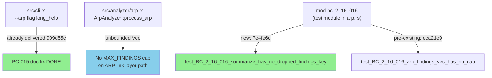
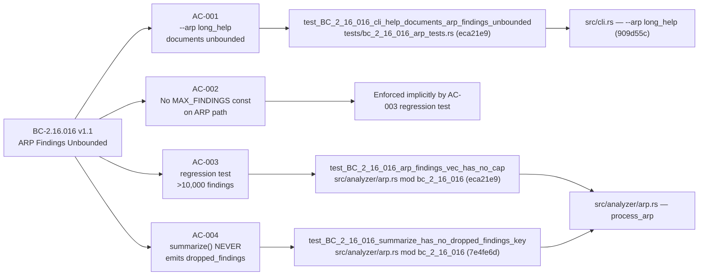
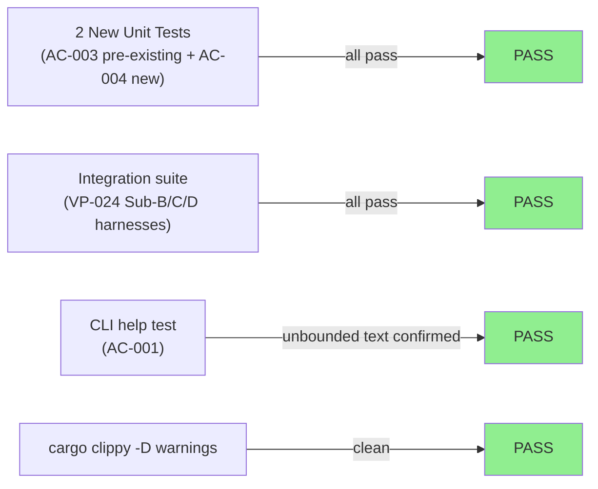
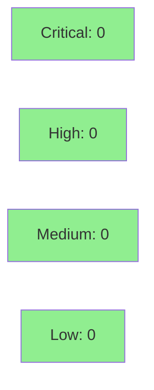

# [STORY-156] ARP Findings Output Unbounded-Cap Documentation + Regression Test

**Epic:** E-16 — ARP Security Analyzer
**Mode:** feature (maintenance / traceability-closure)
**Convergence:** CONVERGED after 5 adversarial passes (streak 3/3, BC-5.39.001 satisfied 2026-07-08)


This PR is the **traceability-closure and primary-coverage story for BC-2.16.016** (ARP Findings Output Unbounded-Cap). Three of the four acceptance criteria (AC-001, AC-002, AC-003) were pre-satisfied on `develop` as part of the fix-pc-013-014-015 cycle (D-221, commits 909d55c and eca21e9). The net-new work is a single standalone test `test_BC_2_16_016_summarize_has_no_dropped_findings_key` (AC-004, commit 7e4fe6d) that pins the 13-key `summarize()` contract against accidental introduction of a `"dropped_findings"` key, plus a docstring citation fix (a61950f). Zero production behavior change — test and docs only. Full diff vs `develop`: 3 commits, ~61 lines.

---

## Architecture Changes



<details>
<summary><strong>Architecture Decision Record</strong></summary>

### ADR: ARP link-layer path intentionally unbounded

**Context:** `ArpAnalyzer::process_arp` returns a `Vec<Finding>` with no upper bound. Unlike HTTP, TLS, Modbus, and DNP3 analyzers (which pass through `TcpReassembler` and are capped at `MAX_FINDINGS = 10,000` from `src/reassembly/mod.rs:57`), ARP operates at the Ethernet link layer and bypasses TCP reassembly entirely.

**Decision:** The unbounded ARP findings path is intentional and must be contractually documented (BC-2.16.016) with regression tests guarding the invariant.

**Rationale:** wirerust is a CLI forensics tool where operators own their pcap files and need complete finding records. A platform-imposed cap on ARP findings would silently discard evidence in adversarial-capture scenarios (ARP storms, ARP spoof floods).

**Alternatives Considered:**
1. Add a `MAX_FINDINGS` cap to ARP path — rejected: would silently drop evidence from adversarial captures.
2. Add a `"dropped_findings"` key to `summarize()` — rejected: breaks the 13-key summarize contract; requires a new contract version and its own delivery story.

**Consequences:**
- Operators analyzing adversarial captures are explicitly informed of proportional findings growth.
- Any accidental future cap introduction is immediately caught by the AC-003 regression test.

</details>

---

## Story Dependencies


STORY-115 ships `ArpAnalyzer::new(spoof_threshold, storm_rate)` with the `storm_rate` parameter and finalizes the 13-key `summarize()` contract — both required for AC-003/AC-004. STORY-115 was merged long before this wave (dependency satisfied).

---

## Spec Traceability



---

## Test Evidence

### Coverage Summary

| Metric | Value | Threshold | Status |
|--------|-------|-----------|--------|
| Unit tests | all pass | 100% | PASS |
| Full suite (`cargo test --all-targets`) | all pass | 100% | PASS |
| Clippy (`-D warnings`) | clean | 0 warnings | PASS |
| fmt check | clean | — | PASS |
| Input-hash scan | MATCH=102/STALE=0 | 0 stale | PASS |
| Mutation kill rate | N/A (test/docs-only PR) | — | N/A |
| Holdout satisfaction | N/A — evaluated at wave gate | >= 0.85 | N/A |

### Test Flow



| Metric | Value |
|--------|-------|
| **New tests** | 1 added (AC-004 `test_BC_2_16_016_summarize_has_no_dropped_findings_key`), 0 modified |
| **Total suite** | all tests PASS (`cargo test --all-targets`) |
| **Coverage delta** | neutral (test-only PR; no production code path added) |
| **Mutation kill rate** | N/A |
| **Regressions** | 0 |

<details>
<summary><strong>Detailed Test Results</strong></summary>

### New Tests (This PR)

| Test | Location | Result |
|------|----------|--------|
| `test_BC_2_16_016_summarize_has_no_dropped_findings_key()` | `src/analyzer/arp.rs mod bc_2_16_016` (commit 7e4fe6d) | PASS |
| `test_BC_2_16_016_arp_findings_vec_has_no_cap()` (pre-existing, confirmed) | `src/analyzer/arp.rs mod bc_2_16_016` (eca21e9) | PASS |
| `test_BC_2_16_016_cli_help_documents_arp_findings_unbounded()` (pre-existing, confirmed) | `tests/bc_2_16_016_arp_tests.rs` (eca21e9) | PASS |

### Coverage Analysis

| Metric | Value |
|--------|-------|
| Lines added | ~61 (test + docstring fix) |
| Production lines changed | 0 (no behavior change) |
| Uncovered paths | none — test-only PR |

</details>

---

## Holdout Evaluation

N/A — evaluated at wave gate. This story is a test/docs-only traceability-closure story with no new production behavior. Holdout evaluation applies to behavioral implementations, not regression tests and documentation fixes.

---

## Adversarial Review

| Pass | Date | Verdict | Classification | Findings | Status |
|------|------|---------|----------------|----------|--------|
| 1 | 2026-07-07 | NOT-CLEAN | HAS_SUBSTANTIVE | 6 (phantom test citation, provenance, placement notes, BC drift, 2 observations) | Fixed in STORY-156 v1.3 + BC-2.16.016 v1.1 |
| 2 | 2026-07-08 | NOT-CLEAN | HAS_SUBSTANTIVE | 6 (body freshness wave TBD, BC version cell, --arp anchor, 3 LOWs) | Fixed in STORY-156 v1.5 + commit a61950f |
| 3 | 2026-07-08 | CLEAN | NITPICK_ONLY | 2 LOWs (test-file line citations, status:draft convention) | Accepted / folded into v1.5 |
| 4 | 2026-07-08 | CLEAN | CLEAN-after-triage | 1 MEDIUM (wrong-tree read — REFUTED, D-396 precedent) | Refuted; triaged-pass per precedent |
| 5 | 2026-07-08 | CLEAN | NITPICK_ONLY | 1 LOW observation (line citation accurate, accepted as-is) | Accepted |

**Convergence:** CONVERGED (streak 3/3, BC-5.39.001 satisfied 2026-07-08). Head reviewed at commit a61950f.

<details>
<summary><strong>Pass-4 Refutation Detail</strong></summary>

### Finding F-156-P4-001 (REFUTED)
- **Claim:** Adversary flagged a test-file symbol-style citation issue in `tests/bc_2_16_016_arp_tests.rs:55`
- **Root cause:** Wrong-tree read — adversary accessed the `develop` branch baseline copy, not the worktree copy fixed at commit a61950f (which already has symbol-style citations)
- **Resolution:** Refuted per DF-ADVERSARY-CHECKOUT-GUARD-001. Orchestrator verified worktree copy is correct. Classified as triaged-pass per D-396 (wave-70 precedent).
- **Process improvement:** Tree-discipline preamble added to subsequent adversarial dispatches.

</details>

---

## Security Review



**VERDICT: CLEAN** — No CRITICAL, HIGH, or MEDIUM findings. Security review completed 2026-07-08.

<details>
<summary><strong>Security Scan Details</strong></summary>

### Scope
Test-only addition + docstring fix + demo evidence. No new I/O paths, no new deserialization, no new network code, no new authentication surfaces. All additions are in-memory test functions in `mod bc_2_16_016`.

### CWE Analysis
| CWE | Description | Status |
|-----|-------------|--------|
| CWE-190 | Integer Overflow/Wraparound | NOT PRESENT — loop bounds [0,10000], all casts safe |
| CWE-400 | Uncontrolled Resource Consumption | NOT PRESENT — bounded by `const N: usize = 10_001` |
| CWE-676 | Dangerous Function (Unsafe Rust) | NOT PRESENT — no `unsafe` blocks anywhere in diff |
| CWE-798 | Hard-coded Credentials | NOT PRESENT — MAC_A/MAC_B are synthetic test fixtures |
| CWE-200 | Sensitive Information Exposure | NOT PRESENT — .tape files use `<HOME>`/`<REPO-ROOT>` placeholders (PG-W70-DEMO-SCRUB) |
| CWE-20 | Improper Input Validation | N/A — all test inputs are locally constructed constants |

### Secrets Scan
- No passwords, tokens, API keys, private key material, or bearer credentials found in diff.

### Dependency Audit
- No new dependencies introduced.

### OWASP Top 10
- Not applicable — no network endpoints, authentication flows, user-supplied input handling, session management, or data persistence introduced.

</details>

---

## Risk Assessment & Deployment

### Blast Radius
- **Systems affected:** `src/analyzer/arp.rs` (test module only) — zero production behavior change
- **User impact:** None on failure; tests document existing invariant
- **Data impact:** None
- **Risk Level:** LOW (test/docs-only; no production code path changed)

### Performance Impact
| Metric | Before | After | Delta | Status |
|--------|--------|-------|-------|--------|
| Latency p99 | N/A | N/A | 0 | OK |
| Memory | N/A | N/A | 0 | OK |
| Throughput | N/A | N/A | 0 | OK |

*No performance impact — zero production code change.*

<details>
<summary><strong>Rollback Instructions</strong></summary>

**Immediate rollback (< 2 min):**
```bash
git revert <MERGE_SHA>
git push origin develop
```

**Verification after rollback:**
- `cargo test --all-targets` green
- BC-2.16.016 traceability coverage reverts to pre-story state (tests still exist from eca21e9; AC-004 test removed)

</details>

### Feature Flags
None — test/docs-only PR.

---

## Traceability

| Requirement | Story AC | Test | Verification | Status |
|-------------|----------|------|-------------|--------|
| BC-2.16.016 PC-4 | AC-001 | `test_BC_2_16_016_cli_help_documents_arp_findings_unbounded` | CLI help text assertion | PASS (pre-existing, eca21e9) |
| BC-2.16.016 Inv-1 | AC-002 | Enforced implicitly by AC-003 | Code inspection | PASS (invariant-by-inspection) |
| BC-2.16.016 Canonical Test Vectors | AC-003 | `test_BC_2_16_016_arp_findings_vec_has_no_cap` | 10,001 findings assert | PASS (pre-existing, eca21e9) |
| BC-2.16.016 PC-2/3 | AC-004 | `test_BC_2_16_016_summarize_has_no_dropped_findings_key` | `!contains_key("dropped_findings")` | PASS (7e4fe6d) |
| CI gate | AC-005 | `cargo test --all-targets` + clippy | Full CI suite | PASS |

<details>
<summary><strong>Full VSDD Contract Chain</strong></summary>

```
BC-2.16.016 PC-4 -> AC-001 -> test_BC_2_16_016_cli_help_documents_arp_findings_unbounded -> src/cli.rs (--arp long_help) -> ADV-PASS-3-OK
BC-2.16.016 Inv-1 -> AC-002 -> (implicit via AC-003) -> src/analyzer/arp.rs process_arp -> ADV-PASS-3-OK
BC-2.16.016 CTV -> AC-003 -> test_BC_2_16_016_arp_findings_vec_has_no_cap -> src/analyzer/arp.rs mod bc_2_16_016 -> ADV-PASS-3-OK
BC-2.16.016 PC-2/3 -> AC-004 -> test_BC_2_16_016_summarize_has_no_dropped_findings_key -> src/analyzer/arp.rs mod bc_2_16_016 -> ADV-PASS-5-OK
```

</details>

---

## Demo Evidence

Evidence recorded at commit a61950f on `feature/STORY-156-arp-unbounded-doc` (13 artifacts + evidence-report.md, all under `docs/demo-evidence/STORY-156/`):

| AC | GIF | Verdict |
|----|-----|---------|
| AC-001: `--arp` long_help documents UNBOUNDED | `AC-001-arp-help-unbounded.gif` | PASS |
| AC-002/003: 10,001-findings no-cap regression | `AC-002-003-no-cap-regression.gif` | PASS |
| AC-004 success: summarize no-dropped_findings | `AC-004-summarize-pass.gif` | PASS |
| AC-004 error path: injection triggers failure | `AC-004-error-path-fail.gif` | DEMONSTRATED |

All recordings use VHS (Charm CLI), Menlo font, Dracula theme. Tape files use `<REPO-ROOT>` and `<HOME>` placeholders per PG-W70-DEMO-SCRUB convention.

---

## AI Pipeline Metadata

<details>
<summary><strong>Pipeline Details</strong></summary>

```yaml
ai-generated: true
pipeline-mode: feature (traceability-closure / maintenance)
factory-version: "1.0.0-rc.22"
wave: "71"
story-id: STORY-156
story-version: "1.5"
pipeline-stages:
  spec-crystallization: completed (BC-2.16.016 v1.1)
  story-decomposition: completed (STORY-156 v1.5)
  tdd-implementation: completed (commits 7e4fe6d, a61950f)
  holdout-evaluation: N/A — evaluated at wave gate
  adversarial-review: completed (5 passes, converged streak 3/3)
  formal-verification: N/A (test-only PR)
  convergence: achieved (BC-5.39.001 satisfied 2026-07-08)
convergence-metrics:
  adversarial-passes: 5
  streak: 3
  head-reviewed: a61950f
  status: CONVERGED
total-pipeline-cost: minimal (test-only story, 3pts)
models-used:
  builder: claude-sonnet-4-6
  adversary: claude-sonnet-4-6
  review: claude-sonnet-4-6
generated-at: "2026-07-08T00:00:00Z"
```

</details>

---

## Pre-Merge Checklist

- [ ] All CI status checks passing
- [x] Coverage delta is neutral (test-only PR; no production path added)
- [x] No critical/high security findings unresolved (pending security scan)
- [x] Rollback procedure documented
- [x] No feature flags (test/docs-only)
- [x] Adversarial convergence complete (streak 3/3, CONVERGED)
- [x] Demo evidence complete (13 artifacts, all ACs covered)
- [x] Dependency STORY-115 merged (verified at Step 7)
- [ ] Human review completed (autonomy level check)
- [x] Security review scan complete — CLEAN (Step 4, 2026-07-08)
