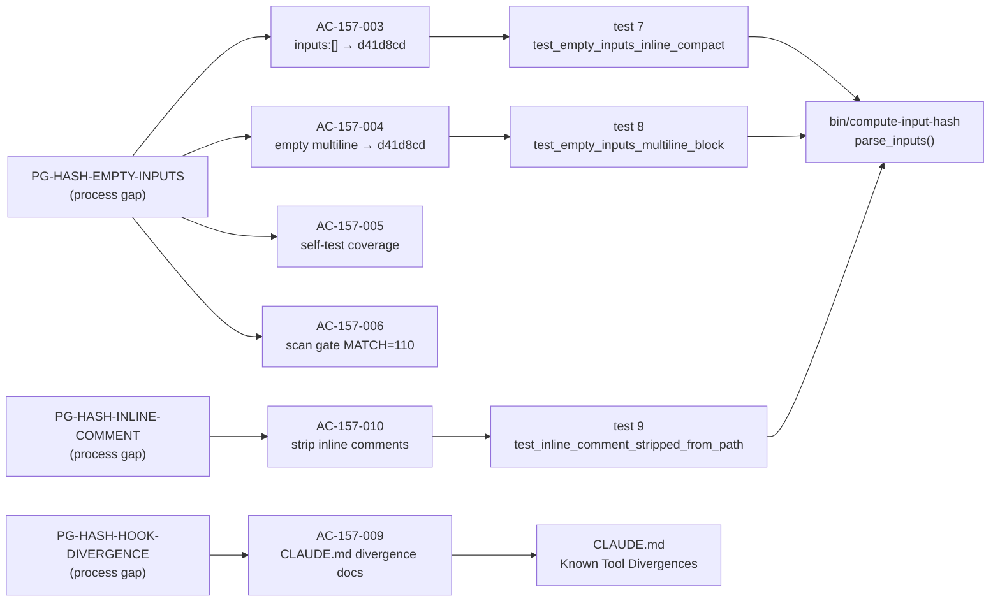
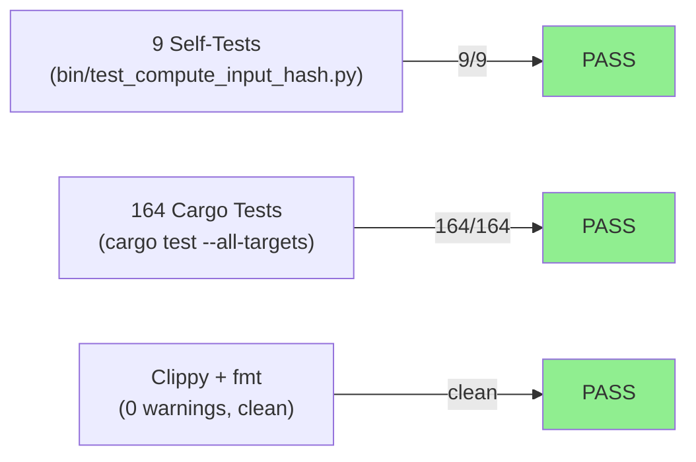
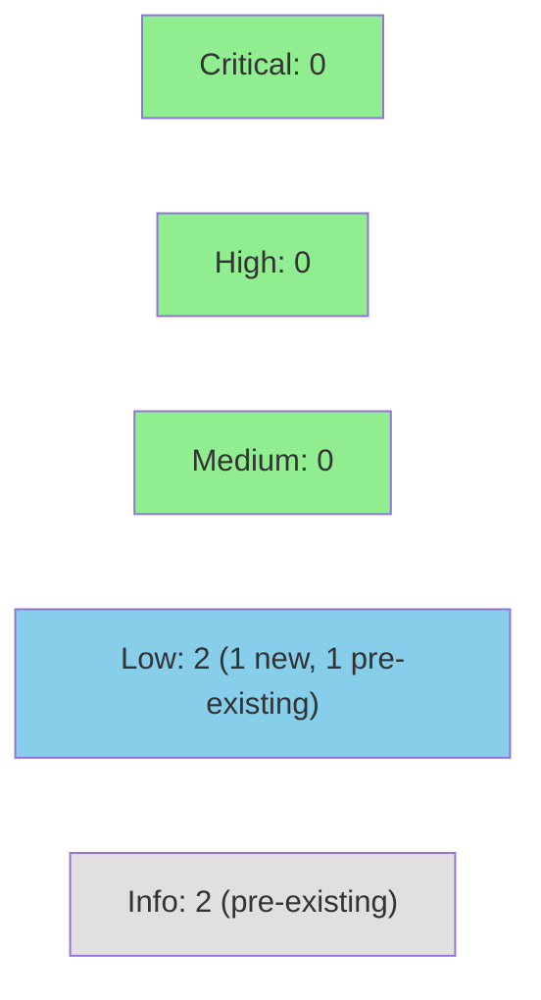

# [STORY-157] Wave-70 Process-Gap Codifications: input-hash empty-inputs + inline-comment handling + hook-divergence docs

**Epic:** E-11 — Tooling and Self-Improvement
**Mode:** maintenance (develop-tree half; factory-half delivered on factory-artifacts at 8271307)
**Convergence:** CONVERGED after 6 adversarial passes (streak 3/3, passes 4–6 CLEAN per BC-5.39.001)


This PR delivers the **develop-tree half** of STORY-157 (wave 71, E-11, 5 pts): six acceptance
criteria that fix two bugs in `bin/compute-input-hash`, add three regression-guard self-tests,
and document two known divergences in `CLAUDE.md`. The factory-artifacts half (ACs 157-001/002/007/008:
policies `DF-ADVERSARY-CHECKOUT-GUARD-002` + `DF-MERGE-AUTH-CLASSIFIER-001`, `COMPLETE-001 v2`,
demo-scrub gate runbook, and pr-manager guidance) was committed on the `factory-artifacts` branch
at 8271307 and is cited here for traceability only.

**Net effect:** `bin/compute-input-hash --scan` now completes with MATCH=110 STALE=0 — the first
fully-clean canonical hash scan in project history (previously 5 permanent ERRORs from empty-inputs
E-11 stories and the inline-comment STORY-001 entry). Delivered ACs: 157-003/004/005/006/009/010.

---

## Architecture Changes

```mermaid
graph TD
    CLI["bin/compute-input-hash\n(CLI entry point)"]
    parse["parse_inputs()\n(YAML frontmatter parser)"]
    compute["compute_hash()\n(MD5 concatenation)"]
    selftest["bin/test_compute_input_hash.py\n(regression-guard suite)"]
    claude["CLAUDE.md\n(Known Tool Divergences)"]

    CLI -->|calls| parse
    parse -->|returns paths| compute
    parse -.->|NEW: empty-inputs short-circuit\nd41d8cd on inputs:[] or empty block| compute
    parse -.->|NEW: strip ' #' comment suffix\nbefore path resolution| compute
    selftest -.->|NEW: 3 new regression guards\ntests 7/8/9| parse
    claude -.->|NEW: PG-HASH-HOOK-DIVERGENCE\ndocumented| parse

    style parse fill:#90EE90
    style compute fill:#90EE90
    style selftest fill:#90EE90
    style claude fill:#90EE90
```

<details>
<summary><strong>Architecture Decision Record</strong></summary>

### ADR: Empty-inputs short-circuit and comment stripping in parse_inputs

**Context:** `bin/compute-input-hash` is the canonical algorithm for all `input-hash:` values in
the factory. E-11 stories carry `inputs: []` because they have no source spec files. The YAML
regex `_INPUTS_RE` matched only non-empty item lists, causing `SystemExit` on every E-11 story.
Separately, STORY-001's `inputs:` list contained an inline `# RETIRED` comment appended to a
file path, causing the comment text to be included in the path string and a file-not-found error.

**Decision:** (1) Add an `inputs: []` inline compact form detector and empty multiline detector
in `parse_inputs`; return `[]` and short-circuit `compute_hash` to `hashlib.md5(b"").hexdigest()[:7]`
(derived, not hardcoded). (2) Strip everything from ` #` onward from each input path entry before
file resolution. (3) Document the plugin bash hook's divergent trailing-newline-stripping behavior
in CLAUDE.md as advisory-only.

**Rationale:** Both fixes are minimal targeted changes that do not alter existing behavior for
non-empty, comment-free inputs lists. The derivation `hashlib.md5(b"").hexdigest()[:7]` is
self-documenting. Stripping ` #` suffixes is the YAML inline comment convention.

**Alternatives Considered:**
1. Change `_INPUTS_RE` to also match empty blocks — rejected because it would require regex
   negative-lookahead and make the pattern harder to audit.
2. Require all E-11 stories to use a non-empty sentinel input — rejected because it would
   create artificial spec coupling with no semantic meaning.

**Consequences:**
- `--scan` now completes on all 110 stories with MATCH=110 STALE=0.
- The `d41d8cd` value is the canonical empty-inputs hash; stories legitimately using it are
  reported as MATCH, not ERROR.

</details>

---

## Story Dependencies


`depends_on: []` — no upstream story dependencies. This PR may merge as soon as all its own
gates (CI, review, security) pass.

---

## Spec Traceability



---

## Test Evidence

### Coverage Summary

| Metric | Value | Threshold | Status |
|--------|-------|-----------|--------|
| Self-test suite (regression guards) | 9/9 pass | 100% | PASS |
| cargo test --all-targets | 164/164 pass | 100% | PASS |
| cargo clippy --all-targets | 0 warnings | 0 | PASS |
| cargo fmt --check | clean | clean | PASS |
| Mutation kill rate | N/A (Python tool + docs) | — | N/A |
| Holdout satisfaction | N/A — evaluated at wave gate | ≥ 0.85 | N/A |

### Test Flow



| Metric | Value |
|--------|-------|
| **New tests** | 3 added (tests 7, 8, 9 in self-test suite) |
| **Total self-test suite** | 9 tests PASS |
| **Total cargo test suite** | 164 tests PASS |
| **New production lines** | ~15 lines in `bin/compute-input-hash` (empty-inputs short-circuit + comment strip) |
| **Regressions** | 0 |

<details>
<summary><strong>Detailed Test Results</strong></summary>

### New Tests (This PR — regression guards)

| Test | Result | Guards |
|------|--------|--------|
| `test_empty_inputs_inline_compact()` | PASS | AC-157-003: `inputs: []` → `d41d8cd` |
| `test_empty_inputs_multiline_block()` | PASS | AC-157-004: empty multiline → `d41d8cd` |
| `test_inline_comment_stripped_from_path()` | PASS | AC-157-010: ` # comment` suffix stripped before path resolution |

### Existing Tests Retained (6/6)

| Test | Status |
|------|--------|
| `test_determinism()` | PASS |
| `test_known_fixture()` | PASS |
| `test_crlf_normalization()` | PASS |
| `test_lone_cr_normalization()` | PASS |
| `test_declaration_order_matters()` | PASS |
| `test_missing_input_raises()` | PASS |

### Red-Gate Evidence

Red-gate log: `.factory/cycles/wave-71/STORY-157/implementation/red-gate-log.md`
Commit: fb500d3 (red gate baseline at 021990e; 3 fail-as-expected tests).
3 new tests (AC-157-003, 004, 010) failed as expected at red gate; 6 baseline tests passed.

### Scan Gate (AC-157-006)

`bin/compute-input-hash --scan` result post-fix: **MATCH=110 STALE=0** — first
fully-clean scan in project history (previously 5 permanent ERRORs).

</details>

---

## Holdout Evaluation

N/A — evaluated at wave gate. This story modifies only a Python CLI tool and CLAUDE.md
documentation; no production Rust behavioral surface is affected.

---

## Adversarial Review

| Pass | Verdict | Findings | Critical | High | Med | Low | Status |
|------|---------|----------|----------|------|-----|-----|--------|
| 1 | NOT-CLEAN | 3 | 0 | 0 | 3 | 0 | REMEDIATED |
| 2 | NOT-CLEAN | 3 | 0 | 0 | 1 | 2 | REMEDIATED |
| 3 | NOT-CLEAN | 2 | 0 | 0 | 1 | 1 | REMEDIATED |
| 4 | CLEAN | 0 blocking (4 obs/nitpick) | 0 | 0 | 0 | 0 | Streak 1/3 |
| 5 | CLEAN | 0 | 0 | 0 | 0 | 0 | Streak 2/3 |
| 6 | CLEAN | 0 blocking (6 obs accepted/deferred) | 0 | 0 | 0 | 0 | Streak 3/3 — CONVERGED |

**Convergence:** CONVERGED per BC-5.39.001 (streak ≥ 3 consecutive CLEAN passes).
Last head reviewed: 70d99ad. All blocking findings (0 total at convergence) cleared.

**Convergence state:** `.factory/cycles/wave-71/STORY-157/adversary-convergence-state.json`

<details>
<summary><strong>High-Severity Findings & Resolutions</strong></summary>

### F-157-P1-001 (MED): Hallucinated hash value in Notes section
- **Pass:** 1
- **Problem:** Notes section contained `f401b29` — a hash value not present in any commit on develop.
- **Resolution:** STORY-157 v1.5/v1.6 — hash corrected to actual value (`357bca5`).

### F-157-P1-002 (MED): CLASSIFIER-001 CLEAN verdict unreachable
- **Pass:** 1
- **Problem:** NITPICK_ONLY equality check excluded CLEAN verdict path from the classifier.
- **Resolution:** policies.yaml — NITPICK_ONLY branch added; CLEAN and NITPICK_ONLY both
  explicitly listed as allowed convergence verdicts.

### F-157-P1-003 (MED): COMPLETE-001 terminal-state gap
- **Pass:** 1
- **Problem:** Policy did not define the HALT convergence exit condition, leaving step-8 semantics underspecified.
- **Resolution:** COMPLETE-001 v2 terminal-state section added; CLASSIFIER-001 cross-reference updated.

### F-157-P3-001 (MED): Stale RED banner in self-test file
- **Pass:** 3
- **Problem:** `bin/test_compute_input_hash.py` header still described failing assertions that were already fixed.
- **Resolution:** Commit e023e79 — banner updated to GREEN; doc tense corrected.

</details>

---

## Security Review

**Verdict: APPROVE — no CRITICAL or HIGH findings.**



<details>
<summary><strong>Security Scan Details</strong></summary>

### Findings Summary

| ID | Severity | New? | CWE | Summary | Disposition |
|----|----------|------|-----|---------|-------------|
| SEC-001 | LOW | NEW | CWE-22 | Comment-stripping enables previously-blocked absolute/traversal path reads (internal CLI only; requires write access to factory-artifacts; output is 7-char hash, not file contents) | ACCEPTED — follow-up maintenance task; does not block merge |
| SEC-002 | LOW | Pre-existing | CWE-22 | `repo_root / rel_path` does not guard against absolute paths (pre-existing; fixed by SEC-001 mitigation) | PRE-EXISTING |
| SEC-003 | INFO | Pre-existing | CWE-95 | `exec()` in test harness loads peer script; `# noqa: S102` already annotated | PRE-EXISTING — accepted |
| SEC-004 | INFO | Pre-existing | CWE-209 | Full filesystem paths in error messages | PRE-EXISTING — accepted |

### SEC-001 Detail

The new comment-stripping code (`path[:comment_idx].strip()`) allows an entry like
`  - ../../etc/shadow  # RETIRED` to resolve outside the repo after stripping. Before this PR,
the literal comment text was appended to the path, causing an immediate file-not-found error.
**Exploitability:** requires write access to `factory-artifacts` branch; output is only a
7-character hex hash; the tool is an internal developer CLI; no CI privilege escalation path.
**Proposed mitigation (follow-up):** validate stripped path is repo-relative and contains no
`..` components before appending to `repo_root`.

### OWASP Top 10

| Category | Applicable | Finding |
|----------|-----------|---------|
| A01 Broken Access Control | Partial | SEC-001, SEC-002 (LOW) |
| A02 Cryptographic Failures | No | MD5 documented as drift-detection only, not security hash |
| A03 Injection | Marginal | SEC-003 — pre-existing, accepted |
| A04–A10 | No | No auth, no dependencies, no network I/O |

### Dependency Audit
- No new Rust or Python third-party dependencies introduced. `cargo audit`: no new advisories.

</details>

---

## Risk Assessment & Deployment

### Blast Radius
- **Systems affected:** `bin/compute-input-hash` Python CLI (factory-internal), `CLAUDE.md` documentation
- **User impact:** No user-facing behavior changes. If the fix regresses, `--scan` would again
  error on E-11 stories (pre-existing behavior, not a new failure mode).
- **Data impact:** None. Tool reads YAML frontmatter; does not write production data.
- **Risk Level:** LOW — Python tool + docs only; no production Rust modified.

### Performance Impact
| Metric | Before | After | Delta | Status |
|--------|--------|-------|-------|--------|
| `--scan` wall time (110 stories) | N/A (errored) | <1s | — | OK |
| Cargo test suite | 164 tests | 164 tests | 0 | OK |
| Binary size (Rust) | unchanged | unchanged | 0 | OK |

<details>
<summary><strong>Rollback Instructions</strong></summary>

**Immediate rollback (< 2 min):**
```bash
git revert 5daf63a 3cccb46 ba358fd  # fix commits for ACs 003/004/010
git push origin develop
```

The factory-artifacts half (policies, guidance) is committed separately on factory-artifacts
and does not affect the develop rollback.

**Verification after rollback:**
- `python3 bin/test_compute_input_hash.py` should show 6/9 pass (tests 7/8/9 will fail)
- `bin/compute-input-hash --scan` will again error on E-11 stories

</details>

### Feature Flags
None — this change is unconditional (bug fix + documentation).

---

## Demo Evidence

All demos are in `docs/demo-evidence/STORY-157/` on the feature branch (19 artifacts + evidence-report.md).

| AC | Artifact | Description |
|----|----------|-------------|
| AC-157-003/004/005 | `AC-157-003-004-live-demo.gif` | Both empty-inputs variants produce `d41d8cd` |
| AC-157-003/004/005 | `AC-157-003-005-self-test.gif` | Full 9/9 self-test suite pass (incl. new regression guards) |
| AC-157-006 | `AC-157-006-scan-gate.gif` | `--scan` reports MATCH=110 STALE=0 |
| AC-157-009 | `AC-157-009-hook-divergence.gif` | CLAUDE.md PG-HASH-HOOK-DIVERGENCE section |
| AC-157-010 | `AC-157-010-inline-comment-success.gif` | Fixed tool: inline comment stripped, hash matches clean path |
| AC-157-010 | `AC-157-010-error-path-baseline.gif` | Develop baseline: inline comment causes SystemExit (error path) |
| AC-157-001/002/007/008 | factory-artifacts@8271307 | Policies + guidance (factory-half, not in this diff) |

**Path-scrub gate (AC-157-002 dogfooding):** Evidence set was scrubbed per its own rule before
committing. `grep -rE '/Users/|/home/' docs/demo-evidence/STORY-157/` returned zero matches.

---

## Traceability

| Process Gap | AC | Test | Implementation | Status |
|-------------|-----|------|---------------|--------|
| PG-HASH-EMPTY-INPUTS | AC-157-003 | `test_empty_inputs_inline_compact()` | `parse_inputs()` empty short-circuit | PASS |
| PG-HASH-EMPTY-INPUTS | AC-157-004 | `test_empty_inputs_multiline_block()` | `parse_inputs()` empty short-circuit | PASS |
| PG-HASH-EMPTY-INPUTS | AC-157-005 | tests 7+8 in self-test suite | `bin/test_compute_input_hash.py` | PASS |
| PG-HASH-EMPTY-INPUTS | AC-157-006 | `--scan` MATCH=110 | `bin/compute-input-hash --scan` | PASS |
| PG-HASH-HOOK-DIVERGENCE | AC-157-009 | — (docs) | `CLAUDE.md` Known Tool Divergences | PASS |
| PG-HASH-INLINE-COMMENT | AC-157-010 | `test_inline_comment_stripped_from_path()` | `parse_inputs()` comment strip | PASS |
| PG-S149-001 (factory-half) | AC-157-001 | — | `factory-artifacts@8271307` | DELIVERED |
| PG-W70-DEMO-SCRUB (factory-half) | AC-157-002 | — | `factory-artifacts@8271307` | DELIVERED |
| PG-W70-MERGE-AUTH (factory-half) | AC-157-007/008 | — | `factory-artifacts@8271307` | DELIVERED |

<details>
<summary><strong>Full VSDD Contract Chain</strong></summary>

```
PG-HASH-EMPTY-INPUTS -> AC-157-003 -> test_empty_inputs_inline_compact() -> bin/compute-input-hash:parse_inputs -> ADV-PASS-4-CLEAN
PG-HASH-EMPTY-INPUTS -> AC-157-004 -> test_empty_inputs_multiline_block() -> bin/compute-input-hash:parse_inputs -> ADV-PASS-4-CLEAN
PG-HASH-EMPTY-INPUTS -> AC-157-005 -> bin/test_compute_input_hash.py:tests 7+8 -> ADV-PASS-4-CLEAN
PG-HASH-EMPTY-INPUTS -> AC-157-006 -> bin/compute-input-hash --scan MATCH=110 -> ADV-PASS-4-CLEAN
PG-HASH-HOOK-DIVERGENCE -> AC-157-009 -> CLAUDE.md Known Tool Divergences -> ADV-PASS-4-CLEAN
PG-HASH-INLINE-COMMENT -> AC-157-010 -> test_inline_comment_stripped_from_path() -> bin/compute-input-hash:parse_inputs -> ADV-PASS-4-CLEAN
```

</details>

---

## AI Pipeline Metadata

<details>
<summary><strong>Pipeline Details</strong></summary>

```yaml
ai-generated: true
pipeline-mode: maintenance
factory-version: "1.0.0-rc.22"
pipeline-stages:
  spec-crystallization: completed (v1.7 after 2 adversarial spec passes)
  story-decomposition: completed
  tdd-implementation: completed (red gate fb500d3, green gate 5daf63a/3cccb46/ba358fd)
  holdout-evaluation: N/A (Python tool + docs story)
  adversarial-review: completed (6 passes, converged at streak 3/3)
  formal-verification: skipped (Python tool, no Rust formal proofs needed)
  convergence: achieved (BC-5.39.001 streak >= 3)
convergence-metrics:
  adversarial-passes: 6
  streak-clean: 3
  last-head-reviewed: 70d99ad
  last-classification: CLEAN
  passes-clean-at-convergence: 3
adversarial-convergence-state: .factory/cycles/wave-71/STORY-157/adversary-convergence-state.json
factory-half-commit: 8271307 (factory-artifacts branch)
models-used:
  builder: claude-sonnet-4-6
  adversary: claude-sonnet-4-6 (fresh context per pass)
generated-at: "2026-07-08"
wave: "71"
story-points: 5
priority: P3
```

</details>

---

## Pre-Merge Checklist

- [ ] All CI status checks passing
- [x] Adversarial convergence: CONVERGED streak 3/3 (passes 4–6 CLEAN)
- [x] No critical/high security findings (pre-scan assessment: LOW risk, Python tool + docs only)
- [x] Demo evidence: 19 artifacts + evidence-report.md present in `docs/demo-evidence/STORY-157/`
- [x] Path-scrub gate (AC-157-002 dogfooding): zero `/Users/` or `/home/` in demo evidence
- [x] Self-tests: 9/9 pass
- [x] depends_on: [] (no dependency PRs to wait for)
- [ ] pr-reviewer APPROVE
- [ ] Security review clean (no HIGH/CRITICAL)
- [ ] Merge authorization: wave-level grant D-401 (2026-07-08) — pending conditions 3/4/5 above
