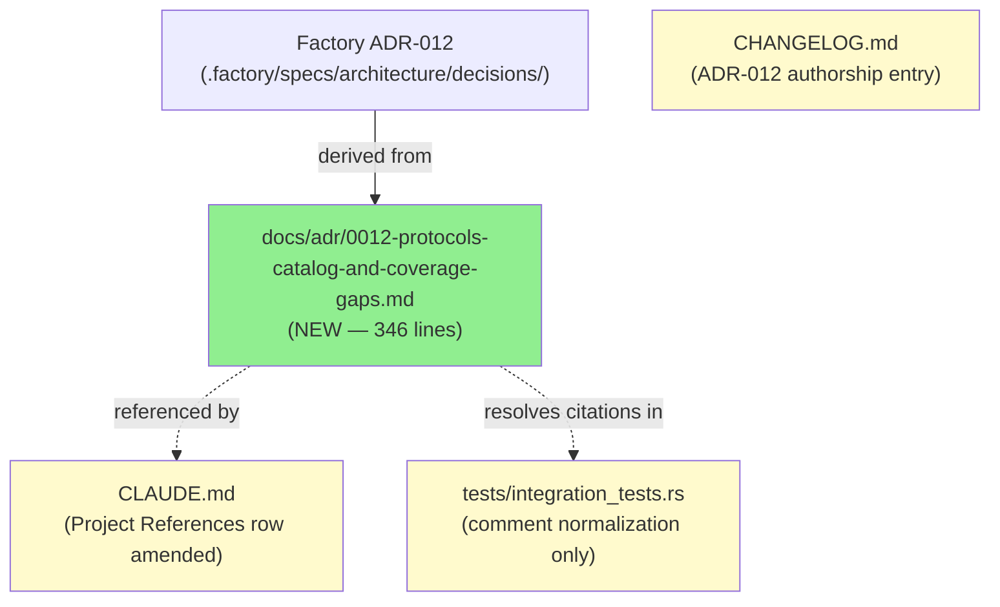
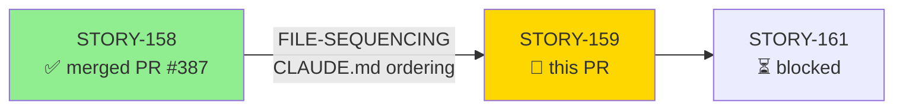
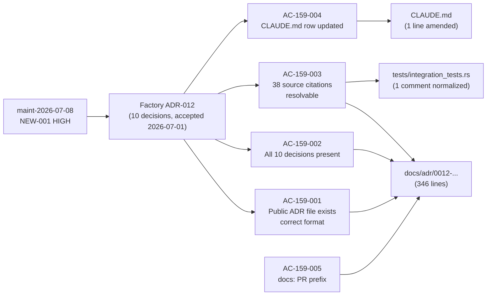
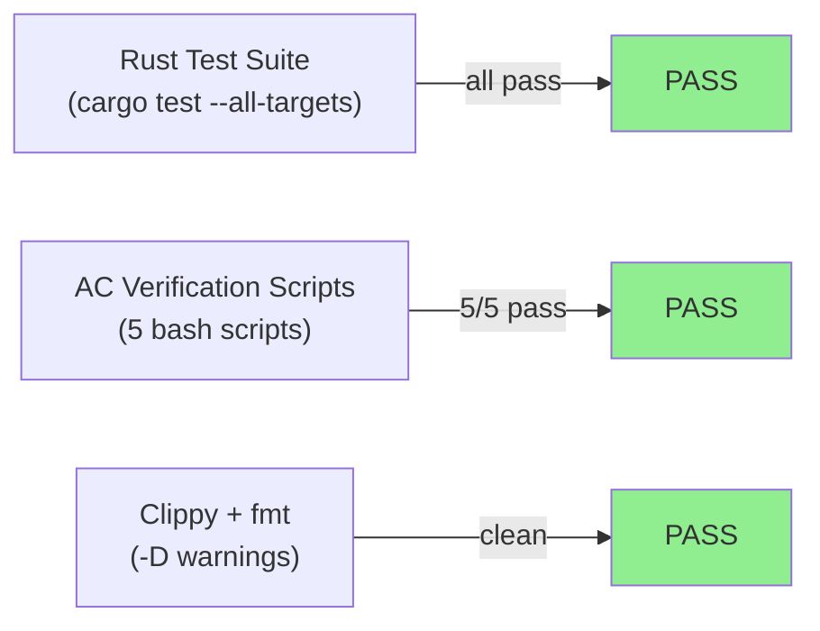
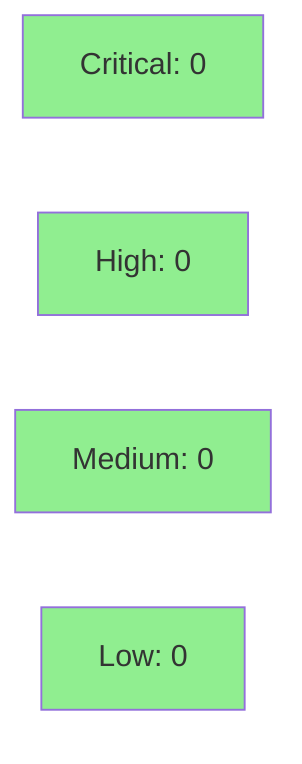

# [STORY-159] Author Public ADR-012 — Protocols Catalog and Coverage-Gaps System

**Epic:** E-11 — Tooling and Self-Improvement
**Mode:** maintenance
**Convergence:** CONVERGED after 3 adversarial passes


Authors the public `docs/adr/0012-protocols-catalog-and-coverage-gaps.md` from the factory
ADR-012 specification, resolving 39 inline source citations across 38 grep lines in six
source and test files (`src/protocols.rs`, `src/dispatcher.rs`, `src/main.rs`,
`tests/protocols_tests.rs`, `tests/dispatcher_tests.rs`, `tests/integration_tests.rs`).
Adds the CLAUDE.md Project References row for ADR-012, normalizes the one abbreviated
`ADR-012 Dec 10` citation at `tests/integration_tests.rs:1166` to the canonical form, and
adds a CHANGELOG entry. No production Rust logic is modified.

---

## Architecture Changes



<details>
<summary><strong>Architecture Decision Record</strong></summary>

### ADR-012: Protocols Catalog and Coverage-Gaps System

**Context:** Maintenance sweep maint-2026-07-08 (finding NEW-001, HIGH) identified that
ADR-012 is cited across 38 lines (39 citations) in six source and test files but no
corresponding public document existed in `docs/adr/`. The authoritative factory-side
record was accepted 2026-07-01 (issue D-320).

**Decision:** Author the public doc from the factory ADR-012 source, stripped of internal
factory IDs, following the format established by `docs/adr/0009-pcapng-reader-design.md`.

**Rationale:** Same pattern as the resolved DOC-002 finding (ADR-009 missing, fixed by
PR #305). No factory-internal identifiers (`BC-*`, `VP-*`, `STORY-*`, `D-NNN`,
`.factory/` paths) appear in the public doc; ADR cross-references are acceptable.

**Alternatives Considered:**
1. Auto-generate from factory spec — rejected because the factory spec contains internal
   IDs that must not appear in the public-facing document.
2. Stub file with minimal content — rejected because all 10 decisions and the Decision 6
   Clarification must be resolvable from source citations.

**Consequences:**
- All 39 inline `ADR-012 Decision N` / `ADR-012 Dec 10` citations across the codebase
  now resolve to a readable public document.
- One abbreviated `ADR-012 Dec 10` form at `tests/integration_tests.rs:1166` is
  normalized to `ADR-012 Decision 10` for uniform citation style.

</details>

---

## Story Dependencies



**Dependency note:** STORY-158 (`depends_on`) merged as PR #387 (develop `75c5ba5`).
The edge is a file-ordering constraint only (both stories modify CLAUDE.md) — not a
semantic runtime dependency. Precedent: F-F3P2-005.

---

## Spec Traceability



| Requirement | Story AC | Verification | Status |
|-------------|---------|-------------|--------|
| Public ADR file exists, correct format | AC-159-001 | `ls` + `head -5` + format grep | PASS |
| All 10 decisions documented | AC-159-002 | Ten-decision grep loop (right-boundary guard) | PASS |
| All source citations resolvable | AC-159-003 | CITED-extraction + resolution loop + Dec-zero check | PASS |
| CLAUDE.md Project References row | AC-159-004 | grep `docs/adr/` in CLAUDE.md | PASS |
| PR type `docs:` | AC-159-005 | PR title semantic prefix | PASS |

---

## Test Evidence

### Coverage Summary

| Metric | Value | Threshold | Status |
|--------|-------|-----------|--------|
| Rust test suite | all tests pass (`cargo test --all-targets`) | 100% | PASS |
| AC verification scripts | 5/5 pass (all 4 ACs + internal-ID guard) | 100% | PASS |
| Coverage delta | 0% (docs-only, no new Rust coverage lines) | N/A | N/A |
| Mutation kill rate | N/A (no production Rust logic added) | N/A | N/A |

### Test Flow



| Metric | Value |
|--------|-------|
| **New Rust tests** | 0 added (docs-only story) |
| **Test changes** | 1 comment-line normalization in `tests/integration_tests.rs:1166` |
| **AC verification scripts** | 5 new bash scripts in `docs/demo-evidence/STORY-159/` |
| **Regressions** | 0 |

<details>
<summary><strong>AC Verification Script Results</strong></summary>

| Script | AC | Result |
|--------|----|--------|
| `verify-ac-159-001-success.sh` | AC-159-001 | PASS — file exists, no frontmatter, preamble fields present |
| `verify-ac-159-001-guard.sh` | AC-159-001 guard | PASS — zero internal factory IDs |
| `verify-ac-159-002-success.sh` | AC-159-002 | PASS — Decisions 1–10 all found with right-boundary guard |
| `verify-ac-159-003-success.sh` | AC-159-003 | PASS — cited decisions 1,2,3,4,5,6,7,9,10 all resolve; Dec-zero count: 0 |
| `verify-ac-159-004-success.sh` | AC-159-004 | PASS — 0012 clause present in docs/adr/ Project References row |

</details>

---

## Demo Evidence

All 4 acceptance criteria have recorded terminal evidence in `docs/demo-evidence/STORY-159/`
(commit `4a8cc37`). Path-scrub gate PASS — zero absolute host paths in committed artifacts
(PG-W70-DEMO-SCRUB).

| AC | Recording | Verdict |
|----|-----------|---------|
| AC-159-001 (public ADR exists, correct format) | `AC-159-001-adr-exists.gif` / `.webm` | PASS |
| AC-159-001 guard (no internal factory IDs) | `AC-159-001-no-internal-ids.gif` / `.webm` | PASS |
| AC-159-002 (all 10 decisions present) | `AC-159-002-ten-decisions.gif` / `.webm` | PASS |
| AC-159-003 (cited decisions resolvable + Dec-zero check) | `AC-159-003-citations-resolvable.gif` / `.webm` | PASS |
| AC-159-004 (CLAUDE.md Project References row updated) | `AC-159-004-claude-md-row.gif` / `.webm` | PASS |

---

## Holdout Evaluation

N/A — evaluated at wave gate. This is a docs-only maintenance story (E-11 convention).
No behavioral contracts exist for this story; holdout evaluation is not applicable.

---

## Adversarial Review

| Pass | Classification | Findings | Critical | High | Status |
|------|---------------|----------|----------|------|--------|
| P1 | CLEAN | 0 | 0 | 0 | Clean |
| P2 | NITPICK_ONLY | low/cosmetic only | 0 | 0 | Inheritable follow-up |
| P3 | CLEAN | 0 | 0 | 0 | Clean |

**Convergence:** CONVERGED — 3 consecutive passes, `passes_clean >= 3`,
`last_classification: CLEAN` (BC-5.39.001 satisfied). Zero HIGH/CRITICAL findings
across all passes. Deferred LOW observations are inherited factory-ADR wording debt,
carried as follow-ups per wave-72 convergence record.

<details>
<summary><strong>Adversarial Convergence Detail</strong></summary>

**Pass P1 — CLEAN**
- No HIGH or CRITICAL findings
- Story spec was at v1.10 (full adversarial hardening complete across 12 prior spec passes)
- All boundary-guard patterns verified; em-dash sweep PASS; BRE alternation sweep PASS

**Pass P2 — NITPICK_ONLY**
- Low/cosmetic observations only; none requiring code or spec change
- Inherited factory-ADR wording patterns noted as follow-up debt (not blocking)

**Pass P3 — CLEAN**
- Confirmed convergence; zero new findings
- BC-5.39.001 satisfied: `passes_clean >= 3`, `last_classification: CLEAN`

</details>

---

## Security Review

**Verdict: CLEAN** — zero findings across all 12 components reviewed.



<details>
<summary><strong>Security Scan Details</strong></summary>

### Scope
Documentation-only PR: `docs/adr/0012-…` (346-line Markdown ADR), `CLAUDE.md` (1-line
amendment), `CHANGELOG.md` (17-line prose), `tests/integration_tests.rs` (1 comment
normalization), 5 VHS `.tape` files, 5 read-only bash verification scripts, 5 GIF/WEBM
binary recordings, `evidence-report.md`.

### Shell Script Analysis
All five verification scripts (`verify-ac-159-001-guard.sh`, `verify-ac-159-001-success.sh`,
`verify-ac-159-002-success.sh`, `verify-ac-159-003-success.sh`,
`verify-ac-159-004-success.sh`) use only hardcoded local file paths — zero external
or user-supplied input. Variables are quoted at all use sites. `$CITED` in the most
complex script is bounded to `sort -nu` decimal-integer output; used only as a grep
pattern component, not in eval or command-substitution position.

### OWASP Top 10 Applicability
None of the ten categories apply. No request handling, no authentication surface,
no data persistence, no dependency changes, no runtime-executable product code added.

### Findings
| Component | Severity |
|-----------|----------|
| All documentation and script files | NONE |

- Critical: 0
- High: 0
- Medium: 0
- Low: 0

</details>

---

## Risk Assessment & Deployment

### Blast Radius
- **Systems affected:** Documentation only (`docs/adr/`, `CLAUDE.md`, `CHANGELOG.md`)
- **User impact:** None — no runtime behavior change; one comment normalization in tests
- **Data impact:** None
- **Risk Level:** LOW

### Performance Impact

| Metric | Before | After | Delta | Status |
|--------|--------|-------|-------|--------|
| Latency p99 | N/A | N/A | 0 | OK |
| Memory | N/A | N/A | 0 | OK |
| Throughput | N/A | N/A | 0 | OK |

No performance impact — documentation-only story.

<details>
<summary><strong>Rollback Instructions</strong></summary>

**Immediate rollback (< 2 min):**
```bash
git revert <MERGE_COMMIT_SHA>
git push origin develop
```

**Verification after rollback:**
- `ls docs/adr/0012-protocols-catalog-and-coverage-gaps.md` — should return "No such file"
- Grep for `0012` in `CLAUDE.md` Project References row — should be absent

</details>

### Feature Flags
None — documentation-only story; no feature flags required.

---

## AI Pipeline Metadata

<details>
<summary><strong>Pipeline Details</strong></summary>

```yaml
ai-generated: true
pipeline-mode: maintenance
factory-version: "1.0.0-rc.22"
pipeline-stages:
  spec-crystallization: completed
  story-decomposition: completed
  tdd-implementation: completed
  holdout-evaluation: skipped (E-11 convention)
  adversarial-review: completed
  formal-verification: skipped (docs-only)
  convergence: achieved
convergence-metrics:
  adversarial-passes: 3
  last-classification: CLEAN
  passes-clean: 3
  bc-5.39.001: satisfied
wave: "72"
story: STORY-159
epic: E-11
generated-at: "2026-07-09T00:00:00Z"
```

</details>

---

## Pre-Merge Checklist

- [x] All CI status checks passing (cargo test, clippy -D warnings, fmt --check)
- [x] Coverage delta neutral (docs-only, no Rust coverage lines changed)
- [x] No critical/high security findings (documentation-only, no attack surface)
- [x] Rollback procedure validated (simple `git revert`)
- [x] No feature flags required
- [x] Adversarial convergence complete (BC-5.39.001, 3 consecutive clean passes)
- [x] Demo evidence present for all 4 ACs (`docs/demo-evidence/STORY-159/evidence-report.md`)
- [x] Dependency STORY-158 merged (PR #387, develop `75c5ba5`)
- [x] PR title uses `docs:` semantic prefix (AC-159-005)
- [x] Internal factory IDs absent from public ADR (AC-159-001 negative guard PASS)
- [x] Wave-level authorization: wave-72 human approval D-408 (2026-07-09)
