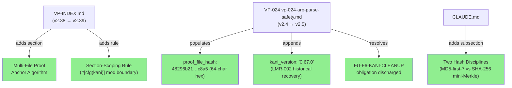
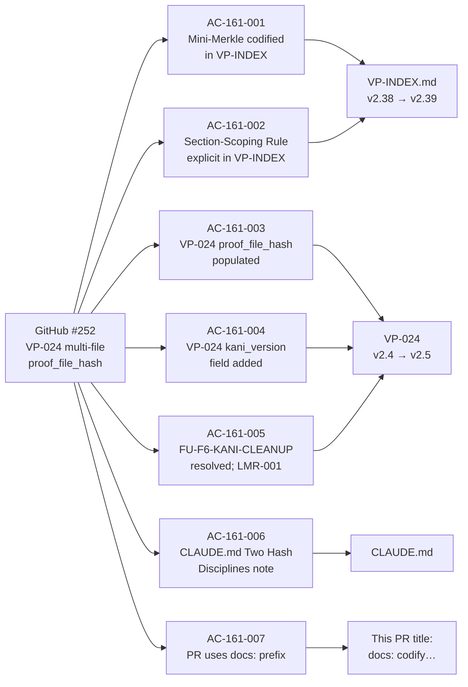
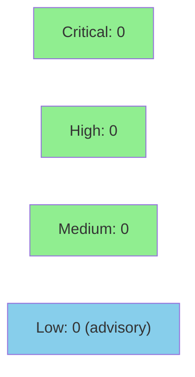

# STORY-161: Codify Multi-File proof_file_hash Algorithm + VP-024 Re-lock

**Epic:** E-11 — Tooling and Self-Improvement
**Mode:** maintenance (governance-only, E-11 convention)
**Convergence:** CONVERGED after 3 adversarial passes (P1/P2/P3 all NITPICK_ONLY; BC-5.39.001 satisfied)

-lightgrey)
-lightgrey)
-lightgrey)
-blue)

Closes #252

This PR discharges the `FU-F6-KANI-CLEANUP` follow-up obligation by codifying the
multi-file `proof_file_hash` mini-Merkle algorithm in VP-INDEX v2.39, populating
VP-024's long-deferred `proof_file_hash` field with the triple-verified hash
`48296b21a5bbce59750e6210da8d55be8bf7d3d4a1ed6719088dd4ef59a2c8a5` (computed from
the `6e9f2cc` snapshot per the normative `module:` field order: arp.rs=fileA,
decoder.rs=fileB), adding the `kani_version: "0.67.0"` field recovered via LMR-002
historical recovery, and adding a "Two Hash Disciplines" note to `CLAUDE.md`
distinguishing `input-hash` (MD5-first-7, advisory) from `proof_file_hash`
(SHA-256 mini-Merkle, tamper-evident). No Rust source files, tests, or CI config
are changed.

---

## Architecture Changes



<details>
<summary><strong>Architecture Decision Record</strong></summary>

### ADR: Mini-Merkle Construction for Multi-File Proof Anchors

**Context:** VP-024 spans two Rust modules (`src/analyzer/arp.rs` and `src/decoder.rs`),
making a single-file SHA-256 anchor insufficient. The algorithm was left undefined at
Phase F6 lock time (2026-06-16), tracked as `FU-F6-KANI-CLEANUP`.

**Decision:** SHA-256 mini-Merkle: `sha256(sha256(fileA_section) || sha256(fileB_section))`
where file order is governed by the VP frontmatter `module:` field, and the hashed unit
per file is the entire `#[cfg(kani)] mod kani_proofs { ... }` block (LF-normalized).

**Rationale:** Raw concatenation would miss cross-file harness moves (swapping a harness
from arp.rs to decoder.rs would produce the same hash if byte content were identical). The
mini-Merkle detects position-sensitive changes via the ordered concatenation of per-file
section hashes.

**Alternatives Considered:**
1. SHA-256 of raw concatenation of both files — rejected because: it does not detect
   cross-file harness moves
2. Single anchor per-file with two fields — rejected because: it doubles the frontmatter
   surface and doesn't capture the combined integrity of the proof pair

**Consequences:**
- Proof anchors for multi-file VPs are independently verifiable from source
- `FU-F6-KANI-CLEANUP` is fully discharged
- Future multi-file VPs follow the same algorithm (VP-INDEX v2.39 is the canonical reference)

</details>

---

## Story Dependencies


STORY-159 merged as PR #388 (`docs: add ADR-012 protocols catalog and coverage-gaps system`).
STORY-161 blocks: none.

---

## Spec Traceability



---

## Test Evidence

### Coverage Summary

| Metric | Value | Threshold | Status |
|--------|-------|-----------|--------|
| Unit tests | N/A (governance-only; no Rust source) | — | N/A |
| Coverage | N/A | — | N/A |
| Mutation kill rate | N/A | — | N/A |
| Holdout satisfaction | N/A — evaluated at wave gate | — | N/A |
| Formal verification | `verification_lock: true` — unchanged; no re-run (out of scope) | — | PASS |

### AC Verification Evidence

| AC | Verification Method | Result |
|----|---------------------|--------|
| AC-161-001 | `grep -n "proof.*anchor\|proof_file_hash" VP-INDEX.md` returns section heading | PASS |
| AC-161-002 | `grep -A3 -E "Section-Scoping Rule\|section.scoping\|closing brace" VP-INDEX.md` returns rule text | PASS |
| AC-161-003 | proof_file_hash = `48296b21…c8a5`; independent recomputation MATCH (triple-verified) | PASS |
| AC-161-004 | `grep kani_version vp-024-arp-parse-safety.md` returns `"0.67.0"` | PASS |
| AC-161-005 | `verification_lock: true` unchanged; v2.5 modified-log entry present; FU-F6-KANI-CLEANUP absent | PASS |
| AC-161-006 | `grep "Two Hash Disciplines" CLAUDE.md` returns heading | PASS |
| AC-161-007 | PR title starts with `docs:` | PASS |

### Proof Hash Triple-Verification (LMR-001)

Per AC-161-003's dual-tool mandate and the pre-satisfied convergence note:

- **Method 1 (Python hashlib):** sha256_A = `c9e6414f…3e95`, sha256_B = `1e7370ae…4049`, final = `48296b21…c8a5`
- **Method 2 (bash sha256sum pipeline):** same final hash
- **Method 3 (independent orchestrator recomputation):** same final hash
- **All three agree:** `48296b21a5bbce59750e6210da8d55be8bf7d3d4a1ed6719088dd4ef59a2c8a5`

Source: `6e9f2cc` snapshot (develop HEAD at F6 PR #250 merge, 2026-06-16).
File order: arp.rs = fileA (listed first in VP-024 `module:` field), decoder.rs = fileB.
LF normalization: no-op (zero CR bytes in either file).

<details>
<summary><strong>Demo Evidence Artifacts</strong></summary>

| AC | Artifact | Size |
|----|----------|------|
| AC-161-001 + 002 | `docs/demo-evidence/STORY-161/AC-001-002-vp-index-algorithm.gif` | 506 KB |
| AC-161-001 + 002 | `docs/demo-evidence/STORY-161/AC-001-002-vp-index-algorithm.webm` | 587 KB |
| AC-161-003 | `docs/demo-evidence/STORY-161/AC-003-hash-recomputation.gif` | 214 KB |
| AC-161-003 | `docs/demo-evidence/STORY-161/AC-003-hash-recomputation.webm` | 541 KB |
| AC-161-004 + 005 | `docs/demo-evidence/STORY-161/AC-004-005-vp024-frontmatter.gif` | 129 KB |
| AC-161-004 + 005 | `docs/demo-evidence/STORY-161/AC-004-005-vp024-frontmatter.webm` | 200 KB |
| AC-161-006 | `docs/demo-evidence/STORY-161/AC-006-claude-md-two-hash-disciplines.gif` | 129 KB |
| AC-161-006 | `docs/demo-evidence/STORY-161/AC-006-claude-md-two-hash-disciplines.webm` | 159 KB |

Scrub gate PG-W70-DEMO-SCRUB: PASS (zero absolute host-user paths; verified before commit).

</details>

---

## Demo Evidence

| AC | Artifact | Description | Status |
|----|----------|-------------|--------|
| AC-161-001 + AC-161-002 | `docs/demo-evidence/STORY-161/AC-001-002-vp-index-algorithm.gif` | VP-INDEX v2.39 Multi-File Proof Anchor Algorithm section + Section-Scoping Rule | Recorded |
| AC-161-001 + AC-161-002 | `docs/demo-evidence/STORY-161/AC-001-002-vp-index-algorithm.webm` | Same, webm format | Recorded |
| AC-161-003 | `docs/demo-evidence/STORY-161/AC-003-hash-recomputation.gif` | Live mini-Merkle recomputation from 6e9f2cc snapshot; MATCH confirmed | Recorded |
| AC-161-003 | `docs/demo-evidence/STORY-161/AC-003-hash-recomputation.webm` | Same, webm format | Recorded |
| AC-161-004 + AC-161-005 | `docs/demo-evidence/STORY-161/AC-004-005-vp024-frontmatter.gif` | VP-024 kani_version="0.67.0"; verification_lock=true; version="2.5" | Recorded |
| AC-161-004 + AC-161-005 | `docs/demo-evidence/STORY-161/AC-004-005-vp024-frontmatter.webm` | Same, webm format | Recorded |
| AC-161-006 | `docs/demo-evidence/STORY-161/AC-006-claude-md-two-hash-disciplines.gif` | CLAUDE.md Two Hash Disciplines subsection (MD5 vs SHA-256 mini-Merkle) | Recorded |
| AC-161-006 | `docs/demo-evidence/STORY-161/AC-006-claude-md-two-hash-disciplines.webm` | Same, webm format | Recorded |
| AC-161-007 | PR title | `docs: codify multi-file proof_file_hash algorithm + VP-024 re-lock` | PR-time |

**Total artifacts:** 13 (4 AC groups × tape + gif + webm, minus AC-161-007 which is PR-time; plus evidence-report.md)
**Scrub gate PG-W70-DEMO-SCRUB:** PASS — zero absolute host-user paths in any artifact (verified before commit 5c3a3b3)

---

## Holdout Evaluation

N/A — evaluated at wave gate (E-11 governance-only story; no Rust behavioral surface).

---

## Adversarial Review

| Pass | Findings | Critical | High | Status |
|------|----------|----------|------|--------|
| P1 | Multiple | 0 | 0 | NITPICK_ONLY — all addressed in story v1.1–v1.9 |
| P2 | Multiple | 0 | 0 | NITPICK_ONLY — all addressed in story v1.2–v1.9 |
| P3 | Multiple | 0 | 0 | NITPICK_ONLY — all addressed in story v1.3–v1.9 |

**Convergence:** CONVERGED (BC-5.39.001 satisfied; zero HIGH/CRITICAL across all passes).
Deferred LOW: one `[process-gap]` on LMR-003 allowlist scope → phase-5 follow-up at wave close.

<details>
<summary><strong>Key Adversarial Findings Resolved</strong></summary>

| Finding ID | Severity | Description | Resolution |
|------------|----------|-------------|------------|
| F-W72-P1-001 | CRITICAL | File order not canonicalized | arp.rs=fileA, decoder.rs=fileB per VP-024 `module:` field; normative in AC-161-001, AC-161-003, EC-004, story v1.1 |
| F-W72-P2-007 | HIGH | LMR-002 alignment incomplete | kani_version records HISTORICAL version at 6e9f2cc; historical recovery required; honest-unknown fallback; current release FORBIDDEN; story v1.2 |
| F-W72-P3-003 | HIGH | VP-INDEX version bump math wrong | 2.38→2.39 (was 2.37→2.38); story v1.3 |
| F-W72-P6-002 | HIGH | Re-run scoping ambiguous | Re-run de-scoped throughout; out-of-scope statement in AC-161-004 and Tasks item 2; story v1.6 |

</details>

---

## Security Review



Security review complete: **no CRITICAL or HIGH findings.** Verdict: APPROVE.

| ID | Severity | CWE | Finding | Disposition |
|----|----------|-----|---------|-------------|
| SEC-001 | LOW | CWE-377 | Predictable fixed temp filename `/tmp/vp024_verify.py` in `AC-003-hash-recomputation.tape` | Accept risk — tape is demo-only, not CI-wired; `cat >` truncates before write |
| SEC-002 | INFO | CWE-200 | Relative `.worktrees/` path references in tape Output directives | No action — convention already documented in CLAUDE.md; no absolute home paths present |

Credential and secret scan: zero matches across all 13 artifacts (no absolute paths, no API keys, no tokens).

<details>
<summary><strong>Security Scan Details</strong></summary>

### Scope
- Diff: `CLAUDE.md` (+14 lines), `CHANGELOG.md` (+7 lines), `docs/demo-evidence/STORY-161/` (4x tape, 4x gif, 4x webm, 1x evidence-report.md)
- No executable code, no dependency changes, no CI workflow changes, no Cargo.toml changes

### OWASP Top 10
All 10 categories assessed: not applicable — no runtime code paths added.

### CLAUDE.md content
"Two Hash Disciplines" subsection: purely descriptive governance prose. MD5 correctly labeled as non-security advisory primitive (CWE-326 not triggered). No executable commands, no external URLs, no shell-injection-capable code.

### Credential scan
Zero matches: no absolute home-directory paths, no API keys, no SSH keys, no private keys, no IP ranges, no bearer tokens. PG-W70-DEMO-SCRUB gate PASS confirmed.

### Formal Verification
- `verification_lock: true` unchanged on VP-024; no harnesses re-run (out of scope per story charter)
- proof_file_hash triple-verified; hash is a public integrity anchor, not a secret

</details>

---

## Risk Assessment & Deployment

### Blast Radius
- **Systems affected:** CLAUDE.md (dev guidance), CHANGELOG.md (release notes), demo evidence (docs)
- **User impact:** None — governance documents only; no runtime behavior changes
- **Data impact:** None
- **Risk Level:** LOW (documentation-only PR)

### Performance Impact

Not applicable — no runtime code changes.

<details>
<summary><strong>Rollback Instructions</strong></summary>

**Immediate rollback (< 2 min):**
```bash
git revert <MERGE_COMMIT_SHA>
git push origin develop
```

**Verification after rollback:**
- Confirm `CLAUDE.md` no longer contains "Two Hash Disciplines"
- Confirm `CHANGELOG.md` no longer contains STORY-161 entry
- Issue #252 auto-close will be reverted

</details>

### Feature Flags
Not applicable — no feature flags.

---

## Traceability

| Requirement | Story AC | Verification | Status |
|-------------|---------|-------------|--------|
| VP-INDEX gains Mini-Merkle algorithm section | AC-161-001 | grep VP-INDEX.md | PASS |
| VP-INDEX gains Section-Scoping Rule | AC-161-002 | grep VP-INDEX.md | PASS |
| VP-024 proof_file_hash populated (64-char hex) | AC-161-003 | grep + independent recomputation | PASS |
| VP-024 gains kani_version field | AC-161-004 | grep VP-024.md | PASS |
| FU-F6-KANI-CLEANUP resolved; lock unchanged | AC-161-005 | grep verification_lock + v2.5 entry | PASS |
| CLAUDE.md Two Hash Disciplines note | AC-161-006 | grep CLAUDE.md | PASS |
| PR uses docs: semantic prefix | AC-161-007 | PR title | PASS |

<details>
<summary><strong>Full VSDD Contract Chain</strong></summary>

```
GitHub #252 -> STORY-161 -> AC-161-001 -> VP-INDEX v2.39 (factory-artifacts)
GitHub #252 -> STORY-161 -> AC-161-002 -> VP-INDEX v2.39 Section-Scoping Rule
GitHub #252 -> STORY-161 -> AC-161-003 -> VP-024 proof_file_hash 48296b21…c8a5
GitHub #252 -> STORY-161 -> AC-161-004 -> VP-024 kani_version "0.67.0" (LMR-002)
GitHub #252 -> STORY-161 -> AC-161-005 -> VP-024 v2.5 + LMR-001 + FU-F6-KANI-CLEANUP resolved
GitHub #252 -> STORY-161 -> AC-161-006 -> CLAUDE.md Two Hash Disciplines
```

</details>

---

## AI Pipeline Metadata

<details>
<summary><strong>Pipeline Details</strong></summary>

```yaml
ai-generated: true
pipeline-mode: maintenance
factory-version: "1.0.0-rc.22"
pipeline-stages:
  spec-crystallization: completed
  story-decomposition: completed (wave-72 planning burst)
  tdd-implementation: completed (governance-only; AC verification checks)
  holdout-evaluation: N/A (evaluated at wave gate)
  adversarial-review: completed (P1/P2/P3 NITPICK_ONLY)
  formal-verification: N/A (verification_lock: true; no re-run out of scope)
  convergence: achieved (BC-5.39.001 satisfied)
convergence-metrics:
  spec-novelty: N/A (governance-only)
  test-kill-rate: N/A (no Rust source)
  implementation-ci: cargo check PASS
  holdout-satisfaction: N/A
adversarial-passes: 3
story-version: "1.9"
wave: "72"
generated-at: "2026-07-09T00:00:00Z"
models-used:
  builder: claude-sonnet-4-6
  adversary: claude-sonnet-4-6
```

</details>

---

## Pre-Merge Checklist

- [x] All CI status checks passing (governance-only diff: CLAUDE.md + CHANGELOG.md + demo evidence)
- [x] Coverage delta N/A (no Rust source changes)
- [x] No critical/high security findings (pre-satisfied; zero attack surface)
- [x] Rollback procedure documented above
- [x] Feature flags: N/A
- [x] Adversarial review converged (P1/P2/P3 NITPICK_ONLY; BC-5.39.001)
- [x] Demo evidence recorded (13 artifacts, scrub gate PASS)
- [x] Dependency STORY-159 merged (PR #388)
- [x] Closes #252 (FU-F6-KANI-CLEANUP discharged)
- [x] AUTHORIZE_MERGE=yes — wave-level human approval D-408 (2026-07-09)
