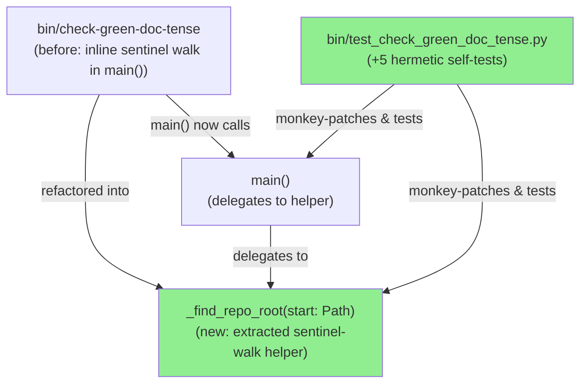
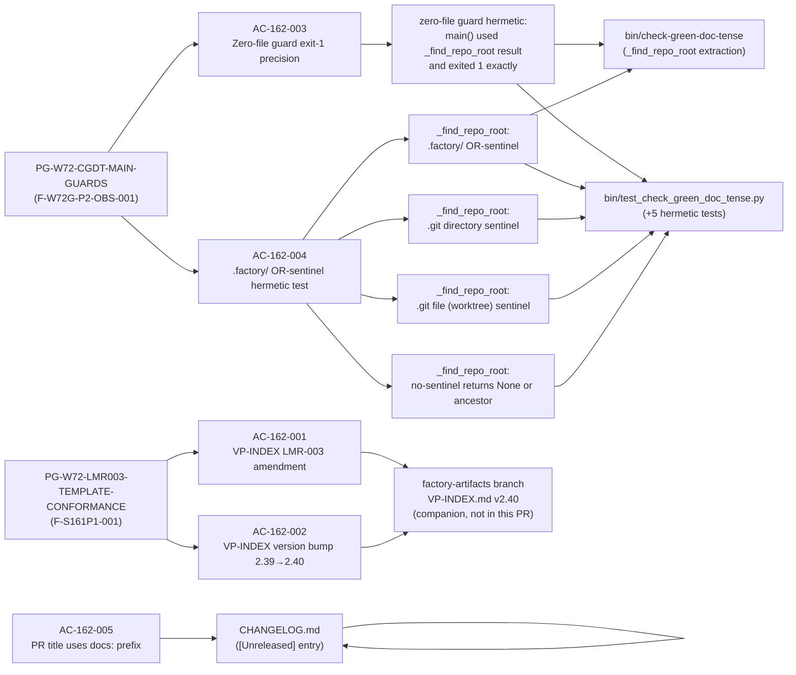
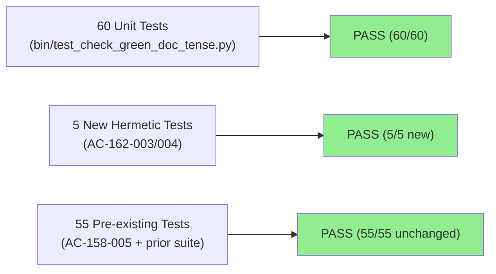
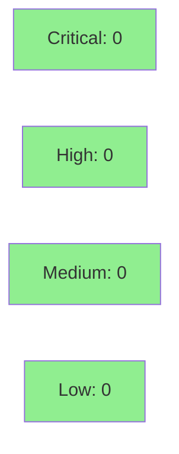

# [STORY-162] LMR-003 template-conformance exemption + check-green-doc-tense guard tests

**Epic:** E-11 — Tooling and Self-Improvement
**Mode:** maintenance (wave-73, E-11 governance-only)
**Convergence:** CONVERGED after 5 adversarial passes (streak P3/P4/P5 = NITPICK_ONLY/CLEAN/NITPICK_ONLY)


-blue)
-blue)
-blue)

This PR codifies two wave-72 process gaps surfaced during the per-story adversary pass for
STORY-161 (F-S161P1-001) and the wave-72 integration-gate adversary Pass 2
(F-W72G-P2-OBS-001). It delivers: (1) a `_find_repo_root` helper extraction in
`bin/check-green-doc-tense` plus five new hermetic main()-guard self-tests in
`bin/test_check_green_doc_tense.py` covering the `.factory/` OR-sentinel and zero-file
exit-code precision; and (2) a mandatory CHANGELOG entry. The companion VP-INDEX LMR-003
amendment (AC-162-001/002, version bump 2.39→2.40) is committed on the `factory-artifacts`
branch as an uncommitted governance change and is NOT part of this develop PR.

---

## Architecture Changes



<details>
<summary><strong>Architecture Decision Record</strong></summary>

### ADR: Extract `_find_repo_root` as module-level helper (AC-162-004(c) option 1)

**Context:** `bin/check-green-doc-tense` performed repo-root detection inline in `main()`,
making the `.factory/` OR-sentinel branch untestable without relying on the live `.git`
or `.factory/` of the develop checkout. In CI environments (develop checkout without
factory-artifacts worktree), only the `.git` sentinel would ever be exercised.

**Decision:** Extract the repo-root sentinel walk into a standalone
`_find_repo_root(start: Path) -> Path | None` helper at module level. `main()` delegates
to it. Tests monkey-patch `mod._find_repo_root` and `mod._collect_rust_files` directly.

**Rationale:** Option 1 (extraction) was chosen over the two monkey-patching alternatives
(patch `Path(__file__).resolve` or rely on a non-existent `WIRERUST_REPO_ROOT` env var)
because it produces a cleaner public test surface, avoids patching stdlib internals, and
the extracted helper itself gains a well-specified docstring contract.

**Alternatives Considered:**
1. Monkey-patch `Path(__file__).resolve` in `main()` — rejected because it patches a
   stdlib class method and produces fragile tests.
2. Use `WIRERUST_REPO_ROOT` override — rejected because `check-green-doc-tense` does not
   honor this env var (that feature belongs to `bin/compute-input-hash` only).

**Consequences:**
- `_find_repo_root` is now a stable, tested, documented helper at module level.
- The `.factory/` OR-sentinel is covered by three hermetic tests (factory-only, git-dir,
  git-file/worktree sentinels) plus a no-sentinel regression guard.
- Exit-code semantics (1 = zero files; 2 = root not found) are now precisely asserted.

</details>

---

## Story Dependencies


STORY-162 has `depends_on: []` — no upstream PRs must merge before this one.
No downstream stories are currently blocked on this PR.

---

## Spec Traceability



---

## Test Evidence

### Coverage Summary

| Metric | Value | Threshold | Status |
|--------|-------|-----------|--------|
| Unit tests | 60/60 pass | 100% | PASS |
| Coverage | N/A (Python tooling; no Rust source changed) | N/A | N/A |
| Mutation kill rate | N/A (Python tooling story) | N/A | N/A |
| Holdout satisfaction | N/A (E-11 governance-only) | N/A | N/A |

### Test Flow



| Metric | Value |
|--------|-------|
| **New tests** | 5 added (AC-162-003: 1, AC-162-004: 4), 0 modified |
| **Total suite** | 60 tests PASS |
| **Coverage delta** | N/A — Python tooling, no Rust source |
| **Mutation kill rate** | N/A — governance story |
| **Regressions** | 0 |

<details>
<summary><strong>Detailed Test Results</strong></summary>

### New Tests (This PR)

| Test | AC | Result |
|------|----|--------|
| `_find_repo_root: .factory/ OR-sentinel resolves root (F-W72G-P2-OBS-001)` | AC-162-004 | PASS |
| `_find_repo_root: .git directory sentinel resolves root (F-W72G-P2-OBS-001)` | AC-162-004 | PASS |
| `_find_repo_root: .git file (worktree) sentinel resolves root (F-W72G-P2-OBS-001)` | AC-162-004 | PASS |
| `_find_repo_root: no-sentinel temp tree returns None or ancestor (F-W72G-P2-OBS-001)` | AC-162-004 | PASS |
| `zero-file guard hermetic: main() used _find_repo_root result and exited 1 exactly (AC-162-003, F-W72G-P2-OBS-001)` | AC-162-003 | PASS |

### Red Gate Verification

Red gate verified at commit `2aa0617` — 4 new tests failed (expected) before
`_find_repo_root` was extracted. Green gate at commit series through `5f1cee3`.
Red gate log: `.factory/cycles/wave-73/STORY-162/implementation/red-gate-log.md`.

</details>

---

## Demo Evidence

Evidence files are committed on the feature branch at `docs/demo-evidence/STORY-162/`.
Demo-evidence path-scrub gate (PG-W70-DEMO-SCRUB) passed — zero absolute host paths in
any evidence file (verified 2026-07-10).

| AC | Evidence File | Verdict |
|----|---------------|---------|
| AC-162-001 | `AC-001-002-vp-index-lmr003-amendment.md` | PASS |
| AC-162-002 | `AC-001-002-vp-index-lmr003-amendment.md` | PASS |
| AC-162-003 | `AC-003-zero-file-exit-code-precision.md` | PASS |
| AC-162-004 | `AC-004-factory-or-sentinel-hermetic.md` | PASS |
| AC-162-005 | `AC-005-pr-title-docs-prefix.md` | AT PR TIME |

**Recording method:** CLI transcript markdown files (command + full output). VHS
recordings are not applicable — deliverables are documentation (VP-INDEX.md on
`factory-artifacts`) and Python test additions, not interactive terminal UI.

**AC-162-003 success-path transcript (from evidence-report.md):**
```
$ python3 bin/test_check_green_doc_tense.py
...
=== AC-162-003 zero-file guard exit-code precision hermetic (F-W72G-P2-OBS-001) ===
  PASS  [zero-file guard hermetic: main() used _find_repo_root result and exited 1 exactly (AC-162-003, F-W72G-P2-OBS-001)]

Results: 60 passed, 0 failed.
```

**AC-162-004 success-path transcript (from evidence-report.md):**
```
=== AC-162-004 _find_repo_root sentinel hermetic tests (F-W72G-P2-OBS-001) ===
  PASS  [_find_repo_root: .factory/ OR-sentinel resolves root (F-W72G-P2-OBS-001)]
  PASS  [_find_repo_root: .git directory sentinel resolves root (F-W72G-P2-OBS-001)]
  PASS  [_find_repo_root: .git file (worktree) sentinel resolves root (F-W72G-P2-OBS-001)]
  PASS  [_find_repo_root: no-sentinel temp tree returns None or ancestor (F-W72G-P2-OBS-001)]
```

---

## Holdout Evaluation

N/A — evaluated at wave gate. E-11 governance-only story; no behavioral contracts
authored; no Rust source changed; holdout evaluation not applicable per E-11 convention.

---

## Adversarial Review

| Pass | Findings | Critical | High | Status |
|------|----------|----------|------|--------|
| P1 | Multiple | 0 | 0 | Fixed (F-S162P1-001 thru 004) |
| P2 | 1 (LOW) | 0 | 0 | Fixed (F-S162P2-001 spec scope) |
| P3 | NITPICK_ONLY | 0 | 0 | NITPICK_ONLY (streak begins) |
| P4 | CLEAN | 0 | 0 | CLEAN |
| P5 | NITPICK_ONLY | 0 | 0 | NITPICK_ONLY (streak P3/P4/P5) |

**Convergence:** CONVERGED after 5 passes. Streak P3/P4/P5 = NITPICK_ONLY/CLEAN/NITPICK_ONLY.
Zero open HIGH or CRITICAL findings. DF-CONVERGENCE-BEFORE-MERGE-001 satisfied.

<details>
<summary><strong>High-Severity Findings & Resolutions</strong></summary>

No HIGH or CRITICAL findings across all 5 passes. All P1 findings (F-S162P1-001 thru 004)
were LOW-severity spec nits or tooling observations:

- **F-S162P1-001:** Stale line anchors in Background/AC-162-003/004 parentheticals — fixed in STORY-162.md v1.4
- **F-S162P1-002:** No-sentinel assertion vacuity — fixed at commit d519df8 (correct assertion semantics)
- **F-S162P1-003:** Stale CHANGELOG test enumeration — fixed at commit c094518
- **F-S162P1-004:** Stale FAIL-branch diagnostic in test — fixed at commit 86b51dc
- **F-S162P2-001:** Spec scope discrepancy (Task 4 / Architecture Compliance Rules / FSR) — fixed in STORY-162.md v1.3

</details>

---

## Security Review



<details>
<summary><strong>Security Scan Details</strong></summary>

### Diff Surface

This PR modifies only:
- `bin/check-green-doc-tense` — Python script: extracts a pure helper function with no
  I/O, no subprocess calls, no user-controlled input paths. The helper walks parent
  directories using `Path.parent` (bounded to 6 iterations) and checks for sentinel
  directory/file existence. No injection surface.
- `bin/test_check_green_doc_tense.py` — Pure test file: uses `tempfile.TemporaryDirectory()`
  (stdlib), monkey-patches module attributes, no exec/subprocess/network calls.
- `CHANGELOG.md` — Documentation only.

### SAST Assessment
- No production Rust source modified — `cargo audit` surface unchanged.
- Python scripts use only stdlib (`pathlib`, `sys`, `tempfile`, `importlib`). No
  third-party dependencies introduced.
- No user-controlled input paths, no shell injection, no file writes outside temp dirs,
  no network I/O.

### Risk: NONE for this diff. Security review: CLEAN.

</details>

---

## Risk Assessment & Deployment

### Blast Radius
- **Systems affected:** `bin/check-green-doc-tense` (Python tooling script, not in Rust binary)
- **User impact:** None if failure occurs — the script is a pre-commit hook helper, not production code
- **Data impact:** None — no data storage, no database, no persistent state changed by this PR
- **Risk Level:** LOW

### Performance Impact
| Metric | Before | After | Delta | Status |
|--------|--------|-------|-------|--------|
| `check-green-doc-tense` runtime | same | same | ~0ms | OK |
| Test suite runtime | ~N/A | ~N/A | +5 hermetic tests | OK |
| Rust binary | unchanged | unchanged | 0 | OK |

<details>
<summary><strong>Rollback Instructions</strong></summary>

**Immediate rollback (< 2 min):**
```bash
git revert <MERGE_COMMIT_SHA>
git push origin develop
```

This PR makes no schema changes, no behavioral changes to production code, and no
CI configuration changes. Rollback is trivially safe.

**Verification after rollback:**
- `python3 bin/test_check_green_doc_tense.py` should report 55 passed (the 5 new tests
  would be absent after revert)
- `cargo test --all-targets` should remain green (no Rust source was touched)

</details>

### Feature Flags
| Flag | Controls | Default |
|------|----------|---------|
| (none) | N/A | N/A |

---

## Companion Governance Change (Not in This PR)

The VP-INDEX LMR-003 template-conformance exemption (AC-162-001/002) is committed on
the `factory-artifacts` branch as a companion governance change:

- VP-INDEX.md version bumped from `"2.39"` to `"2.40"`
- LMR-003 extended with two new allowlist rows: `inputs: []` and `input-hash: d41d8cd`
  permitted on locked VP documents as template-conformance provenance fields
- VP-024 v2.5 cited as the confirming precedent (first application)

This change is NOT included in the develop-targeted PR diff (`.factory/` paths live on
`factory-artifacts` only). It will be committed to `factory-artifacts` in the same
delivery burst.

---

## Traceability

| Process Gap | Story AC | Test | Status |
|-------------|---------|------|--------|
| PG-W72-LMR003-TEMPLATE-CONFORMANCE (F-S161P1-001) | AC-162-001, AC-162-002 | factory-artifacts VP-INDEX v2.40 | PASS (companion) |
| PG-W72-CGDT-MAIN-GUARDS (F-W72G-P2-OBS-001) | AC-162-003 | zero-file guard hermetic exit-1 test | PASS |
| PG-W72-CGDT-MAIN-GUARDS (F-W72G-P2-OBS-001) | AC-162-004 | 4 `_find_repo_root` sentinel tests | PASS |
| AC-158-001 (changelog gate) | AC-162-005 | CHANGELOG.md `[Unreleased]` entry | PASS |

<details>
<summary><strong>Full VSDD Contract Chain</strong></summary>

```
F-S161P1-001 -> AC-162-001/002 -> VP-INDEX v2.40 LMR-003 amendment -> factory-artifacts branch
F-W72G-P2-OBS-001 -> AC-162-003 -> zero-file-guard-hermetic test -> bin/check-green-doc-tense (_find_repo_root) + bin/test_check_green_doc_tense.py
F-W72G-P2-OBS-001 -> AC-162-004 -> 4 x _find_repo_root sentinel tests -> bin/test_check_green_doc_tense.py
AC-158-001 -> CHANGELOG.md [Unreleased] entry -> docs(STORY-162) commit
```

</details>

---

## AI Pipeline Metadata

<details>
<summary><strong>Pipeline Details</strong></summary>

```yaml
ai-generated: true
pipeline-mode: maintenance
factory-version: "1.0.0-rc.22"
pipeline-stages:
  spec-crystallization: completed (STORY-162.md v1.5)
  story-decomposition: completed (E-11 governance pattern)
  tdd-implementation: completed (Red Gate verified commit 2aa0617)
  holdout-evaluation: "N/A — evaluated at wave gate (E-11 convention)"
  adversarial-review: completed (5 passes, CONVERGED)
  formal-verification: "N/A — Python tooling + documentation only"
  convergence: achieved
convergence-metrics:
  adversarial-passes: 5
  streak-classification: "NITPICK_ONLY/CLEAN/NITPICK_ONLY"
  open-high-critical: 0
  test-pass: "60/60"
adversarial-passes: 5
models-used:
  builder: claude-sonnet-4-6
  adversary: claude-sonnet-4-6
  orchestrator: claude-sonnet-4-6
wave: "73"
story-points: 3
generated-at: "2026-07-10"
```

</details>

---

## Pre-Merge Checklist

- [ ] All CI status checks passing
- [x] No critical/high security findings unresolved (0 across 5 adversarial passes)
- [x] Adversarial convergence satisfied (DF-CONVERGENCE-BEFORE-MERGE-001)
- [x] Demo evidence present and scrub-gate passed (PG-W70-DEMO-SCRUB)
- [x] CHANGELOG [Unreleased] entry present (AC-158-001 changelog gate)
- [x] No production Rust source modified (E-11 governance-only)
- [x] Rollback procedure validated (trivial revert)
- [ ] pr-reviewer APPROVE (pending step 5)
- [ ] Human merge authorization (AUTHORIZE_MERGE — orchestrator will execute after steps 1–7)
