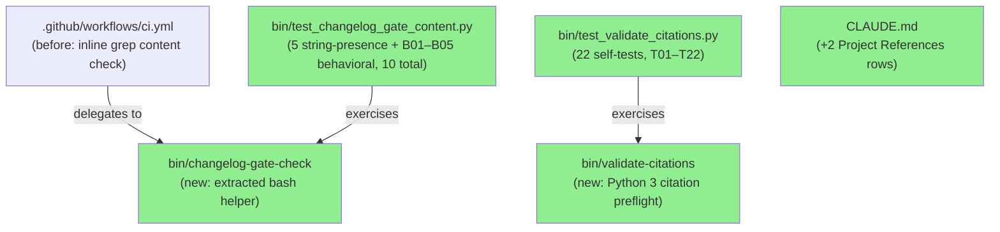
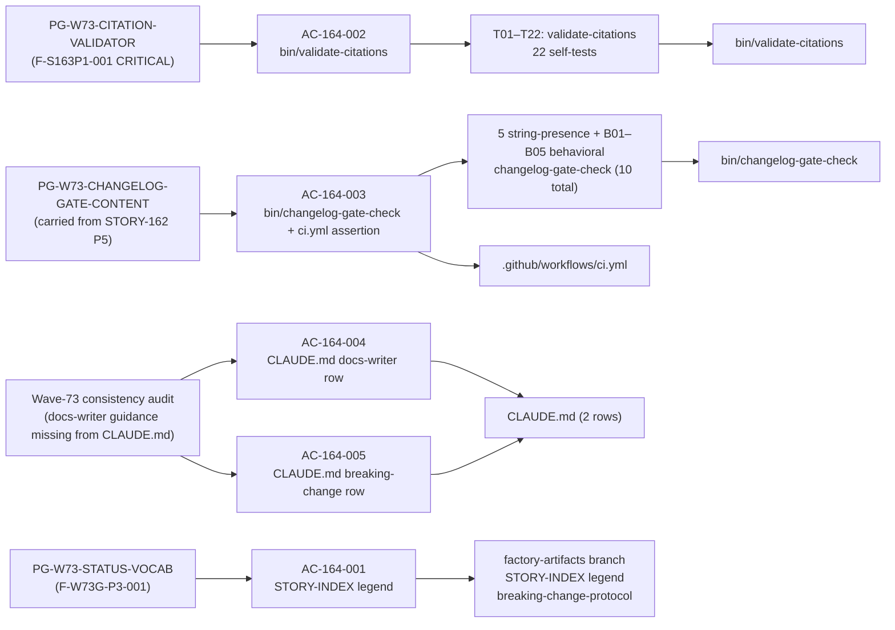
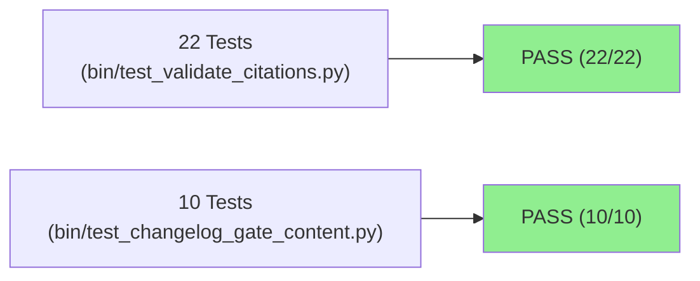
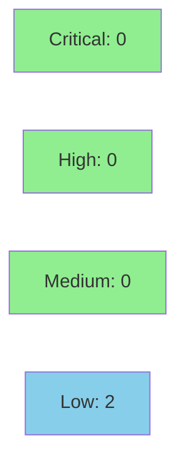

# [STORY-164] Citation preflight validator + changelog-gate content assertion

**Epic:** E-11 — Tooling and Self-Improvement
**Mode:** maintenance (wave-74, E-11 governance-only)
**Convergence:** CONVERGED after 8 adversarial passes (streak P6/P7/P8 = PASS_NITPICK_ONLY x3)


-blue)
-blue)
-blue)

This PR codifies four wave-73 process gaps as durable tooling artifacts. (1) `bin/validate-citations`
(Python 3, stdlib-only, 22 self-tests) mechanically validates `file:line-range` anchor citations
before dispatch — closing the fabricated-citation class surfaced at CRITICAL severity by finding
F-S163P1-001. (2) `bin/changelog-gate-check` is extracted from ci.yml and gains a content assertion
that rejects whitespace-only or header-only CHANGELOG edits, closing the presence-only gap noted in
PG-W73-CHANGELOG-GATE-CONTENT. (3) CLAUDE.md Project References table gains two rows:
`docs-writer-dispatch-guidance.md` (peer of the existing `pr-manager-merge-auth-guidance.md` row)
and `breaking-change-delivery-protocol.md` (new maintenance artifact). Factory-side deliverables
(STORY-INDEX status-vocabulary legend, breaking-change holdout-sweep protocol) are committed on the
`factory-artifacts` branch and are NOT part of this develop PR diff.

---

## Architecture Changes



<details>
<summary><strong>Architecture Decision Record</strong></summary>

### ADR: Extract bin/changelog-gate-check + add bin/validate-citations (AC-164-002/003)

**Context:** The changelog-gate CI job checked only for CHANGELOG.md presence in the diff (a
whitespace-only touch satisfied it). There was no tool to validate `file:line-range` anchor
citations before adversarial review; F-S163P1-001 caught fabricated citations at CRITICAL
severity only after dispatch.

**Decision:** Extract the changelog-gate content check into a standalone bash helper
`bin/changelog-gate-check` (testable independently of CI). Add a new Python 3 tool
`bin/validate-citations` following the `bin/compute-input-hash` structural pattern (stdlib only,
Python 3.10+ type syntax, self-test suite in the companion test file).

**Rationale:** Extraction of `changelog-gate-check` mirrors the existing `bin/` tooling pattern
and enables the 10-test suite (5 string-presence tests + B01–B05 behavioral) to exercise content vs. presence behavior hermetically.
A Python tool for citation validation allows structured output, 8 discrete failure classes, and
three exit codes (0=PASS, 1=citation errors, 2=input/config errors) without external dependencies.

**Alternatives Considered:**
1. Inline the content assertion directly in ci.yml — rejected because it cannot be unit-tested
   without a real PR diff.
2. Shell script for citation validation — rejected because parsing file:line-range with reliable
   error classes is error-prone in bash; Python 3.10+ pathlib gives idiomatic path containment.

**Consequences:**
- `bin/changelog-gate-check` is now independently testable and exercised by CI via this PR's
  own diff (the content assertion verifies itself).
- `bin/validate-citations` closes the fabricated-citation class mechanically with CWE-22
  containment via `.resolve()` + `.is_relative_to()`.
- Two LOW security findings (SEC-001 WIRERUST_REPO_ROOT bypass, SEC-002 TOCTOU) are
  accepted-by-design for a local dev tool; both documented in `security-review.md`.

</details>

---

## Story Dependencies


STORY-164 has `depends_on: []` — no upstream PRs must merge before this one.
No downstream stories are currently blocked on this PR.

---

## Spec Traceability



---

## Test Evidence

### Coverage Summary

| Metric | Value | Threshold | Status |
|--------|-------|-----------|--------|
| Unit tests (validate-citations) | 22/22 pass | 100% | PASS |
| Unit tests (changelog-gate-check) | 10/10 pass | 100% | PASS |
| Coverage | N/A (Python tooling; no Rust source changed) | N/A | N/A |
| Mutation kill rate | N/A (governance story) | N/A | N/A |
| Holdout satisfaction | N/A (E-11 governance-only) | N/A | N/A |

### Test Flow



| Metric | Value |
|--------|-------|
| **New tests** | 32 added (22 validate-citations T01–T22, 10 changelog-gate: 5 string-presence + B01–B05 behavioral), 0 modified |
| **Total suite** | cargo test --all-targets: full suite green |
| **Coverage delta** | N/A — Python tooling, no Rust source |
| **Mutation kill rate** | N/A — governance story |
| **Regressions** | 0 |

<details>
<summary><strong>Detailed Test Results</strong></summary>

### validate-citations (T01–T22)

| Test | Function | Description | Exit |
|------|----------|-------------|------|
| T01 | `test_T01_valid_line_citation_passes` | Valid file:line citation within bounds | 0 |
| T02 | `test_T02_valid_range_citation_passes` | Valid file:line-range citation, both endpoints in bounds | 0 |
| T03 | `test_T03_nonexistent_file_rejected` | Nonexistent file → FILE NOT FOUND | 1 |
| T04 | `test_T04_out_of_range_single_line_rejected` | Single line beyond file length → LINE OUT OF RANGE | 1 |
| T05 | `test_T05_out_of_range_range_endpoint_rejected` | Range end endpoint exceeds file length → LINE OUT OF RANGE | 1 |
| T06 | `test_T06_comments_and_blanks_ignored` | Comment lines (#…) and blank lines silently ignored | 0 |
| T07 | `test_T07_empty_input_passes` | Empty input (all comments) → PASS: 0 citations | 0 |
| T08 | `test_T08_invalid_range_start_gt_end` | Range where start > end → INVALID RANGE (EC-002) | 1 |
| T09 | `test_T09_bad_argument_exits_2` | Nonexistent citations file as argument → usage error | 2 |
| T10 | `test_T10_multiple_valid_citations_count` | Multiple valid citations all pass, count correct | 0 |
| T11 | `test_T11_mixed_valid_and_invalid` | Mixed valid + invalid → FAIL with correct failure count | 1 |
| T12 | `test_T12_malformed_line_reported` | Non-blank, non-comment, unparseable line → MALFORMED | 1 |
| T13 | `test_T13_zero_line_number_rejected` | Line number 0 → INVALID LINE (F-S164P1-004) | 1 |
| T14 | `test_T14_zero_range_start_rejected` | Range start 0 → INVALID LINE (F-S164P1-004) | 1 |
| T15 | `test_T15_malformed_counts_in_fail_denominator` | MALFORMED line counted in denominator → "FAIL: 1 of 1" | 1 |
| T16 | `test_T16_absolute_path_rejected` | Absolute path citation → OUTSIDE REPO, CWE-22 | 1 |
| T17 | `test_T17_parent_escape_rejected` | Parent-escape path (../../…) → OUTSIDE REPO, CWE-22 | 1 |
| T18 | `test_T18_non_utf8_citations_file_exits_2` | Non-UTF-8 citations file → exit 2, no traceback | 2 |
| T19 | `test_T19_unreadable_citations_file_exits_2` | Unreadable citations file (chmod 000) → exit 2, no traceback | 2 |
| T20 | `test_T20_non_utf8_stdin_exits_2` | Non-UTF-8 bytes on stdin → exit 2, no traceback (F-S164P6-001) | 2 |
| T21 | `test_T21_directory_target_not_a_file` | Citation to an existing directory → NOT A FILE, exit 1 | 1 |
| T22 | `test_T22_unreadable_target_file` | Unreadable cited target (chmod 000) → UNREADABLE, exit 1 | 1 |

### changelog-gate-check (5 string-presence tests + B01–B05 behavioral)

**String-presence tests (verify key constructs in `bin/changelog-gate-check`):**

| Function | Construct verified |
|----------|--------------------|
| `test_content_lines_variable_present` | `CONTENT_LINES` bash variable present |
| `test_changelog_diff_variable_present` | `CHANGELOG_DIFF` variable present |
| `test_whitespace_only_message_present` | "whitespace-only" FAIL message text present |
| `test_content_line_pass_message_present` | "content line" PASS message text present |
| `test_grep_filter_chain_present` | `^+##` section-header filter present |

**Behavioral tests (execute gate logic against crafted diff fixtures):**

| Test | Function | Scenario | Exit |
|------|----------|----------|------|
| B01 | `test_B01_real_content_line_pass` | Real content line addition → PASS | 0 |
| B02 | `test_B02_blank_only_touch_fail` | Blank-line-only additions → whitespace-only FAIL | 1 |
| B03 | `test_B03_section_header_only_add_fail` | Section header-only additions → FAIL (headers not counted) | 1 |
| B04 | `test_B04_deletions_only_fail` | Deletions only, no content additions → FAIL | 1 |
| B05 | `test_B05_exec_bit_direct_invocation` | Direct path invocation (no `bash` prefix) → PASS (exec-bit guard) | 0 |

</details>

---

## Demo Evidence

Evidence files committed on the feature branch at `.factory/demo-evidence/story-164/`.
Demo-evidence path-scrub gate (PG-W70-DEMO-SCRUB) passed — zero absolute host paths in
any evidence file (verified 2026-07-11).

| AC | Evidence File | Verdict |
|----|---------------|---------|
| AC-164-001 | `AC-164-001.md` — STORY-INDEX legend at lines 124–145 | PASS (factory-artifacts) |
| AC-164-002 | `AC-164-002.md` — 8 failure classes + exit codes 0/1/2 + T01–T22 green | PASS |
| AC-164-003 | `AC-164-003.md` — 3 diff scenarios (PASS/FAIL/FAIL) + ci.yml delegation at line 509 | PASS |
| AC-164-004 | `AC-164-004.md` — CLAUDE.md row at line 249 | PASS |
| AC-164-005 | `AC-164-005.md` — CLAUDE.md row at line 250; protocol doc verified | PASS |

**Recording method:** CLI transcript markdown files. VHS not applicable — deliverables are
Python/bash tooling and documentation, not interactive terminal UI (house precedent for bin/ stories).

---

## Holdout Evaluation

N/A — E-11 governance-only story; no behavioral contracts authored; no Rust source changed;
holdout evaluation not applicable per E-11 convention.

---

## Adversarial Review

| Pass | Findings | Critical | High | Status |
|------|----------|----------|------|--------|
| P1 | 6 | 0 | 0 | Fixed (F-S164P1-001/002/004/005/006) |
| P2 | 4 | 0 | 0 | Fixed (F-S164P2-001/002/003/004) |
| P3 | 3 | 0 | 0 | Fixed (F-S164P3-001/002/003) |
| P4 | 2n | 0 | 0 | Nits fixed |
| P5 | 2 | 0 | 0 | Fixed (F-S164P5-002 CHANGELOG parity) |
| P6 | 1n | 0 | 0 | PASS_NITPICK_ONLY (streak begins) |
| P7 | 2n | 0 | 0 | PASS_NITPICK_ONLY |
| P8 | 1n | 0 | 0 | PASS_NITPICK_ONLY (streak 3/3) |

**Convergence:** CONVERGED after 8 passes. Streak P6/P7/P8 = PASS_NITPICK_ONLY x3.
Finding trajectory: 6→4→3→2n→2→1n→2n→1n. Zero open HIGH or CRITICAL findings.
DF-CONVERGENCE-BEFORE-MERGE-001 satisfied.

<details>
<summary><strong>Accepted-by-Design Dispositions</strong></summary>

Two items accepted-by-design, recorded in STORY-164 v1.10 Notes:

- **stdin non-UTF-8 → exit 2 (not 1):** Intentional distinction between "bad input format"
  (exit 2) and "citation validation errors" (exit 1). The exit-code contract is documented in
  the tool's ALGORITHM docstring.
- **T20 docstring label "unreadable target":** Matches the test name and failure class verbatim.
  The label is correct and needs no change.

</details>

---

## Security Review



<details>
<summary><strong>Security Scan Details</strong></summary>

### Findings (from security-review.md)

| ID | Severity | CWE | Finding | Disposition |
|----|----------|-----|---------|-------------|
| SEC-001 | LOW | CWE-610 | `WIRERUST_REPO_ROOT=/` bypasses `is_relative_to()` containment | Accepted / design-intentional for test isolation |
| SEC-002 | LOW | CWE-367 | TOCTOU between `is_file()` check and `count_lines()` open | Accepted / very low exploitability for local dev tool |
| SEC-003 | INFO | CWE-22 | `compute-input-hash` path traversal gap (pre-existing, deferred) | Accepted / tracked in GitHub #392 |
| SEC-004 | INFO | CWE-829 | `bin/changelog-gate-check` mutable via PRs (same as all bin/ scripts) | Accepted / consistent pattern |

### Positive Findings

- CWE-22 containment via `.resolve()` + `.is_relative_to()` is correct and handles absolute
  paths, `../` traversal, and symlink chasing.
- Non-UTF-8 input hardened on both stdin and file-argument paths.
- Bash `|| true` pipefail guard correct; all variable expansions double-quoted.
- ci.yml change adds no new `uses:` actions; SHA-pin policy unaffected.

### Dependency Audit

- No Rust source modified — `cargo audit` surface unchanged.
- Python scripts use stdlib only (no third-party deps introduced).

</details>

---

## Risk Assessment & Deployment

### Blast Radius
- **Systems affected:** `bin/validate-citations` and `bin/changelog-gate-check` (Python/bash tooling, not in Rust binary); `ci.yml` changelog-gate step; `CLAUDE.md` reference table
- **User impact:** None if failure occurs — tooling scripts only, not production code
- **Data impact:** None — no data storage, no persistent state changed by this PR
- **Risk Level:** LOW

### Performance Impact

| Metric | Before | After | Delta | Status |
|--------|--------|-------|-------|--------|
| `changelog-gate` CI step | presence-only grep | extracted helper + content check | ~0ms | OK |
| Rust binary | unchanged | unchanged | 0 | OK |
| Test suite (Rust) | green | green | 0 | OK |

<details>
<summary><strong>Rollback Instructions</strong></summary>

**Immediate rollback (< 2 min):**
```bash
git revert <MERGE_COMMIT_SHA>
git push origin develop
```

This PR makes no schema changes, no behavioral changes to production Rust code, and the
ci.yml change is additive (content assertion on top of the existing presence check).
Rollback is trivially safe.

**Verification after rollback:**
- `python3 bin/test_validate_citations.py` — should report 0 tests (tool no longer exists)
- `python3 bin/test_changelog_gate_content.py` — should report 0 tests
- `cargo test --all-targets` — should remain green

</details>

### Feature Flags

| Flag | Controls | Default |
|------|----------|---------|
| (none) | N/A | N/A |

---

## Companion Governance Changes (Not in This PR)

The following deliverables are committed on the `factory-artifacts` branch and are NOT part of
this develop PR diff:

- **AC-164-001:** STORY-INDEX status-vocabulary legend — seven statuses with precise semantics
  (draft, ready, pending, delivered, merged, completed, superseded — AC-164-001 originally
  specified six statuses at delivery (v1.10); the seventh (`superseded`) was added during
  wave-gate convergence (F-W74P3-001, STORY-164 v1.12 / STORY-INDEX v3.48)), synonym note
  (delivered/merged/completed equivalence), loci agreement rule; placed after `## Index Table`
  heading before the table itself.
- **AC-164-005 companion:** `breaking-change-delivery-protocol.md` in `.factory/maintenance/`
  codifying the BREAKING-change holdout-sweep obligation identified in wave-73.

---

## Traceability

| Process Gap | Story AC | Test / Artifact | Status |
|-------------|---------|-----------------|--------|
| PG-W73-CITATION-VALIDATOR (F-S163P1-001 CRITICAL) | AC-164-002 | T01–T22 (22/22) | PASS |
| PG-W73-CHANGELOG-GATE-CONTENT | AC-164-003 | 5 string-presence + B01–B05 behavioral (10/10) + ci.yml | PASS |
| Wave-73 docs-writer guidance discoverability | AC-164-004 | CLAUDE.md line 249 | PASS |
| Breaking-change holdout-sweep obligation | AC-164-005 | CLAUDE.md line 250 | PASS |
| PG-W73-STATUS-VOCAB (F-W73G-P3-001) | AC-164-001 | factory-artifacts STORY-INDEX legend | PASS (companion) |
| AC-158-001 (changelog gate) | — | CHANGELOG.md `[Unreleased]` entry | PASS |

<details>
<summary><strong>Full VSDD Contract Chain</strong></summary>

```
F-S163P1-001 CRITICAL -> AC-164-002 -> T01–T22 -> bin/validate-citations (CWE-22 contained)
PG-W73-CHANGELOG-GATE-CONTENT -> AC-164-003 -> 5 string-presence + B01–B05 behavioral -> bin/changelog-gate-check + ci.yml:509
Wave-73 consistency audit -> AC-164-004 -> CLAUDE.md line 249 (docs-writer row)
Wave-73 consistency audit -> AC-164-005 -> CLAUDE.md line 250 (breaking-change row)
F-W73G-P3-001 -> AC-164-001 -> STORY-INDEX legend -> factory-artifacts branch
AC-158-001 -> CHANGELOG.md [Unreleased] entry -> exercised by ci.yml changelog-gate job
```

</details>

---

## AI Pipeline Metadata

<details>
<summary><strong>Pipeline Details</strong></summary>

```yaml
ai-generated: true
pipeline-mode: maintenance
factory-version: "1.0.0-rc.22"
pipeline-stages:
  spec-crystallization: completed (STORY-164.md v1.10)
  story-decomposition: completed (E-11 governance pattern)
  tdd-implementation: completed
  holdout-evaluation: "N/A — E-11 governance convention"
  adversarial-review: completed (8 passes, CONVERGED)
  formal-verification: "N/A — Python tooling + documentation only"
  convergence: achieved
convergence-metrics:
  adversarial-passes: 8
  streak-classification: "PASS_NITPICK_ONLY x3 (P6/P7/P8)"
  finding-trajectory: "6→4→3→2n→2→1n→2n→1n"
  open-high-critical: 0
  test-pass: "32/32 (22 + 10)"
models-used:
  builder: claude-sonnet-4-6
  adversary: claude-sonnet-4-6
  orchestrator: claude-sonnet-4-6
wave: "74"
story-points: 4
generated-at: "2026-07-11"
```

</details>

---

## Pre-Merge Checklist

- [x] All CI status checks passing (12/12 green)
- [x] No critical/high security findings unresolved (0 across 8 adversarial passes + security review)
- [x] Adversarial convergence satisfied (DF-CONVERGENCE-BEFORE-MERGE-001, streak 3/3)
- [x] Demo evidence present and scrub-gate passed (PG-W70-DEMO-SCRUB)
- [x] CHANGELOG [Unreleased] entry present (AC-158-001 changelog gate)
- [x] No production Rust source modified (E-11 governance-only)
- [x] Rollback procedure validated (trivial revert)
- [x] pr-reviewer APPROVE posted (review comment 4678783752, D-425 self-PR waiver documented)
- [x] security-reviewer PASS (no CRITICAL/HIGH; 2 LOW accepted-by-design)
- [ ] Human merge authorization (DF-MERGE-AUTH-CLASSIFIER-001 / D-425 interim path — orchestrator executes after gate report)
