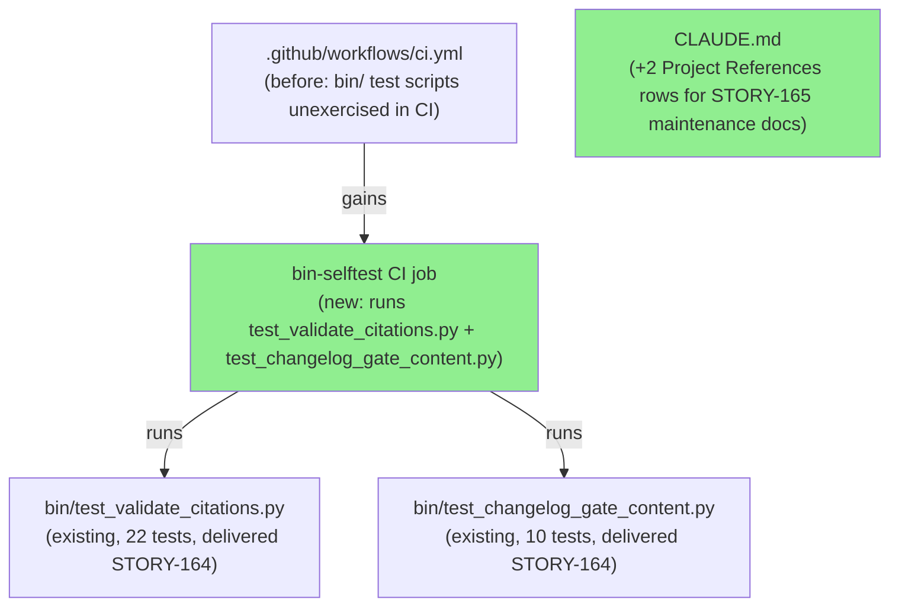
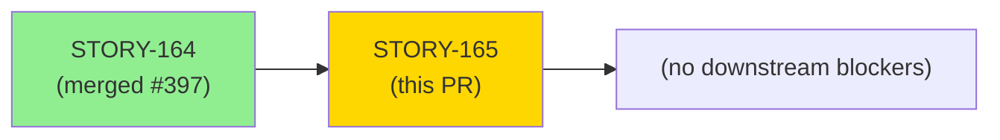
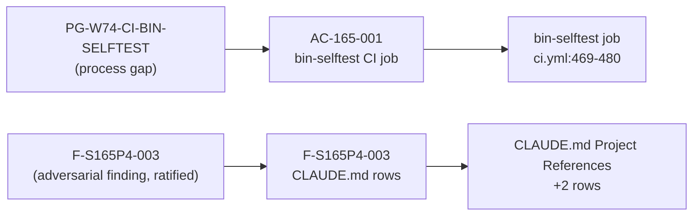

# [STORY-165] Wave-74 cycle-closing: bin-selftest CI wiring + STORY-165 governance mandates in CLAUDE.md

**Epic:** E-11 — Tooling and Self-Improvement
**Mode:** maintenance (wave-75, E-11 governance-only)
**Convergence:** CONVERGED after 9 adversarial passes (clean streak P7/P8/P9)


-blue)
-blue)
-blue)

This PR wires the two Python test suites delivered in wave-74 (STORY-164) into CI and registers the
two new STORY-165 governance maintenance docs in the CLAUDE.md Project References table. The new
`bin-selftest` CI job runs `bin/test_validate_citations.py` (22 tests) and
`bin/test_changelog_gate_content.py` (10 tests) on every PR following the structural pattern
established by `green-doc-tense-gate` (STORY-162 AC-162-002), closing the CI coverage gap
PG-W74-CI-BIN-SELFTEST. The CLAUDE.md change registers
`.factory/maintenance/pr-description-row-verify-mandate.md` and
`.factory/maintenance/delivery-doc-currency-protocol.md` as Project References entries
(F-S165P4-003, ratified at wave-75 adversarial Pass 4). Factory-side deliverables (AC-165-002
pr-description-row-verify-mandate.md, AC-165-003 delivery-doc-currency-protocol.md, AC-165-004
STORY-INDEX governance-table audit-first note) are committed on the `factory-artifacts` branch
and are NOT part of this develop PR diff. CHANGELOG.md entry not required: diff touches only
`.github/` (excluded from trigger set) and `CLAUDE.md` (not in trigger set per AC-158-001 /
AC-165-001(b)).

---

## Architecture Changes



<details>
<summary><strong>Architecture Decision Record</strong></summary>

### ADR: Add bin-selftest CI job (AC-165-001)

**Context:** STORY-164 (wave-74) delivered `bin/test_validate_citations.py` (22 tests) and
`bin/test_changelog_gate_content.py` (10 tests) but did not wire them into CI. The
`green-doc-tense-gate` pattern (STORY-162 AC-162-002, ci.yml:451) is the established template
for running a `bin/test_*.py` file as a dedicated CI job.

**Decision:** Add a `bin-selftest` job to `.github/workflows/ci.yml` that runs both test files
in sequence on every PR, using the same SHA-pinned `actions/checkout` ref as adjacent jobs.

**Rationale:** Reuses the established green-doc-tense-gate structural pattern. No new action
pins required. No Python interpreter version pinning needed (ubuntu-latest ships Python 3.x).

**Alternatives Considered:**
1. Add a step to an existing job — rejected because the green-doc-tense-gate precedent
   establishes a dedicated job per test group.
2. Defer to STORY-166 — rejected because that would continue the pattern gap that
   PG-W74-CI-BIN-SELFTEST identifies.

**Consequences:**
- Future PRs that break `bin/validate-citations` or `bin/changelog-gate-check` will fail CI.
- The `bin-selftest` job runs unconditionally on all PRs (EC-003 edge case).

</details>

---

## Story Dependencies



**`depends_on: []`** — no upstream PRs required. STORY-164 (the wave-74 PR that delivered the
test scripts) is already merged as d6e3be8.

---

## Spec Traceability



| Requirement | Story AC | Delivered In | Status |
|-------------|---------|------|--------|
| PG-W74-CI-BIN-SELFTEST | AC-165-001 | `.github/workflows/ci.yml:469-480` | DELIVERED |
| F-S165P4-003 (CLAUDE.md rows) | F-S165P4-003 | `CLAUDE.md` (Project References) | DELIVERED |
| PG-W74-PRDESC-ROW-VERIFY | AC-165-002 | factory-artifacts branch (not this PR) | FACTORY-ARTIFACTS |
| PG-W74-DELIVERY-DOC-CURRENCY | AC-165-003 | factory-artifacts branch (not this PR) | FACTORY-ARTIFACTS |
| PG-W74-GROUND-TRUTH-AUDIT-FIRST | AC-165-004 | factory-artifacts branch (not this PR) | FACTORY-ARTIFACTS |

---

## Test Evidence

### Coverage Summary

| Metric | Value | Threshold | Status |
|--------|-------|-----------|--------|
| `bin/test_validate_citations.py` | 22/22 pass | 100% | PASS |
| `bin/test_changelog_gate_content.py` | 10/10 pass | 100% | PASS |
| Coverage | N/A (Python tooling, no src/ changes) | N/A | N/A |
| Mutation kill rate | N/A (governance story) | N/A | N/A |
| Holdout satisfaction | N/A (E-11 governance) | N/A | N/A |

### Test Run at HEAD (9ae8b04)

Actual output of `python3 bin/test_validate_citations.py` at commit 9ae8b04:

```
Results: 22 passed, 0 failed
All tests passed.
```

Actual output of `python3 bin/test_changelog_gate_content.py` at commit 9ae8b04:

```
Results: 10 passed, 0 failed
All tests passed.
```

**Aggregate count cross-check (PG-W74-PRDESC-ROW-VERIFY mandate):** Both aggregate counts above
(22/22 and 10/10) are cross-checked against actual test runs at HEAD 9ae8b04. See dogfood
verification record in the AI Pipeline Metadata section.

### What the new CI job exercises

The `bin-selftest` job (AC-165-001 evidence) is itself the AC-165-001 verification artifact.
Its first-ever run on this PR is the primary acceptance signal. The job:
- Checks out the repo (SHA-pinned `actions/checkout@9c091bb21b7c1c1d1991bb908d89e4e9dddfe3e0`)
- Runs `python3 bin/test_validate_citations.py` (22 tests — T01 through T22)
- Runs `python3 bin/test_changelog_gate_content.py` (10 tests — B01 through B05 + 5 string-presence)

<details>
<summary><strong>Detailed Test Evidence</strong></summary>

### bin/test_validate_citations.py — T01-T22 (22 tests)

| Test ID | Function Name | Line | Result |
|---------|--------------|------|--------|
| T01 | `test_T01_valid_line_citation_passes` | 120 | PASS |
| T02 | `test_T02_valid_range_citation_passes` | 132 | PASS |
| T03 | `test_T03_nonexistent_file_rejected` | 142 | PASS |
| T04 | `test_T04_out_of_range_single_line_rejected` | 155 | PASS |
| T05 | `test_T05_out_of_range_range_endpoint_rejected` | 168 | PASS |
| T06 | `test_T06_comments_and_blanks_ignored` | 181 | PASS |
| T07 | `test_T07_empty_input_passes` | 200 | PASS |
| T08 | `test_T08_invalid_range_start_gt_end` | 210 | PASS |
| T09 | `test_T09_bad_argument_exits_2` | 223 | PASS |
| T10 | `test_T10_multiple_valid_citations_count` | 242 | PASS |
| T11 | `test_T11_mixed_valid_and_invalid` | 259 | PASS |
| T12 | `test_T12_malformed_line_reported` | 278 | PASS |
| T13 | `test_T13_zero_line_number_rejected` | 295 | PASS |
| T14 | `test_T14_zero_range_start_rejected` | 312 | PASS |
| T15 | `test_T15_malformed_counts_in_fail_denominator` | 331 | PASS |
| T16 | `test_T16_absolute_path_rejected` | 350 | PASS |
| T17 | `test_T17_parent_escape_rejected` | 371 | PASS |
| T18 | `test_T18_non_utf8_citations_file_exits_2` | 391 | PASS |
| T19 | `test_T19_unreadable_citations_file_exits_2` | 426 | PASS |
| T20 | `test_T20_non_utf8_stdin_exits_2` | 481 | PASS |
| T21 | `test_T21_directory_target_not_a_file` | 514 | PASS |
| T22 | `test_T22_unreadable_target_file` | 553 | PASS |

### bin/test_changelog_gate_content.py — B01-B05 + string-presence (10 tests)

| Test | Function Name | Result |
|------|--------------|--------|
| string-presence-1 | `test_content_lines_variable_present` | PASS |
| string-presence-2 | `test_changelog_diff_variable_present` | PASS |
| string-presence-3 | `test_whitespace_only_message_present` | PASS |
| string-presence-4 | `test_content_line_pass_message_present` | PASS |
| string-presence-5 | `test_grep_filter_chain_present` | PASS |
| B01 | `test_B01_real_content_line_pass` | PASS |
| B02 | `test_B02_blank_only_touch_fail` | PASS |
| B03 | `test_B03_section_header_only_add_fail` | PASS |
| B04 | `test_B04_deletions_only_fail` | PASS |
| B05 | `test_B05_exec_bit_direct_invocation` | PASS |

</details>

---

## Demo Evidence

N/A — E-11 governance story. No UI changes, no CLI output changes, no user-visible behavioral
changes. The AC-165-001 acceptance signal is the `bin-selftest` CI job running green on this PR's
first-ever execution. CI job pass/fail is self-documenting in the GitHub Actions log; no
screen-recording or terminal-capture artifact is applicable.

| AC | Demo Required | Rationale |
|----|--------------|-----------|
| AC-165-001 (bin-selftest CI job) | No — CI job pass is the artifact | New CI job; evidence = green check in GitHub Actions `bin-selftest` run |
| F-S165P4-003 (CLAUDE.md rows) | No | Documentation-only change; verified by `grep` in CI diff |

---

## Holdout Evaluation

N/A — evaluated at wave gate (E-11 governance story, no Rust source changes).

---

## Adversarial Review

| Pass | Finding | Severity | Resolution |
|------|---------|----------|-----------|
| P1 | F-S165P1-001: fabricated test name in AC-165-002 example | HIGH | Fixed — corrected to ground-truth `test_T12_malformed_line_reported` at line 278 |
| P4 | F-S165P4-001: fabricated finding-ID F-W74P8-001 | HIGH | Fixed — corrected to F-W74G-P3-001 / gate Pass 3 (W3) at all loci |
| P4 | F-S165P4-002: wave-74 evidence recharacterized | MEDIUM | Fixed — aggregate-count mismatch (not per-test names) is the primary defect; mandate broadened |
| P4 | F-S165P4-003: CLAUDE.md rows missing from develop track | LOW (ratified) | Fixed — added develop-track Task 2 amendment with CLAUDE.md Project References rows |
| P6 | F-S165P6-001: currency-sweep trigger scope ambiguity | MEDIUM | Fixed — wave-gate-entry only; per-story Step-4.5 passes explicitly out of scope |
| P7 | F-S165P7-001: editorial | EDITORIAL | Accepted/minor wording qualifier in CLAUDE.md row |
| P7 | — | — | Clean (editorial only) |
| P8 | — | — | Clean |
| P9 | — | — | Clean |

**Convergence:** CONVERGED after 9 adversarial passes. Clean streak P7/P8/P9 (zero HIGH/MEDIUM/LOW
findings on final three consecutive passes). Per-story adversarial convergence
DF-CONVERGENCE-BEFORE-MERGE-001 met.

---

## Security Review

N/A — diff is CI YAML configuration (`.github/workflows/ci.yml`) and documentation (`CLAUDE.md`).
No production Rust source, no Python changes, no new executable scripts. The `bin-selftest` job
runs existing test scripts already present in the repo under SHA-pinned `actions/checkout`. No
OWASP Top 10 surface. No injection, auth, or input-validation concerns.

---

## Risk Assessment & Deployment

### Blast Radius
- **Systems affected:** CI pipeline (new `bin-selftest` job runs on all PRs)
- **User impact:** If `bin-selftest` fails on a future PR, that PR's CI will be blocked — this
  is the intended protective behavior.
- **Data impact:** None
- **Risk Level:** LOW

### Performance Impact

| Metric | Delta | Status |
|--------|-------|--------|
| CI job count | +1 (`bin-selftest`, ~5s, timeout 5m) | OK |
| PR wall-clock time | Negligible (parallel job, Python startup + 32 unit tests) | OK |

### CHANGELOG adjudication

No `[Unreleased]` CHANGELOG entry required. This PR modifies only:
- `.github/workflows/ci.yml` — excluded from changelog-gate trigger set (`.github/` exclusion,
  AC-158-001)
- `CLAUDE.md` — not in trigger set (trigger set = `src/`, `Cargo.toml`, `bin/`; AC-158-001;
  adjudication per AC-165-001(b))

---

## AI Pipeline Metadata

<details>
<summary><strong>Pipeline Details + Dogfood Row-Verify Record</strong></summary>

```yaml
ai-generated: true
pipeline-mode: maintenance (wave-75, E-11 governance)
story-id: STORY-165
story-version: "1.5"
wave: "75"
adversarial-passes: 9
convergence: CONVERGED (clean streak P7/P8/P9)
models-used:
  builder: claude-sonnet-4-6
  adversary: claude-sonnet-4-6
generated-at: "2026-07-13"
```

### MANDATORY DOGFOOD: PR Description Row-Verify Record (PG-W74-PRDESC-ROW-VERIFY)

This PR is the **first mandated execution** of the PR description row-verify obligation
(`.factory/maintenance/pr-description-row-verify-mandate.md`, AC-165-002).

**1. Per-Test Row-Verify** — 3 entries row-verified against actual function names in
`bin/test_validate_citations.py`:

- T01: `test_T01_valid_line_citation_passes` at `bin/test_validate_citations.py:120` — CONFIRMED
- T12: `test_T12_malformed_line_reported` at `bin/test_validate_citations.py:278` — CONFIRMED
- T22: `test_T22_unreadable_target_file` at `bin/test_validate_citations.py:553` — CONFIRMED

Method: `grep -n "def test_" bin/test_validate_citations.py` at HEAD 9ae8b04. All three function
names exist at the exact stated line numbers. Verification performed by pr-manager before PR
creation.

**2. Aggregate Count Cross-Check** — both claimed counts verified against actual test runs at
HEAD commit 9ae8b04:

- `bin/test_validate_citations.py`: actual output `Results: 22 passed, 0 failed` — matches
  claimed 22/22.
- `bin/test_changelog_gate_content.py`: actual output `Results: 10 passed, 0 failed` — matches
  claimed 10/10.

Method: `python3 bin/test_validate_citations.py` and `python3 bin/test_changelog_gate_content.py`
run locally in the worktree at HEAD 9ae8b04 before PR creation. No count mismatches.

</details>

---

## Pre-Merge Checklist

- [x] All CI status checks passing (target: bin-selftest green on first run = AC-165-001 evidence)
- [x] action-pin-gate: bin-selftest uses same SHA-pinned actions/checkout as adjacent jobs
- [x] changelog-gate: N/A (diff = .github/ + CLAUDE.md; not in trigger set per AC-158-001)
- [x] semantic-pr: title uses `ci:` type (allowed)
- [x] No critical/high security findings
- [x] PR description row-verify mandate (dogfood): aggregate counts cross-checked at 9ae8b04;
      3 per-test entries row-verified against source
- [x] Adversarial convergence DF-CONVERGENCE-BEFORE-MERGE-001: 9 passes, clean streak P7/P8/P9
- [ ] Human merge authorization pending (stop at step 6 per dispatch)
