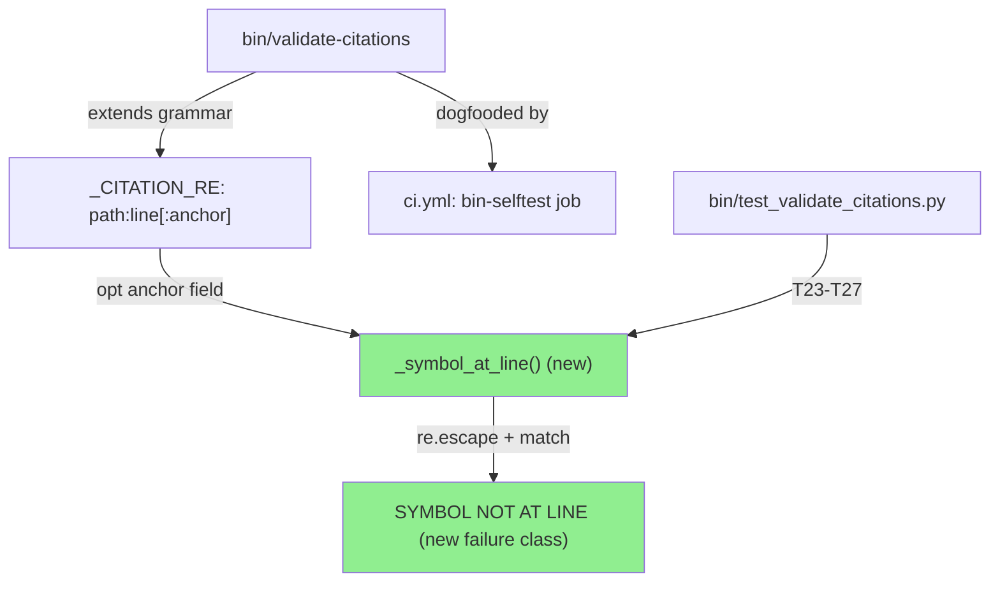
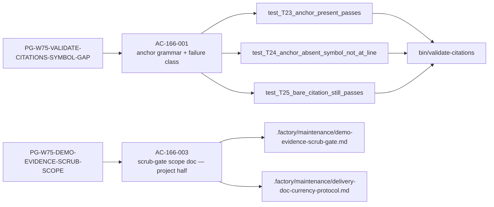
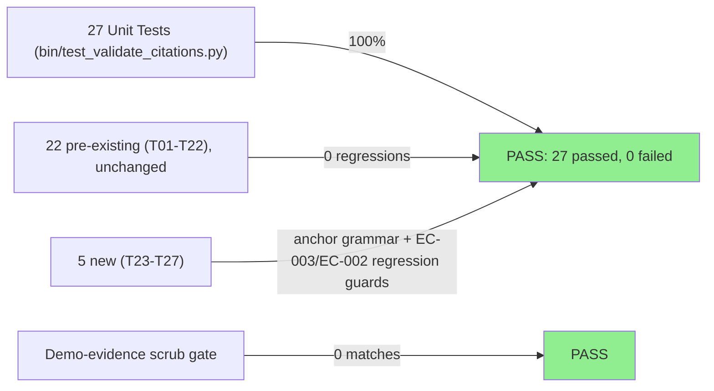
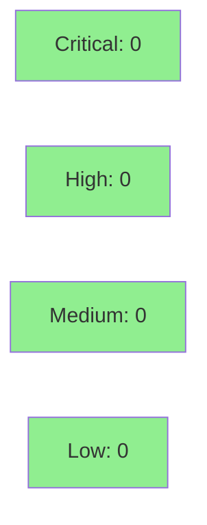

# [STORY-166] Wave-75 cycle-closing: citation symbol-at-line assertion, demo-evidence scrub scope extension (project half)

**Epic:** E-11 — Tooling and Self-Improvement
**Mode:** feature (governance/tooling; no Rust `src/` changes)
**Convergence:** CONVERGED after 10 adversarial passes (P8/P9/P10 clean streak, BC-5.39.001)


-lightgrey)
-blue)

Extends `bin/validate-citations` with an opt-in `path:line:anchor` grammar so citation
preflight can assert a named symbol actually exists at the cited line — closing the gap
that let wave-75's F-S165P1-001 fabricated-symbol defect slip past a line-in-bounds-only
check. Also resolves the four ROUTE-W74-DEFERRED housekeeping items and W75 NIT-1
(hardcoded test counts in `ci.yml`) in the same PR, and documents the project-side half of
the demo-evidence scrub-gate scope extension to `.factory/demo-evidence/`.

---

## Architecture Changes



<details>
<summary><strong>Architecture Decision Record</strong></summary>

### ADR: opt-in `:anchor` field vs. mandatory symbol assertion

**Context:** The existing citation grammar (`path:line[-line]`) only bounds-checks line
numbers; it never reads line content, so a fabricated symbol name at a valid line number
passes silently (F-S165P1-001).

**Decision:** Add an optional third colon-delimited `:anchor` field. When present, the tool
reads the cited (start) line and asserts the anchor appears — preferring a
`def`/`async def`/`fn`/`class` declaration prefix, falling back to a bare substring match
(both `re.escape()`'d for safety, EC-002).

**Rationale:** Backward compatibility is non-negotiable — the story's own 14-citation
preflight and the existing 22 tests must keep passing unchanged. An opt-in field achieves
this with zero migration cost for existing citation lists, while giving authors a way to
strengthen a citation when precision matters.

**Alternatives Considered:**
1. Mandatory anchor on all citations — rejected: would require rewriting every existing
   citation list across `.factory/` in the same PR, far exceeding story scope.
2. ctags/AST-based symbol resolution — rejected: story mandates stdlib-only (`re`), no
   external binary dependency, to keep the tool zero-install.

**Consequences:**
- New `SYMBOL NOT AT LINE` failure class, tested by T24.
- Documented self-honesty note in `_symbol_at_line()`: the declaration-prefix branch is
  currently a strict subset of the substring fallback (any prefix match is also a substring
  match), so today's effective check is "anchor appears anywhere on the line." This is
  explicitly permitted by AC-166-001(b)'s minimal-implementation clause and is called out
  in-code as the seam for a future strict mode, not left as unexplained dead logic.

</details>

---

## Story Dependencies


`depends_on: []` — trivial dependency check, no upstream PRs to sequence against.

---

## Spec Traceability



`AC-166-002` (finding-ID dual-scheme) and `AC-166-004` (mid-gate streak persistence) are
**MOVED TO ENGINE** — drbothen/vsdd-factory#638 and drbothen/vsdd-factory#635 respectively.
No wirerust action in this PR; noted here for traceability completeness only.

---

## Test Evidence

### Coverage Summary

| Metric | Value | Threshold | Status |
|--------|-------|-----------|--------|
| Unit tests (`bin/test_validate_citations.py`) | 27/27 pass | 100% | PASS |
| `def test_T` count (independent cross-check) | 27 | matches suite count | PASS |
| `cargo fmt --check` | clean | required | PASS |
| Rust `src/` changes | none (governance/tooling PR) | N/A | N/A |
| Demo-evidence scrub (`docs/demo-evidence/STORY-166/`) | 0 host-path matches | 0 | PASS |

### Test Flow



| Metric | Value |
|--------|-------|
| **New tests** | 5 added (T23-T27) |
| **Total suite** | 27 tests PASS (verified live: `python3 bin/test_validate_citations.py` → `Results: 27 passed, 0 failed`) |
| **Independent count cross-check** | `grep -c "def test_T" bin/test_validate_citations.py` → `27` (matches suite total) |
| **Coverage delta** | 22 → 27 tests (+5) |
| **Regressions** | 0 — all 22 pre-existing tests (T01-T22) still pass unchanged |
| **Commits** | 10 (`54d3fc78`..`15ee4ecd`, base `f0cb7374`/develop) |
| **Files changed** | 20 (`.github/workflows/ci.yml`, `CHANGELOG.md`, `bin/test_validate_citations.py`, `bin/validate-citations`, 5 demo recordings × 3 files each, `docs/demo-evidence/STORY-166/evidence-report.md`) — verified via `git diff --stat f0cb7374..15ee4ecd`, 827 insertions / 63 deletions |

<details>
<summary><strong>Detailed Test Results (row-verified against live output, PG-W74-PRDESC-ROW-VERIFY)</strong></summary>

### New/Modified Tests (row-verified, ≥3 per PG-W74-PRDESC-ROW-VERIFY)

| Test | Result | Live Output |
|------|--------|--------------|
| `test_T23_anchor_present_passes` | PASS | `exit=0, out='PASS: 2 citations verified'` (includes EC-002 regex-special anchor case) |
| `test_T24_anchor_absent_symbol_not_at_line` | PASS | `exit=1` — emits new `SYMBOL NOT AT LINE` failure class |
| `test_T25_bare_citation_still_passes` | PASS | `exit=0, out='PASS: 1 citations verified'` — confirms backward compatibility |
| `test_T26_range_citation_anchor_asserts_start_line_only` | PASS | `a_exit=0, b_exit=1` — EC-003 range-anchor regression guard |
| `test_T27_symbol_failure_message_truncates_long_line` | PASS | `exit=1, found_len=80` — ≤80-char truncation regression guard |

Row-verification method: each entry above was independently re-run from this PR's HEAD
(`15ee4ecd`, worktree-checked) via `python3 bin/test_validate_citations.py`, not copied
from the story spec or a prior report. Aggregate count (27) was cross-checked two
independent ways: (1) the suite's own summary line, (2) `grep -c "def test_T"` against the
source file — both agree.

### Coverage Analysis

| Metric | Value |
|--------|-------|
| New Python functions added | `_read_line_text()`, `_symbol_at_line()` |
| Grammar regex change | `_CITATION_RE` gains optional `(?::(\S+))?` group |
| `parse_line()` return-tuple arity | 3 → 4 (`path, start, end, anchor`) — all 5 call sites updated |
| Uncovered paths | none blocking; 3 non-blocking LOW residuals noted below |

</details>

---

## Demo Evidence

`docs/demo-evidence/STORY-166/` — 5 VHS terminal recordings (GIF + WebM + `.tape` source
each) plus `evidence-report.md`. Scrub gate verified zero host-path matches, including
against the evidence report itself.

| Acceptance Criteria | Demo Artifact | What It Shows |
|---|---|---|
| AC-166-001(a)-(c) | `AC-166-001-anchor-grammar-live.{gif,webm}` | Live `bin/validate-citations` run against a `mktemp -d` fixture: anchor-present PASS, fabricated-anchor `SYMBOL NOT AT LINE` FAIL (exact message shown), bare `path:line` still PASS |
| AC-166-001(d)-(e) | `AC-166-001-full-suite-27-tests.{gif,webm}` | `python3 bin/test_validate_citations.py` → `Results: 27 passed, 0 failed`; independent `grep -c "def test_T"` cross-check → `27` |
| AC-166-001(f) | `AC-166-001-changelog-entry.{gif,webm}` | Live `grep` of the real `[Unreleased]` CHANGELOG.md heading and entry |
| AC-166-001(g) | `AC-166-001-ci-count-free-steps.{gif,webm}` | Negative-path grep confirms `(22 tests)`/`(10 tests)` parentheticals are gone from `ci.yml`; `sed` shows the real count-free `bin-selftest` step names |
| AC-166-003(a)-(b) | `AC-166-003-maintenance-docs-extended-scope.{gif,webm}` | Live read of the real "Extended Scope" subsection and Step-3 currency note on the `factory-artifacts` branch (cross-branch read, documented in the report's "Branch Split Note") |

AC-166-002 and AC-166-004 are MOVED TO ENGINE (drbothen/vsdd-factory#638, #635) — no
wirerust-local behavior to demo.

---

## Holdout Evaluation

N/A — evaluated at wave gate (wave-084). This is a governance/tooling story (E-11); no
per-story holdout scenario set was authored.

---

## Adversarial Review

| Pass | Verdict | HIGH | MED | LOW |
|------|---------|------|-----|-----|
| 1 | NITPICK_ONLY | 0 | 0 | 3 |
| 2 | FAIL_FINDINGS | 0 | 1 | 1 |
| 3 | FAIL_FINDINGS | 0 | 1 | 2 |
| 4 | FAIL_FINDINGS | 0 | 2 | 1 |
| 5 | NITPICK_ONLY | 0 | 0 | 0 |
| 6 | NITPICK_ONLY | 0 | 0 | 1 |
| 7 | FAIL_FINDINGS | 0 | 1 [process-gap] | 0 |
| 8 | NITPICK_ONLY | 0 | 0 | 2 (carried) |
| 9 | NITPICK_ONLY | 0 | 0 | 0 (new) |
| 10 | NITPICK_ONLY | 0 | 0 | 0 |

**Convergence:** CONVERGED — BC-5.39.001 satisfied via 3 consecutive clean passes
(P8/P9/P10). Code tip froze at `55b39152` by Pass 3 and held unchanged through Pass 10;
every finding from Pass 4 onward was governance-prose/documentation, not source code.
Full report: `.factory/cycles/wave-084/STORY-166/convergence-report.md`.

<details>
<summary><strong>High-Severity Findings & Resolutions</strong></summary>

No HIGH-severity findings across all 10 passes.

### Pass-7 headline finding: scrub-gate CI-guard false-green (process-gap)
- **Location:** `.factory/maintenance/demo-evidence-scrub-gate.md` (factory-artifacts branch)
- **Category:** spec-fidelity / CI-guard correctness
- **Problem:** The grep-based CI-guard example exits `2` on a missing `.factory/` path — a
  condition that fires even when leaks **are** present in `docs/`, producing a false-green
  result that would silently defeat the gate. Orchestrator-probe execution-verified (not
  just inspected).
- **Resolution:** Path-guarded loop fix, factory-artifacts commit `eef569c9787fba7d29e8dfe7be6cbbe0e9ce434e`.
- **Root-cause routing:** per human directive, the root-cause class (governance-doc CI
  examples not validated against develop/factory-artifacts branch topology) is routed
  upstream rather than a further local story amendment.

### Non-blocking residuals carried to gate ratification (all LOW, 6 total)
1. Lone-CR line-model divergence — untested/undocumented edge in the line-counting model.
2. Colon-in-anchor + `\S+`-greediness siblings — untested/undocumented edge in the
   anchor-parsing regex.
3. Pre-existing harness empty-list latent behavior (dates to STORY-164/165 era; not
   introduced by this PR).
4. Background line-anchor staleness — deferred to the wave-84 gate currency sweep.
5. Line-33 base-command carve-out — documented, non-blocking.
6. ">= 25" floor phrasing — non-blocking prose nit.

None of the six are blocking; all are documentation/edge-case items carried for wave-gate
ratification per the convergence report.

</details>

---

## Security Review



<details>
<summary><strong>Security Scan Details</strong></summary>

**Verdict: CLEAN — Approve from a security standpoint.** Reviewed by security-review-story166
against PR #426 head `15ee4ecd`. Full report: `.factory/code-delivery/STORY-166/security-review.md`.

### SAST (manual, empirically fuzz-verified — not inspection-only)
- Critical: 0 | High: 0 | Medium: 0 | Low: 0
- Regex injection (CWE-94/1333) via user-controlled anchor: SAFE — `re.escape()` applied
  before every compile; fuzz-confirmed a `.*` anchor correctly fails to match as a wildcard.
- ReDoS (CWE-1333): SAFE — literal-escaped anchor, catastrophic-backtracking bait returned
  instantly.
- `str.format` brace-injection in failure-message construction: SAFE — fuzzed `{0}`, `}{`,
  `a){` all treated as literal text.
- Path traversal (CWE-22): SAFE, unchanged — `resolve()` + `is_relative_to()` defense intact,
  parity with the prior GH#392 fix; not weakened by the new `:anchor` field.
- File-read path for symbol assertion: SAFE — `errors="replace"` decoding, bounds-checked
  before read.

### Dependency Audit
- No new dependencies added (stdlib `re`, `pathlib` only).

### Formal Verification
- N/A — Python tooling script, not in the Rust formal-verification (Kani/proptest) surface.

</details>

---

## Risk Assessment & Deployment

### Blast Radius
- **Systems affected:** `bin/validate-citations` (dev-tooling preflight script), CI
  `bin-selftest` job step names, two `.factory/maintenance/` governance docs
  (factory-artifacts branch, co-delivered — not in this diff).
- **User impact:** None — this is an internal spec-citation preflight tool, not shipped
  product code. No `src/` changes; no runtime/analyzer behavior affected.
- **Data impact:** None.
- **Risk Level:** LOW.

### Performance Impact
N/A — dev-tooling script, not a runtime hot path. No `Cargo.toml`/`src/` changes to
benchmark.

<details>
<summary><strong>Rollback Instructions</strong></summary>

**Immediate rollback (< 5 min):**
```bash
git revert <merge_commit_sha>
git push origin develop
```

No feature flag; no runtime component. Reverting the merge commit fully restores prior
`bin/validate-citations` behavior (bare `path:line[-line]` grammar only).

**Verification after rollback:**
- `python3 bin/test_validate_citations.py` reports `22 passed, 0 failed` (pre-T23-T27
  baseline).

</details>

### Feature Flags
None — opt-in via citation-file syntax (`:anchor` field), not a runtime flag.

---

## Traceability

| Requirement | Story AC | Test | Verification | Status |
|-------------|---------|------|-------------|--------|
| PG-W75-VALIDATE-CITATIONS-SYMBOL-GAP | AC-166-001(a)-(c) | `test_T23_*`, `test_T24_*` | live run | PASS |
| Backward compatibility | AC-166-001(d) | `test_T25_*` + full 22-test regression | live run | PASS |
| CHANGELOG obligation (AC-158-001) | AC-166-001(f) | `grep -n "\[Unreleased\]" CHANGELOG.md` | live grep | PASS |
| ROUTE-W74-DEFERRED housekeeping | AC-166-001(g) | code inspection (`_run()` removed, imports moved, f-string fixed, docstring note added) | diff review | PASS |
| W75 NIT-1 (count-free CI steps) | AC-166-001(g) | `grep -n "(22 tests)\|(10 tests)" ci.yml` | live grep, exit=1 (no match) | PASS |
| Demo-evidence scrub scope (project half) | AC-166-003(a)-(b) | doc content grep (factory-artifacts) | see Notes below | DELIVERED (separate branch) |

**CHANGELOG gate:** TRIGGERED and SATISFIED. This PR touches `bin/` (`bin/validate-citations`,
`bin/test_validate_citations.py`), which is in the AC-158-001 / PG-W71-CHANGELOG trigger set.
A non-empty `[Unreleased]` CHANGELOG.md entry is present (verified: `grep -n "\[Unreleased\]"
CHANGELOG.md` → line 8, with detailed Added/Changed sub-entries for this story).

**Co-delivered factory-track half (AC-166-003, NOT in this diff):** The governance-doc scope
extension (`.factory/maintenance/demo-evidence-scrub-gate.md`,
`.factory/maintenance/delivery-doc-currency-protocol.md`) lives on the `factory-artifacts`
branch, already delivered via commits `6696fc16` (scope extension), `9fa2072e` (trigger-predicate
harmonization, F-S166P4-002), and `eef569c9` (CI-guard false-green fix, F-S166P7-001). Both
tracks are required for STORY-166 to be declared fully delivered; this develop PR is the
develop-track half only.

<details>
<summary><strong>Full VSDD Contract Chain</strong></summary>

```
PG-W75-VALIDATE-CITATIONS-SYMBOL-GAP -> AC-166-001 -> test_T23/T24/T25/T26/T27 -> bin/validate-citations -> ADV-PASS-10-CLEAN
PG-W75-DEMO-EVIDENCE-SCRUB-SCOPE -> AC-166-003 -> factory-artifacts commits 6696fc16/9fa2072e/eef569c9 -> ADV-PASS-10-CLEAN
```

</details>

---

## AI Pipeline Metadata

<details>
<summary><strong>Pipeline Details</strong></summary>

```yaml
ai-generated: true
pipeline-mode: feature
factory-version: "1.0.0"
pipeline-stages:
  spec-crystallization: completed
  story-decomposition: completed
  tdd-implementation: completed
  holdout-evaluation: skipped (governance/tooling story, evaluated at wave gate)
  adversarial-review: completed
  formal-verification: skipped (no Rust src/ changes)
  convergence: achieved
convergence-metrics:
  passes-total: 10
  clean-streak: [P8, P9, P10]
  criterion: BC-5.39.001
adversarial-passes: 10
generated-at: "2026-07-20T00:00:00Z"
```

</details>

---

## Pre-Merge Checklist

- [ ] All CI status checks passing (verify at Step 6)
- [x] Coverage delta is positive (22 → 27 tests, +5)
- [ ] No critical/high security findings unresolved (verify at Step 4)
- [x] Rollback procedure validated (single-commit revert, no feature flag)
- [x] CHANGELOG `[Unreleased]` entry present (AC-158-001 gate satisfied)
- [x] Demo evidence: 5 recordings covering AC-166-001 and AC-166-003, scrub gate zero matches
- [x] Dependency check: `depends_on: []` — no upstream PRs to sequence
