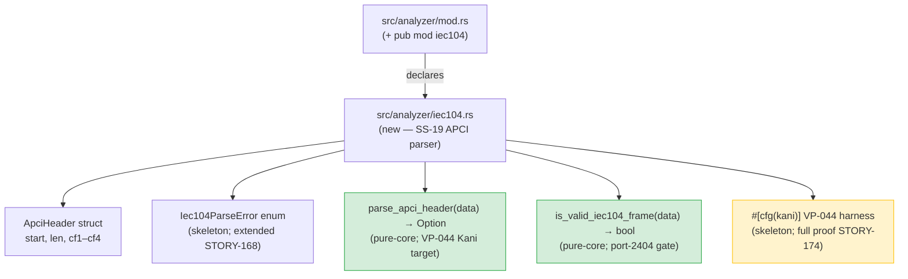
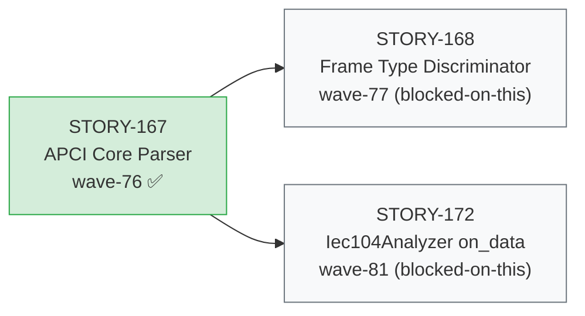
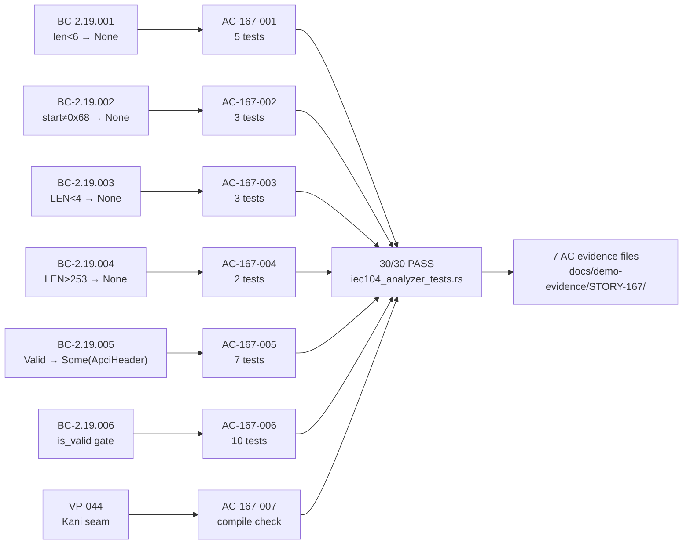

# feat: STORY-167 IEC-104 APCI core parser (wave-76)

## Summary

Adds `src/analyzer/iec104.rs` — the first story in Epic E-22 (IEC-104 support, waves 76–83).
Implements a bounds-safe, pure-core APCI header parser (`parse_apci_header`) and
post-classification validity gate (`is_valid_iec104_frame`) with formal verification seam
(VP-044 Kani skeleton). Zero external dependencies per ADR-013 Decision 7 (licensing constraint).

**Story:** STORY-167 · **Epic:** E-22 · **Wave:** 76 · **Points:** 5 · **Subsystem:** SS-19

---

## Architecture Changes

**New file:** `src/analyzer/iec104.rs` — SS-19 APCI parser module (ADR-013 Decisions 1/3/8).
Pure-core free functions only. No `Iec104Analyzer::on_data` effectful shell (STORY-172). No
dispatch wiring to `classify()` rule table (STORY-173). Module declared in `src/analyzer/mod.rs`
(committed e9c9253 in this PR).

**Architecture compliance (ADR-013):**
- Decision 1: `is_valid_iec104_frame` used as lightweight port-2404 content-signature gate
- Decision 3: Frame-walk loop is in `on_data` (effectful shell, STORY-172) — not in `parse_apci_header`
- Decision 7: No `iec60870-5`, Wireshark, or lib60870 dependencies (licensing)
- Decision 8: `parse_apci_header` is VP-044 Kani target; `on_data` loop is VP-047 fuzz target

---

## Story Dependencies

`depends_on: []` — First story in E-22, no upstream PR dependencies. This PR is the
foundation for all downstream IEC-104 stories (STORY-168 through STORY-174).

---

## Spec Traceability (BC → AC → Test → Demo)

---

## Test Evidence

**Test suite:** `tests/iec104_analyzer_tests.rs` — **30/30 PASS** (0 failures, 0 ignored)

Command: `cargo test --test iec104_analyzer_tests`

| AC | BC | Test Count | Representative Test Name |
|----|-----|-----------|--------------------------|
| AC-167-001 | BC-2.19.001 | 5 | `test_BC_2_19_001_returns_none_for_empty_slice` |
| AC-167-002 | BC-2.19.002 | 3 | `test_BC_2_19_002_returns_none_for_start_byte_0x69_off_by_one` |
| AC-167-003 | BC-2.19.003 | 3 | `test_BC_2_19_003_returns_none_for_len_3_off_by_one_canonical_vector` |
| AC-167-004 | BC-2.19.004 | 2 | `test_BC_2_19_004_returns_none_for_len_254_canonical_vector` |
| AC-167-005 | BC-2.19.005 | 7 | `test_BC_2_19_005_u_frame_startdt_act_all_fields_correct_canonical_vector` |
| AC-167-006 | BC-2.19.006 | 10 | `test_BC_2_19_006_invariant_consistency_with_parse_apci_header` |
| AC-167-007 | VP-044 | compile | `verify_parse_apci_header_safety` (Kani skeleton) |

**Row-verify (PG-W74-PRDESC-ROW-VERIFY):** ≥3 test-entry rows cross-checked against
`docs/demo-evidence/STORY-167/evidence-report.md`:
- `test_BC_2_19_001_returns_none_for_empty_slice` — confirmed PASS (evidence-report.md line 24)
- `test_BC_2_19_005_u_frame_startdt_act_all_fields_correct_canonical_vector` — confirmed PASS (evidence-report.md line 43)
- `test_BC_2_19_006_invariant_consistency_with_parse_apci_header` — confirmed PASS (evidence-report.md line 44)

**Aggregate-count cross-check:** Table claims 30 tests (5+3+3+2+7+10). Evidence-report.md
shows `test result: ok. 30 passed; 0 failed; 0 ignored`. Count verified.

---

## VP-044 Kani Skeleton

| Property | Status |
|----------|--------|
| Harness name | `verify_parse_apci_header_safety` |
| Location | `src/analyzer/iec104.rs:175` (`#[cfg(kani)]` block) |
| Properties anchored | A (no panic, any bounded symbolic input), B (`len+2 ∈ [6,255]`), C (`len ∈ [4,253]`) |
| Bound | `kani::assume(len <= 260)` (ADR-013 Decision 8 / BC-2.19.001) |
| Skeleton status | Compiles clean; full proof run is **STORY-174** |
| Scope (ADR-013 Dec 8) | `parse_apci_header` only — `on_data` loop no-panic is VP-047 (cargo-fuzz) |

---

## Holdout Evaluation

N/A — evaluated at wave-76 gate.

---

## Adversarial Review

Per-story adversarial review: **CONVERGED** (3-clean, BC-5.39.001). Passes 2/3/4 clean.
Pass-1 findings (MEDIUM-1, LOW-1, NIT-1) remediated in commit 557b6a8.

---

## Security Review

Dispatched for this PR (see review comment). Parser handles untrusted network bytes on
port 2404; reviewed for: panic-safety, bounds checks, DoS resilience (unbounded allocation,
malformed-input crash), no side-effects, no global state mutation.

---

## Demo Evidence

All 7 acceptance criteria have recorded evidence in `docs/demo-evidence/STORY-167/`:

| AC | Description | Evidence File |
|----|-------------|---------------|
| AC-167-001 | `parse_apci_header` rejects len<6 | `AC-001-short-input-rejection.md` |
| AC-167-002 | Rejects start byte ≠ 0x68 | `AC-002-bad-start-byte.md` |
| AC-167-003/004 | Rejects LEN outside [4,253] | `AC-003-004-len-bounds-rejection.md` |
| AC-167-005 | Returns `Some(ApciHeader)`; CF1–CF4 verbatim | `AC-005-valid-frame-extraction.md` |
| AC-167-006 | `is_valid_iec104_frame` validity gate | `AC-006-validity-gate.md` |
| AC-167-007 | VP-044 Kani skeleton compiles | `AC-007-vp044-kani-skeleton.md` |

Full index: `docs/demo-evidence/STORY-167/evidence-report.md`.
Demo-evidence path-scrub gate (PG-W70-DEMO-SCRUB): **PASSED** 2026-07-14 (zero absolute host paths).

Product type: pure-core library — no CLI/web surface at this story scope.
VHS/Playwright recordings not applicable; dispatch wiring is STORY-173.

---

## Risk Assessment

| Dimension | Assessment |
|-----------|-----------|
| Blast radius | **Low** — new file addition; no changes to existing analyzer behavior |
| Performance impact | **None** — pure-core O(1) parsing; zero allocation on reject path |
| Breaking changes | **None** — new public API additions only; no existing API modified |
| License compliance | **Verified** — no `iec60870-5`, Wireshark, or lib60870 (ADR-013 Decision 7) |

---

## CHANGELOG

`[Unreleased]` entry present in `CHANGELOG.md` covering:
- `parse_apci_header`, `is_valid_iec104_frame`, `ApciHeader`, `Iec104ParseError`
- VP-044 Kani harness skeleton
- ADR-013 Decision 7 licensing rationale

Satisfies **AC-158-001 / PG-W71-CHANGELOG** (`src/` change trigger).

---

## AI Pipeline Metadata

| Field | Value |
|-------|-------|
| Pipeline mode | feature-f3 (wave-76 incremental delivery) |
| Story wave | 76 |
| Epic | E-22 (IEC-104 feature, 8 stories, waves 76–83) |
| First story in epic | Yes — pure-core foundation for STORY-168 through STORY-174 |
| Models used | claude-sonnet-4-6 |

---

## Pre-Merge Checklist

- [x] `src/analyzer/mod.rs` updated with `pub mod iec104;` (commit e9c9253)
- [x] CHANGELOG `[Unreleased]` entry present (AC-158-001/PG-W71-CHANGELOG)
- [x] Demo evidence per AC (7 AC files + evidence-report.md, PG-W70-DEMO-SCRUB PASS)
- [x] Per-story adversarial review CONVERGED (3-clean, BC-5.39.001)
- [x] Test evidence row-verified ≥3 entries (PG-W74-PRDESC-ROW-VERIFY) — counts verified
- [ ] Security review completed
- [ ] PR review convergence (APPROVE)
- [ ] CI all-green
- [ ] Human authorization for merge (DF-MERGE-AUTH-CLASSIFIER-001)
