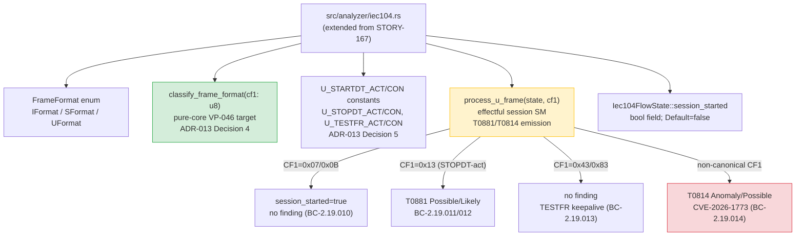
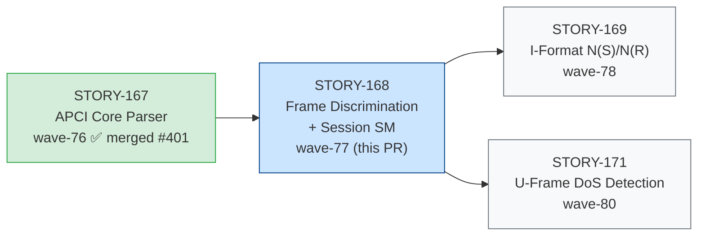
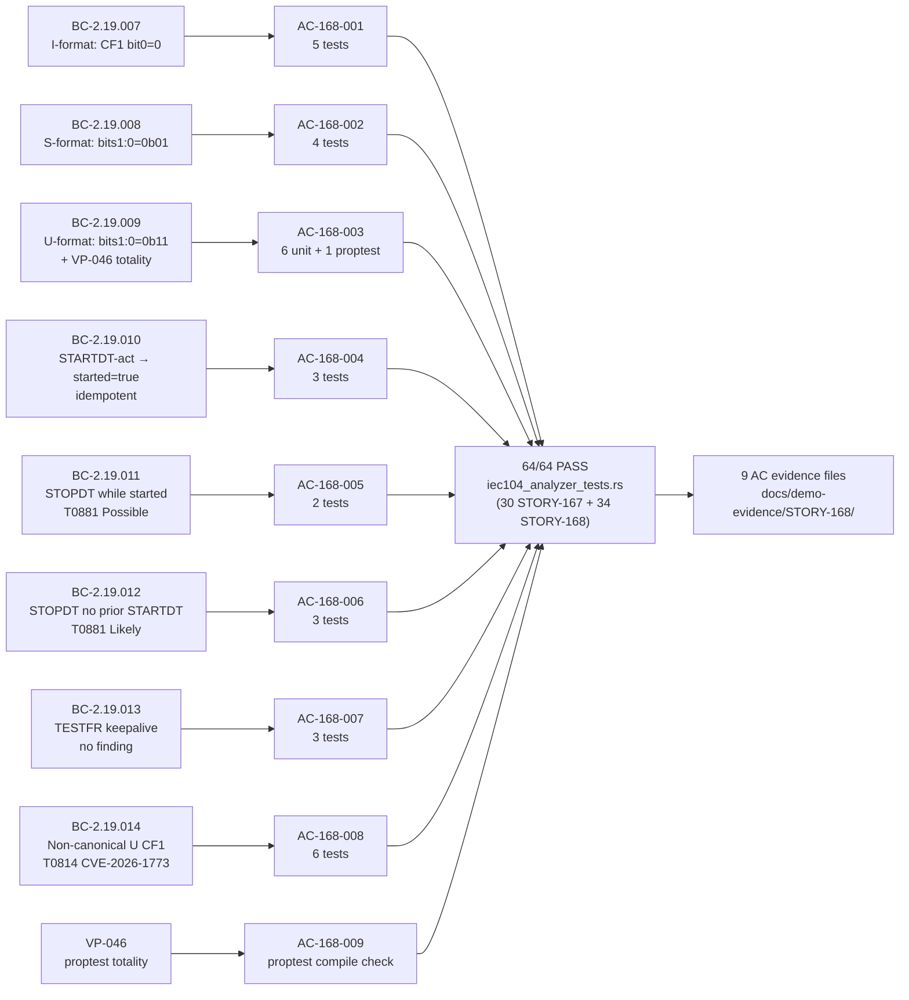

# feat: STORY-168 IEC-104 frame discrimination + session state machine (wave-77)

## Summary

Extends `src/analyzer/iec104.rs` with the IEC-104 frame format discriminator and U-format
session state machine — the second story in Epic E-22 (waves 76–83). Adds:
- `classify_frame_format(cf1: u8) -> FrameFormat`: pure-core free function; total over all 256 CF1 values (VP-046 proptest).
- `process_u_frame(state, cf1) -> Option<Finding>`: effectful session SM for STARTDT/STOPDT/TESTFR with T0881/T0814 emission.
- `Iec104FlowState::session_started: bool` field for confidence escalation.

Detects service-stop anomalies (T0881), non-canonical U-frame attacks (T0814/CVE-2026-1773),
and tracks session lifecycle per BC-2.19.007–014.

**Story:** STORY-168 · **Epic:** E-22 · **Wave:** 77 · **Points:** 5 · **Subsystem:** SS-19  
**Depends on:** STORY-167 (PR #401, merged to develop e65e0d6) · **Blocks:** STORY-169, STORY-171

---

## Architecture Changes

**Modified file:** `src/analyzer/iec104.rs` — +264 lines (enum, constants, pure fn, effectful SM).  
**No `on_data` dispatch wiring** — effectful shell is STORY-172; dispatch table is STORY-173.  
**Architecture compliance (ADR-013):**
- Decision 4: `classify_frame_format` is pure-core free fn — no state mutation, no findings
- Decision 5: Canonical U-frame CF1 table: 0x07, 0x0B, 0x13, 0x23, 0x43, 0x83
- Decision 7: No `iec60870-5`, Wireshark, or lib60870 dependencies (licensing)
- Decision 9: T0881 string emitted here; catalog entry is STORY-173 atomic commit

---

## Story Dependencies

`depends_on: [STORY-167]` — STORY-167 merged as PR #401 (develop HEAD e65e0d6). No
other upstream dependencies. This PR is safe to merge against current develop.

---

## Spec Traceability (BC → AC → Test → Demo)

---

## Test Evidence

**Test suite:** `tests/iec104_analyzer_tests.rs` — **64/64 PASS** (0 failures, 0 ignored)

Command: `cargo test --test iec104_analyzer_tests`

| AC | BC | Test Count | Representative Test Name |
|----|----|-----------|--------------------------|
| AC-168-001 | BC-2.19.007 | 5 | `test_BC_2_19_007_returns_iformat_for_cf1_0x00_canonical_vector` |
| AC-168-002 | BC-2.19.008 | 4 | `test_BC_2_19_008_returns_sformat_for_cf1_0x01_canonical_vector` |
| AC-168-003 | BC-2.19.009 | 7 unit tests | `test_BC_2_19_009_invariant_vp046_totality_exhaustive_all_256_values` |
| AC-168-004 | BC-2.19.010 | 3 | `test_BC_2_19_010_startdt_act_idempotent_when_already_started` |
| AC-168-005 | BC-2.19.011 | 2 | `test_BC_2_19_011_stopdt_act_after_startdt_emits_t0881_possible` |
| AC-168-006 | BC-2.19.012 | 3 | `test_BC_2_19_012_stopdt_act_without_startdt_emits_t0881_likely` |
| AC-168-007 | BC-2.19.013 | 3 | `test_BC_2_19_013_testfr_act_emits_no_finding_canonical_vector` |
| AC-168-008 | BC-2.19.014 | 6 | `test_BC_2_19_014_non_canonical_cf1_0xFF_emits_t0814_possible_canonical_vector` |
| AC-168-009 | VP-046 | proptest skeleton | `proptest_vp046_frame_format_totality` |

Story-168 test count: 5+4+7+3+2+3+3+6 = 33 unit + 1 proptest = **34 new tests**  
Cumulative IEC-104 test count: 30 (STORY-167) + 34 (STORY-168) = **64/64 PASS**

**Row-verify (PG-W74-PRDESC-ROW-VERIFY):** 3 entries cross-checked against
`tests/iec104_analyzer_tests.rs` on feature branch HEAD (b7a94f3):
- AC-168-001: `test_BC_2_19_007_returns_iformat_for_cf1_0x00_canonical_vector` — confirmed at line 701
- AC-168-005: `test_BC_2_19_011_stopdt_act_after_startdt_emits_t0881_possible` — confirmed at line 1075
- AC-168-008: `test_BC_2_19_014_non_canonical_cf1_0xFF_emits_t0814_possible_canonical_vector` — confirmed at line 1357

**Aggregate-count cross-check:** Table claims 34 STORY-168 tests (5+4+7+3+2+3+3+6+1). Evidence-report.md
shows `running 64 tests … 64 passed; 0 failed; 0 ignored`. 30 (STORY-167) + 34 (STORY-168) = 64. Count verified.

---

## VP-046 Proptest Skeleton

| Property | Status |
|----------|--------|
| Harness name | `proptest_vp046_frame_format_totality` |
| Location | `tests/iec104_analyzer_tests.rs:1508` (inside `mod story_168`) |
| Method | proptest exhaustive sweep over all 256 u8 CF1 values |
| Assertion | `cf1 & 0x03` match dispatch: 0x00→IFormat, 0x01→SFormat, 0x03→UFormat |
| Skeleton status | Compiles clean; full proptest run is **STORY-174** |
| Mirrors | VP-032 Sub-B pattern (ENIP `classify_enip_command`) |

---

## Holdout Evaluation

N/A — evaluated at wave-77 gate.

---

## Adversarial Review

Per-story adversarial review: **CONVERGED** (3-clean, BC-5.39.001). Passes 2/3/4 clean.  
Pass-1 findings (MEDIUM-1 M1, LOW-1 L1, NIT-1 L3) remediated in commit 2d29bce:
- M1 (BC-2.19.012 PC3): STOPDT Likely-path adds distinguishing evidence entry
  `"STOPDT received without prior STARTDT on this flow"` for cold-start anomaly identification.
- L1: Defensive U-format guard added.
- L3: Category assertions added to test.

Finding BC-5.39.001 convergence ref: `.factory/` adversarial state (wave-77).

---

## Security Review

**Verdict: APPROVE WITH NOTES** — No CRITICAL or HIGH findings.

| ID | Severity | Finding | Disposition |
|----|----------|---------|-------------|
| SEC-001 | MEDIUM | Missing `MAX_IEC104_CARRY_BYTES` constant (CWE-400); carry fields in `Iec104FlowState` lack a bound constant — deferred DoS risk when STORY-171 wires carry buffers | Deferred to STORY-171; safe in this PR (no STORY-168 code writes carry buffers) |
| SEC-002 | LOW | `debug_assert!` in `process_u_frame` panics on mis-dispatch in debug builds only (CWE-617); no-op in `--release` | Accepted-by-design; documents STORY-173 dispatcher precondition |
| SEC-003 | INFO | `"T0881"` string used before STORY-173 catalog entry | No panic risk; `Finding.mitre_techniques` is `Vec<String>` plain data |

Reviewed for: panic-safety (exhaustive match with `_` arm — every u8 handled), unbounded
state growth (single `bool` field; carry buffers not written), format string safety
(CWE-134 N/A — `cf1: u8` cannot carry format specifiers), fail-closed non-canonical
(T0814 emitted; `session_started` not modified in `_` arm), pure/effectful boundary
(ADR-013 Decision 4 conforms — `classify_frame_format` takes no state parameter).

---

## Demo Evidence

All 9 acceptance criteria have recorded evidence in `docs/demo-evidence/STORY-168/`:

| AC | Description | Evidence File |
|----|-------------|---------------|
| AC-168-001/002/003 | Frame format classification (I/S/U) | `AC-001-002-003-frame-discrimination.md` |
| AC-168-004 | STARTDT-act sets session_started=true (idempotent) | `AC-004-startdt-session-state.md` |
| AC-168-005/006 | STOPDT-act T0881 Possible/Likely | `AC-005-006-stopdt-t0881.md` |
| AC-168-007 | TESTFR keepalive; no finding | `AC-007-testfr-no-finding.md` |
| AC-168-008 | Non-canonical U-frame T0814 (CVE-2026-1773) | `AC-008-non-canonical-u-t0814.md` |
| AC-168-009 | VP-046 proptest skeleton compiles | `AC-009-vp046-proptest-totality.md` |

Full index: `docs/demo-evidence/STORY-168/evidence-report.md`.  
Demo-evidence path-scrub gate (PG-W70-DEMO-SCRUB): **PASSED** 2026-07-14 (zero absolute host paths).

Product type: pure-core library — no CLI/web surface at this story scope.
VHS/Playwright recordings not applicable; dispatch wiring is STORY-173.

---

## Risk Assessment

| Dimension | Assessment |
|-----------|-----------|
| Blast radius | **Low** — extends existing file with new types and functions; no changes to STORY-167 API |
| Performance impact | **None** — `classify_frame_format` is O(1), single bitwise op; `process_u_frame` is O(1) match dispatch |
| Breaking changes | **None** — new public API additions only; no existing API modified |
| Session state | **Single bool field** on per-flow state struct; no heap allocation, no unbounded growth |
| T0881/T0814 emission | **Fail-closed** on non-canonical (T0814 emitted, state NOT advanced); confidence escalation (Likely vs Possible) is deterministic |
| License compliance | **Verified** — no `iec60870-5`, Wireshark, or lib60870 (ADR-013 Decision 7) |

---

## CHANGELOG

`[Unreleased]` entry present in `CHANGELOG.md` covering:
- `classify_frame_format`, `FrameFormat` enum, `process_u_frame`
- `Iec104FlowState::session_started` field
- VP-046 proptest skeleton
- T0881/T0814 emission with confidence escalation
- Pass-1 adversarial remediation (BC-2.19.012 PC3 distinguishing evidence)

Satisfies **AC-158-001 / PG-W71-CHANGELOG** (`src/` change trigger).

---

## AI Pipeline Metadata

| Field | Value |
|-------|-------|
| Pipeline mode | feature-f3 (wave-77 incremental delivery) |
| Story wave | 77 |
| Epic | E-22 (IEC-104 feature, 8 stories, waves 76–83) |
| Position in epic | 2 of 8 — frame discrimination + session SM |
| Models used | claude-sonnet-4-6 |

---

## Pre-Merge Checklist

- [x] CHANGELOG `[Unreleased]` entry present (AC-158-001/PG-W71-CHANGELOG)
- [x] Demo evidence per AC (6 per-AC files + evidence-report.md, PG-W70-DEMO-SCRUB PASS)
- [x] Per-story adversarial review CONVERGED (3-clean, BC-5.39.001)
- [x] Test evidence row-verified ≥3 entries (PG-W74-PRDESC-ROW-VERIFY) — counts verified
- [x] Dependency STORY-167 merged (PR #401, develop e65e0d6)
- [x] Security review completed — APPROVE WITH NOTES (0 CRITICAL/HIGH; SEC-001 MEDIUM deferred to STORY-171)
- [x] PR review convergence (APPROVE) — Cycle 1, 3 NITs only, NIT-1 fixed
- [x] CI all-green — 13/13 jobs PASS (Test 1m0s, Fuzz build 1m14s, all others green)
- [ ] Human authorization for merge (DF-MERGE-AUTH-CLASSIFIER-001 / D-425 interim — awaiting explicit grant)
