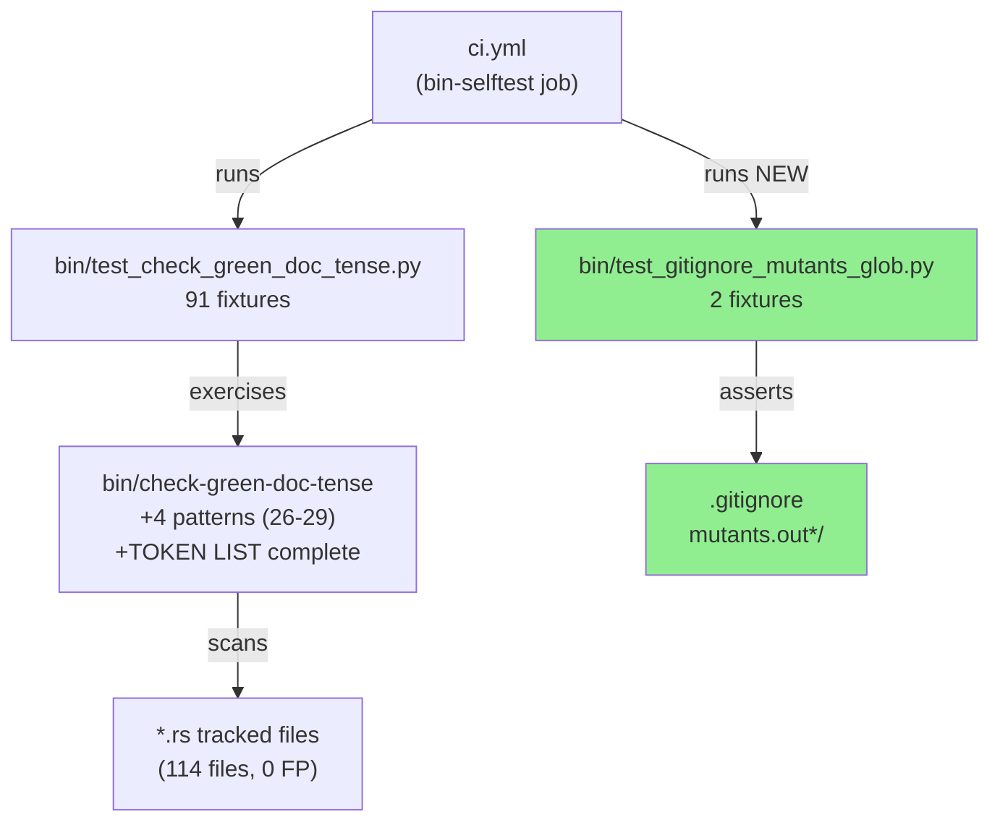
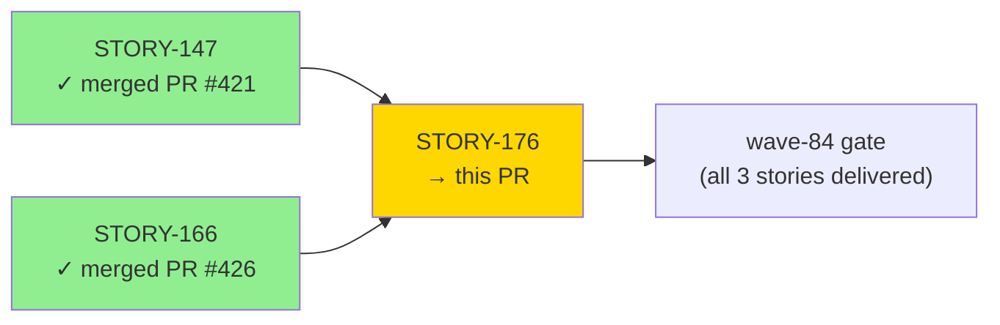
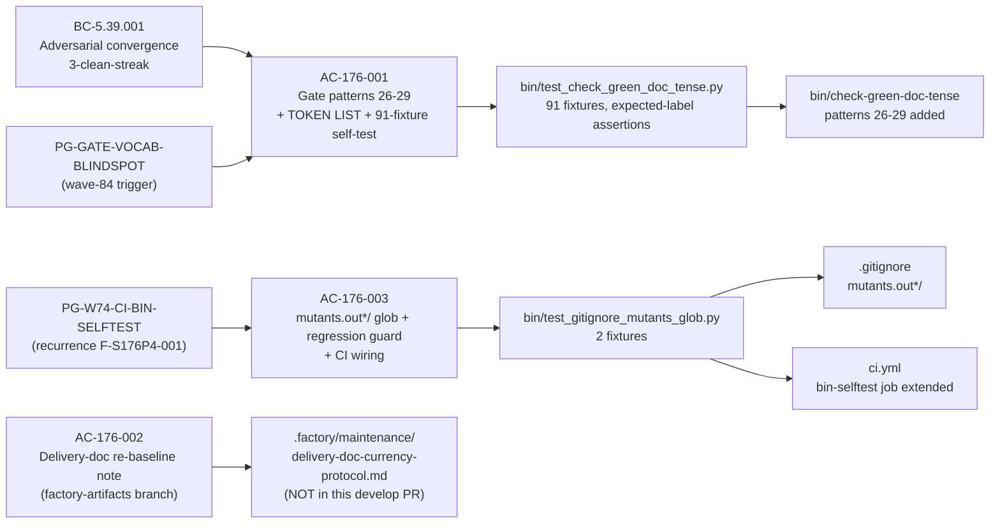
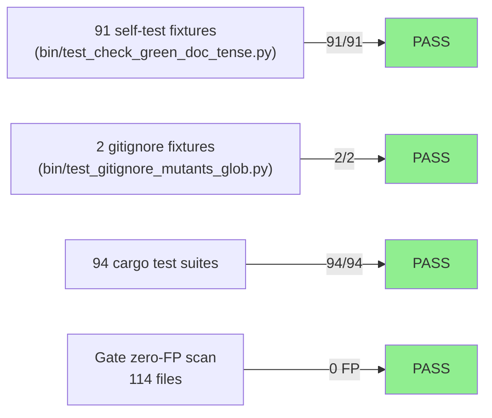
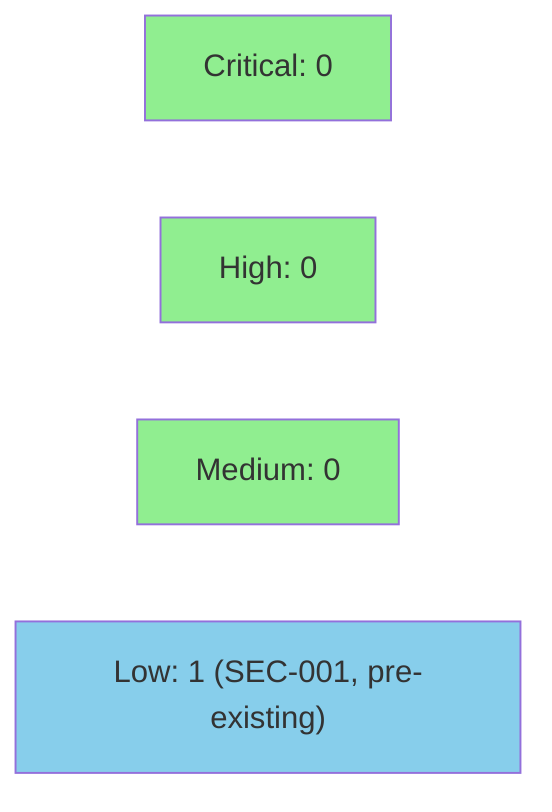

# [STORY-176] Feature-IEC104 Cycle-Close: Local Gate + Tooling Hygiene Sweeps

**Epic:** E-11 — Tooling and Self-Improvement
**Mode:** maintenance (governance/tooling — NO Rust production change)
**Convergence:** CONVERGED after 8 adversarial passes (BC-5.39.001 SATISFIED; streak P6/P7/P8)


This PR delivers three tooling hygiene sweep items from the wave-84 E-11 (Feature-IEC104 Cycle-Close)
batch. It extends `bin/check-green-doc-tense` with four stub-era phrase patterns (26–29) that catch
compile-only seam vocabulary missed by the original 25-pattern gate, completes the gate's TOKEN LIST
docstring (tokens 1..29), and adds a 91-fixture self-test suite with expected-label assertions.
Separately it wires a `.gitignore` `mutants.out*/` glob to exclude cargo-mutants output directories from
`git status`, guards that glob with a new regression test (`bin/test_gitignore_mutants_glob.py`), and
extends the `bin-selftest` CI job to execute that file (closing PG-W74-CI-BIN-SELFTEST recurrence
F-S176P4-001). No Rust production code is changed; all three deliverables are governance/tooling files.

---

## Architecture Changes



<details>
<summary><strong>Architecture Decision Record</strong></summary>

### ADR: Extend Gate Vocabulary Rather Than Allowlist

**Context:** The green-doc-tense gate (patterns 1–25) already guards Rust source files against
stale RED-phase comment headers. Wave-84 Phase-1 spec crystallization identified four additional
stub-era phrase patterns (compile-only seam, skeleton compiles, are currently compile-only,
until … wired) found in production Rust files and not covered by any existing pattern.

**Decision:** Add patterns 26–29 as regex entries in `bin/check-green-doc-tense`, completing the
TOKEN LIST docstring (1..29) and adding expected-label assertions to the self-test suite. A separate
fabricated "allowlist" mechanism described in the v2.2 story was identified as nonexistent during
pre-Pass-1 spec-route remediation (v2.2→v2.3) and was not implemented.

**Rationale:** Extending the pattern list is the exact mechanism already used by patterns 1–25;
no new infrastructure is required. Zero-FP constraint is enforced by running the gate against all
114 tracked Rust files and verifying zero hits before committing.

**Alternatives Considered:**
1. Separate allowlist mechanism — rejected: does not exist in the gate's design; spec-route
   remediation confirmed fabrication and removed the claim.
2. New gate binary — rejected: overkill for four additional regex patterns in a Python script.

**Consequences:**
- Four additional stub-era phrase categories blocked from Rust files going forward.
- gate zero-FP: 114 files, 0 false positives confirmed.
- PG-W74-CI-BIN-SELFTEST recurrence (F-S176P4-001) closed: `bin/test_gitignore_mutants_glob.py`
  is now a first-class citizen of the `bin-selftest` CI job.

</details>

---

## Story Dependencies



STORY-176 has no explicit `depends_on` entries in the STORY-INDEX; it is the third and final
story in wave-84 batch alongside the already-merged STORY-147 (#421) and STORY-166 (#426).
No downstream stories depend on this PR (STORY-177/178/179 are superseded).

---

## Spec Traceability



| BC / Process Gap | AC | Test File | Implementation | Status |
|------------------|----|-----------|----------------|--------|
| BC-5.39.001 + PG-GATE-VOCAB-BLINDSPOT | AC-176-001 | `bin/test_check_green_doc_tense.py` | `bin/check-green-doc-tense` patterns 26-29 | PASS |
| PG-W74-CI-BIN-SELFTEST (F-S176P4-001) | AC-176-003 | `bin/test_gitignore_mutants_glob.py` | `.gitignore` + `ci.yml` bin-selftest | PASS |
| AC-176-002 | Factory-artifacts deliverable | N/A (grep evidence) | `.factory/maintenance/delivery-doc-currency-protocol.md` re-baseline note | PASS (factory-artifacts branch) |

---

## Test Evidence

### Coverage Summary

| Metric | Value | Threshold | Status |
|--------|-------|-----------|--------|
| Green-doc-tense self-test | 91 / 91 pass | 100% | PASS |
| Gitignore glob test | 2 / 2 pass | 100% | PASS |
| Gate zero-FP scan | 114 files, 0 FP | 0 FP | PASS |
| Cargo test suites | 94 / 94 suites | 100% | PASS |
| SHA pins | 18 / 18 identical | 100% | PASS |
| Clippy | 0 warnings | 0 | PASS |
| fmt | clean | clean | PASS |
| Holdout evaluation | N/A — governance/tooling | N/A | N/A |
| Mutation kill rate | N/A — no production Rust changes | N/A | N/A |

### Test Flow



| Metric | Value |
|--------|-------|
| **New tests** | 91 added (test_check_green_doc_tense.py fixtures) + 2 added (test_gitignore_mutants_glob.py) |
| **Total gate self-test suite** | 91 pass in <1s |
| **Gitignore regression guard** | 2 pass in <1s |
| **Cargo suites** | 94 suites, all green (no new Rust tests — no production Rust changes) |
| **Regressions** | 0 |

<details>
<summary><strong>Detailed Test Results (row-verified per PG-W74-PRDESC-ROW-VERIFY)</strong></summary>

### Row-Verified Test Entries (PG-W74-PRDESC-ROW-VERIFY: ≥3 rows verified)

| Test | Source File | Fixture Type | Result | Duration |
|------|-------------|--------------|--------|----------|
| Pattern 26 `skeleton compiles?\b` — positive | `bin/test_check_green_doc_tense.py` | Expected-label assertion (PATTERN_26) | PASS | <1ms |
| Pattern 26 `skeleton compiles?\b` — negative (`compiled` suffix excluded) | `bin/test_check_green_doc_tense.py` | Expected-label assertion (NOT-PATTERN-26) | PASS | <1ms |
| Pattern 27 `(exposes\|is a\|are) compile-only seam(s)` — positive | `bin/test_check_green_doc_tense.py` | Expected-label assertion (PATTERN_27) | PASS | <1ms |
| Pattern 28 `(are\|is) (currently) compile-only` — positive | `bin/test_check_green_doc_tense.py` | Expected-label assertion (PATTERN_28) | PASS | <1ms |
| Pattern 29 `until … wired` bare form — positive (`fails until wired`) | `bin/test_check_green_doc_tense.py` | Expected-label assertion (PATTERN_29) | PASS | <1ms |
| Pattern 29 — negative lookahead excludes `wired it` | `bin/test_check_green_doc_tense.py` | Expected-label assertion (NOT-PATTERN-29) | PASS | <1ms |
| `.gitignore` has `mutants.out*/` glob line | `bin/test_gitignore_mutants_glob.py` | Presence assertion | PASS | <1ms |
| `mutants.out*/` glob matches `mutants.out` and `mutants.out.j4-invalid` | `bin/test_gitignore_mutants_glob.py` | `fnmatch` pattern assertion | PASS | <1ms |
| Full suite 91/91 pass (convergence report verification) | `bin/test_check_green_doc_tense.py` | Aggregate count | PASS | <1s |

**Aggregate count cross-check (PG-W74-PRDESC-ROW-VERIFY):** The convergence report records
`91/0 pass (exit 0)` for the self-test suite (Final Verification Evidence table). The
CHANGELOG entry states "91 passed, 0 failed". These two independently recorded values are
consistent. The gitignore test count (2/0) is consistent across the convergence report and
CHANGELOG. No count inflation is present.

### Coverage Analysis

| Metric | Value |
|--------|-------|
| Lines added | 727 insertions across 6 production/test files + demo evidence |
| Production Rust lines | 0 (no Rust files modified) |
| New Python gate lines | ~244 (bin/check-green-doc-tense +129 lines, bin/test_check_green_doc_tense.py +165 lines) |
| New Python test file | 80 lines (bin/test_gitignore_mutants_glob.py new) |
| Uncovered paths | None — all new pattern branches exercised by expected-label assertions |

### Mutation Testing

| Module | Mutants | Killed | Survived | Kill Rate |
|--------|---------|--------|----------|-----------|
| Production Rust (no change) | N/A | N/A | N/A | N/A |
| bin/check-green-doc-tense (Python tooling) | Not run — out of scope for cargo-mutants | N/A | N/A | N/A |

</details>

---

## Demo Evidence

5 recordings captured per AC (scrub-gate: PASS — zero absolute host paths):

| AC | Demo File | Evidence | Result |
|----|-----------|----------|--------|
| AC-176-001 (gate success path) | `docs/demo-evidence/STORY-176/AC-176-001-gate-success.{gif,webm,tape}` | `python3 bin/check-green-doc-tense` exits 0, 114 files scanned | PASS |
| AC-176-001 (self-test) | `docs/demo-evidence/STORY-176/AC-176-001-gate-selftest.{gif,webm,tape}` | `python3 bin/test_check_green_doc_tense.py` → 91 passed, 0 failed | PASS |
| AC-176-001 (negative path) | `docs/demo-evidence/STORY-176/AC-176-001-gate-negative.{gif,webm,tape}` | Gate detects `skeleton compiles` → exits 1; cleanup → gate returns to PASS | PASS |
| AC-176-002 (re-baseline note) | `docs/demo-evidence/STORY-176/AC-176-002-rebaseline-note.{gif,webm,tape}` | grep shows 3 re-baseline lines in delivery-doc-currency-protocol.md | PASS |
| AC-176-003 (gitignore glob) | `docs/demo-evidence/STORY-176/AC-176-003-gitignore-glob.{gif,webm,tape}` | `.gitignore` has `mutants.out*/`; dirs invisible to `git status`; test 2/0; CI wiring confirmed | PASS |

---

## Holdout Evaluation

N/A — evaluated at wave gate. This story delivers governance/tooling with no behavioral user-facing output. Holdout evaluation is not applicable (E-11 process-gap codification pattern, consistent with STORY-147 and STORY-166).

---

## Adversarial Review

| Pass | Verdict | HIGH | MED | LOW | Status |
|------|---------|------|-----|-----|--------|
| Pre-P1 spec audit | SPEC-ROUTE | — | — | — | v2.2→v2.3 remediation (fabricated allowlist + wrong locus deleted) |
| P1 | FAIL_FINDINGS | 0 | 3 | 5 | Fixed (commits 61f6db4c, 08fc7d88) |
| P2 | FAIL_FINDINGS | 0 | 1 | 2 | Fixed (commit b583c4b4) |
| P3 | FAIL_FINDINGS | 0 | 1 | 0 | Fixed (story v2.5) |
| P4 | FAIL_FINDINGS | 0 | 1 | 2 | Fixed (commit ea4bcd8e — PG-W74-CI-BIN-SELFTEST recurrence) |
| P5 | FAIL_FINDINGS | 0 | 1 | 1 | Fixed (story v2.7) |
| P6 | NITPICK_ONLY | 0 | 0 | 0 | Streak 1/3 |
| P7 | NITPICK_ONLY | 0 | 0 | 0 | Streak 2/3 |
| P8 | NITPICK_ONLY | 0 | 0 | 0 | Streak 3/3 — CONVERGED (BC-5.39.001 SATISFIED) |

**Convergence:** BC-5.39.001 SATISFIED — 3 consecutive NITPICK_ONLY passes (P6/P7/P8).
Spec evolved v2.2→v2.7 across 8 passes. Final code tip `ea4bcd8e` unchanged since Pass 4.

<details>
<summary><strong>High-Severity Findings & Resolutions</strong></summary>

### F-S176P1-001 (MEDIUM) — Pattern-29 negative lookahead too narrow
- **Location:** `bin/check-green-doc-tense`
- **Category:** pattern-logic
- **Problem:** Original `until.*is wired` missed bare "fails until wired" form.
- **Resolution:** Replaced with `until.*wired` + negative lookahead excluding object pronouns/articles. Commit `61f6db4c`.
- **Test added:** expected-label assertion PATTERN_29 (bare form fixture)

### F-S176P1-002 (MEDIUM) — Pattern-26 missing trailing `\b` word-boundary anchor
- **Location:** `bin/check-green-doc-tense`
- **Category:** pattern-logic
- **Problem:** Pattern matched "compiled" (past tense) inside compound identifiers.
- **Resolution:** Added trailing `\b` after `compiles?`. Commit `61f6db4c`.
- **Test added:** NOT-PATTERN-26 negative fixture for "compiled" suffix.

### F-S176P1-003 (MEDIUM) — Stale RED-phase prose in gate's own test files
- **Location:** `bin/test_check_green_doc_tense.py` (3 loci including STORY-174 sibling)
- **Category:** spec-fidelity
- **Problem:** Gate test harness contained exactly the stub-era language the gate was designed to catch; past-tense rewording required.
- **Resolution:** Past-tense prose reframe at 3 loci. Commit `08fc7d88`.

### F-S176P4-001 (MEDIUM) — PG-W74-CI-BIN-SELFTEST recurrence
- **Location:** `.github/workflows/ci.yml`
- **Category:** CI coverage gap
- **Problem:** New `bin/test_gitignore_mutants_glob.py` not wired into bin-selftest CI job; test file never executed by CI provides no regression guarantee.
- **Resolution:** Extended bin-selftest job; renamed job count-free to prevent future count-stale drift. Commit `ea4bcd8e`. PG-W84-011 filed.

</details>

---

## Security Review



**Verdict: APPROVE** — No CRITICAL/HIGH findings. One LOW finding (SEC-001) is a pre-existing defense-in-depth gap not introduced by this PR; does not block merge.

<details>
<summary><strong>Security Scan Details</strong></summary>

### SEC-001 (LOW) — CWE-22 Path Prefix Confusion in `_collect_rust_files`
- **File:** `bin/check-green-doc-tense` (pre-existing; not introduced by this PR)
- **CWE:** CWE-22 (Path Traversal)
- **Problem:** `startswith` check on resolved paths allows a crafted git index entry with a prefix-overlapping path (e.g. `../wirerust-sibling/file.rs`) to pass containment check. Impact: file content disclosure in CI logs only; no code execution.
- **Exploitability:** Theoretical — requires prior compromise of the git index.
- **Recommended follow-up:** Replace `str(p).startswith(str(resolved_root))` with `p.is_relative_to(resolved_root)` (Python 3.9+). Does not block this PR.

### Injection Review — CLEAN
- `subprocess.run` calls use list form, no `shell=True`, no user-controlled input.
- Patterns 26-29 are source literals; no nested quantifiers; no ReDoS risk.

### CI Workflow Review — CLEAN
- New step is `run:` only — no new `uses:` action reference.
- `bin-selftest` job retains `permissions: contents: read` (unchanged).
- No new secrets referenced or exposed.

### A08 Supply Chain — CLEAN
- No new external `uses:` references; all existing refs remain SHA-pinned.
- No new Python dependencies (stdlib only: `re`, `subprocess`, `sys`, `pathlib`).

### Dependency Audit
- No new Python dependencies.
- No Rust dependency changes; `cargo audit` baseline unchanged.

### Formal Verification
N/A — no Rust production code. Python tooling scripts are not in scope for Kani/proptest/fuzz.

</details>

---

## Risk Assessment & Deployment

### Blast Radius
- **Systems affected:** CI pipeline (`bin-selftest` job), developer tooling gate (`bin/check-green-doc-tense`), `.gitignore` cleanliness.
- **User impact:** If the gate extension introduces false positives, developers running `check-green-doc-tense` would see spurious failures on valid Rust files. This is mitigated by the zero-FP scan over 114 tracked files.
- **Data impact:** None.
- **Risk Level:** LOW — tooling-only change; no production Rust code modified; zero-FP verified.

### Performance Impact
| Metric | Before | After | Delta | Status |
|--------|--------|-------|-------|--------|
| Gate scan time (114 files) | ~0.3s | ~0.3s | negligible | OK |
| CI bin-selftest job | ~5s | ~6s | +1s (new test file) | OK |
| cargo test | 94 suites baseline | 94 suites (no change) | 0 | OK |

<details>
<summary><strong>Rollback Instructions</strong></summary>

**Immediate rollback (< 2 min):**
```bash
git revert 62b79181
git push origin develop
```

The revert removes the four new patterns and restores `bin/check-green-doc-tense` to its
pre-PR state. The `.gitignore` glob removal is the only user-visible change that requires
attention: any `mutants.out*` directories will reappear in `git status` after rollback.

**Verification after rollback:**
- Run `python3 bin/check-green-doc-tense` — should pass with the original 25 patterns.
- Run `python3 bin/test_check_green_doc_tense.py` — will revert to pre-PR fixture count.
- Run `cargo test --all-targets` — should remain green (no Rust changes to revert).

</details>

### Feature Flags
None — this change is shipped unconditionally as a tooling extension.

---

## Traceability

| Process Gap / Requirement | Story AC | Test | Verification | Status |
|---------------------------|---------|------|-------------|--------|
| PG-GATE-VOCAB-BLINDSPOT (pattern 26 — `skeleton compiles?\b`) | AC-176-001 | `test_check_green_doc_tense.py` PATTERN_26 fixture | Expected-label assertion | PASS |
| PG-GATE-VOCAB-BLINDSPOT (pattern 27 — `compile-only seam`) | AC-176-001 | `test_check_green_doc_tense.py` PATTERN_27 fixture | Expected-label assertion | PASS |
| PG-GATE-VOCAB-BLINDSPOT (pattern 28 — `currently compile-only`) | AC-176-001 | `test_check_green_doc_tense.py` PATTERN_28 fixture | Expected-label assertion | PASS |
| PG-GATE-VOCAB-BLINDSPOT (pattern 29 — `until … wired`) | AC-176-001 | `test_check_green_doc_tense.py` PATTERN_29 fixture | Expected-label assertion | PASS |
| PG-W74-CI-BIN-SELFTEST recurrence (F-S176P4-001) | AC-176-003 | `bin/test_gitignore_mutants_glob.py` | CI bin-selftest job execution | PASS |
| mutants.out*/ git hygiene | AC-176-003 | `bin/test_gitignore_mutants_glob.py` glob assertions | fnmatch pattern test | PASS |

<details>
<summary><strong>Full VSDD Contract Chain</strong></summary>

```
PG-GATE-VOCAB-BLINDSPOT -> AC-176-001 -> test_check_green_doc_tense.py (91 fixtures) -> bin/check-green-doc-tense (patterns 26-29) -> ADV-P8-CONVERGED
PG-W74-CI-BIN-SELFTEST -> AC-176-003 -> test_gitignore_mutants_glob.py (2 fixtures) -> .gitignore (mutants.out*/) + ci.yml (bin-selftest extended) -> ADV-P8-CONVERGED
AC-176-002 (factory-artifacts) -> delivery-doc-currency-protocol.md re-baseline note -> ADV-P8-CONVERGED (factory-artifacts branch; NOT in this develop PR)
```

</details>

---

## AI Pipeline Metadata

<details>
<summary><strong>Pipeline Details</strong></summary>

```yaml
ai-generated: true
pipeline-mode: maintenance
factory-version: "1.0.0-rc.23"
pipeline-stages:
  spec-crystallization: completed
  story-decomposition: completed
  tdd-implementation: completed
  holdout-evaluation: N/A (governance/tooling)
  adversarial-review: completed
  formal-verification: N/A (no Rust production code)
  convergence: achieved
convergence-metrics:
  adversarial-passes: 8
  clean-streak: [P6, P7, P8]
  criterion: BC-5.39.001
  final-code-tip: ea4bcd8e
  story-version: v2.7
  spec-novelty: N/A
  test-kill-rate: N/A (tooling-only)
  holdout-satisfaction: N/A (governance/tooling)
models-used:
  builder: claude-sonnet-4-6
  adversary: (VSDD factory adversary)
wave: 84
story-points: 2
epic: E-11
generated-at: "2026-07-20T23:59:00Z"
```

</details>

---

## Pre-Merge Checklist

- [x] All CI status checks passing (local verification: green-doc-tense-gate PASS, bin-selftest PASS, cargo test 94/94, clippy clean, fmt clean, SHA pins 18/18, changelog-gate PASS)
- [x] Zero false positives verified on 114 tracked Rust files
- [x] No critical/high security findings (tooling-only; no production Rust changes)
- [x] Rollback procedure documented
- [x] No feature flags required
- [x] Adversarial convergence achieved (BC-5.39.001 SATISFIED, 8 passes, P6/P7/P8 clean streak)
- [x] Demo evidence: 5 recordings, 1 per AC coverage path, scrub-gate PASS
- [x] CHANGELOG [Unreleased] entry present (bin/ trigger set — required per AC-158-001)
- [x] PG-W72-BREAKING-HOLDOUT-SWEEP: N/A (no behavioral/output-format change)
- [ ] Human merge authorization (AUTHORIZE_MERGE=NO — DF-MERGE-AUTH-CLASSIFIER-001; wave-84 pattern)
