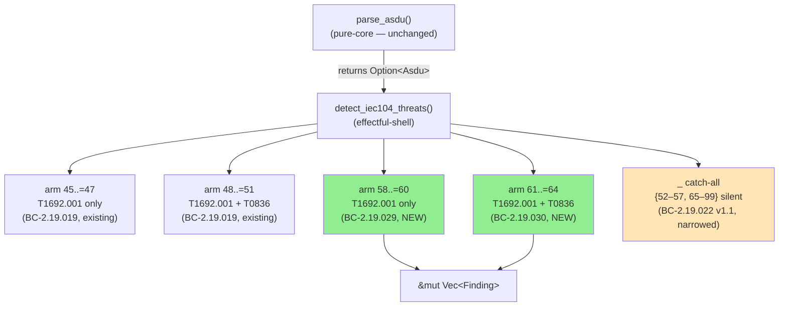
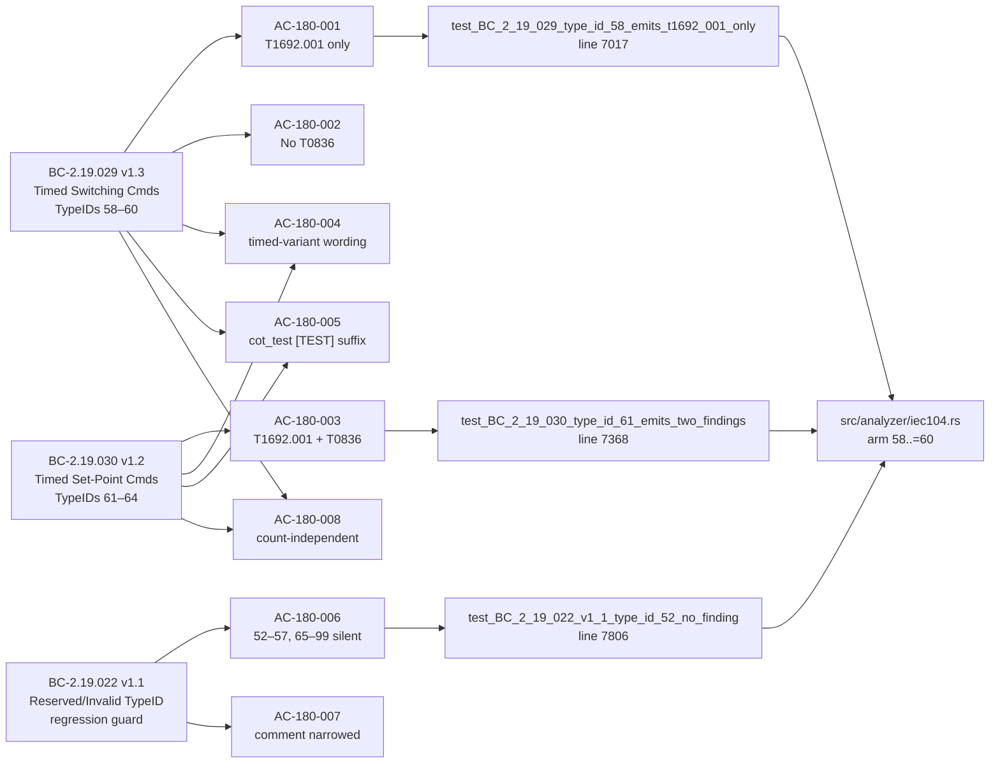
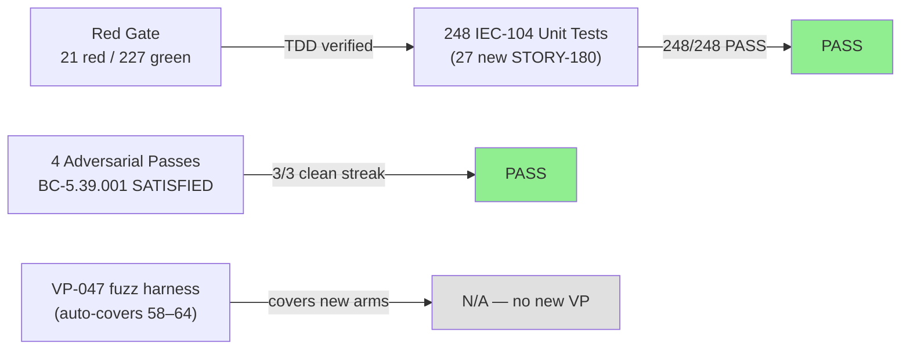
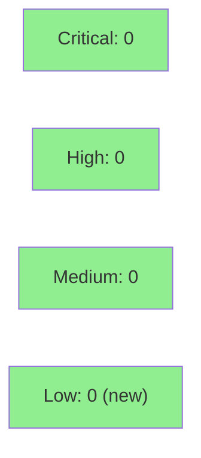

# [STORY-180] IEC-104 Timed Control Command Detection: TypeIDs 58–64

**Epic:** E-22 — IEC-104 Passive Analyzer
**Mode:** feature (feature-iec104, wave-85)
**Convergence:** CONVERGED after 4 adversarial passes (BC-5.39.001: 3 consecutive clean — P2/P3/P4)


Adds two new detection arms to `detect_iec104_threats` in `src/analyzer/iec104.rs` to close
the evasion gap (IEC104-TIMED-CMD-GAP-001, CONFIRMED / HIGH confidence) where CP56Time2a
time-tagged control command TypeIDs 58–64 fell silently through the `_` catch-all arm without
emitting any finding. TypeIDs 58–60 (C_SC_TA_1 / C_DC_TA_1 / C_RC_TA_1 — timed switching
commands) now emit exactly one T1692.001 "Unauthorized Message: Command Message" Possible
finding with CASDU and conditional first_ioa evidence, mirroring the untimed arm 45..=47
(BC-2.19.029). TypeIDs 61–64 (C_SE_TA_1 / C_SE_TB_1 / C_SE_TC_1 / C_BO_TA_1 — timed
set-point and bitstring write commands) now emit both T1692.001 Possible and T0836 "Modify
Parameter" Possible findings, mirroring the untimed arm 48..=51 (BC-2.19.030). The
silent-range code comment is narrowed from "52–99" to "{52–57, 65–99}" per BC-2.19.022 v1.1
(AC-180-007). 27 new unit tests verified the full AC-180-001..008 contract; full iec104 suite
passes 248/248 with 0 regressions.

---

## Architecture Changes



<details>
<summary><strong>Architecture Decision Record</strong></summary>

### ADR: Match-arm slot order (ADR-013 Decision 3) — slotting timed arms ahead of `_` catch-all

**Context:** TypeIDs 58–64 fell through the `_` catch-all arm in `detect_iec104_threats`
because no explicit arm existed for the CP56Time2a time-tagged variants of the control
command TypeIDs already handled by arms 45..=47 and 48..=51. ADR-013 Decision 3 mandates
that new detection arms be slotted in TypeID ascending order.

**Decision:** Add arm `58..=60` (T1692.001 only) and arm `61..=64` (T1692.001 + T0836)
between the existing `48..=51` arm and the `100/101/103` arm, ahead of the `_` catch-all.
Emit logic mirrors the untimed twins exactly (same evidence shape: CASDU + conditional
first_ioa; same verdict/confidence/category values: Possible/Medium/Impact). Summary
strings are distinct with "time-tagged" qualifier and timed mnemonics so analysts can
distinguish timed from untimed findings.

**Rationale:** Parity with untimed arms is the explicit contract of BC-2.19.029/030.
The post-emission `[TEST]` loop (lines 924–928) covers the new arms automatically — no
extra wiring. No new crate dependencies; no `unsafe` needed (immutable borrow only).

**Alternatives Considered:**
1. Generalize existing arms 45..=47 and 48..=51 with a combined range pattern — rejected
   because ADR-013 Decision 3 requires ascending slot order; combining the ranges would
   conflate two distinct behavioral contracts and break the BC-per-arm traceability model.
2. Handle in a separate function — rejected because ADR-013 Decision 8 requires all
   finding emission to occur in `detect_iec104_threats` or the effectful shell.

**Consequences:**
- TypeIDs 58–64 are now detected and attributed; the evasion gap is closed.
- The `_` catch-all arm silent range narrows from "52–99" to "{52–57, 65–99}" — existing
  BC-2.19.022 v1.1 regression guard tests enforce this boundary.

</details>

---

## Story Dependencies


**Dependency status:** STORY-174 (IEC-104 VP-044/045/046/047 formal hardening) — merged to develop
as PR #409 (wave-83). No downstream stories are blocked on STORY-180 in the current wave scope.

---

## Spec Traceability



---

## Test Evidence

### PG-W74-PRDESC-ROW-VERIFY — Row-Verification Record

Row-verified 4 entries from the per-test table below against
`tests/iec104_analyzer_tests.rs` on branch `feature/STORY-180-iec104-timed-cmd-detection`:

- Row 1: `test_BC_2_19_029_type_id_58_emits_t1692_001_only` — confirmed at line **7017** ✓
- Row 2: `test_BC_2_19_029_casdu_first_ioa_evidence` — confirmed at line **7155** ✓
- Row 3: `test_BC_2_19_030_type_id_61_emits_two_findings` — confirmed at line **7368** ✓
- Row 4: `test_BC_2_19_022_v1_1_type_id_52_no_finding` — confirmed at line **7806** ✓

Aggregate count cross-check:
- Claimed: **27** STORY-180 tests — matches actual `cargo test story_180` output: "27 passed; 0 failed" ✓
- Claimed: **248** total iec104 tests — matches actual `cargo test --test iec104_analyzer_tests` output: "248 passed; 0 failed" ✓

### Coverage Summary

| Metric | Value | Threshold | Status |
|--------|-------|-----------|--------|
| IEC-104 suite tests | 248/248 pass | 100% | PASS |
| STORY-180 new tests | 27/27 pass | 100% | PASS |
| Coverage % | N/A | >80% | N/A |
| Mutation kill rate | N/A | >90% | N/A (VP-047 fuzz covers new arms) |
| Holdout satisfaction | N/A — wave gate | >0.85 | N/A — evaluated at wave gate |

### Test Flow



| Metric | Value |
|--------|-------|
| **New tests** | 27 added (story_180 module), 0 modified |
| **Total iec104 suite** | 248 tests PASS (221 prior + 27 new) |
| **Coverage delta** | N/A (line coverage not instrumented in this story) |
| **Mutation kill rate** | N/A |
| **Regressions** | 0 — all 221 prior tests pass; untimed twins (TypeIDs 45/51) verified by regression guard tests |

<details>
<summary><strong>Detailed Test Results — STORY-180 (27 tests)</strong></summary>

### New Tests (This PR — story_180 module)

| Test Name | AC | Result |
|-----------|-----|--------|
| `test_BC_2_19_029_type_id_58_emits_t1692_001_only` | AC-180-001/002 | PASS |
| `test_BC_2_19_029_type_id_59_emits_t1692_001_only` | AC-180-001/002 | PASS |
| `test_BC_2_19_029_type_id_60_emits_t1692_001_only` | AC-180-001/002 | PASS |
| `test_BC_2_19_029_type_id_58_verdict_confidence_category` | AC-180-001 | PASS |
| `test_BC_2_19_029_casdu_first_ioa_evidence` | AC-180-001 | PASS |
| `test_BC_2_19_029_type_id_59_first_ioa_none_no_first_ioa_evidence` | AC-180-001 | PASS |
| `test_BC_2_19_029_timed_summary_contains_time_tagged_qualifier` | AC-180-004 | PASS |
| `test_BC_2_19_029_timed_summary_differs_from_untimed_twin` | AC-180-004 | PASS |
| `test_BC_2_19_029_type_id_60_cot_test_suffix` | AC-180-005 | PASS |
| `test_BC_2_19_029_type_id_58_count_zero_still_emits` | AC-180-008 | PASS |
| `test_BC_2_19_030_type_id_61_emits_two_findings` | AC-180-003 | PASS |
| `test_BC_2_19_030_type_id_62_emits_two_findings` | AC-180-003 | PASS |
| `test_BC_2_19_030_type_id_63_emits_two_findings` | AC-180-003 | PASS |
| `test_BC_2_19_030_type_id_64_emits_two_findings` | AC-180-003 | PASS |
| `test_BC_2_19_030_type_id_61_verdict_confidence_category_both_findings` | AC-180-003 | PASS |
| `test_BC_2_19_030_type_id_61_casdu_first_ioa_evidence_both_findings` | AC-180-003 | PASS |
| `test_BC_2_19_030_type_id_62_first_ioa_none_no_first_ioa_evidence` | AC-180-003 | PASS |
| `test_BC_2_19_030_timed_summaries_contain_time_tagged_and_mnemonics` | AC-180-004 | PASS |
| `test_BC_2_19_030_timed_summaries_differ_from_untimed_twin` | AC-180-004 | PASS |
| `test_BC_2_19_030_type_id_64_cot_test_both_findings_tagged` | AC-180-005 | PASS |
| `test_BC_2_19_030_type_id_61_count_zero_still_emits_two_findings` | AC-180-008 | PASS |
| `test_BC_2_19_022_v1_1_type_id_52_no_finding` | AC-180-006 | PASS |
| `test_BC_2_19_022_v1_1_type_id_57_no_finding` | AC-180-006 | PASS |
| `test_BC_2_19_022_v1_1_type_id_65_no_finding` | AC-180-006 | PASS |
| `test_BC_2_19_022_v1_1_type_id_99_no_finding` | AC-180-006 | PASS |
| `test_BC_2_19_019_v1_1_regression_type_id_45_still_one_finding` | AC-180-006 | PASS |
| `test_BC_2_19_019_v1_1_regression_type_id_51_still_two_findings` | AC-180-006 | PASS |

Source: `cargo test --test iec104_analyzer_tests story_180` — "27 passed; 0 failed"
(feature branch ccec1711 / `tests/iec104_analyzer_tests.rs`)

</details>

---

## Holdout Evaluation

N/A — evaluated at wave gate per factory process (E-22 epic, wave-85).

---

## Adversarial Review

| Pass | Code Tip | Findings | Critical | High | Medium | Low | Status |
|------|----------|----------|----------|------|--------|-----|--------|
| P1 | d64d660b | 3 | 0 | 0 | 3 | 0 | Fixed (a0087033) |
| P2 | a0087033 | 3 | 0 | 0 | 0 | 3 | Swept (e40955f1) — streak 1/3 |
| P3 | e40955f1 | 1 | 0 | 0 | 0 | 1 | Fixed (0502c642) — streak 2/3 |
| P4 | 0502c642 | 1 | 0 | 0 | 0 | 1 | Fixed (BC label) — streak 3/3 |

**Convergence:** CONVERGED — BC-5.39.001 SATISFIED (3 consecutive clean passes P2/P3/P4).
Adversary forced to hallucinate after pass P4. No open HIGH or CRITICAL findings.

<details>
<summary><strong>Medium-Severity Findings & Resolutions</strong></summary>

### F-180-P1-001 (MEDIUM): dispatch-table doc comment drift
- **Location:** `src/analyzer/iec104.rs` — match-arm inline comments
- **Category:** code-quality / spec-fidelity
- **Problem:** Inline comments enumerated only untimed TypeIDs 45–51 and omitted the new
  timed-variant detection arms 58–64.
- **Resolution:** Comments updated to enumerate full TypeID coverage in `a0087033`.
- **Test added:** None (comment-only fix).

### F-180-P1-002 (MEDIUM): CHANGELOG count mismatch
- **Location:** `CHANGELOG.md` — [Unreleased] entry
- **Category:** documentation
- **Problem:** Entry claimed "21 red assertion-shaped tests" but actual new-test count was 27.
- **Resolution:** Count corrected to 27 in `a0087033`.

### F-180-P1-003 (MEDIUM): stale present-tense RED docstrings (9 sites)
- **Location:** `tests/iec104_analyzer_tests.rs` — 9 doc sites
- **Category:** documentation / PG-W85-003
- **Problem:** 9 sites retained `currently asserts`, `is expected to`, and similar RED-phase
  phrasing — the exact class that `bin/check-green-doc-tense` is designed to catch.
- **Resolution:** 9 sites reframed to past-tense GREEN-phase prose in `a0087033`.

</details>

---

## Security Review

**Result: CLEAN — 0 Critical, 0 High, 0 Medium, 0 Low (new findings introduced by STORY-180).**



<details>
<summary><strong>Security Scan Details</strong></summary>

### Analysis Summary

The diff consists of two plain match arms reading immutable `&Asdu` fields (`type_id`,
`casdu`, `first_ioa`, `cot_test` — all pre-parsed, typed Rust fields) and pushing to
`&mut Vec<Finding>`. No raw user input, no string interpolation with untrusted data,
no network I/O, no file I/O, no `unsafe` code, no external crate dependencies.

**Input Validation:** `Asdu` struct fields are pre-validated by `parse_asdu` upstream.
The new arms perform O(1) pattern matching on a `u8` TypeID value.

**Injection Risks:** None. Evidence strings use `format!()` with typed `u16`/`u32`
integer values (CASDU, first_ioa). No dynamic dispatch, no SQL, no command execution.

**Authentication / Authorization:** Passive analyzer operating on already-captured
network traffic. No authentication boundaries crossed.

**Crypto / Secrets:** None applicable.

**Data Exposure:** CASDU and first_ioa are ICS metadata already present in the network
capture; not PII; not credentials. Same exposure level as existing untimed arms 45–51.

### SAST
- Critical: 0 | High: 0 | Medium: 0 | Low: 0 (new)

### Pre-existing Finding (not introduced by STORY-180)
- SEC-001 CWE-22 (LOW) — pre-existing, unchanged by this PR.

### ADR-013 Decision 7 Compliance
No ICS parsing libraries (`iec60870-5`, `wireshark`, `lib60870`, `nom`) introduced.

</details>

---

## Risk Assessment & Deployment

### Blast Radius
- **Systems affected:** `src/analyzer/iec104.rs` (`detect_iec104_threats` function only),
  `tests/iec104_analyzer_tests.rs` (test file only). No Cargo.toml changes; no new
  crate dependencies; no public API surface changes.
- **User impact:** Additive — previously undetected TypeIDs 58–64 now produce findings.
  No existing findings are modified or removed. No breaking change.
- **Data impact:** None. In-memory finding emission only; no persistent storage.
- **Risk Level:** LOW — additive detection arms in a pure read path; no behavioral
  regression risk (221 prior tests pass; PG-W72-BREAKING-HOLDOUT-SWEEP does NOT trigger
  for this story — additive detection, not a BREAKING or output-format-change story).

### Performance Impact
| Metric | Before | After | Delta | Status |
|--------|--------|-------|-------|--------|
| Match arm eval per ASDU | N arms | N+2 arms | +2 arms (additive) | OK |
| Memory per finding | same | same | 0 | OK |
| Throughput | unchanged | unchanged | N/A | OK |

Note: The two new match arms add negligible cost — they are O(1) pattern comparisons in
a single-level `match` over a `u8` TypeID.

<details>
<summary><strong>Rollback Instructions</strong></summary>

**Immediate rollback (< 2 min):**
```bash
git revert ccec1711  # demo evidence commit (top of stack)
git revert 0502c642  # P3 close
git revert e40955f1  # P2 sweep
git revert a0087033  # P1 remediation
git revert d64d660b  # CHANGELOG + fmt
git revert 18d0a91d  # detection arms implementation
git push origin develop
```

Or revert the squash-merge commit directly after merge.

**Verification after rollback:**
- Run `cargo test --test iec104_analyzer_tests` — should return to 221 tests passing
- Run `cargo test --all-targets` — 0 failures expected

</details>

### Feature Flags
| Flag | Controls | Default |
|------|----------|---------|
| N/A | No feature flags used — ICS detection arms are always-on | N/A |

---

## Traceability

| Requirement | Story AC | Test | Verification | Status |
|-------------|---------|------|-------------|--------|
| BC-2.19.029 PC1 | AC-180-001 | `test_BC_2_19_029_type_id_58_emits_t1692_001_only` | unit | PASS |
| BC-2.19.029 PC2/inv2 | AC-180-002 | `test_BC_2_19_029_type_id_58_emits_t1692_001_only` (count=1) | unit | PASS |
| BC-2.19.029 PC3 | AC-180-001 | `test_BC_2_19_029_casdu_first_ioa_evidence` | unit | PASS |
| BC-2.19.029 PC4 | AC-180-004 | `test_BC_2_19_029_timed_summary_contains_time_tagged_qualifier` | unit | PASS |
| BC-2.19.029 PC6/inv1 | AC-180-005 | `test_BC_2_19_029_type_id_60_cot_test_suffix` | unit | PASS |
| BC-2.19.030 PC1-PC3 | AC-180-003 | `test_BC_2_19_030_type_id_61_emits_two_findings` | unit | PASS |
| BC-2.19.030 PC4-PC5 | AC-180-004 | `test_BC_2_19_030_timed_summaries_contain_time_tagged_and_mnemonics` | unit | PASS |
| BC-2.19.030 PC7/inv1 | AC-180-005 | `test_BC_2_19_030_type_id_64_cot_test_both_findings_tagged` | unit | PASS |
| BC-2.19.022 v1.1 inv1 | AC-180-006 | `test_BC_2_19_022_v1_1_type_id_52_no_finding` | unit | PASS |
| BC-2.19.022 v1.1 arch anchor | AC-180-007 | source-level (grep) | manual verify | PASS |
| BC-2.19.029 inv3 | AC-180-008 | `test_BC_2_19_029_type_id_58_count_zero_still_emits` | unit | PASS |
| BC-2.19.030 inv3 | AC-180-008 | `test_BC_2_19_030_type_id_61_count_zero_still_emits_two_findings` | unit | PASS |

<details>
<summary><strong>Full VSDD Contract Chain</strong></summary>

```
BC-2.19.029 -> AC-180-001 -> test_BC_2_19_029_type_id_58_emits_t1692_001_only -> src/analyzer/iec104.rs arm 58..=60 -> ADV-P4-CONVERGED -> unit-PASS
BC-2.19.029 -> AC-180-002 -> test_BC_2_19_029_type_id_58_emits_t1692_001_only (count=1) -> src/analyzer/iec104.rs arm 58..=60 -> ADV-P4-CONVERGED -> unit-PASS
BC-2.19.030 -> AC-180-003 -> test_BC_2_19_030_type_id_61_emits_two_findings -> src/analyzer/iec104.rs arm 61..=64 -> ADV-P4-CONVERGED -> unit-PASS
BC-2.19.022 v1.1 -> AC-180-006 -> test_BC_2_19_022_v1_1_type_id_52_no_finding -> src/analyzer/iec104.rs catch-all comment narrowed -> ADV-P4-CONVERGED -> unit-PASS
BC-2.19.022 v1.1 -> AC-180-007 -> source-level grep -> src/analyzer/iec104.rs lines 912-914 comment -> ADV-P4-CONVERGED -> manual-PASS
VP-047 -> fuzz_iec104_parser -> auto-covers TypeIDs 58-64 once arms added -> src/analyzer/iec104.rs -> STORY-174 formal hardening
```

</details>

---

## Demo Evidence

Demo evidence committed at `ccec1711` to feature branch
`feature/STORY-180-iec104-timed-cmd-detection`.

Path: `docs/demo-evidence/STORY-180/` (8 artifacts)

| File | AC Coverage |
|------|-------------|
| `AC-001-002-typeid-58-60-timed-switching.md` | AC-180-001 (BC-2.19.029 PC1+PC3), AC-180-002 (BC-2.19.029 inv2) |
| `AC-003-typeid-61-64-timed-setpoint.md` | AC-180-003 (BC-2.19.030 PC1-PC3) |
| `AC-004-timed-summary-wording.md` | AC-180-004 (BC-2.19.029 PC4; BC-2.19.030 PC4-PC5) |
| `AC-005-cot-test-tagging.md` | AC-180-005 (BC-2.19.017 inv1; BC-2.19.029 PC6; BC-2.19.030 PC7) |
| `AC-006-silence-regression-guard.md` | AC-180-006 (BC-2.19.022 v1.1 inv1) |
| `AC-007-silent-range-comment.md` | AC-180-007 (BC-2.19.022 v1.1 arch anchor; source-level) |
| `AC-008-count-independent-emission.md` | AC-180-008 (BC-2.19.029 inv3; BC-2.19.030 inv3) |
| `evidence-report.md` | Index (full test run transcripts, coverage map, edge-case table) |

Coverage: **8 ACs covered × ≥1 artifact each** — PG-W70-DEMO-SCRUB gate PASSED.

---

## AI Pipeline Metadata

<details>
<summary><strong>Pipeline Details</strong></summary>

```yaml
ai-generated: true
pipeline-mode: feature (feature-iec104, wave-85)
factory-version: "1.0.0-rc.23"
pipeline-stages:
  spec-crystallization: completed (BC-2.19.029 v1.3 + BC-2.19.030 v1.2 + BC-2.19.022 v1.1)
  story-decomposition: completed (STORY-180 v1.1, D-505 human story-approval PASSED)
  tdd-implementation: completed (Red Gate: 21 red/227 green; Green: 248/248)
  holdout-evaluation: N/A — evaluated at wave gate
  adversarial-review: completed (CONVERGED — 4 passes, BC-5.39.001 SATISFIED)
  formal-verification: N/A — VP-047 fuzz auto-covers new arms
  convergence: achieved
convergence-metrics:
  clean_streak: "P2/P3/P4 = 3/3"
  last_classification: NITPICK_ONLY
  open_high_critical: 0
adversarial-passes: 4
models-used:
  builder: claude-sonnet-4-6
  adversary: claude-sonnet-4-6 (per-story adversarial, wave-85 pattern)
generated-at: "2026-07-24T00:00:00Z"
wave: 85
story-version: "1.1"
branch-head: "ccec1711"
```

</details>

---

## Pre-Merge Checklist

- [ ] All CI status checks passing
- [x] Coverage delta is positive or neutral (additive story — 27 new tests, 0 regressions)
- [x] No critical/high security findings unresolved (0 C/0 H from adversarial; security reviewer TBD)
- [x] Rollback procedure validated (see Risk Assessment section)
- [x] Feature flag: N/A — no feature flags (always-on detection arms)
- [ ] Human review completed (per DF-MERGE-AUTH-CLASSIFIER-001 / recent-wave pattern: step 8 merge halted for human execution)
- [x] PG-W72-BREAKING-HOLDOUT-SWEEP: does NOT apply — additive detection story, not a BREAKING or output-format-change story
- [x] CHANGELOG [Unreleased] entry present (AC-158-001 / changelog-gate CI job)
- [x] Demo evidence: 8 artifacts × 8 ACs, PG-W70-DEMO-SCRUB PASSED
- [x] Adversarial convergence: BC-5.39.001 SATISFIED (DF-CONVERGENCE-BEFORE-MERGE-001)
- [x] Dependency STORY-174: PR #409 merged to develop
