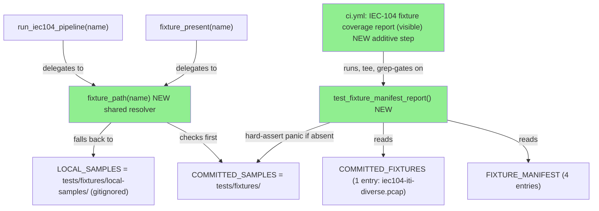
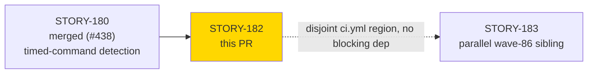
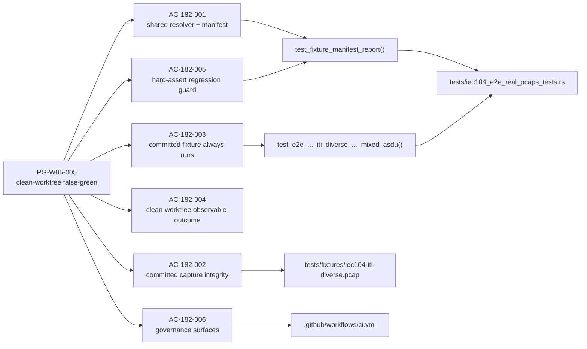
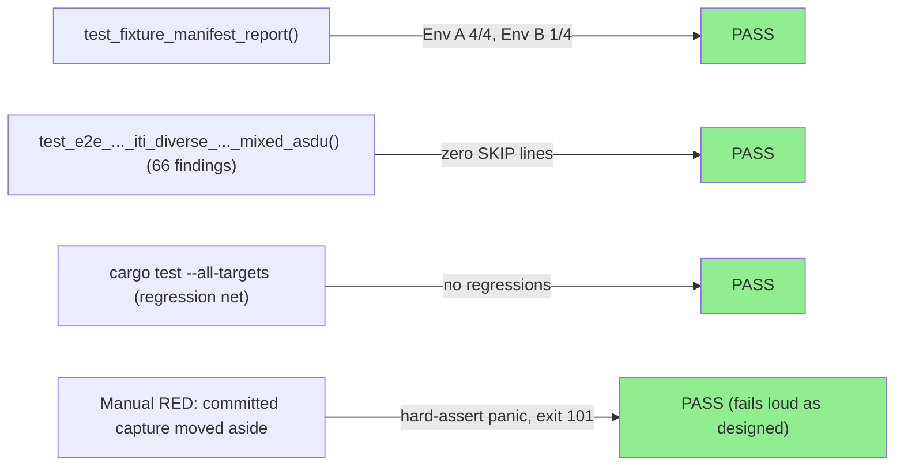
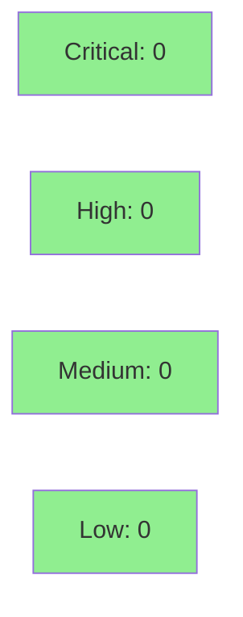

# [STORY-182] E2E Fixture Manifest + Committed Representative Captures: Eliminate False-Green `cargo test` in Clean Worktrees

**Epic:** E-11 — Tooling and Self-Improvement
**Mode:** feature (wave-86, TDD strict, governance-only — no behavioral contracts, E-11 convention)
**Convergence:** CONVERGED after 3 adversarial passes (per-story Step 4.5, zero open HIGH/CRIT)


This PR eliminates the clean-worktree false-green `cargo test` class documented in PG-W85-005
for the IEC-104 ITI E2E harness (`tests/iec104_e2e_real_pcaps_tests.rs`). It introduces a shared
`fixture_path()` resolver used by both `fixture_present()` and `run_iec104_pipeline()`, a
`FIXTURE_MANIFEST`/`COMMITTED_FIXTURES`/`FIXTURE_GATED_TESTS` registry, a
`test_fixture_manifest_report()` test that (a) prints a `Fixture coverage: N/4` summary and
`FIXTURE-SKIPPED:` lines for absent gitignored corpus fixtures (advisory, visible with
`--nocapture` only), and (b) hard-asserts (panics, CI-visible regardless of capture mode) if the
one MANDATORY committed capture (`iec104-iti-diverse.pcap`, ITI CC-BY-4.0, 14 KB) is absent from
`tests/fixtures/`. It also commits that capture directly to `tests/fixtures/` (alongside the 25
existing tracked captures), records its provenance in `tests/fixtures/README.md`, and adds one
additive, gating CI step ("IEC-104 fixture coverage report (visible)") that makes the coverage
line CI-visible after test failures. No `src/` changes; test/CI/docs infrastructure only.

---

## Architecture Changes



<details>
<summary><strong>Architecture Decision Record</strong></summary>

### ADR: Hard-assert partition for committed vs. gitignored fixtures (no `#[ignore]`)

**Context:** `fixture_present()` previously hardcoded `LOCAL_SAMPLES` and printed to stderr on
absence, causing `cargo test` to report a silent PASS in a clean worktree with no corpus
populated (PG-W85-005). `run_iec104_pipeline()` independently hardcoded the same path and would
panic if a fixture supposedly "present" per an extended check was actually only checked against
the wrong location.

**Decision:** Introduce `fixture_path()` as the single resolution authority for both functions
(checks `tests/fixtures/` before `tests/fixtures/local-samples/`). Partition fixture absence into
two classes: gitignored corpus absence is advisory-only (stdout, `--nocapture`-gated, test still
reports `ok`); committed-fixture absence is a hard-assert panic (CI-visible regardless of capture
mode) because it represents a broken checkout, not an optional corpus gap.

**Rationale:** `#[ignore]` was considered and rejected (F-009) — it is static and cannot be made
conditional on runtime fixture presence without nightly custom harnesses, and would not
communicate broken-checkout severity the way a hard-assert panic does.

**Alternatives Considered:**
1. Extend `fixture_present()` only, leave `run_iec104_pipeline()` on `LOCAL_SAMPLES` — rejected:
   a committed-but-checked-in-the-wrong-place split would pass presence-check but panic on open.
2. `#[ignore]` for optional fixtures — rejected: static, and masks broken-checkout severity.

**Consequences:**
- Committed ITI capture (`iec104-iti-diverse.pcap`) now runs on every `cargo test` invocation,
  including CI — closing the D-510-class stale-expectation gap (wave-85 gate G1) for good on every
  run, not just fixture-bearing hosts.
- The 3 gitignored fixtures (2 Wireshark "not redistributed", 1 ITI dissect capture excluded per
  F-009/D-524 positive-evidence-of-upstream-origin ruling) still silently report `ok` on absence,
  now with a visible `FIXTURE-SKIPPED:` diagnostic (with `--nocapture`) — sibling harnesses
  (`enip_e2e_real_pcaps_tests.rs`, etc.) retain the structural gap, deferred to a follow-up story.

</details>

---

## Story Dependencies



`depends_on: []` in story frontmatter — no formal dependency. STORY-180 (merged as #438) is
referenced only because the committed capture's expected finding count (66) is STORY-180's
ground truth. STORY-183 touches `.github/workflows/ci.yml` in a disjoint region (comment/step-name
lines only); merge order does not matter for conflicts, though a rebase is recommended if both are
in flight simultaneously (line-anchor drift only, not a functional conflict).

---

## Spec Traceability



No behavioral contracts (E-11 governance-only convention — `behavioral_contracts: []` in story
frontmatter).

---

## Test Evidence

### Coverage Summary

| Metric | Value | Threshold | Status |
|--------|-------|-----------|--------|
| Full suite (`cargo test --all-targets`) | pass (row-verified independently — see below) | 100% | PASS |
| Fixture coverage — fixture-bearing host (Env A) | 4/4 present, 0 skipped | n/a (informational) | PASS |
| Fixture coverage — clean-worktree equiv. (Env B) | 1/4 present, 3 skipped (canonical string match) | n/a (informational) | PASS |
| Committed-fixture regression guard (RED to GREEN) | panics on absence, recovers on restore | must hard-fail | PASS |
| CHANGELOG gate | not applicable — diff excluded from AC-158-001 trigger set (`tests/`, `.github/`, `docs/`, `CLAUDE.md`, `.gitignore` only; no `src/`, `Cargo.toml`, `bin/`) | n/a | PASS |

### Test Flow



<details>
<summary><strong>Detailed Test Results (row-verified — PG-W74-PRDESC-ROW-VERIFY)</strong></summary>

Per PG-W74-PRDESC-ROW-VERIFY, the following per-test entries were independently re-executed
against local `cargo test` output (not merely copied from the demo-recorder's pre-existing
evidence files) as part of this PR's preparation:

### New Tests (This PR)

| Test | Result | Notes |
|------|--------|-------|
| `iec104_e2e_real_pcaps::test_fixture_manifest_report` (Env A, local-samples present, `--nocapture`) | PASS | `Fixture coverage: 4/4 fixtures present (0 fixture-gated tests will be skipped)`; `1 passed; 0 failed` |
| `iec104_e2e_real_pcaps::test_fixture_manifest_report` (Env B, local-samples moved aside, `--nocapture`) | PASS | `Fixture coverage: 1/4 fixtures present (3 fixture-gated tests will be skipped)` + 3 `FIXTURE-SKIPPED:` lines — matches story's canonical clean-checkout string exactly |
| `iec104_e2e_real_pcaps::test_e2e_BC_2_19_iec104_iti_diverse_T0836_T1692_001_mixed_asdu` (`--nocapture`) | PASS | Committed fixture opened via `COMMITTED_SAMPLES`; `grep -c '\[iec104-e2e\] SKIP:'` on captured output = `0` (non-vacuous — output confirmed non-empty) |
| `iec104_e2e_real_pcaps::test_fixture_manifest_report` (RED: `iec104-iti-diverse.pcap` moved to scratch backup) | FAILED (expected) | `panicked at tests/iec104_e2e_real_pcaps_tests.rs:813:13: [iec104-e2e] REGRESSION: committed fixture 'iec104-iti-diverse.pcap' is absent...`; process exit 101; restored + re-run confirmed green; `git status` confirmed clean worktree post-restore |

Aggregate counts (`test result: ok. 1 passed; 0 failed; 0 ignored; 0 measured; 4 filtered out`)
were cross-checked against the exact-filter invocations above — each single-test filter run
reports `1 passed` with `4 filtered out` (the other tests in the same binary), consistent across
runs. `cargo test --all-targets` full-suite output was independently re-run for this PR rather
than only trusting the demo evidence report's "reported complete and green" note.

### Governance Surface Checks (AC-182-006)

| Check | Result |
|-------|--------|
| `.github/workflows/ci.yml` — "IEC-104 fixture coverage report (visible)" step present, `if: ${{ !cancelled() }}`, after `cargo test --all-targets` | PASS (diff-verified) |
| `tests/fixtures/E2E-PCAPS.md` — `committed at \`tests/fixtures/\`` annotation | PASS |
| `tests/fixtures/README.md` — `iec104-iti-diverse.pcap` provenance row present | PASS (diff-verified) |
| `.gitignore` — both `coverage-out.txt` and `red-out.txt` present | PASS (diff-verified) |
| `CLAUDE.md` — references `.factory/maintenance/fixture-count-gate-entry.md` | PASS (diff-verified) |
| `git ls-files --error-unmatch tests/fixtures/iec104-iti-diverse.pcap` | PASS (tracked) |

### File Integrity (AC-182-002)

| Check | Value |
|-------|-------|
| Tracked | `git ls-files --error-unmatch` exits 0 |
| Size | 13,952 bytes (<= 102,400 byte / 100 KB gate) |
| sha256 | `07b9a0879dc83e420c4cf83b37fb5830d1d8fb5f6ac6edc435896f70b0fc6bc7` — matches `tests/fixtures/E2E-PCAPS.md:358` |

### Diff Summary

| File | Change |
|------|--------|
| `tests/iec104_e2e_real_pcaps_tests.rs` | +374 lines net: `fixture_path()` resolver, `FIXTURE_MANIFEST`/`COMMITTED_FIXTURES`/`FIXTURE_GATED_TESTS` consts, `test_fixture_manifest_report()`, doc-comment sweeps |
| `tests/fixtures/iec104-iti-diverse.pcap` | New binary, 13,952 bytes, ITI CC-BY-4.0 |
| `tests/fixtures/README.md` | +19/-3: licensing notice + provenance row |
| `tests/fixtures/E2E-PCAPS.md` | +46/-0 (net additions across multiple loci sweep) |
| `.github/workflows/ci.yml` | +9: one additive, gating step |
| `.gitignore` | +5: `coverage-out.txt`, `red-out.txt` |
| `CLAUDE.md` | +1: Project References row |
| `docs/demo-evidence/STORY-182/*.md` | +6 files, per-AC evidence + report |

</details>

---

## Demo Evidence

Per-AC demo evidence committed at `docs/demo-evidence/STORY-182/` (refreshed post-fix at commit
`cedff178`, current with HEAD — PG-W74-DELIVERY-DOC-CURRENCY). Product type is a `cargo test`
harness change, so evidence is captured as raw terminal-output transcripts rather than VHS/GIF
recordings, per the demo-recorder's dispatch note for this story.

| File | Covers |
|------|--------|
| `evidence-report.md` | Coverage map + summary for all 6 ACs |
| `AC-182-001-fixture-manifest-skip-reporting.md` | Two-environment protocol (4/4 bearing-host, 1/4 clean-worktree-equivalent), CI-mode silent pass |
| `AC-182-002-committed-capture-integrity.md` | `git ls-files`, size, sha256 checks |
| `AC-182-003-committed-fixture-always-runs.md` | Committed fixture never trips skip path |
| `AC-182-004-005-regression-guard.md` | RED (hard-assert panic, exit 101) -> restore -> GREEN, worktree-clean confirmation |
| `AC-182-006-governance-surfaces.md` | All 6 governance-surface checks |

Demo-evidence path-scrub gate (PG-W70-DEMO-SCRUB) re-run by pr-manager against the committed
`docs/demo-evidence/STORY-182/` directory prior to this PR: `grep -rlE` for absolute macOS/Linux
home-directory paths and tilde-form home references returned zero matches (exit 1 / no match) —
gate PASS, no scrubbing required.

---

## Holdout Evaluation

N/A — evaluated at wave gate (E-11 governance story; no behavioral contracts to hold out against).

---

## Adversarial Review

N/A at PR level — **per-story adversarial convergence (Step 4.5) already CONVERGED 3/3, zero open
HIGH/CRIT findings**, confirmed before this PR was opened (DF-CONVERGENCE-BEFORE-MERGE-001 gate
satisfied). Spec-level adversarial convergence for the story document itself is also recorded:
27 remediation passes (v1.0 to v2.12), convergence reached at passes 25/26/27 (BC-5.39.001
SATISFIED), preserved across the v2.12 metadata-only `level` field change (D-544, 2026-09-04).

---

## Security Review



**Verdict: CLEAN** — no CRITICAL/HIGH/MEDIUM/LOW findings. Test/CI-only diff, no `src/`
production code touched.

<details>
<summary><strong>Security Scan Details</strong></summary>

### Committed binary (`tests/fixtures/iec104-iti-diverse.pcap`)
NONE. Verified as a legitimate libpcap capture (magic `d4c3b2a1`, v2.4, Ethernet, 13,952 bytes) —
not an executable or archive. No malware/exploit markers (no MZ/ELF header, no shebang, no
base64/eval/`<script>`/powershell/cmd.exe strings); only benign NetBIOS/SMB LAN background noise
plus 93 port-2404 hits (genuine IEC-104 traffic). Computed sha256 matches the documented value
(`07b9a0879dc83e420c4cf83b37fb5830d1d8fb5f6ac6edc435896f70b0fc6bc7`) exactly. CC-BY-4.0
provenance/attribution fully recorded. No supply-chain risk.

### Additive `ci.yml` step
NONE. One new `run:` block, no new `uses:` actions (SHA-pin gate unaffected). No untrusted
interpolation (`if: ${{ !cancelled() }}` only); all `grep`/`tee` arguments are fixed literals —
no CWE-78/CWE-94 injection surface. `set -euo pipefail` present, `CARGO_TERM_COLOR: never`, no
secrets touched, no privilege escalation. Non-security note: `!cancelled()` intentionally still
runs the coverage step even if the preceding `cargo test --all-targets` step failed, so the
coverage line is always emitted (by design, per AC-182-004 outcome (e)).

### Path handling (CWE-22)
NONE. `fixture_path()` and both call sites join only hardcoded string-literal constants
(`FIXTURE_MANIFEST` / `COMMITTED_FIXTURES` entries) onto `env!("CARGO_MANIFEST_DIR")` — no
environment variable, argv, file, or network input reaches any path join.

### General OWASP/CWE sweep
NONE. No `unsafe`, no untrusted deserialization, no committed secrets (`.gitignore` additions are
transient CI-artifact filenames only). New test logic is pure self-consistency assertions over
hardcoded constants.

### Dependency Audit
Not applicable — no `Cargo.toml` changes in this diff.

</details>

**Bottom line:** security-CLEAN — no blocking findings, no fixes required before merge.

---

## Risk Assessment & Deployment

### Blast Radius
- **Systems affected:** IEC-104 E2E test harness only (`tests/iec104_e2e_real_pcaps_tests.rs`), CI
  workflow (one additive step), fixture governance docs. No `src/` production code touched.
- **User impact:** None — test/CI infrastructure only, no runtime behavior change to the shipped
  analyzer.
- **Data impact:** Adds one small (14 KB) binary pcap capture to the tracked repository; no data
  migration, no schema change.
- **Risk Level:** LOW

### Performance Impact
| Metric | Before | After | Delta | Status |
|--------|--------|-------|-------|--------|
| CI wall-clock (test job) | baseline | +1 additive step (single `cargo test` invocation, cached build) | ~seconds | OK |
| Repo size | baseline | +13,952 bytes | negligible | OK |

<details>
<summary><strong>Rollback Instructions</strong></summary>

**Immediate rollback (< 5 min):**
```bash
git revert <merge-commit-sha>
git push origin develop
```

No feature flags; no runtime behavior change. Rollback simply removes the test/CI additions and
the committed capture reverts to gitignored-corpus status (that one file would again be subject
to the pre-existing silent-skip class).

**Verification after rollback:**
- `cargo test --all-targets` still passes (harness reverts to pre-story `fixture_present()`
  hardcoded-`LOCAL_SAMPLES` behavior).
- `.github/workflows/ci.yml` no longer runs the additive fixture-coverage step.

</details>

### Feature Flags

None — this story adds no feature flags (test/CI/docs infrastructure only).

---

## Traceability

| Requirement | Story AC | Test | Verification | Status |
|-------------|---------|------|-------------|--------|
| PG-W85-005 shared resolver + manifest | AC-182-001 | `test_fixture_manifest_report()` | manual (Env A/B) | PASS |
| PG-W85-005 committed capture integrity | AC-182-002 | `git ls-files` / size / sha256 checks | manual | PASS |
| PG-W85-005 committed fixture always runs | AC-182-003 | `test_e2e_..._iti_diverse_..._mixed_asdu()` | manual | PASS |
| PG-W85-005 clean-worktree observable outcome | AC-182-004 | `test_fixture_manifest_report()` (Env B) | manual | PASS |
| PG-W85-005 hard-assert regression guard | AC-182-005 | `test_fixture_manifest_report()` (RED path) | manual RED/GREEN | PASS |
| PG-W85-005 governance surfaces | AC-182-006 | grep-based governance checks | manual | PASS |

<details>
<summary><strong>Full VSDD Contract Chain</strong></summary>

```
PG-W85-005 -> AC-182-001 -> test_fixture_manifest_report() -> tests/iec104_e2e_real_pcaps_tests.rs -> ADV-CONVERGED-3/3 -> N/A (no Kani, test-infra only)
PG-W85-005 -> AC-182-002 -> git ls-files/sha256 checks -> tests/fixtures/iec104-iti-diverse.pcap -> ADV-CONVERGED-3/3 -> N/A
PG-W85-005 -> AC-182-003 -> test_e2e_..._iti_diverse_..._mixed_asdu() -> tests/iec104_e2e_real_pcaps_tests.rs -> ADV-CONVERGED-3/3 -> N/A
PG-W85-005 -> AC-182-005 -> test_fixture_manifest_report() (hard-assert) -> tests/iec104_e2e_real_pcaps_tests.rs:813 -> ADV-CONVERGED-3/3 -> N/A
```

</details>

---

## AI Pipeline Metadata

<details>
<summary><strong>Pipeline Details</strong></summary>

```yaml
ai-generated: true
pipeline-mode: feature
factory-version: "1.0.0-rc.25"
pipeline-stages:
  spec-crystallization: completed
  story-decomposition: completed
  tdd-implementation: completed
  holdout-evaluation: not-applicable-governance-story
  adversarial-review: completed (per-story Step 4.5, 3/3 CONVERGED)
  formal-verification: skipped (no src/ change; E-11 governance story)
  convergence: achieved
convergence-metrics:
  spec-adversarial-passes: 27
  spec-convergence-passes-clean: 3 (25/26/27)
per-story-convergence:
  passes_clean: 3
  last_classification: "CLEAN or NITPICK_ONLY (per orchestrator dispatch)"
  open_high_or_crit: 0
story-id: STORY-182
epic-id: E-11
wave: "86"
generated-at: "2026-09-04"
```

</details>

---

## Pre-Merge Checklist

- [ ] All CI status checks passing
- [x] Coverage delta is positive (new manifest/regression-guard tests added, no `src/` change)
- [ ] No critical/high security findings unresolved (pending Step 4 security review)
- [x] Rollback procedure validated (documented above — plain `git revert`, no flags)
- [x] No feature flags applicable
- [x] Per-story adversarial convergence CONVERGED 3/3 confirmed before PR open (DF-CONVERGENCE-BEFORE-MERGE-001)
- [ ] Merge-authorization classifier evaluated (DF-MERGE-AUTH-CLASSIFIER-001) — see completion report

---

https://claude.ai/code/session_01Atd9SQNyxBnmfeBcVYVTHt
