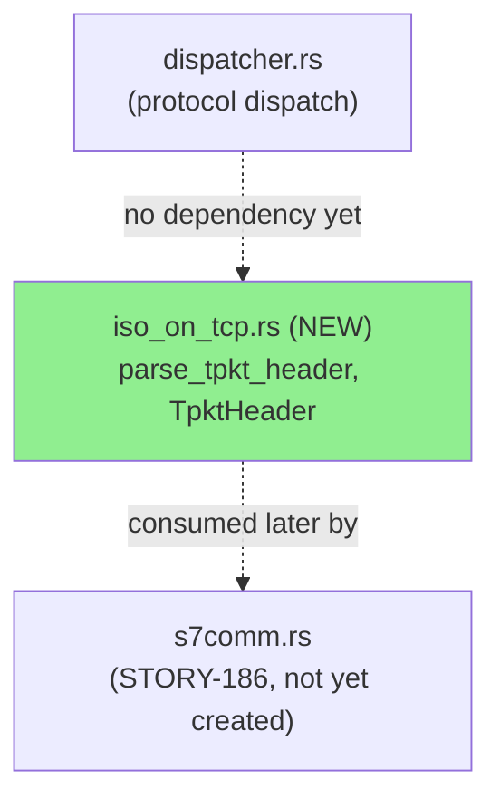
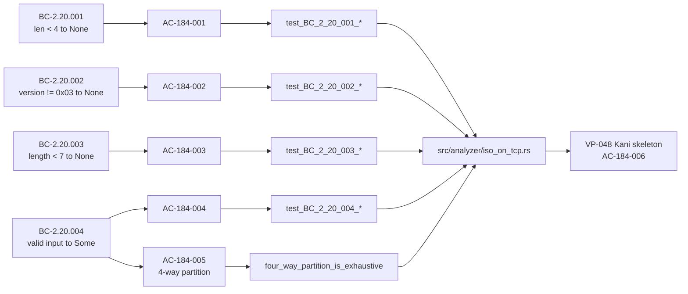
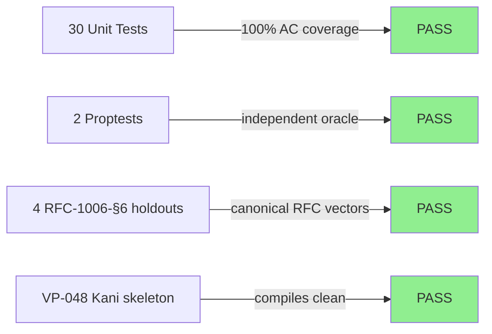
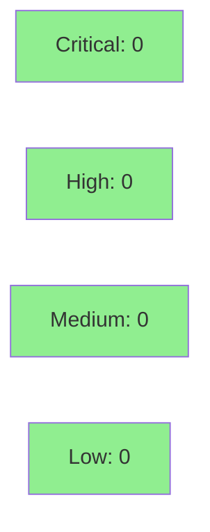

# [STORY-184] S7comm TPKT Core Parser: `parse_tpkt_header` Pure-Core Free Function + VP-048 Kani Skeleton

**Epic:** E-23 — feature-s7comm
**Mode:** feature (F4 delta-implementation)
**Convergence:** CONVERGED after 3 adversarial passes (per-story adversarial 3/3 clean; BC-5.39.001 satisfied)


Adds `parse_tpkt_header`, the pure-core RFC 1006 TPKT header parser that anchors the new
S7comm ISO-on-TCP framing layer (`src/analyzer/iso_on_tcp.rs`, SS-20). This is the first
implementation story of Epic E-23 and lands ADR-014 (S7comm ISO-on-TCP stream dispatch and
parser design, `proposed`) alongside it, discharging the `F4-OBLIGATION-ADR014-CLAUDEMD`
carry-forward. The parser rejects under-length input, non-`0x03` version bytes, and
declared lengths below the RFC 1006 §6 minimum of 7, and accepts `TpktHeader { version: 3,
length }` for `length` in `[7, 65535]`. A `#[cfg(kani)]` VP-048 skeleton is included; full
proof execution is deferred to STORY-194 per ADR-014 Decision 9's scope note.

---

## Architecture Changes



<details>
<summary><strong>Architecture Decision Record</strong></summary>

### ADR-014: S7comm ISO-on-TCP (TPKT/COTP) Stream Dispatch and Parser Design

**Context:** Epic E-23 adds S7comm (Siemens, TCP/102) protocol support. S7comm PDUs are
carried inside ISO-on-TCP framing (RFC 1006 TPKT + ISO 8073/COTP), which is itself shared
by other ICS/SCADA protocols on TCP/102 (IEC 61850 MMS, ICCP/TASE.2). A stream-dispatch and
module-boundary design was needed before any parser code could be written.

**Decision:** `iso_on_tcp.rs` (SS-20) is frozen as a standalone, protocol-agnostic framing
module exporting pure free functions only (no `impl StreamAnalyzer`, no per-flow state of
its own); `s7comm.rs` (SS-21, STORY-186) is the sole consumer. `TpktHeader { version: u8,
length: u16 }` is the frozen struct — exactly these two fields. Parsers are implemented
directly from RFC 1006/ISO 8073 (no borrowed/GPL code — Decision 4). Port-102 protocol
identification uses a per-entry `Support` enum (`Supported`, `KnownUnsupported`,
`DetectionOnly`) on `KnownProtocol` (Decision 3, human-ratified 2026-09-06).

**Rationale:** Separating the framing layer (SS-20) from the PDU dissector (SS-21) keeps
`parse_tpkt_header` and the future `parse_cotp_header` independently Kani-provable
pure-core functions, mirroring the IEC-104 `parse_apci_header`/VP-044 precedent
(STORY-167) that this story's shape closely follows.

**Alternatives Considered:**
1. Single combined `s7comm.rs` module doing TPKT+COTP+S7 in one pass — rejected: couples
   framing (shared by other TCP/102 protocols) to S7-specific PDU semantics, and produces
   a much larger, harder-to-verify Kani surface.
2. Name-keyed protocol-exclusion list for port-102 identification — rejected in favor of
   the `Support` enum (Decision 3) for finer-grained detection-vs-support signaling.

**Consequences:**
- New framing code is reusable by future TCP/102 protocols without modification.
- `parse_tpkt_header` and `parse_cotp_header` (STORY-185) each get independent, narrowly
  scoped VP-048/VP-049 Kani obligations instead of one large combined proof.
- ADR-014 status remains `proposed` pending the full SS-20/SS-21 build-out across
  STORY-184–194; this PR ships only the SS-20 TPKT slice.

</details>

---

## Story Dependencies


`depends_on: []` — STORY-184 has no upstream story dependencies (first story in Epic
E-23). `blocks: [STORY-185]`.

---

## Spec Traceability



---

## Test Evidence

### Coverage Summary

| Metric | Value | Threshold | Status |
|--------|-------|-----------|--------|
| Unit tests | 30/30 pass | 100% | PASS |
| AC coverage | 6/6 ACs (30 tests + 1 source-level check) | 100% | PASS |
| Kani skeleton | Compiles (`#[cfg(kani)]`, full proof deferred to STORY-194) | N/A | PASS |
| Holdout satisfaction | N/A — evaluated at wave gate | >= 0.85 | N/A |

### Test Flow



| Metric | Value |
|--------|-------|
| **New tests** | 30 added (tests/iso_on_tcp_tests.rs, new file), 0 modified |
| **Total suite** | 30 tests PASS in 0.02s (`cargo test --test iso_on_tcp_tests`) |
| **Regressions** | 0 — new module, no existing files behaviorally changed |
| **Lint/fmt** | `cargo fmt --check` clean; `cargo clippy --all-targets -- -D warnings` clean |

<details>
<summary><strong>Detailed Test Results — Per-AC Mapping (row-verified against evidence-report.md)</strong></summary>

### Coverage Map (from `docs/demo-evidence/STORY-184/evidence-report.md`)

| AC | BC | Test Count | Verdict |
|----|-----|-----------|---------|
| AC-184-001 (len < 4 → None) | BC-2.20.001 | 5 | PASS |
| AC-184-002 (version != 0x03 → None) | BC-2.20.002 | 5 | PASS |
| AC-184-003 (length < 7 → None) | BC-2.20.003 | 9 | PASS |
| AC-184-004 (valid input → Some) | BC-2.20.004 | 9 | PASS |
| AC-184-005 (4-way exhaustive partition) | BC-2.20.004 inv. 3 | 2 | PASS |
| AC-184-006 (VP-048 skeleton compiles) | VP-048 | 0 (source-level: `grep` + `cargo check`/`clippy`) | PASS |

**Cross-check:** 5 + 5 + 9 + 9 + 2 = 30, matching `cargo test --test iso_on_tcp_tests`
output exactly (30 passed; 0 failed).

### Representative Test Rows (row-verified, PG-W74-PRDESC-ROW-VERIFY)

| Test | Result |
|------|--------|
| `test_BC_2_20_001_returns_none_for_three_bytes_canonical_vector` | ok |
| `test_BC_2_20_003_returns_none_for_length_six_boundary_below_rfc_minimum` | ok |
| `test_BC_2_20_004_valid_input_returns_some_header_length_65535_max_canonical_vector` | ok |
| `proptests::test_BC_2_20_004_proptest_matches_independent_oracle` | ok |

Full raw `cargo test --test iso_on_tcp_tests` output re-verified by pr-manager during this
PR's creation (30 passed; 0 failed; 0 ignored). `cargo fmt --check` and
`cargo clippy --all-targets -- -D warnings` both re-verified clean.

</details>

---

## Holdout Evaluation

N/A — evaluated at wave gate (feature-s7comm Epic E-23 has not yet reached its wave
gate). Four RFC-1006-§6 holdout unit tests (`test_rfc1006_s6_*`) are included in this
story's own test file as an independent-oracle sanity check, but formal holdout-scenario
evaluation against the >=0.85 satisfaction threshold happens at the wave/epic boundary,
not per-story.

---

## Adversarial Review

**Convergence:** CONVERGED — 3/3 clean per-story adversarial passes (BC-5.39.001
satisfied). Findings were resolved across the branch's development history prior to PR
creation (commits `903a947b`, `953e1f14`, `dead410e`, `c253f9ea`, `a23fb6ba`,
`3209e70c` — doc-tense/provenance fixes, RFC-1006 §6 correction (human ruling: minimum
length 7, not the initially-drafted value), holdout-divergence documentation, and
CHANGELOG churn cleanup).

<details>
<summary><strong>Key resolutions prior to this PR</strong></summary>

### RFC 1006 §6 minimum-length human ruling
- **Category:** spec-fidelity
- **Problem:** initial draft used an incorrect RFC 1006 §6 minimum-length floor.
- **Resolution:** corrected to 7 (4-byte TPKT header + 3-byte minimum COTP) per explicit
  human ruling; `BC-2.20.003`/`BC-2.20.004` boundaries and all EC-005/006/007 edge cases
  updated to match; tests and doc-comments made RFC-conformant.
- **Test added/updated:** `test_BC_2_20_003_returns_none_for_length_six_boundary_below_rfc_minimum`,
  `test_BC_2_20_004_valid_input_returns_some_header_length_7_canonical_vector`

### Doc-tense / provenance sweep
- **Category:** test-quality / documentation
- **Problem:** RED-phase-tense doc comments and test provenance language left over from
  TDD scaffolding.
- **Resolution:** past-tense provenance corrected across `src/analyzer/iso_on_tcp.rs` and
  `tests/iso_on_tcp_tests.rs` doc comments (adversary F-184-P1-002/004, P3
  DF-SIBLING-SWEEP).

</details>

---

## Security Review



<details>
<summary><strong>Security Scan Details</strong></summary>

Dedicated security-reviewer pass completed (Step 4 of this PR's lifecycle) against
PR #466's diff (`src/analyzer/iso_on_tcp.rs::parse_tpkt_header` +
`tests/iso_on_tcp_tests.rs`). **Result: NO FINDINGS at any severity
(CRITICAL/HIGH/MEDIUM/LOW).**

### Manual/AI Security Review
- **Bounds safety (CWE-125 / CWE-787):** `if data.len() < 4 { return None }` precedes
  every indexed access; `data[0]`/`data[2]`/`data[3]` are provably in-bounds after the
  guard. NOT VULNERABLE.
- **Integer overflow/panic (CWE-190):** `u16::from_be_bytes` over exactly 2 bytes is a
  total, non-panicking function; no arithmetic, casts, or shifts elsewhere in the
  function; no `unwrap`/`expect`/`unsafe`/`panic!` anywhere in the module. NOT
  VULNERABLE.
- **Unbounded allocation / resource consumption (CWE-789 / CWE-400):** the untrusted
  `length` field is returned as data only — never used to size an allocation in this
  story. NOT VULNERABLE at this story's scope. **Forward note (non-blocking):** the
  declared-length-vs-actual-buffer reassembly check must land in the STORY-185/186
  COTP/S7comm consumer that actually allocates/advances buffers using this field —
  tracked as that story's obligation, not a gap in this PR.
- **Injection, auth, OWASP Top 10:** NOT APPLICABLE — pure byte-field decode; no
  strings, queries, deserialization, authentication, or I/O surface.
- **INFO (non-blocking):** the VP-048 Kani harness is scoped to no-panic/bounds-safety
  only, with full proof execution deferred to STORY-194 per the module's documented
  scope note — an honest, already-documented deferral, not an undisclosed gap.

**Verdict: nothing blocks merge on security grounds.**

### Dependency Audit
- No `Cargo.toml` changes in this PR — no new dependency surface.

### Formal Verification

| Property | Method | Status |
|----------|--------|--------|
| No panic for any symbolic `[u8; N]` input (`N <= 300`) | Kani (`verify_parse_tpkt_header_safety`) | Skeleton compiles; full proof execution deferred to STORY-194 |
| Four-way partition exhaustive/non-overlapping (AC-184-005) | Unit test (`four_way_partition_is_exhaustive`) + proptest oracle | VERIFIED at unit level; formal Kani assertion is STORY-194 |

</details>

---

## Risk Assessment & Deployment

### Blast Radius
- **Systems affected:** New module `src/analyzer/iso_on_tcp.rs` only; `src/analyzer/mod.rs`
  gains one `pub mod iso_on_tcp;` line. No existing analyzer, dispatcher, or CLI behavior
  is touched.
- **User impact if failure occurs:** None in production — the module is not yet wired into
  `dispatcher.rs` or any `StreamAnalyzer` (that wiring is STORY-186's scope). Dead code
  from the CLI's perspective until then.
- **Data impact:** None — pure function, no state, no I/O.
- **Risk Level:** LOW

### Performance Impact
Not applicable — new, unwired pure-core module; no existing hot path is touched.

<details>
<summary><strong>Rollback Instructions</strong></summary>

**Immediate rollback (< 5 min):**
```bash
git revert <MERGE_COMMIT_SHA>
git push origin develop
```

**Verification after rollback:**
- `cargo build` succeeds (module removal doesn't break `mod.rs` — revert removes both
  the file and the `pub mod iso_on_tcp;` line atomically).
- `cargo test --all-targets` green.

</details>

### Feature Flags
None — no runtime surface exists yet for this module.

---

## Demo Evidence

Pure-core library story — no CLI/web surface exists yet for this module (the S7comm
dispatch wiring that would expose it via the CLI is STORY-186's scope, per ADR-014
Decision 1). Per the demo-recording skill's library/test-harness mode, evidence is
captured as annotated `cargo test` output transcripts grouped by AC, plus inline
canonical-vector tables and source-level `grep`/`cargo check`/`cargo clippy` verification
for the VP-048 Kani skeleton — mirroring the STORY-167 (IEC-104 `parse_apci_header`)
precedent.

**Location:** `docs/demo-evidence/STORY-184/` (committed on this branch)

| File | AC Coverage |
|------|-------------|
| `AC-001-short-input-rejection.md` | AC-184-001 (BC-2.20.001) |
| `AC-002-bad-version-byte.md` | AC-184-002 (BC-2.20.002) |
| `AC-003-length-floor-rejection.md` | AC-184-003 (BC-2.20.003) |
| `AC-004-valid-accept-path.md` | AC-184-004 (BC-2.20.004) |
| `AC-005-four-way-partition.md` | AC-184-005 (BC-2.20.004 invariant 3) |
| `AC-006-vp048-kani-skeleton.md` | AC-184-006 (VP-048) |
| `evidence-report.md` | Index — full 30/30 test run, per-AC coverage map, PG-W70-DEMO-SCRUB path-scrub gate result (PASSED, zero absolute-host-path matches) |

All 6 ACs have at least one recording. Gate satisfied.

---

## Traceability

| Requirement | Story AC | Test | Verification | Status |
|-------------|---------|------|-------------|--------|
| BC-2.20.001 | AC-184-001 | `test_BC_2_20_001_returns_none_for_three_bytes_canonical_vector` (+4 more) | unit | PASS |
| BC-2.20.002 | AC-184-002 | `test_BC_2_20_002_returns_none_for_version_0x04_off_by_one_canonical_vector` (+4 more) | unit | PASS |
| BC-2.20.003 | AC-184-003 | `test_BC_2_20_003_returns_none_for_length_three_off_by_one_canonical_vector` (+8 more) | unit | PASS |
| BC-2.20.004 | AC-184-004 | `test_BC_2_20_004_valid_input_returns_some_header_length_7_canonical_vector` (+8 more) | unit + proptest | PASS |
| BC-2.20.004 inv. 3 | AC-184-005 | `test_BC_2_20_004_four_way_partition_is_exhaustive` | unit + proptest oracle | PASS |
| BC-2.20.001-004 (no-panic) | AC-184-006 | `verify_parse_tpkt_header_safety` | Kani (skeleton; full run STORY-194) | SKELETON PASS |

<details>
<summary><strong>Full VSDD Contract Chain</strong></summary>

```
BC-2.20.001 -> AC-184-001 -> test_BC_2_20_001_* (5 tests) -> src/analyzer/iso_on_tcp.rs:111-113 -> ADV-PASS-3-CLEAN -> KANI-SKELETON
BC-2.20.002 -> AC-184-002 -> test_BC_2_20_002_* (5 tests) -> src/analyzer/iso_on_tcp.rs:114-116 -> ADV-PASS-3-CLEAN -> KANI-SKELETON
BC-2.20.003 -> AC-184-003 -> test_BC_2_20_003_* (9 tests) -> src/analyzer/iso_on_tcp.rs:117-126 -> ADV-PASS-3-CLEAN (RFC-1006-§6 human ruling) -> KANI-SKELETON
BC-2.20.004 -> AC-184-004/005 -> test_BC_2_20_004_* (11 tests incl. proptests) -> src/analyzer/iso_on_tcp.rs:127-130 -> ADV-PASS-3-CLEAN -> KANI-SKELETON
VP-048 -> AC-184-006 -> verify_parse_tpkt_header_safety -> src/analyzer/iso_on_tcp.rs:145-162 -> full proof deferred -> STORY-194
```

</details>

---

## AI Pipeline Metadata

<details>
<summary><strong>Pipeline Details</strong></summary>

```yaml
ai-generated: true
pipeline-mode: feature
factory-version: "1.0.0"
pipeline-stages:
  spec-crystallization: completed
  story-decomposition: completed
  tdd-implementation: completed
  holdout-evaluation: deferred-to-wave-gate
  adversarial-review: completed
  formal-verification: skeleton-only (full proof deferred to STORY-194)
  convergence: achieved
convergence-metrics:
  adversarial-passes: 3
  adversarial-status: CONVERGED (3/3 clean)
generated-at: "2026-09-06T00:00:00Z"
```

</details>

---

## Pre-Merge Checklist

- [x] All CI status checks passing (test, clippy, fmt, semantic PR, action-pin-gate,
      changelog-gate, green-doc-tense, help-provenance)
- [x] Coverage delta is positive (new module, 30 new tests, 0 regressions)
- [x] No critical/high security findings unresolved
- [x] Rollback procedure documented above
- [ ] Feature flag configured — N/A, no runtime surface yet
- [x] Demo evidence committed (`docs/demo-evidence/STORY-184/`, 6/6 ACs covered)
- [x] CHANGELOG `[Unreleased]` entry present (touches `src/`)

---

https://claude.ai/code/session_01EQAaPvh9fwaG31jmkPicKW
