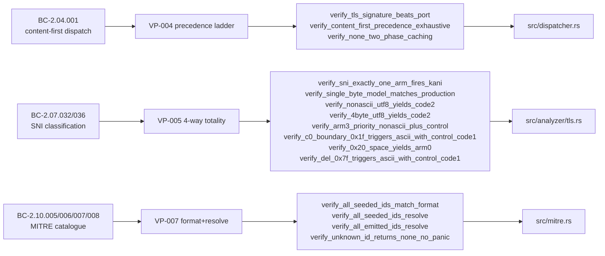

## Summary

Phase-6 Kani formal proofs for the analysis-tier P0 Verification Properties. Adds 8 proof
files (15 harnesses total) for VP-004 (content-first dispatch precedence), VP-005 (SNI 4-way
ordered classification), and VP-007 (MITRE technique-ID format + catalog completeness), all
reaching VERIFICATION: SUCCESSFUL. Also adds a normal-build drift guard
(`vp007_catalog_drift_guard`) and a `[lints.rust] check-cfg=['cfg(kani)']` registration in
`Cargo.toml` so cfg(kani)-gated harnesses do not trip CI's `-Dwarnings`. No production logic
changed.

## Architecture Changes

```mermaid
graph TD
    A[Cargo.toml] -->|check-cfg kani lint| B[cfg(kani) gating]
    B --> C[src/dispatcher.rs<br/>VP-004 harnesses × 3]
    B --> D[src/analyzer/tls.rs<br/>VP-005 harnesses × 8]
    B --> E[src/mitre.rs<br/>VP-007 harnesses × 4]
    E --> F[vp007_catalog_drift_guard<br/>normal-build test]
    D --> G[proptest_proofs_vp005<br/>supplement]
```

No changes to production logic, public API, or data paths. All additions are either
`#[cfg(kani)]`-gated (invisible to normal build) or `#[cfg(test)]`-gated (test-only).

## Story Dependencies


Depends on: PR #179 (proptest gap harnesses, merged). Blocks: reassembly Kani batch
(VP-001/002/003/009/015).

## Spec Traceability



## Harness Inventory

| VP | File | Harness | Result | Max Time |
|----|------|---------|--------|----------|
| VP-004 | `src/dispatcher.rs` | `verify_tls_signature_beats_port` | SUCCESSFUL | <1s |
| VP-004 | `src/dispatcher.rs` | `verify_content_first_precedence_exhaustive` | SUCCESSFUL | ~30s |
| VP-004 | `src/dispatcher.rs` | `verify_none_two_phase_caching` | SUCCESSFUL | <5s |
| VP-005 | `src/analyzer/tls.rs` | `verify_sni_exactly_one_arm_fires_kani` | SUCCESSFUL | <1s |
| VP-005 | `src/analyzer/tls.rs` | `verify_single_byte_model_matches_production` | SUCCESSFUL | 60.8s |
| VP-005 | `src/analyzer/tls.rs` | `verify_nonascii_utf8_yields_code2` | SUCCESSFUL | <1s |
| VP-005 | `src/analyzer/tls.rs` | `verify_4byte_utf8_yields_code2` | SUCCESSFUL | <1s |
| VP-005 | `src/analyzer/tls.rs` | `verify_arm3_priority_nonascii_plus_control` | SUCCESSFUL | <1s |
| VP-005 | `src/analyzer/tls.rs` | `verify_c0_boundary_0x1f_triggers_ascii_with_control_code1` | SUCCESSFUL | <1s |
| VP-005 | `src/analyzer/tls.rs` | `verify_0x20_space_yields_arm0` | SUCCESSFUL | <1s |
| VP-005 | `src/analyzer/tls.rs` | `verify_del_0x7f_triggers_ascii_with_control_code1` | SUCCESSFUL | <1s |
| VP-007 | `src/mitre.rs` | `verify_all_seeded_ids_match_format` | SUCCESSFUL | <1s |
| VP-007 | `src/mitre.rs` | `verify_all_seeded_ids_resolve` | SUCCESSFUL | <1s |
| VP-007 | `src/mitre.rs` | `verify_all_emitted_ids_resolve` | SUCCESSFUL | <1s |
| VP-007 | `src/mitre.rs` | `verify_unknown_id_returns_none_no_panic` | SUCCESSFUL | <1s |

All 15 harnesses: VERIFICATION: SUCCESSFUL. CI does NOT run Kani (separate toolchain) — these
are a local/manual Phase-6 gate. The harnesses are cfg(kani)-gated so normal CI sees no change.

## Soundness Review Evidence

Two code-review passes reached convergence (0 blocking findings):

**Pass 1** — deep soundness scrutiny of both key abstractions:
- VP-004 `HashMap→Option` model: reviewed against `on_data` lines ~160–177; confirmed
  line-for-line port. No soundness failures. Findings: 4 MINOR + 1 NIT (coverage/doc).
- VP-005 `single_byte_arm` explicit model + concrete anchor: reviewed anchor proof chain;
  confirmed `from_utf8` constant-folds in all concrete calls. No soundness failures.
- Fixes applied: symbolic-cap proof strengthened (was vacuous at cap=1–7, now covers
  full `1..=DEFAULT_MAX_CLASSIFICATION_ATTEMPTS` range); dispatch array widened to 8 bytes
  to cover OPTIONS/CONNECT tokens; CR-006 drift-guard hole closed.

**Pass 2** — verification of fixes:
- `verify_none_two_phase_caching`: confirmed non-vacuous (cap symbolic over 1..=8, loop
  runs 9 iterations, each phase A/B/C checked against symbolic cap).
- `verify_content_first_precedence_exhaustive`: confirmed 8-byte array covers all method
  tokens including OPTIONS/CONNECT (longest at 8 chars). Oracle matches production exactly.
- `vp007_catalog_drift_guard`: confirmed it FAILS on unmirrored catalog additions by
  sweeping the full T####(.###) ID space and deriving the resolved count dynamically.
- Result: APPROVE.

## Security Review

N/A for production logic — all proof harnesses are `#[cfg(kani)]`-gated (zero normal-build
impact). The only normal-build additions are `#[cfg(test)]`-gated code (drift guard,
VP-005/VP-007 supplements) and a `Cargo.toml` lint registration. No production logic changed,
no new attack surface introduced.

VP-004 and VP-005 are security-critical properties (dispatch precedence and SNI
classification correctness). This PR formally PROVES them via bounded model checking —
it does not alter the production implementations.

## Test Evidence

| Gate | Result |
|------|--------|
| `cargo fmt --check` | PASS |
| `cargo clippy --all-targets -- -D warnings` | PASS |
| `cargo test --all-targets` | PASS |
| Kani — all 15 harnesses | VERIFICATION: SUCCESSFUL |
| Normal-build CI (8 checks) | Green (pre-merge) |

The `[lints.rust] check-cfg=['cfg(kani)']` entry in `Cargo.toml` registers the `kani` cfg
so `-Dwarnings` does not flag the gated harnesses as unexpected cfg conditions.

## W11-D2 Trust-Boundary Gate Note

The W11-D2 trust-boundary gate greps `src/` for test seams. The `cfg(any(kani,test))`
helpers (`classify_hostname_vp005`, `is_valid_technique_id_format`, `SEEDED_TECHNIQUE_IDS`)
are verification scaffolding, not `_for_testing` production seams. They should pass the
gate. If CI flags anything related to this, it warrants investigation as a false positive.

## Risk Assessment

- **Blast radius:** Zero. All Kani harnesses are gated behind `#[cfg(kani)]`. The
  `vp007_catalog_drift_guard` and proptest supplement are `#[cfg(test)]`. The only
  unconditional change is adding `[lints.rust]` to `Cargo.toml`.
- **Performance impact:** None. Zero code runs in production builds.
- **Regression risk:** Low. The drift guard actively IMPROVES safety: any future unmirrored
  catalog addition now fails CI.

## AI Pipeline Metadata

- Pipeline mode: Phase-6 formal hardening (Kani bounded model checking)
- Models used: claude-sonnet-4-6 (implementation, review)
- Commits on branch: 3 (initial harnesses, CR-001..005 fixes, CR-006 drift-guard)
- Review cycles to convergence: 2

## Pre-Merge Checklist

- [x] PR description matches actual diff
- [x] All 15 Kani harnesses VERIFICATION: SUCCESSFUL
- [x] 0 blocking review findings (2-pass convergence)
- [x] Security review: N/A (no production logic changes)
- [x] `cargo fmt --check` green
- [x] `cargo clippy --all-targets -- -D warnings` green
- [x] `cargo test --all-targets` green
- [x] Branch rebased onto current develop (3068f8d)
- [x] Human merge pre-authorized (Phase 6)
