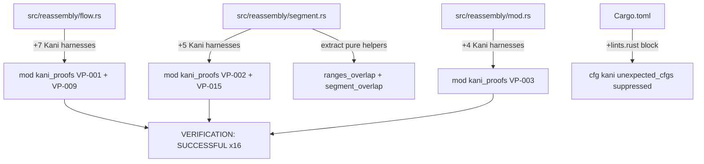
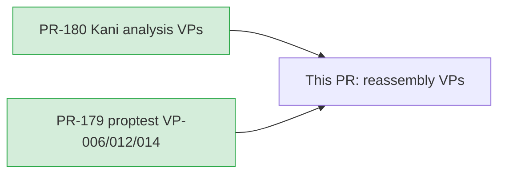
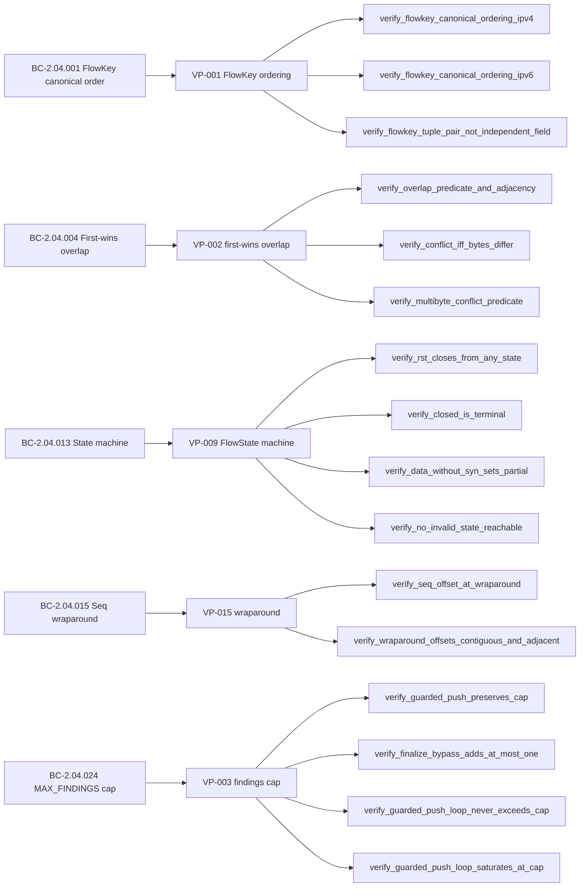

## Summary

Adds 16 Kani formal-verification harnesses for the Phase-6 reassembly verification
properties (VP-001, VP-002, VP-003, VP-009, VP-015). All harnesses achieve
`VERIFICATION: SUCCESSFUL`. Includes a behavior-preserving extract-method refactor of
`insert_segment` to expose two pure helpers (`ranges_overlap`, `segment_overlap`) that
make VP-002's overlap predicates tractable under CBMC. Two-pass code review confirmed
the refactor is algebraically identical to the original logic (no behavior change) and
that all proofs are sound.

## Architecture Changes

All harnesses are `#[cfg(kani)]`-gated and compile out of normal builds.

## Story Dependencies

Both upstream PRs already merged to develop (2a2dd5a).

## Spec Traceability

## Harness Inventory (16 total)

### VP-001 — FlowKey canonical ordering (`src/reassembly/flow.rs`)

| Harness | Scope | Result |
|---------|-------|--------|
| `verify_flowkey_canonical_ordering_ipv4` | Full 32-bit symbolic IPv4 pairs | SUCCESSFUL |
| `verify_flowkey_canonical_ordering_ipv6` | Full 128-bit symbolic IPv6 pairs | SUCCESSFUL |
| `verify_flowkey_tuple_pair_not_independent_field` | Tuple-pair witness (ensures ordering is joint, not per-field) | SUCCESSFUL |

### VP-009 — FlowState machine validity (`src/reassembly/flow.rs`)

| Harness | Scope | Result |
|---------|-------|--------|
| `verify_rst_closes_from_any_state` | Symbolic start state × RST event | SUCCESSFUL |
| `verify_closed_is_terminal` | Symbolic 2-event sequence from Closed | SUCCESSFUL |
| `verify_data_without_syn_sets_partial` | DataWithoutSyn → PartialStream | SUCCESSFUL |
| `verify_no_invalid_state_reachable` | No invalid discriminant reachable from any state | SUCCESSFUL |

### VP-002 — First-wins overlap (`src/reassembly/segment.rs`)

| Harness | Scope | Result |
|---------|-------|--------|
| `verify_overlap_predicate_and_adjacency` | Overlap/adjacency predicate soundness | SUCCESSFUL |
| `verify_conflict_iff_bytes_differ` | All 256×256 per-pair byte conflicts | SUCCESSFUL |
| `verify_multibyte_conflict_predicate` | Multi-byte conflict detection | SUCCESSFUL |

**Formal-coverage boundary (documented in source):** The overlap/conflict *predicates*
(`ranges_overlap`, `segment_overlap`) are Kani-proven. The BTreeMap range-scan,
`fully_covered` aggregate, and gap-fill winner-selection are NOT Kani-verified (BTreeMap
symbolic execution is intractable under CBMC) — these are integration-test-covered. This
boundary is documented in `src/reassembly/segment.rs` and is the basis for VP-002's
"justified" entry at the hardening gate.

### VP-015 — TCP sequence wraparound (`src/reassembly/segment.rs`)

| Harness | Scope | Result |
|---------|-------|--------|
| `verify_seq_offset_at_wraparound` | Symbolic ISN near u32 ceiling | SUCCESSFUL |
| `verify_wraparound_offsets_contiguous_and_adjacent` | Concrete boundary witness at ceiling | SUCCESSFUL |

### VP-003 — MAX_FINDINGS cap (`src/reassembly/mod.rs`)

| Harness | Scope | Result |
|---------|-------|--------|
| `verify_guarded_push_preserves_cap` | Inductive single-step preservation | SUCCESSFUL |
| `verify_finalize_bypass_adds_at_most_one` | finalize() bypass adds ≤1 finding | SUCCESSFUL |
| `verify_guarded_push_loop_never_exceeds_cap` | Below-cap loop: count ≤ MAX_FINDINGS | SUCCESSFUL |
| `verify_guarded_push_loop_saturates_at_cap` | Cap-saturation: drop arm fires at MAX_FINDINGS | SUCCESSFUL |

## Behavior-Preserving Refactor Note

To make VP-002's overlap/conflict predicates tractable under CBMC, `insert_segment` was
refactored to extract two **pure** production helpers:

- `ranges_overlap(new_start, new_end, existing_offset, existing_end) -> bool` — the
  byte-range intersection test, previously inlined.
- `segment_overlap(new_start, new_data, existing_offset, existing_data) -> (bool, bool)` —
  returns `(overlaps, conflicts)`, previously inlined inside the BTreeMap scan loop.

Code review Pass 1 explicitly verified this refactor is **behavior-preserving**:
pure extract-method, algebraically identical overlap/conflict logic, no allocations
added, no new seam or test-only path. The helpers are legit production functions
called from `insert_segment` on the hot path.

## Test Evidence

- Normal test suite: **1097 tests passing** (`cargo test --all-targets`)
- Kani harnesses: **16/16 VERIFICATION: SUCCESSFUL** (all <60s)
- `cargo clippy --all-targets -- -D warnings`: **clean** (0 warnings)
- `cargo fmt --check`: **clean**
- Harnesses compile out via `#[cfg(kani)]` in normal builds — zero impact on CI

## Demo Evidence

Kani formal proofs are CLI/terminal artifacts (CBMC bounded model checking output).
No interactive demo is applicable. Evidence is the Kani harness source code and
verification results documented in this PR body and commit history.

## Holdout Evaluation

N/A — evaluated at wave gate.

## Adversarial Review

N/A — evaluated at Phase 5. Code review Pass 1 verdict: refactor BEHAVIOR-PRESERVING,
proofs sound, 6 LOW/MINOR findings (doc accuracy, vacuous assertion, IPv4-only overclaim)
→ all fixed. Pass 2: new harnesses non-vacuous with real teeth, VP-002 formal-coverage
boundary accurate. No CRITICAL/HIGH at any point.

## Security Review

N/A for net-new production logic. The `ranges_overlap` / `segment_overlap` helpers are
pure functions with no I/O, no allocation, no unsafe, no new attack surface. Harnesses
are `#[cfg(kani)]`-gated and do not ship in production builds.

## Risk Assessment

- **Blast radius:** Reassembly source files (`flow.rs`, `segment.rs`, `mod.rs`) only.
  Disjoint from HTTP/terminal (#179) and dispatcher/TLS/MITRE (#180) changes.
- **Performance impact:** None. Helpers are pure extractions of existing inline logic.
  No allocation change, no algorithmic change.
- **Behavioral risk:** None. Code review 2× confirmed behavior-preserving.

## AI Pipeline Metadata

- Pipeline mode: Phase 6 (Kani formal hardening — reassembly batch)
- Models: claude-sonnet-4-6
- Review cycles: 2 passes to convergence (Pass 1: 6 LOW/MINOR fixed; Pass 2: APPROVE)

## Pre-Merge Checklist

- [x] PR description matches actual diff
- [x] All VPs covered by harness evidence (16/16)
- [x] Traceability chain complete (BC → VP → Harness → SUCCESSFUL)
- [x] Behavior-preserving refactor reviewed and confirmed
- [x] VP-002 formal-coverage boundary documented
- [x] `[lints.rust]` conflict resolved (develop's version kept, duplicate dropped)
- [x] `cargo build` clean post-rebase
- [x] `cargo clippy -- -D warnings` clean
- [x] `cargo test --all-targets` 1097 passing
- [x] No CRITICAL/HIGH security findings
- [x] All dependency PRs merged (#179, #180)
- [x] Human pre-approved Phase 6 merge
