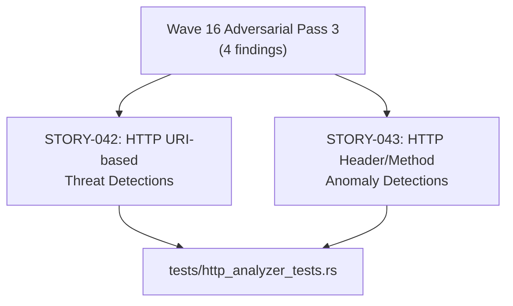
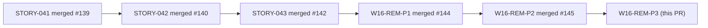
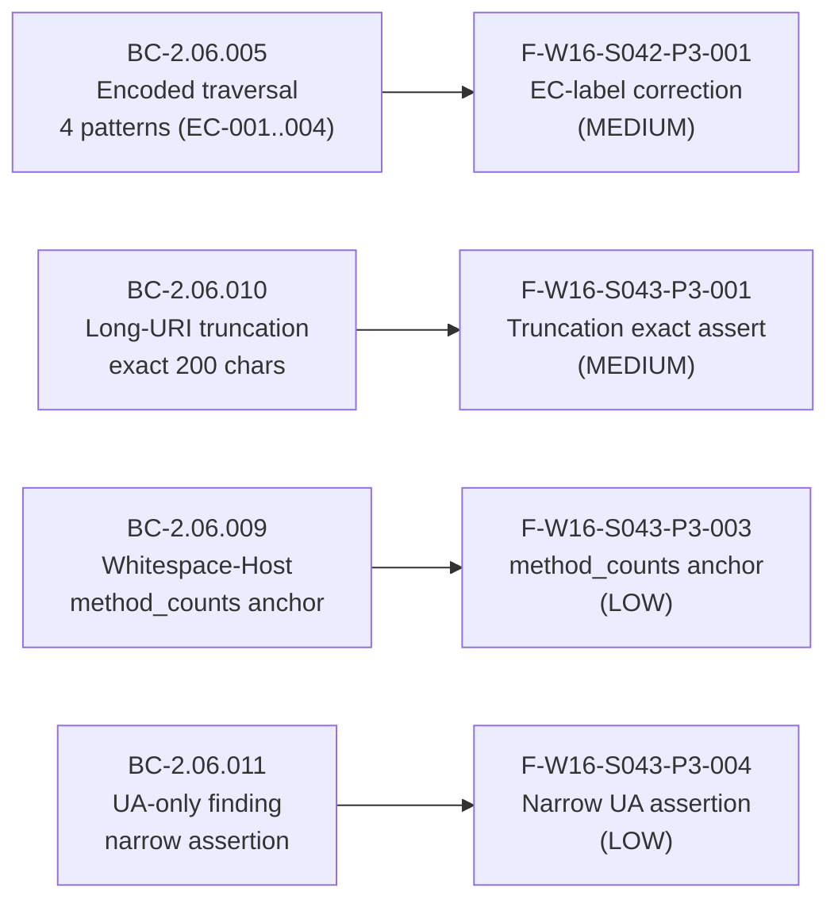

# test(http): Wave 16 adversarial-review Pass-3 test-quality fixes (STORY-042/043)

**Scope:** Test-only remediation — no `src/` production changes
**Wave:** Wave 16 retroactive adversarial review, Pass 3
**Stories affected:** STORY-042 (HTTP URI-based threat detections), STORY-043 (HTTP header/method anomaly detections)

---

## Summary

Four test-quality findings from the Wave 16 retroactive adversarial review (Pass 3) are
remediated here. All changes are confined to `tests/http_analyzer_tests.rs` — no production
code is touched.

- **F-W16-S043-P3-001 (MEDIUM):** Strengthened vacuous `prefix.len() <= 200` truncation
  assertions to exact length + golden-string equality in two test sites:
  `test_detect_long_uri` and `test_BC_2_06_010_very_long_uri_evidence_truncated_to_200`.
- **F-W16-S042-P3-001 (MEDIUM):** Corrected off-by-one EC-label comments in
  `test_BC_2_06_005_encoded_traversal_four_patterns` to match STORY-042 EC table (EC-001..EC-004).
- **F-W16-S043-P3-003 (LOW):** Added `method_counts` positive-parse anchor to the
  HTTP/1.1 whitespace-Host sub-case.
- **F-W16-S043-P3-004 (LOW):** Narrowed over-broad `findings().is_empty()` assertion to
  the targeted UA-only assertion.

---

## Architecture Changes

---

## Story Dependencies

All upstream PRs already merged. No blockers.

---

## Spec Traceability

---

## Findings Detail

| Finding ID | Severity | File | Description |
|------------|----------|------|-------------|
| F-W16-S043-P3-001 | MEDIUM | `tests/http_analyzer_tests.rs` | Strengthened `prefix.len() <= 200` to exact length + golden-string equality (2 sites: `test_detect_long_uri`, `test_BC_2_06_010_very_long_uri_evidence_truncated_to_200`) |
| F-W16-S042-P3-001 | MEDIUM | `tests/http_analyzer_tests.rs` | Corrected off-by-one EC-label comments in `test_BC_2_06_005_encoded_traversal_four_patterns` to match STORY-042 EC table (EC-001..EC-004) |
| F-W16-S043-P3-003 | LOW | `tests/http_analyzer_tests.rs` | Added `method_counts` positive-parse anchor to HTTP/1.1 whitespace-Host sub-case |
| F-W16-S043-P3-004 | LOW | `tests/http_analyzer_tests.rs` | Narrowed over-broad `findings().is_empty()` to targeted UA-only assertion |

---

## Test Evidence

- `cargo test --all-targets` — all green on `test/wave16-adversarial-remediation-p3`
- `cargo clippy --all-targets -- -D warnings` — clean
- `cargo fmt --check` — clean
- Files changed: `tests/http_analyzer_tests.rs` (+40/-20)
- No production code changes — zero blast radius on runtime behavior

---

## Holdout Evaluation

N/A — evaluated at wave gate.

---

## Adversarial Review

These changes ARE the Pass-3 adversarial remediation. All 4 findings (2 MEDIUM, 2 LOW)
pre-remediated in the commit before PR creation.

---

## Demo Evidence

N/A — test-quality fixes only. No new ACs introduced. Prior demo evidence at
`docs/demo-evidence/STORY-042/` and `docs/demo-evidence/STORY-043/` remains valid and
unaffected by these changes.

---

## Security Review

N/A — test-only changes. No production paths modified. No new dependencies introduced.
No input validation, authentication, or data-handling code touched.

---

## Risk Assessment

- **Blast radius:** Zero — all changes confined to `tests/`. No production behavior altered.
- **Performance impact:** None.
- **Rollback:** Trivial — test-only changes can be reverted without any runtime impact.

---

## AI Pipeline Metadata

- **Pipeline mode:** brownfield-adversarial-remediation
- **Models used:** claude-sonnet-4-6
- **Wave:** 16 (retroactive adversarial review, Pass 3)

---

## Pre-Merge Checklist

- [x] PR description matches actual diff (test-only, 4 findings)
- [x] All upstream story PRs merged (#139, #140, #141, #142, #143, #144, #145)
- [x] `cargo test --all-targets` green
- [x] `cargo clippy --all-targets -- -D warnings` clean
- [x] `cargo fmt --check` clean
- [x] Security review: N/A (test-only)
- [x] Demo evidence: N/A (no new ACs)
- [x] Semantic PR title confirmed: `test(http): Wave 16 adversarial-review Pass-3 test-quality fixes (STORY-042/043)`
- [x] Target branch: `develop`
