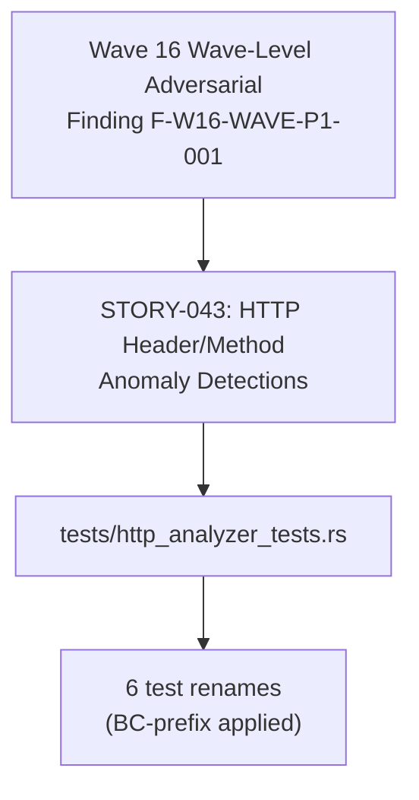
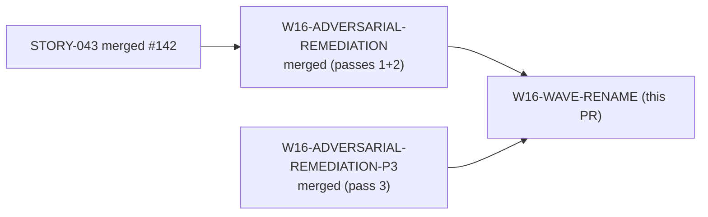
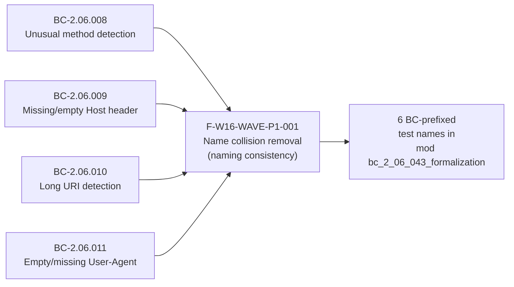

# test(http): BC-prefix STORY-043 formalization tests to remove name collision (F-W16-WAVE-P1-001)

**Scope:** Test-only remediation — no `src/` production changes  
**Wave:** Wave 16 wave-level adversarial review, Pass 1 finding F-W16-WAVE-P1-001  
**Stories affected:** STORY-043 (HTTP header/method anomaly detections)

---

## Summary

Wave 16 wave-level adversarial review identified finding F-W16-WAVE-P1-001: STORY-043's 6
formalization tests inside `mod bc_2_06_043_formalization` shared bare names with pre-existing
legacy top-level tests of the same names, making AC citations ambiguous. The 6 tests are renamed
to BC-prefixed form matching STORY-044's convention. Legacy basis tests of the same names are
unchanged.

Renamed tests:
- `test_detect_unusual_method` → `test_BC_2_06_008_detect_unusual_method`
- `test_detect_missing_host_header` → `test_BC_2_06_009_detect_missing_host_header`
- `test_detect_empty_host_header` → `test_BC_2_06_009_detect_empty_host_header`
- `test_detect_long_uri` → `test_BC_2_06_010_detect_long_uri`
- `test_detect_empty_user_agent` → `test_BC_2_06_011_detect_empty_user_agent`
- `test_missing_user_agent_no_finding` → `test_BC_2_06_011_missing_user_agent_no_finding`

---

## Architecture Changes

---

## Story Dependencies

All upstream PRs already merged. No blockers.

---

## Spec Traceability

---

## Findings Detail

| Finding ID | Severity | File | Description |
|------------|----------|------|-------------|
| F-W16-WAVE-P1-001 | NAMING | `tests/http_analyzer_tests.rs` | 6 STORY-043 formalization tests had bare names colliding with legacy top-level tests; renamed to BC-prefixed form |

---

## Test Evidence

- `cargo test --all-targets` — all green on `test/wave16-story043-bc-prefix`
- `cargo clippy --all-targets -- -D warnings` — clean
- `cargo fmt --check` — clean
- Files changed: `tests/http_analyzer_tests.rs` (+6/-6, pure renames)
- No production code changes — zero blast radius on runtime behavior

---

## Demo Evidence

N/A — test naming consistency fix only. No new ACs introduced. No behavioral change.
Prior demo evidence at `docs/demo-evidence/STORY-043/` remains valid and unaffected.

---

## Security Review

N/A — test-only changes. No production paths modified. No new dependencies introduced.
No input validation, authentication, or data-handling code touched.

---

## Risk Assessment

- **Blast radius:** Zero — all changes confined to `tests/`. No production behavior altered.
- **Performance impact:** None.
- **Rollback:** Trivial — test-only renames, no runtime impact.

---

## AI Pipeline Metadata

- **Pipeline mode:** brownfield-adversarial-remediation (wave-level)
- **Models used:** claude-sonnet-4-6
- **Wave:** 16 (wave-level adversarial review, Pass 1, finding F-W16-WAVE-P1-001)

---

## Pre-Merge Checklist

- [x] PR description matches actual diff (6 test renames, test-only)
- [x] All upstream story PRs merged (STORY-043 #142, W16 remediation passes merged)
- [x] `cargo test --all-targets` green
- [x] `cargo clippy --all-targets -- -D warnings` clean
- [x] `cargo fmt --check` clean
- [x] Security review: N/A (test-only)
- [x] Demo evidence: N/A (no new ACs)
- [x] Semantic PR title confirmed
- [x] Target branch: `develop`
