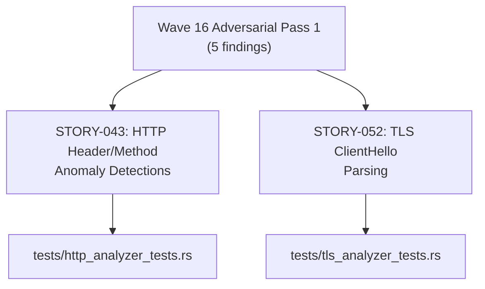
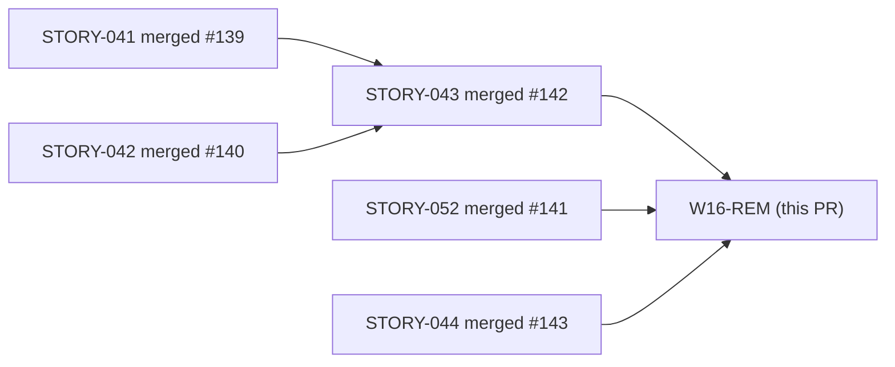
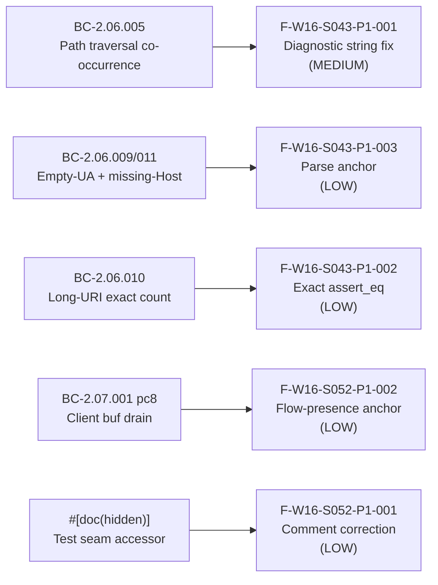

# test(http,tls): Wave 16 adversarial-review test-quality fixes (STORY-043/052)

**Scope:** Test-only remediation — no `src/` production changes  
**Wave:** Wave 16 retroactive adversarial review, Pass 1  
**Stories affected:** STORY-043 (HTTP header/method anomaly detections), STORY-052 (TLS ClientHello parsing)

---

## Summary

Five test-quality findings from the Wave 16 retroactive adversarial review (Pass 1) are
remediated here. All changes are confined to `tests/http_analyzer_tests.rs` and
`tests/tls_analyzer_tests.rs` — no production code is touched.

---

## Architecture Changes

---

## Story Dependencies

All upstream PRs already merged. No blockers.

---

## Spec Traceability

---

## Findings Detail

| Finding ID | Severity | File | Description |
|------------|----------|------|-------------|
| F-W16-S043-P1-001 | MEDIUM | `tests/http_analyzer_tests.rs` | Corrected diagnostic string `BC-2.06.001` → `BC-2.06.005` in path-traversal co-occurrence test |
| F-W16-S043-P1-002 | LOW | `tests/http_analyzer_tests.rs` | `.contains("10000 chars")` → exact `assert_eq!` on summary (+ sibling fix at line 659 for "2101 chars") |
| F-W16-S043-P1-003 | LOW | `tests/http_analyzer_tests.rs` | Added positive-parse anchor to empty-UA + missing-Host co-occurrence test |
| F-W16-S052-P1-001 | LOW | `tests/tls_analyzer_tests.rs` | Corrected misleading comment `#[cfg(test)]` → `#[doc(hidden)]` for the test seam |
| F-W16-S052-P1-002 | LOW | `tests/tls_analyzer_tests.rs` | Strengthened weak `==0` assertion with flow-presence pre-assertion to disambiguate drain from flow-absence |

---

## Test Evidence

- `cargo test --all-targets` — all green on `test/wave16-adversarial-remediation`
- `cargo clippy --all-targets -- -D warnings` — clean
- `cargo fmt --check` — clean
- Files changed: `tests/http_analyzer_tests.rs` (+17/-8), `tests/tls_analyzer_tests.rs` (+13/-1)
- No production code changes — zero blast radius on runtime behavior

---

## Demo Evidence

N/A — test-quality fixes only. No new ACs introduced. Prior demo evidence at
`docs/demo-evidence/STORY-043/` and `docs/demo-evidence/STORY-052/` remains valid and
unaffected by these changes.

---

## Security Review

N/A — test-only changes. No production paths modified. No new dependencies introduced.
No input validation, authentication, or data-handling code touched.

---

## Risk Assessment

- **Blast radius:** Zero — all changes confined to `tests/`. No production behavior altered.
- **Performance impact:** None.
- **Rollback:** Trivial — test-only changes can be reverted without any runtime impact.

---

## AI Pipeline Metadata

- **Pipeline mode:** brownfield-adversarial-remediation
- **Models used:** claude-sonnet-4-6
- **Wave:** 16 (retroactive adversarial review, Pass 1)

---

## Pre-Merge Checklist

- [x] PR description matches actual diff (test-only, 5 findings)
- [x] All upstream story PRs merged (#139, #140, #141, #142, #143)
- [x] `cargo test --all-targets` green
- [x] `cargo clippy --all-targets -- -D warnings` clean
- [x] `cargo fmt --check` clean
- [x] Security review: N/A (test-only)
- [x] Demo evidence: N/A (no new ACs)
- [x] Semantic PR title confirmed
- [x] Target branch: `develop`
