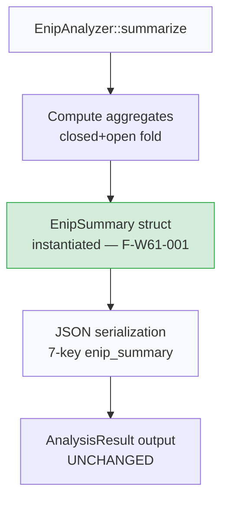
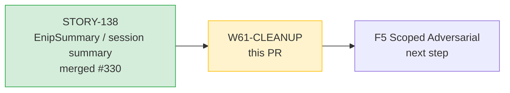
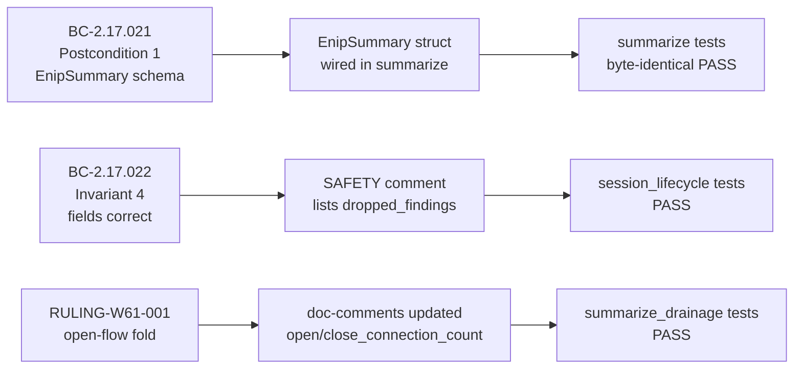

## Summary

Behavior-neutral pre-F5 cleanup: three Wave-61 findings (F-W61-001, F-W61-002, O-1) resolved
against `src/analyzer/enip.rs`. JSON output is **byte-identical** — the 7-key `enip_summary`
schema (command_distribution, total_pdu_count, parse_errors, write_count, error_count,
flows_analyzed, dropped_findings) is unchanged. All existing summarize / session_lifecycle /
summarize_drainage tests pass without modification, proving byte-identical output.

## Changes

| Finding | Description | File | Type |
|---------|-------------|------|------|
| F-W61-001 | Wire `summarize()` through `pub struct EnipSummary` — struct was formerly dead (never instantiated); now the load-bearing construction step before JSON serialization | `src/analyzer/enip.rs` | Correctness (doc accuracy + struct liveness) |
| F-W61-002 | SAFETY comment of the unsafe split-borrow now lists `self.dropped_findings` (doc accuracy; soundness unchanged — `process_pdu` already correctly avoided `self.flows`) | `src/analyzer/enip.rs` | Doc accuracy |
| O-1 | Corrected stale "Read by STORY-138 summary" doc-comments on `open_connection_count` / `close_connection_count` — these fields are per-flow lifetime counters not surfaced in `enip_summary` | `src/analyzer/enip.rs` | Doc accuracy |

## Architecture Changes

_Before F-W61-001: computed aggregates were serialized directly; `EnipSummary` was defined
but never instantiated. After: `EnipSummary` is constructed as a named intermediate — JSON
output is byte-identical._

## Story Dependencies

No story-level dependencies blocked. This is a cleanup fix against STORY-135/138 (`#316`).

## Spec Traceability

## Test Evidence

- `cargo test --all-targets` at `f949b07`: **0 failures**
- `cargo clippy --all-targets -- -D warnings`: **clean**
- `cargo fmt --check`: **clean**
- All existing `summarize`, `session_lifecycle`, and `summarize_drainage` tests pass
  WITHOUT modification (proves byte-identical JSON output)
- No new tests required — behavior-neutral doc + struct-wiring cleanup only

## Holdout Evaluation

N/A — evaluated at wave gate. This is a behavior-neutral cleanup; no AC regression possible.

## Adversarial Review

N/A — evaluated at Phase 5. This cleanup was driven by Wave-61 adversarial findings.

## Security Review

To be populated after Step 4 security-reviewer dispatch.

## Risk Assessment

| Dimension | Assessment |
|-----------|-----------|
| Blast radius | Single file: `src/analyzer/enip.rs` |
| Behavior change | None — byte-identical JSON output proven by passing tests |
| Public API impact | `EnipSummary` gains `#[derive(Debug)]` — additive, not breaking |
| Performance | No performance impact — struct instantiation is zero-cost at this scale |

## AI Pipeline Metadata

| Field | Value |
|-------|-------|
| Pipeline mode | fix-PR (Wave-61 cleanup, pre-F5) |
| Branch | `refactor/enip-summary-wire-cleanup` |
| Base | `develop` (HEAD `7ceb670`) |
| Worktree HEAD | `f949b07` |
| Story ref | #316 (STORY-135 / STORY-138) |
| Findings addressed | F-W61-001, F-W61-002, O-1 |

## Pre-Merge Checklist

- [x] Branch pushed to origin
- [x] PR created with structured description
- [ ] Security review complete
- [ ] AI code review (pr-reviewer) approved
- [ ] CI checks passing
- [ ] Dependencies merged (STORY-138 merged in #330 — satisfied)
- [ ] HUMAN AUTHORIZATION for merge (HALT enforced — D-231)
