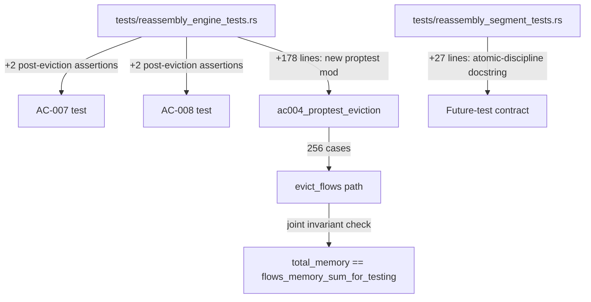
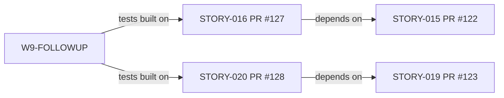
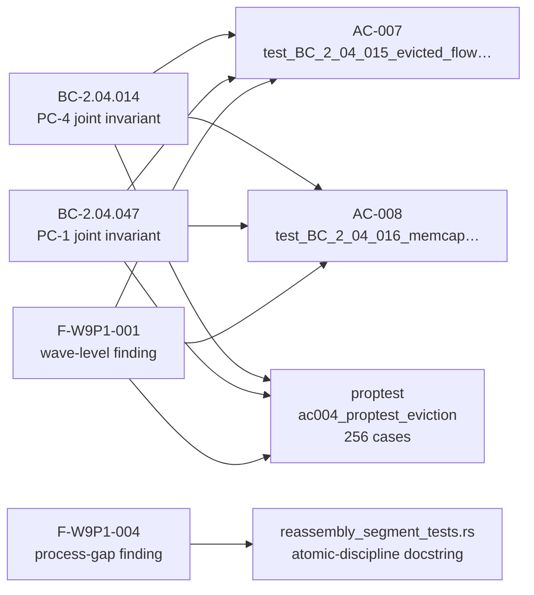

## Summary

Wave-9 wave-level adversarial pass-1 remediation. Addresses 2 MED findings from
the wave-level adversarial review cycle (F-W9P1-001, F-W9P1-004). Zero `src/`
changes — brownfield-formalization preserved.

**Finding F-W9P1-001 — joint invariant not asserted post-eviction:**
The BC-2.04.014 PC-4 / BC-2.04.047 PC-1 joint invariant
(`total_memory == flows_memory_sum_for_testing()`) was only verified in
no-eviction paths. Added assertions to AC-007 (`test_BC_2_04_015_…`) and AC-008
(`test_BC_2_04_016_…`) immediately after eviction fires. Added a new proptest
`test_BC_2_04_014_proptest_total_memory_invariant_under_eviction` (256 cases,
memcap=50/max_flows=4) that forces eviction on almost every run and checks the
invariant after each op.

**Finding F-W9P1-004 [process-gap] — atomic-discipline docstring missing from segment_tests:**
STORY-019's CLOSE_FLOW + ISN_MISSING_WARNED discipline doctrine (documented at
`reassembly_engine_tests.rs` lines 10-26) was not propagated to the companion
binary `reassembly_segment_tests.rs`. Added a 27-line top-of-file docstring
documenting the separate-binary isolation model and the contract for future tests
that inspect the atomic.

---

## Architecture Changes

No `src/` files changed.

---

## Story Dependencies

All upstream PRs (#122, #123, #127, #128) are merged into `develop`.

---

## Spec Traceability

---

## Test Evidence

| Metric | Value |
|--------|-------|
| Total tests | 631 (was 630 before this commit) |
| Failures | 0 |
| New tests added | 1 proptest (`ac004_proptest_eviction`, 256 cases) |
| New assertions added | 2 (post-eviction in AC-007, AC-008) |
| Clippy | Clean (`-D warnings`) |
| `cargo fmt --check` | Clean |
| `src/` changes | None — brownfield-formalization preserved |

---

## Demo Evidence

N/A — this PR contains only test additions and a docstring. No UI or CLI behavior
changed. Wave-9 per-story demo evidence is in `docs/demo-evidence/STORY-016/`
and `docs/demo-evidence/STORY-020/` (committed in PRs #127/#128).

---

## Holdout Evaluation

N/A — evaluated at wave gate.

---

## Adversarial Review

Wave-9 wave-level adversarial pass-1 (fresh-context) produced 2 MED findings:

| ID | Severity | Description | Status |
|----|----------|-------------|--------|
| F-W9P1-001 | MED | Joint invariant not asserted post-eviction | FIXED — 2 assertions + proptest |
| F-W9P1-004 | MED | Atomic-discipline docstring absent from segment_tests | FIXED — 27-line docstring added |

---

## Security Review

No `src/` changes. No new public API surface. No new I/O, network, or
deserialization paths. Security posture unchanged from Wave-9 story PRs (#127/#128).

Risk classification: **LOW** — test-only additions with no behavioral change.

---

## Risk Assessment

| Dimension | Assessment |
|-----------|------------|
| Blast radius | Minimal — test files only |
| Performance impact | None — no src/ changes |
| Behavioral change | None |
| Rollback cost | Trivial — revert test additions |

---

## AI Pipeline Metadata

| Field | Value |
|-------|-------|
| Pipeline mode | brownfield / wave-9 wave-level remediation |
| Wave | 9 |
| Stories in wave | STORY-016 + STORY-020 |
| Wave-level adversarial pass | Pass 1 (2 MED findings remediated) |
| Worktree | w9-followup / branch `worktree-w9-followup` |

---

## Pre-Merge Checklist

- [x] PR description matches actual diff
- [x] All ACs covered (AC-007, AC-008, + new proptest)
- [x] Traceability chain complete (BC → AC → Test)
- [x] All review findings addressed (F-W9P1-001, F-W9P1-004)
- [x] 631 tests passing, 0 failures
- [x] Clippy clean
- [x] fmt clean
- [x] Zero src/ changes — brownfield-formalization preserved
- [x] All upstream dependency PRs merged (#122, #123, #127, #128)
- [x] CI checks must pass before merge
