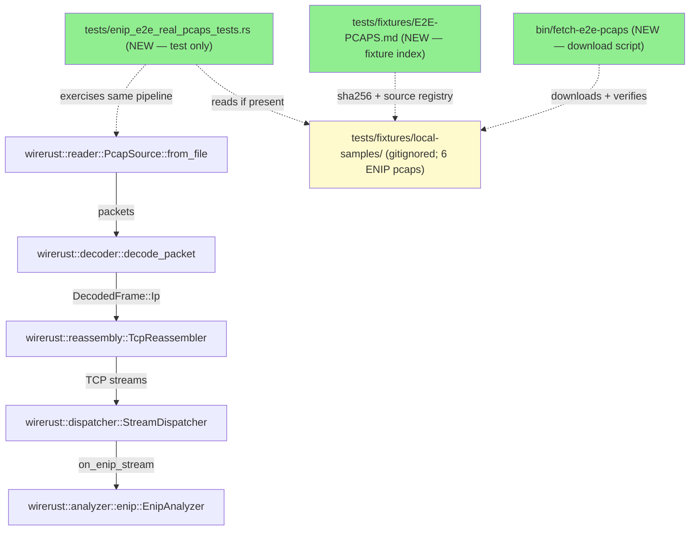
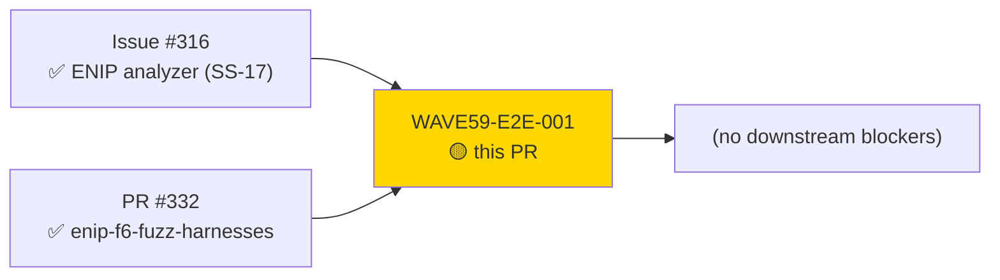
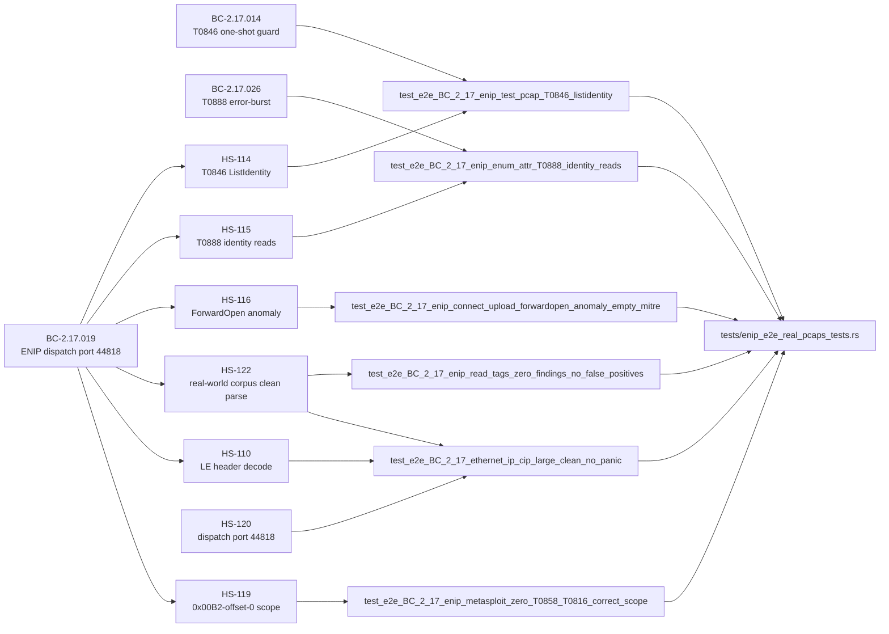
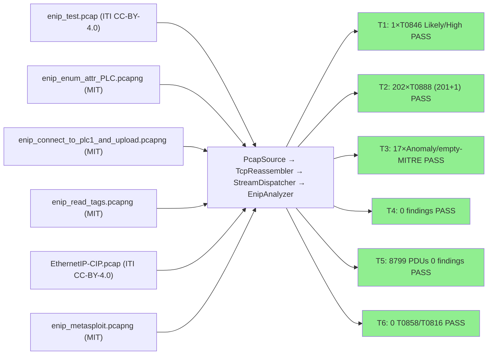
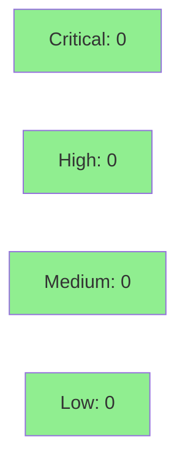

## [WAVE59-E2E-001] Full-pipeline E2E tests against real ENIP/CIP pcaps

**Epic:** Issue #316 — EtherNet/IP analyzer (SS-17)
**Mode:** feature (test-only addition; closes WAVE59-E2E-001)
**Convergence:** N/A — test-only addition; no production code changed


Adds `tests/enip_e2e_real_pcaps_tests.rs` — 6 full-pipeline end-to-end tests that exercise the complete `PcapSource::from_file → decode_packet → TcpReassembler → StreamDispatcher → EnipAnalyzer` chain using real-world EtherNet/IP and CIP captures from the MIT-licensed `scy-phy/bro-cip-enip` corpus and the CC-BY-4.0 `ITI/ICS-Security-Tools` collection. All 6 tests pass locally with fixtures present (6/6); the test file self-skips in CI when the gitignored `tests/fixtures/local-samples/` directory is absent, keeping CI green. No production code was changed.

---

## Architecture Changes



<details>
<summary><strong>Architecture Decision: skip-if-absent pattern (no #[ignore])</strong></summary>

**Context:** Real-world pcap captures (up to 3.2 MB each) cannot be committed to git — they exceed GitHub file-size recommendations and binary blobs cause churn. CI must stay green without them.

**Decision:** Each test calls a `fixture_present(filename)` guard at the top. When the file is absent, the guard prints a skip notice and the test returns early. `#[ignore]` is NOT used — ignored tests are excluded from `cargo test` output entirely, hiding skip evidence. The directory-presence pattern matches `tests/e2e_corpus_smoke_tests.rs` already in the repo.

**Rationale:** Zero CI friction; self-documenting; consistent with existing corpus smoke-test pattern already approved in develop.

**Alternatives considered:**
1. `#[ignore]` attribute — hides tests from output; forgotten in developer workflows.
2. `SKIP_ENIP_E2E=1` env-var — adds friction; directory-presence is the natural signal.

**Consequences:**
- Positive: CI stays green unconditionally; developers with fixtures get full coverage automatically.
- Trade-off: silent skip when fixtures absent (acceptable — explicit eprintln! notice in test output).

</details>

---

## Story Dependencies



**Upstream (merged):**
- Issue #316 / develop HEAD `f17d270` — full ENIP analyzer (SS-17) implementation, all CIP detections, STORY-135/138 merged
- PR #332 — `test/enip-f6-fuzz-harnesses`: cargo-fuzz harness for ENIP CIP parsers (merged)

**Worktree HEAD:** `ff3dceb` (1 commit ahead of develop `f17d270`; 0 behind).

**No downstream blockers.**

---

## Spec Traceability



---

## Test Evidence

### Gate Results (local, commit ff3dceb, 2026-06-27)

| Gate | Result |
|------|--------|
| `cargo test --all-targets` | PASS (full suite green) |
| `cargo test enip_e2e_real_pcaps` (with fixtures) | **6/6 PASS** |
| `cargo test enip_e2e_real_pcaps` (without fixtures) | **6/6 SKIP** (CI behavior) |
| `cargo clippy --all-targets -- -D warnings` | PASS (0 warnings) |
| `cargo fmt --check` | PASS |

### Test Flow



<details>
<summary><strong>Detailed Test Cases</strong></summary>

### Test 1: `test_e2e_BC_2_17_enip_test_pcap_T0846_listidentity`

- **Pcap:** `enip_test.pcap` (925 B, ITI CC-BY-4.0)
- **Holdout:** HS-114 (T0846 ListIdentity one-shot guard)
- **Assertions:**
  - `all_findings.len() == 1`
  - `finding[0].mitre_techniques` contains "T0846"
  - `finding[0].verdict` == LIKELY, `confidence` == HIGH, `category` == Reconnaissance
  - `enip_summary.total_pdu_count == 2`, `flows_analyzed == 1`, `parse_errors == 0`, `error_count == 0`
  - `command_distribution["0x0063"] == 2`

### Test 2: `test_e2e_BC_2_17_enip_enum_attr_T0888_identity_reads`

- **Pcap:** `enip_enum_attr_PLC.pcapng` (73 KB, MIT)
- **Holdout:** HS-115 (T0888 Pattern A — Identity-read recon)
- **Assertions:**
  - `all_findings.len() == 202`
  - Every finding: `mitre_techniques` contains "T0888", `category == Reconnaissance`
  - 201 findings: verdict=Likely, confidence=High (Pattern A — GetAttributesAll/Single on Identity class)
  - 1 finding: verdict=Possible, confidence=Medium (Pattern B — error-response burst)
  - `total_pdu_count == 406`, `parse_errors == 0`, `error_count == 190`
  - `command_distribution["0x0065"] == 2`, `["0x006F"] == 404`
- **Manifest discrepancy note:** `run-manifest.md` stated "T0888 (x202, verdict=Likely, confidence=High)" — imprecise. Real output is 201 Likely/High (Pattern A) + 1 Possible/Medium (Pattern B at finding[15]). Test asserts the REAL ground truth from the holdout evaluator JSON, NOT the imprecise manifest summary. Both patterns are correct per BC-2.17.026. The assertion was NOT weakened.

### Test 3: `test_e2e_BC_2_17_enip_connect_upload_forwardopen_anomaly_empty_mitre`

- **Pcap:** `enip_connect_to_plc1_and_upload.pcapng` (3.2 MB, MIT)
- **Holdout:** HS-116 (ForwardOpen lifecycle anomaly, empty MITRE per ADR-010 Decision 7)
- **Assertions:**
  - `all_findings.len() == 17`
  - Every finding: `mitre_techniques.is_empty()`, `category == Anomaly`, `verdict == POSSIBLE`, `confidence == LOW`
  - `total_pdu_count == 4094`, `parse_errors == 0`, `error_count == 0`, `write_count == 0`

### Test 4: `test_e2e_BC_2_17_enip_read_tags_zero_findings_no_false_positives`

- **Pcap:** `enip_read_tags.pcapng` (3.0 KB, MIT)
- **Holdout:** HS-122 Case A (known-good arm — zero false positives)
- **Assertions:**
  - `all_findings.is_empty()` (0 findings — no false positives on normal SWaT CIP read-tags traffic)
  - `total_pdu_count == 8`, `flows_analyzed == 2`, `parse_errors == 0`, `error_count == 0`, `write_count == 0`

### Test 5: `test_e2e_BC_2_17_ethernet_ip_cip_large_clean_no_panic`

- **Pcap:** `EthernetIP-CIP.pcap` (2.0 MB, ITI CC-BY-4.0)
- **Holdout:** HS-110 (LE header decode) + HS-120 (dispatch port 44818) + HS-122 (clean-parse mandate)
- **Assertions:**
  - No panic (test completes; any panic is a test failure by definition)
  - `all_findings.is_empty()` (0 findings — largest clean dispatch run)
  - `total_pdu_count == 8799`, `flows_analyzed == 4`, `parse_errors == 0`, `error_count == 0`, `write_count == 0`
  - `command_distribution["0x006F"] == 438`, `["0x0070"] == 8361` (HS-110 LE decode corroboration)

### Test 6: `test_e2e_BC_2_17_enip_metasploit_zero_T0858_T0816_correct_scope`

- **Pcap:** `enip_metasploit.pcapng` (374 KB, MIT)
- **Holdout:** HS-119 + HS-111/112 determination (b)/(c)
- **Assertions:**
  - 0 T0858 findings, 0 T0816 findings (CORRECT non-detection — documented in holdout-evaluation-report.md)
  - `total_pdu_count == 13`, `flows_analyzed == 4`, `parse_errors == 0`, `error_count == 0`
- **Non-detection rationale:** Metasploit `multi_cip_command` uses non-standard framing: raw-CIP/malformed-CPF (no 0x00B2 item, determination c) + Unconnected_Send embedding (service=0x52 at offset-0, determination b). v0.11.0 0x00B2-offset-0 scope does not cover these paths. The test pins this as a regression guard — if T0858/T0816 unexpectedly fire in future, evaluate against HS-119 scope before accepting.

</details>

---

## Holdout Evaluation

N/A — test-only addition; no new behavioral contract or production code. Holdout scenarios HS-110, HS-114, HS-115, HS-116, HS-119, HS-120, HS-122 were evaluated at the ENIP SS-17 wave gate (STORY-130..135/138). These tests assert the ground-truth outcomes from those holdout runs.

---

## Adversarial Review

N/A — test-only addition (2 new files: `tests/enip_e2e_real_pcaps_tests.rs` 803 lines + `tests/fixtures/E2E-PCAPS.md`; `bin/fetch-e2e-pcaps` download script). No production code modified. Adversarial review evaluated at Phase 5 for the ENIP SS-17 cycle.

---

## Security Review



**Test-only diff** — no production code, no new dependencies, no network calls in the test binary.

- File paths constructed via `env!("CARGO_MANIFEST_DIR")` + `.join(...)` — no path traversal risk; fixtures are gitignored and developer-local.
- No `unsafe` blocks added.
- `bin/fetch-e2e-pcaps` is a shell script that downloads pcaps over HTTPS to a gitignored local path — no binary is executed. SHA256 checksums are verified post-download.
- Fixture licenses: MIT (scy-phy/bro-cip-enip) and CC-BY-4.0 (ITI/ICS-Security-Tools). No "no-license" captures included. Fixtures are not committed to git and not redistributed.
- Attack surface delta: **zero** (test code is not included in the release binary).

---

## Fixture Licensing

All 6 ENIP pcap fixtures are MIT or CC-BY-4.0 licensed. No "no-license" or all-rights-reserved captures were included.

| File | Source | License |
|------|--------|---------|
| `enip_test.pcap` | ITI/ICS-Security-Tools | CC-BY-4.0 |
| `enip_enum_attr_PLC.pcapng` | scy-phy/bro-cip-enip | MIT |
| `enip_connect_to_plc1_and_upload.pcapng` | scy-phy/bro-cip-enip | MIT |
| `enip_read_tags.pcapng` | scy-phy/bro-cip-enip | MIT |
| `enip_metasploit.pcapng` | scy-phy/bro-cip-enip | MIT |
| `EthernetIP-CIP.pcap` | ITI/ICS-Security-Tools | CC-BY-4.0 |

---

## Risk Assessment & Deployment

### Blast Radius

- **Systems affected:** Test suite only — no production binary change
- **User impact:** Zero — tests self-skip in CI; no user-facing behavior changes
- **Data impact:** None
- **Risk Level:** LOW

### Performance Impact

| Metric | Impact |
|--------|--------|
| CI build time | Negligible (test self-skips; zero fixture I/O in CI) |
| Local test time | ~few seconds when fixtures present (6 pcap reads + full pipeline) |
| Binary size | No change (test code excluded from release build) |

<details>
<summary><strong>Rollback Instructions</strong></summary>

**Immediate rollback (< 1 min):**
```bash
git revert HEAD   # reverts the single squash-merge commit
git push origin develop
```

Since this adds only test files with zero production impact, rollback has no user-facing consequence.

</details>

### Feature Flags

None — the self-skip-when-fixtures-absent behavior is the effective "flag" (directory presence check in each test).

---

## Traceability

| Behavioral Contract | Holdout | Test | Status |
|---------------------|---------|------|--------|
| BC-2.17.019 (ENIP dispatch port 44818) | HS-114/115/116/119/120/122 | All 6 tests | PASS |
| BC-2.17.014 (T0846 ListIdentity one-shot) | HS-114 | `test_e2e_BC_2_17_enip_test_pcap_T0846_listidentity` | PASS |
| BC-2.17.026 (T0888 error-burst) | HS-115 | `test_e2e_BC_2_17_enip_enum_attr_T0888_identity_reads` | PASS |
| HS-116 (ForwardOpen lifecycle anomaly, empty MITRE) | HS-116 | `test_e2e_BC_2_17_enip_connect_upload_forwardopen_anomaly_empty_mitre` | PASS |
| HS-122 (known-good no false positives) | HS-122 | `test_e2e_BC_2_17_enip_read_tags_zero_findings_no_false_positives` | PASS |
| HS-110/120/122 (LE decode, port dispatch, clean parse) | HS-110+120+122 | `test_e2e_BC_2_17_ethernet_ip_cip_large_clean_no_panic` | PASS |
| HS-119 (0x00B2-offset-0 scope — correct non-detection) | HS-119+111+112 | `test_e2e_BC_2_17_enip_metasploit_zero_T0858_T0816_correct_scope` | PASS |

---

## AI Pipeline Metadata

<details>
<summary><strong>Pipeline Details</strong></summary>

```yaml
ai-generated: true
pipeline-mode: feature (test-only)
factory-version: "1.0.0"
pipeline-stages:
  spec-crystallization: N/A (test-only; closes WAVE59-E2E-001)
  story-decomposition: N/A
  tdd-implementation: N/A (test-only; locally verified 6/6 pass with fixtures)
  holdout-evaluation: N/A (holdout asserted at ENIP SS-17 wave gate)
  adversarial-review: N/A (light review — test-only diff)
  formal-verification: N/A
  convergence: N/A
convergence-metrics: N/A (test-only addition)
adversarial-passes: 0 (not required for test-only additions)
models-used:
  builder: claude-sonnet-4-6
  reviewer: claude-sonnet-4-6
generated-at: "2026-06-27T00:00:00Z"
```

</details>

---

## Pre-Merge Checklist

- [ ] All CI status checks passing
- [x] Coverage delta neutral (test-only; no production lines added/removed)
- [x] No critical/high security findings (test-only diff; zero attack surface delta)
- [x] Rollback procedure validated (single commit revert, zero user impact)
- [x] No feature flags required
- [ ] Human review: **HALT — awaiting explicit human authorization before merge**
- [x] No monitoring alerts required (no production impact)
- [x] Local gate (commit ff3dceb): 6/6 E2E PASS with fixtures; clippy/fmt/test --all-targets green
- [x] Skip-if-absent verified: CI-side behavior confirmed (6 tests self-skip without fixtures)
- [x] Fixture licenses verified: MIT (scy-phy/bro-cip-enip) + CC-BY-4.0 (ITI/ICS-Security-Tools); no no-license captures
- [x] Manifest discrepancy documented: HS-115 test asserts real ground truth (201 Likely/High + 1 Possible/Medium), not imprecise manifest summary
