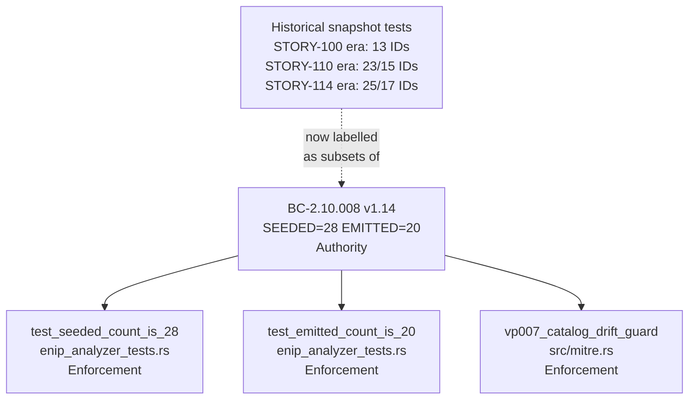
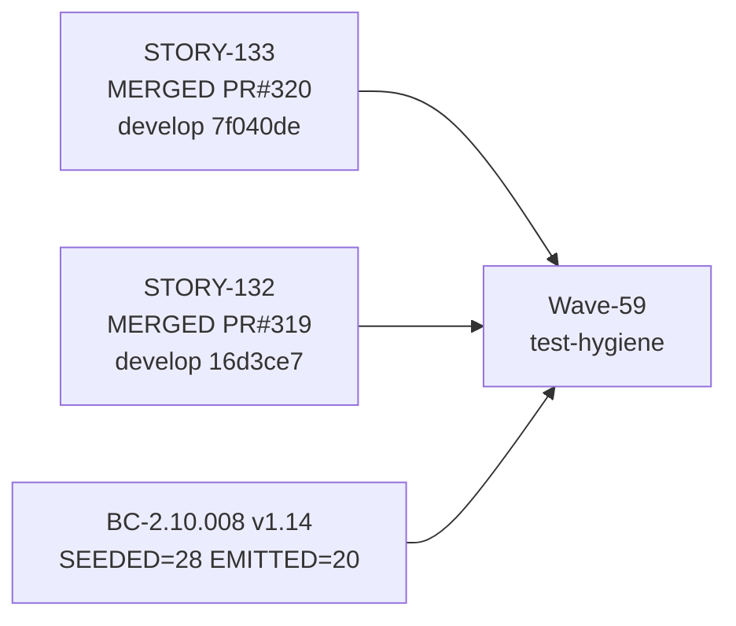
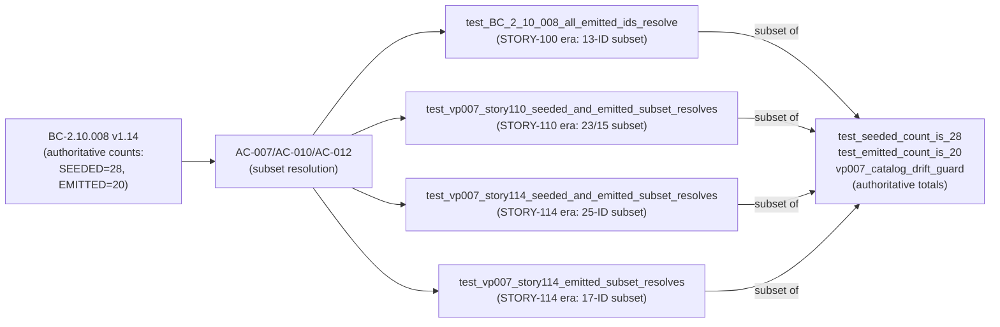

## Summary

Wave-59 wave-level test-hygiene remediation: relabel stale cross-story catalogue-count
snapshots to explicit subset semantics and scrub RED-phase tense from assertion messages.

**Change type:** TEST-PROSE only — no `src/` changes, no behavioral change.

**Cycle:** `feature-enip-v0.11.0` (GitHub issue #316)

---

## Wave-59 Findings Addressed

Three wave-level adversarial findings surfaced after STORY-133 was merged (develop `7f040de`,
PR #320). All findings are message/name/prose corrections to historical subset tests; the
subset invariants themselves are unchanged.

| Finding ID | Severity | Category | Description |
|---|---|---|---|
| F-WAVE59-C-001 | HIGH | spec-fidelity | Stale assertion messages cited "exactly 13/17 emitted" per BC-2.10.008 — contradicting BC-2.10.008 v1.14 (EMITTED=20, SEEDED=28). |
| M-2 (DF-GREEN-DOC-TENSE) | MEDIUM | doc-tense | RED-phase tense string literals ("RED until…") in `bc_2_16_story114_arp_tests.rs` — should be past tense since seeding already happened. |
| DNP3-SNAPSHOT | LOW | snapshot-stale | `bc_2_15_110_dnp3_dispatcher_tests.rs` test name `test_vp007_seeded_23_emitted_15` and its doc implied those were current totals (not historical snapshot). |

---

## Files Changed (4 test files, no `src/` changes)

```
tests/bc_2_09_100_multitag_tests.rs        — relabeled section header + assertion message
tests/bc_2_15_110_dnp3_dispatcher_tests.rs — renamed test fn + relabeled doc + messages
tests/bc_2_16_story114_arp_tests.rs        — renamed 2 test fns + scrubbed RED-tense
tests/mitre_tests.rs                       — relabeled section header + assertion message
```

---

## Architecture Changes

No architectural changes. Test prose/message/name corrections only.



---

## Story Dependencies



This PR has no upstream dependencies — all Wave-59 stories are merged.

---

## Spec Traceability



---

## Test Evidence

All pre-flight checks passed on branch HEAD `3f081e4` (branch `test/wave59-sibling-count-sweep`):

| Check | Result |
|---|---|
| `cargo test --all-targets` | GREEN — all tests pass |
| `cargo clippy --all-targets -- -D warnings` | CLEAN — zero warnings |
| `cargo fmt --check` | CLEAN — no format drift |
| `python3 bin/check-green-doc-tense` | PASS — no RED-tense strings in test files |

**Key behavioral invariants unchanged** — the subset self-checks assert the same numeric invariants:
- `test_BC_2_10_008_all_emitted_ids_resolve` still asserts `emitted_ids.len() == 13` (STORY-100-era subset vector)
- `test_vp007_story110_seeded_and_emitted_subset_resolves` still asserts `all_seeded_ids.len() == 23` (STORY-110-era subset vector)
- `test_vp007_story114_seeded_and_emitted_subset_resolves` still asserts `seeded_25.len() == 25` (STORY-114-era subset vector)
- `test_vp007_story114_emitted_subset_resolves` still asserts `emitted_17.len() == 17` (STORY-114-era subset vector)

These are now correctly understood as subset self-checks, not total-catalogue counts. The authoritative total counts are enforced by `test_seeded_count_is_28`, `test_emitted_count_is_20`, and `vp007_catalog_drift_guard`.

---

## Holdout Evaluation

N/A — evaluated at wave gate. No new behavioral contracts introduced.

---

## Adversarial Review

Wave-59 wave-level adversarial findings F-WAVE59-C-001 (HIGH) and M-2 (MEDIUM) are the
**source** of this PR; this PR is the fix delivery. Evaluated at Wave-59 wave-level gate.

---

## Security Review

N/A — test-prose-only changes (no `src/` changes, no new I/O paths, no dependency changes).

---

## Risk Assessment

| Dimension | Assessment |
|---|---|
| Blast radius | Zero — test prose/name/message corrections only; no behavioral change |
| Performance impact | None |
| Behavioral change | None — subset invariants identical |
| Rollback | Trivially revertable (message/name text only) |

---

## AI Pipeline Metadata

| Field | Value |
|---|---|
| Pipeline mode | Feature-mode (feature-enip-v0.11.0) |
| Cycle | Wave-59 wave-level remediation |
| Issue | GitHub #316 |
| Stories | STORY-132 + STORY-133 (source stories, already merged) |

---

## Pre-Merge Checklist

- [x] All tests pass (`cargo test --all-targets`)
- [x] Clippy clean (`cargo clippy --all-targets -- -D warnings`)
- [x] Format clean (`cargo fmt --check`)
- [x] Green-doc-tense gate passes (`python3 bin/check-green-doc-tense`)
- [x] No `src/` changes — test-prose only
- [x] No version bump needed — test-hygiene only
- [x] Semantic PR title: `test:` type (CI-enforced)
- [x] All Wave-59 source stories merged (STORY-132 PR #319, STORY-133 PR #320)
- [ ] CI green on this PR
- [ ] pr-reviewer APPROVE
