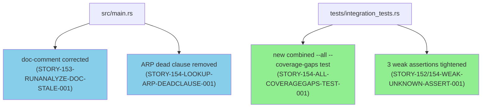
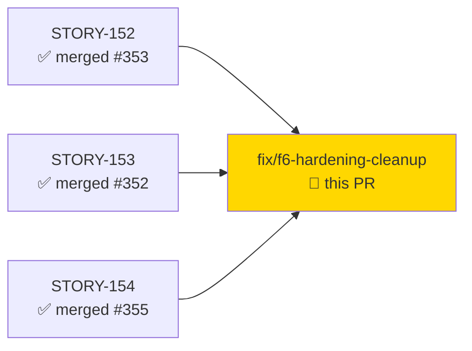
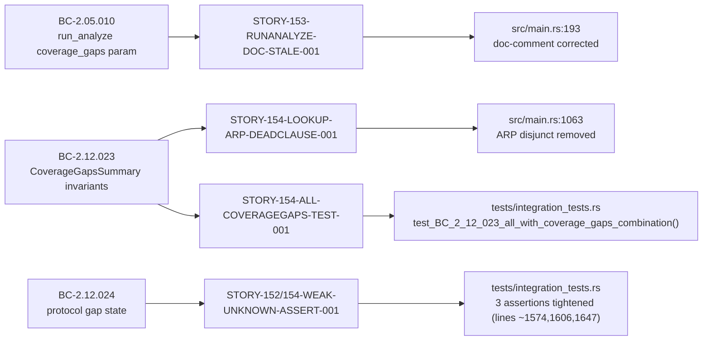
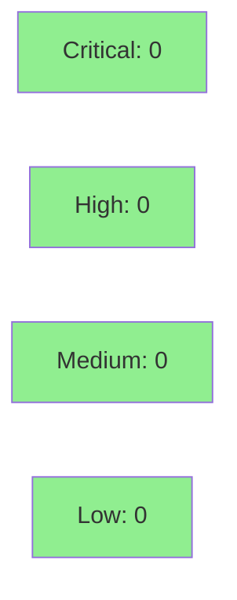

## Fix: F6 Pre-Hardening Cleanup — 4 LOW/non-blocking F5 adversarial findings

**Source:** Phase F5 scoped-adversarial review (feature-protocol-coverage / E-21)
**Phase:** F6 pre-hardening cleanup
**Severity:** LOW (all 4 findings non-blocking)
**Stories:** STORY-152, STORY-153, STORY-154
**Mode:** feature (fix-PR delivery — no demo recording; no user-facing behavior change)


This PR resolves 4 LOW-severity findings carried from the F5 scoped-adversarial review pass
against the feature-protocol-coverage epic (E-21, STORY-152/153/154). Changes are internal
only: a stale doc-comment correction, a dead-code removal with proof comment, a new integration
test for an untested `--all --coverage-gaps` combination, and tightened assertions on 3 weak
`contains("unknown")` checks. No public API or user-observable behavior is altered.

---

## Architecture Changes



No architecture changes. All edits are cosmetic (doc-comment), provably-dead-code removal,
and test hardening within existing modules.

---

## Story Dependencies



All upstream stories are already merged into `develop`. No downstream blockers.

---

## Spec Traceability



---

## What Changed

### Finding 1: STORY-153-RUNANALYZE-DOC-STALE-001 (commit `7fbb57c`)

**File:** `src/main.rs` — `run_analyze()` doc-comment on `coverage_gaps` param

**Before:** Stale scaffold comment described the parameter as a pre-ship stub wired to `false`
from main() pending STORY-154.

**After:** Comment now accurately describes the shipped behavior — the param activates the
per-packet UDP gap counter and appends `CoverageGapsSummary` output (AC-154-002/003/007;
ADR-012 Decision 9), wired via `*coverage_gaps` from `Commands::Analyze` destructure.

---

### Finding 2: STORY-154-LOOKUP-ARP-DEADCLAUSE-001 (commit `0fdaa29`)

**File:** `src/main.rs` — `lookup_protocol_state()` match guard

**Removed:** `|| p.name == "ARP"` disjunct in the `Some(p) if ...` guard.

**Proof of death:** The enclosing `find()` predicate filters on
`p.transport == catalog_transport` where `catalog_transport` is `Transport::Tcp` or
`Transport::Udp` (from the packet's network layer). The ARP catalog entry has
`transport = Transport::LinkLayer` and `canonical_ports = []`, so it can never pass the
`find()` predicate and be returned as `Some(p)`. The `|| p.name == "ARP"` clause in the
match guard was therefore unreachable on all possible inputs. A proof comment documents
this reasoning in-place.

---

### Finding 3: STORY-154-ALL-COVERAGEGAPS-TEST-001 (commit `abc048e`)

**File:** `tests/integration_tests.rs` — new test `test_BC_2_12_023_all_with_coverage_gaps_combination()`

**Added:** Integration test covering the `analyze --all --coverage-gaps` combination, which
was previously untested. Verifies (1) exit 0, (2) `CoverageGapsSummary` section present,
(3) TCP/9600 row shows state `unknown`. The `--all` and `--coverage-gaps` flags are
orthogonal (clap config); the test guards against any future clap conflict or orthogonality
regression.

---

### Finding 4: STORY-152/154-WEAK-UNKNOWN-ASSERT-001 (commit `f90dfb8`)

**File:** `tests/integration_tests.rs` — 3 assertions tightened

**Before:** Three tests used `stdout.contains("unknown")` — a substring match that would pass
if "unknown" appeared anywhere in stdout for any reason.

**After:** Each assertion now uses a line-level check:
```rust
let tcp<port>_row_is_unknown = stdout
    .lines()
    .any(|l| l.contains("TCP/<port>") && l.ends_with("unknown"));
```
This ties the port identity to the state value, preventing false passes from incidental
"unknown" substrings in error messages, headers, or other output rows. Applies to:
- TCP/9600 state check (BC-2.12.024 PC-4)
- TCP/47808 state check (BC-2.12.024 EC-009 — BACnet/IP transport mismatch)
- TCP/53 state check (BC-2.12.024 EC-010 / STORY-154-DNS53-TCP-GAP-001)

---

## Test Evidence

| Metric | Value | Status |
|--------|-------|--------|
| Full test suite | 85 binaries, 0 failures | PASS |
| New tests added | 1 (STORY-154-ALL-COVERAGEGAPS-TEST-001) | PASS |
| Modified assertions | 3 tightened (STORY-152/154-WEAK-UNKNOWN-ASSERT-001) | PASS |
| `cargo clippy --all-targets -- -D warnings` | Clean | PASS |
| `cargo fmt --check` | Clean | PASS |

### New Test

| Test | BC | Result |
|------|----|--------|
| `test_BC_2_12_023_all_with_coverage_gaps_combination()` | BC-2.12.023 Invariant 1, PC-1 | PASS |

---

## Holdout Evaluation

N/A — evaluated at wave gate. No new behavioral contracts introduced.

---

## Adversarial Review

These 4 findings originate from the F5 scoped-adversarial review pass (Phase F5).
All are LOW severity / non-blocking. This PR resolves them before the F6 formal-hardening phase.

| Finding ID | Category | Severity | Resolution |
|------------|----------|----------|------------|
| STORY-153-RUNANALYZE-DOC-STALE-001 | docs/comment accuracy | LOW | Doc-comment corrected |
| STORY-154-LOOKUP-ARP-DEADCLAUSE-001 | dead code | LOW | ARP disjunct removed + proof comment |
| STORY-154-ALL-COVERAGEGAPS-TEST-001 | test coverage gap | LOW | New integration test added |
| STORY-152/154-WEAK-UNKNOWN-ASSERT-001 | test quality | LOW | 3 assertions tightened |

---

## Security Review

**Verdict: APPROVE — no findings**



OWASP Top 10 sweep: all N/A. Diff touches only internal match-guard logic and tests;
no new input paths, no auth/authz, no dependencies, no network, no serialization.
ARP dead-code removal is structurally sound — `find()` predicate eliminates
`Transport::LinkLayer` entries before the removed disjunct could be evaluated.
Test assertion tightening improves coverage properties; no security checks weakened.

---

## Risk Assessment

### Blast Radius
- **Systems affected:** None (internal-only changes)
- **User impact:** None (no behavior change; doc-comment + dead-code + test hardening)
- **Data impact:** None
- **Risk Level:** LOW

### Performance Impact

No performance impact. The removed ARP disjunct was dead code in a match guard; its removal
has no runtime effect. No new hot paths introduced.

### Feature Flags

None. No feature flags used or required.

---

## Traceability

| Finding | BC | Commit | File | Status |
|---------|----|----|------|--------|
| STORY-153-RUNANALYZE-DOC-STALE-001 | BC-2.05.010 | `7fbb57c` | `src/main.rs:193` | RESOLVED |
| STORY-154-LOOKUP-ARP-DEADCLAUSE-001 | BC-2.12.023 | `0fdaa29` | `src/main.rs:1063` | RESOLVED |
| STORY-154-ALL-COVERAGEGAPS-TEST-001 | BC-2.12.023 Inv.1/PC-1 | `abc048e` | `tests/integration_tests.rs` | RESOLVED |
| STORY-152/154-WEAK-UNKNOWN-ASSERT-001 | BC-2.12.024 PC-4/EC-009/EC-010 | `f90dfb8` | `tests/integration_tests.rs` | RESOLVED |

---

## AI Pipeline Metadata

<details>
<summary><strong>Pipeline Details</strong></summary>

```yaml
ai-generated: true
pipeline-mode: feature
factory-version: "1.0.0-rc.21"
pipeline-stages:
  fix-pr-delivery: in-progress
  demo-recording: skipped (no behavior change)
  wave-integration-gate: skipped (fix PR — merges individually)
fix-source: F5 scoped-adversarial review (E-21 feature-protocol-coverage)
findings-resolved: 4
findings-severity: LOW
models-used:
  pr-manager: claude-sonnet-4-6
  security-reviewer: dispatched
  pr-reviewer: dispatched
generated-at: "2026-07-04T00:00:00Z"
```

</details>

---

## Pre-Merge Checklist

- [ ] All CI status checks passing
- [x] No restricted files changed (only src/main.rs, tests/integration_tests.rs)
- [x] No behavior change — docs/dead-code/test-hardening only
- [x] All 4 F5 adversarial findings addressed
- [ ] Security review: PENDING
- [ ] PR reviewer: PENDING
- [x] No demo recording required (no user-observable behavior change)
- [x] No wave integration gate (fix PR — merges individually per autonomy level 4)
