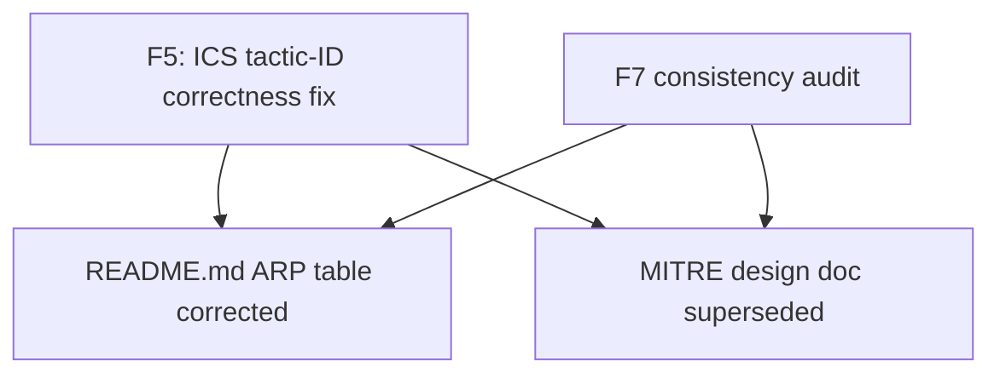
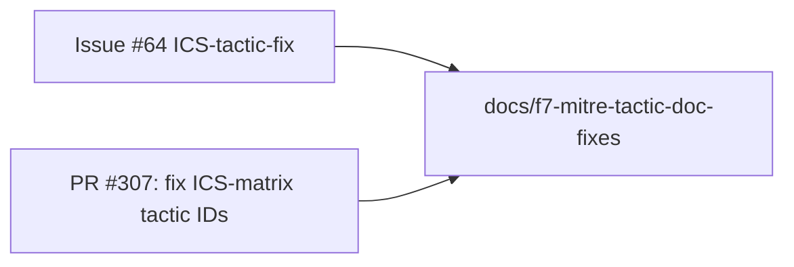
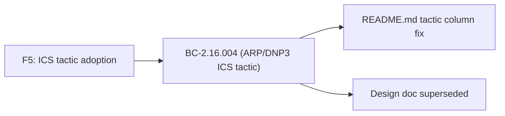

## docs: correct ARP table tactics + supersede stale MITRE design doc

**Branch:** `docs/f7-mitre-tactic-doc-fixes`
**Base:** `develop`
**Severity:** MINOR (documentation only)
**Behavior change:** None — documentation corrections only, no code touched

---

### Summary

F7 consistency-audit follow-up for issue #64 / ICS-tactic-fix feature. Two documentation
corrections that reconcile ARP-detection user-facing docs and the now-superseded MITRE
design spec with the ICS-tactic corrections adopted during F5.

---

### What Changed

| File | Change |
|------|--------|
| `README.md` | ARP detection table: corrected the "Tactic" column for D1 (ARP spoofing) and D12 (L2/L3 sender-MAC mismatch) rows from the technique name "Adversary-in-the-Middle" to the correct tactic label "Collection (ICS), Credential Access" — aligning with the post-F5 ICS-matrix corrections. |
| `docs/superpowers/specs/2026-04-13-mitre-attack-mapping-design.md` | Added a SUPERSEDED banner documenting that the single-Discovery-variant design was not adopted, ICS Discovery is TA0102 (not TA0111 as the original text stated), and T0830 maps to Collection (not Lateral Movement). Also corrected the inline TA-id reference TA0111 → TA0102 in the "known limitation" paragraph. |

### Root Cause

The F5 phase adopted dedicated ICS-matrix `MitreTactic` variants with correct TA-IDs.
Two documentation artefacts were not updated at that time:

1. The README ARP table still used the technique name "Adversary-in-the-Middle" in the
   Tactic column instead of the correct ICS tactic names "Collection (ICS), Credential
   Access".
2. The original MITRE mapping design doc contained a stale TA-id (TA0111 for ICS Discovery)
   that was never corrected, and no supersession notice was added when the implementation
   diverged from the design.

### Architecture Changes

None. This PR touches only Markdown documentation files.

### Story Dependencies

No story dependency. This is an ad-hoc F7 consistency-audit documentation fix.

### Spec Traceability

No behavioral contracts apply (docs-only change).

### Test Evidence

No tests required or modified. This is a documentation-only change.

- `cargo test --all-targets`: not required to re-run (zero Rust source changes)
- `cargo clippy --all-targets -- -D warnings`: N/A (no Rust code changed)
- `cargo fmt --check`: N/A (no Rust code changed)

### Demo Evidence

Not applicable — no behavior change, no UI/CLI output change.

### Security Review

Skipped — docs-only PR. No code, no secrets, no config changed. Diff verified:
2 Markdown files, 23 insertions, 3 deletions. No executable content.

### Holdout Evaluation

N/A — evaluated at wave gate.

### Adversarial Review

N/A — evaluated at Phase 5.

### Risk Assessment

- **Blast radius:** Zero. Markdown-only changes with no effect on runtime behavior.
- **Performance impact:** None.
- **Rollback:** Trivial — revert the commit.

### AI Pipeline Metadata

- **Pipeline mode:** Ad-hoc F7 consistency fix (docs)
- **Models used:** claude-sonnet-4-6 (pr-manager)
- **Branch HEAD:** 05ef2ba

### Pre-Merge Checklist

- [x] Branch uses semantic naming (`docs/f7-mitre-tactic-doc-fixes`)
- [x] PR title uses allowed semantic type (`docs`)
- [x] Docs-only: no Rust source changes
- [x] No secrets or credentials in diff
- [x] ARP tactic column corrected in README.md (D1, D12: "Collection (ICS), Credential Access")
- [x] MITRE design doc superseded with correct TA-id (TA0102 not TA0111)
- [x] Consistent with PR #307 / BC-2.16.004 authoritative tactic assignments
- [ ] CI checks pass (pending)
- [ ] PR reviewer approved (pending)
