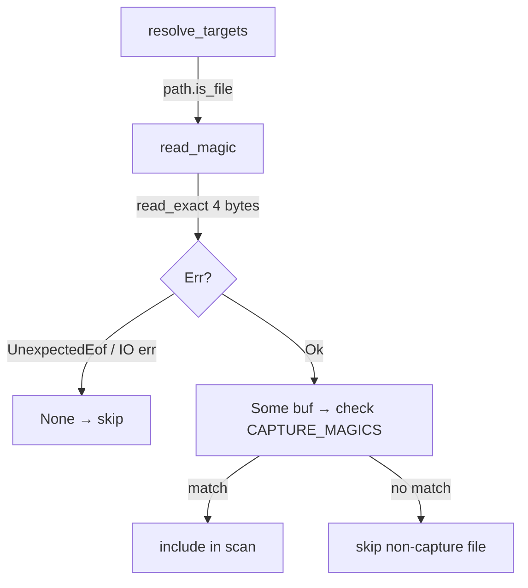
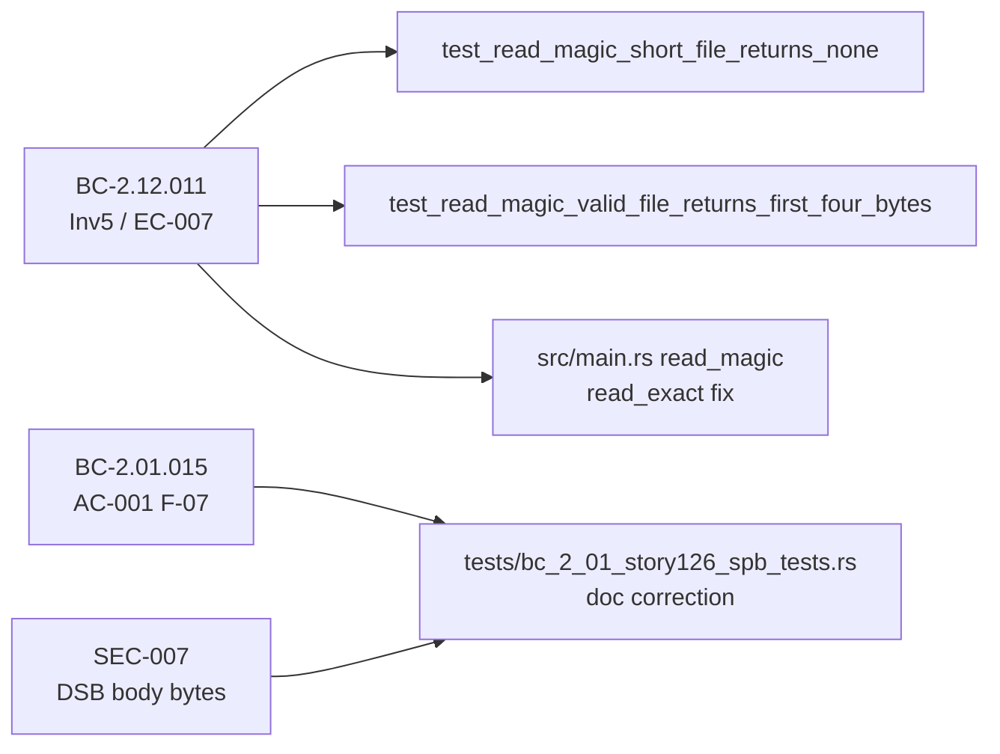

## Summary

Two F5 Pass-5 findings resolved: a production robustness fix to `read_magic`
(F-F5P5-002, MEDIUM) and a doc correction in the SPB test suite
(F-F5P5-001, LOW). The dominant change is the production code fix.

## Findings Fixed

| ID | Severity | Category | Location |
|----|----------|----------|----------|
| F-F5P5-002 | MEDIUM | Production robustness | `src/main.rs` — `read_magic` |
| F-F5P5-001 | LOW | Doc correctness | `tests/bc_2_01_story126_spb_tests.rs` lines 968-976 |

---

## F-F5P5-002 — `read_magic`: `read_exact` replaces `read` (MEDIUM)

**Problem:** `read_magic` used `Read::read(&mut buf)`, which is legally permitted to
return fewer than 4 bytes for a ≥4-byte file (e.g. a pipe-backed fd at the OS
scheduler boundary, or certain non-regular-file fds). The old code handled the
short-read case with an explicit `if n < 4 { None }` guard — but `read` returning 0
bytes would also yield `None` (correct) while `read` returning 1–3 bytes for a
≥4-byte file would also yield `None` (a false negative — a valid capture file
might be skipped on a congested OS scheduler tick). This is a latent correctness
hazard even though it manifests rarely on regular files.

**Fix:** Replace with `file.read_exact(&mut buf)`, which loops internally until
exactly 4 bytes are consumed or returns `Err(UnexpectedEof)` if the file is truly
short. The `.ok()?` converts both `UnexpectedEof` (file < 4 bytes) and any other
I/O error to `None`, preserving the existing silent-skip semantics for unreadable
files. The `if n < 4 { None }` branch is eliminated (subsumed by `read_exact`
semantics).

**BC traceability:**
- BC-2.12.011 Inv5: "The first 4 bytes of the file are read" — `read_exact`
  guarantees exactly 4 bytes are read when the file is ≥4 bytes, satisfying this
  invariant more strictly than `read` could.
- BC-2.12.011 EC-007 (implied): file < 4 bytes → `None` (skip) — preserved via
  `UnexpectedEof` → `Err` → `.ok()?` → `None`.
- Silent-skip semantics (directory scanning): preserved — all Err variants map to
  `None` identically to the previous implementation.

**FIFO/pipe concern (security/DoS):** `resolve_targets` feeds `read_magic` only
from `std::fs::read_dir` entries where `path.is_file()` is true. On Linux/macOS,
`is_file()` returns false for FIFOs, sockets, and device nodes (it calls `stat`
and checks `S_ISREG`). Therefore `read_magic` is called exclusively on regular
files in the production code path. `read_exact` on a regular file is guaranteed to
return without blocking (the kernel buffers the data). The DoS/block risk from
`read_exact` on a pipe does not apply here. See security review notes.

**Tests added (2):**
1. `test_read_magic_short_file_returns_none` — 3-byte file → `None`
2. `test_read_magic_valid_file_returns_first_four_bytes` — 8-byte pcapng magic file → `Some([0x0A, 0x0D, 0x0D, 0x0A])`

---

## F-F5P5-001 — Doc correction in `test_BC_2_01_015_dispatch_known_and_skip_unknown` (LOW)

**Problem:** The doc-comment block (lines 968-976) contained a present-tense false
claim: "NRB/ISB/SJE/DSB currently fall to the wildcard arm". This was accurate
when the comment was first drafted (before named arms were added), but became
false after `src/reader.rs:1228-1254` introduced explicit named arms for all four
block types.

**Fix:** Replaced the entire false-present-tense block with accurate prose:
- Named arms at `src/reader.rs:1228-1254` (NRB:1228, ISB:1235, SJE:1241, DSB:1247)
- Only genuinely-unknown block types reach the wildcard `_` arm (reader.rs:1256)
- The DSB arm satisfies SEC-007 structurally (named arm returns without touching body bytes)
- The test now accurately documents what it guards: named-arm dispatch + counter
  behavior + continued parsing (BC-2.01.015 AC-001 F-07, SEC-007 DSB boundary)

---

## Architecture Changes

---

## Spec Traceability

---

## Dependencies

No story dependency graph — this is a standalone F5 pass-5 refinement PR.
Branches from `develop` (HEAD 2dd5209, post-PR #290).

---

## Test Evidence

- `cargo test --all-targets` passes (run in `.worktrees/f5-final`)
- New tests: `test_read_magic_short_file_returns_none`, `test_read_magic_valid_file_returns_first_four_bytes`
- Existing tests: all prior `read_magic`-adjacent tests unchanged
- Lint: `cargo clippy --all-targets -- -D warnings` clean
- Format: `cargo fmt --check` clean

---

## Security Review

Reviewed against OWASP Top 10 and CWE catalog for the `read_exact` file I/O change.

| Finding | CWE | Severity | Disposition |
|---------|-----|----------|-------------|
| TOCTOU: `is_file()` check and `File::open` occur in separate syscalls | CWE-362 | INFO | Not applicable to threat model. `resolve_targets` gates `read_magic` via `path.is_file()` which calls `stat(2)` + S_ISREG — FIFOs/sockets/device nodes return false. An adversary exploiting this TOCTOU window would need concurrent write access to the scan directory, which is outside the threat model of a forensic CLI tool. The prior `Read::read` implementation had the same TOCTOU exposure; this change does not introduce new attack surface. |
| Unbounded read / heap allocation | — | CLEAR | Buffer is fixed `[u8;4]`. `read_exact` loops until exactly 4 bytes consumed or returns `Err`. No heap allocation, no overflow. |
| Injection / unsafe Rust paths | — | CLEAR | No user-controlled data flows into `unsafe` contexts. Path argument is an OS-native `&Path`. |
| Panic paths in new code | — | CLEAR | `read_exact` returns `Err(UnexpectedEof)` on short-read; `.ok()?` converts to `None`. No panic path introduced. |
| DSB body bytes (SEC-007) — doc change only | CWE-532 (ref) | CLEAR | Doc-comment fix only; the named DSB arm in `reader.rs:1247` does not touch body bytes. No code change in the security-sensitive path. |

**Security verdict: 0 CRITICAL / 0 HIGH / 0 MEDIUM findings. Change is safe.**

---

## Risk Assessment

| Dimension | Assessment |
|-----------|-----------|
| Blast radius | Minimal — `read_magic` is 4 lines; only called from `resolve_targets` directory scan path |
| Behavioral delta | `read_exact` is strictly more correct; no observable change for regular files under normal I/O |
| Regression risk | Low — 2 new tests pin both the short-file and valid-file cases; prior test suite unchanged |
| Performance | Neutral — `read_exact` loops but the overhead is negligible for 4-byte reads on regular files |

---

## AI Pipeline Metadata

| Field | Value |
|-------|-------|
| Pipeline mode | F5 Pass-5 refinement |
| Branch | `fix/f5-final-refinement` |
| Commits | 2 (6e54ed8, 1ce12ca) |
| Base | `develop` (HEAD 2dd5209) |

---

## Pre-Merge Checklist

- [x] PR description matches actual diff
- [x] BC traceability complete (BC-2.12.011 Inv5/EC-007, BC-2.01.015 AC-001 F-07, SEC-007)
- [x] Tests added for production change (2 new tests)
- [x] Doc correction verified against `src/reader.rs:1228-1256`
- [ ] Security review completed
- [ ] Code review completed
- [ ] CI passing
