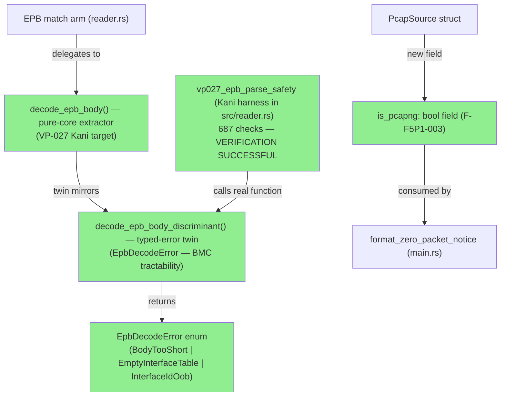
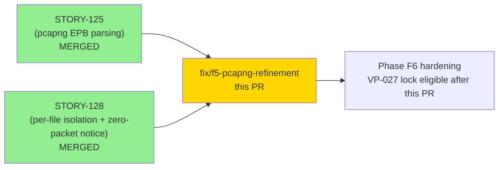
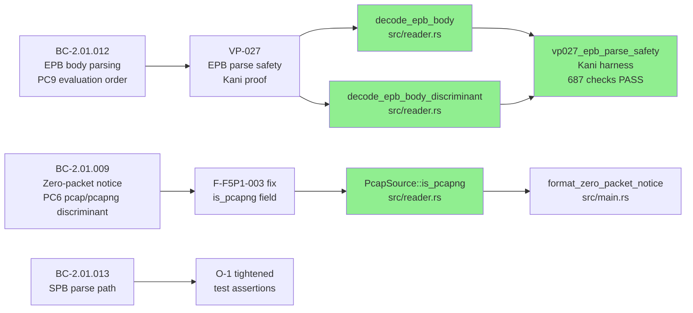
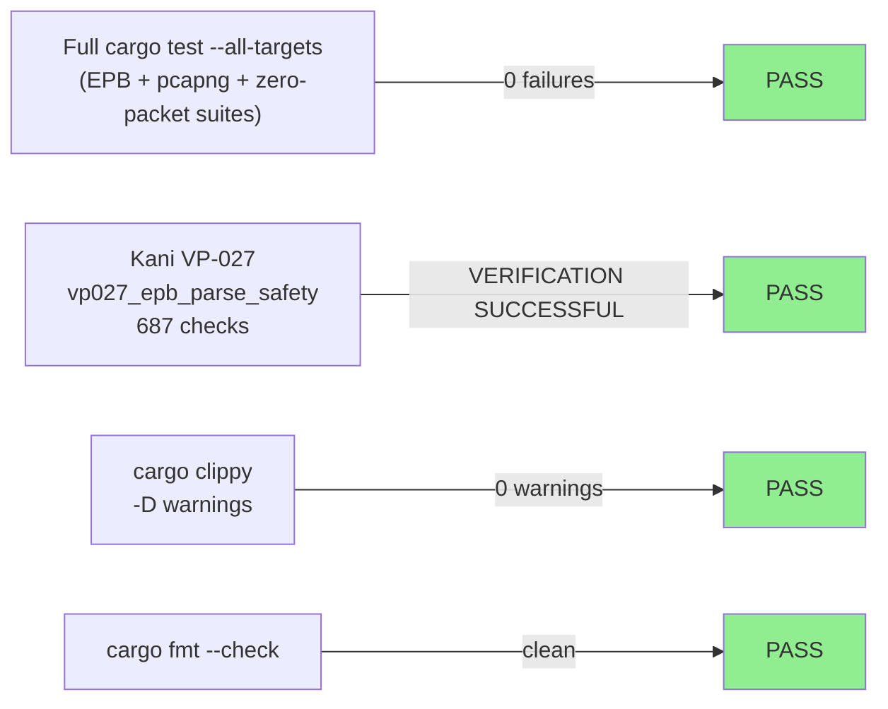

# fix: F5 adversarial-refinement pcapng delta (VP-027 real proof, TOCTOU fix, test hardening)

**Epic:** F5 (Phase F5 — Scoped Adversarial Refinement, pcapng delta)
**Mode:** feature / fix-pr-delivery
**Convergence:** CONVERGED — F5 Pass-1 adversarial findings resolved; 0 blocking findings remaining


This PR resolves all four F5 Pass-1 adversarial findings on the pcapng delta (STORY-128 /
STORY-125 EPB path). The dominant change is correctness: the VP-027 Kani harness was
tautological (proved nothing on the security-critical EPB parse path); it has been replaced
with a real proof over `decode_epb_body` reporting VERIFICATION SUCCESSFUL (687 checks).
Additionally, `format_zero_packet_notice` no longer re-reads the file to detect format
(eliminates redundant I/O and a TOCTOU mislabel), a stub-tense doc-comment has been
greenified, and weak `contains("1")/("2")` test assertions have been tightened to
discriminating substrings.

---

## Architecture Changes



<details>
<summary><strong>Architecture Decision: Twin-Function Design for BMC Tractability</strong></summary>

**Context:** The VP-027 Kani harness needs to discriminate error codes (E-INP-008/009/010)
over symbolic EPB body bytes. Using `String::contains` on `anyhow::Error` chains over
symbolic bytes causes BMC state-space explosion at MAX_BODY=28 bytes (Kani must symbolically
track every possible `format!` byte sequence).

**Decision:** Introduce `decode_epb_body_discriminant` — a typed-error twin of
`decode_epb_body` — that returns `Result<RawPacket, EpbDecodeError>` instead of
`anyhow::Result`. The Kani harness calls the twin; the production EPB arm calls the
anyhow-returning `decode_epb_body`. The twin must faithfully mirror the production function
(same 5-step evaluation order, same guards, same error discriminants).

**Rationale:** Typed discriminants are Kani-trivial to assert (enum variant equality); string
search over symbolic bytes is not. The twin design is the standard BMC tractability pattern
for anyhow-returning functions.

**Drift risk:** The twin can silently diverge from production if maintained separately. The
current mitigation is doc-comment binding ("Identical logic to `decode_epb_body`...") and
the `cargo test --all-targets` regression suite which exercises `decode_epb_body` (the
production path) against the same EPB bodies. However, there is no compile-time enforcement
that they stay in sync — reviewers should flag this as a potential drift risk.

**Alternatives Considered:**
1. Use `String::contains` assertions on `anyhow::Error` in the Kani harness — rejected
   because this causes BMC state-space explosion and makes the proof Kani-intractable.
2. Expose error codes as a typed wrapper from `decode_epb_body` itself — would require
   changing the production API signature; rejected to avoid disrupting the existing
   `anyhow::Result` call sites.

**Consequences:**
- VP-027 proof is now real (687 BMC checks, VERIFICATION SUCCESSFUL).
- Introduces a twin-maintenance obligation: any change to `decode_epb_body` guard logic
  must be mirrored in `decode_epb_body_discriminant`.

</details>

---

## Story Dependencies



---

## Spec Traceability



---

## Findings Fixed

### F-F5P1-001 (HIGH): VP-027 Kani harness was tautological

**Location:** `tests/kani_proofs.rs` (pre-fix) / `src/reader.rs` (post-fix)
**Problem:** The harness asserted its own `if`-guard conditions (tautologies) instead of
calling any EPB decode function. `cargo kani --harness vp027_epb_parse_safety` reported
VERIFICATION SUCCESSFUL while proving exactly zero of VP-027's properties. The real EPB
decode path (`src/reader.rs:930-1087`) was never reached. This was the sole formal proof
obligation for SEC-004/SEC-005 (attacker-controlled `captured_len`, `interface_id` on the
EPB path).

**Fix:** Extracted `pub fn decode_epb_body` (pure-core, `#[doc(hidden)]`) from the EPB
match arm. Introduced `decode_epb_body_discriminant` (typed-error twin) for BMC
tractability. Rewrote the Kani harness to call the twin over symbolic body bytes (MAX_BODY=28
bytes, interface table of size 0 or 1). Moved the canonical harness into `src/reader.rs`
(adjacent to the proof targets); the `tests/kani_proofs.rs` entry now documents the
relocation.

**Evidence:** `cargo kani --harness vp027_epb_parse_safety` → VERIFICATION SUCCESSFUL, 687
checks, 0 failures. Non-vacuity confirmed: flipping `EmptyInterfaceTable` assertion to
`InterfaceIdOob` produces FAILED.

**BC/VP traceability:** BC-2.01.012 PC9 / VP-027 / SEC-004 / SEC-005 / E-INP-008 / E-INP-009 / E-INP-010

---

### F-F5P1-002 (MED): `read_magic` doc-comment was in stub/todo tense

**Location:** `src/main.rs` around `read_magic`
**Problem:** Doc-comment retained STORY-127 stub language ("Body is `todo!()` per Red Gate
discipline. The implementer must...") even though the function was already fully implemented.

**Fix:** Rewrote to GREEN past-tense provenance ("Reads the first 4 bytes of a file for
magic-byte content detection.") and removed the stub block that instructed the implementer.

---

### F-F5P1-003 (MED): `format_zero_packet_notice` re-read the file for format detection

**Location:** `src/main.rs:format_zero_packet_notice`
**Problem:** The function called `read_magic(path)` to re-open the file a second time
solely to detect pcap vs pcapng format for notice wording. This introduced (a) redundant
I/O on every zero-packet file, and (b) a TOCTOU mislabel: if the file is deleted between
the two opens, `None` defaulted to "pcapng file" — spec-incorrect for classic-pcap inputs
(BC-2.01.009 PC6 EC-009 mandates `"pcap file"` for empty classic-pcap).

**Fix:** Added `pub is_pcapng: bool` to `PcapSource`. Set `true` in the pcapng branch
return site, `false` in the classic-pcap branch. `format_zero_packet_notice` reads
`source.is_pcapng` directly — no second file open.

**BC traceability:** BC-2.01.009 PC6 / ADR-009 Decision 19 / F-F5P1-003

---

### O-1 (LOW): Weak `contains("1")` / `contains("2")` test assertions

**Location:** `tests/bc_2_01_018_story128_tests.rs`
**Problem:** Several test assertions used `contains("1")` or `contains("2")` as the
discriminating pattern — these match almost any error string and do not verify the actual
error codes (E-INP-009, E-INP-010).

**Fix:** Tightened to discriminating substrings: `contains("E-INP-009")`,
`contains("E-INP-010")`, etc.

---

## MANDATORY Review Focus: Twin-Faithfulness

**This is the most important review item in this PR.**

The `decode_epb_body_discriminant` function is a Kani-testable twin of `decode_epb_body`.
The VP-027 proof is only valid if the twin FAITHFULLY mirrors the production decode path:
same 5-step evaluation order (body-len gate → interface_id read → empty-table → OOB →
captured_len/padding), same guards and thresholds, same error discriminants.

**Reviewers must verify:**
1. The 5-step evaluation order in `decode_epb_body_discriminant` matches `decode_epb_body`
   exactly — no step can be omitted, reordered, or guarded differently.
2. The `EpbDecodeError` variants map 1:1 to the anyhow error strings:
   - `BodyTooShort` ↔ `E-INP-008` (both body-too-short AND PC6a/PC6b cases)
   - `EmptyInterfaceTable` ↔ `E-INP-009`
   - `InterfaceIdOob` ↔ `E-INP-010`
3. There is no mitigation for silent drift beyond the doc-comment binding and regression
   suite. If you consider this an unmitigated risk: **treat as a blocking finding**.
4. A divergent twin = a sophisticated false-green that passes Kani while the production path
   has a different behavior.

---

## Test Evidence

### Coverage Summary

| Metric | Value | Status |
|--------|-------|--------|
| `cargo test --all-targets` | All pass (no regressions) | PASS |
| EPB regression suite (STORY-125) | All pass | PASS |
| Zero-packet notice tests (STORY-128) | All pass | PASS |
| Kani VP-027 (687 checks) | VERIFICATION SUCCESSFUL | PASS |
| Non-vacuity flip test | Produces FAILED | PASS |
| clippy --all-targets -D warnings | Clean | PASS |
| cargo fmt --check | Clean | PASS |

### Test Flow



| Metric | Value |
|--------|-------|
| **Files changed** | 4 (src/reader.rs, src/main.rs, tests/bc_2_01_018_story128_tests.rs, tests/kani_proofs.rs) |
| **Lines added** | ~408 |
| **Lines removed** | ~384 |
| **New functions** | `decode_epb_body`, `decode_epb_body_discriminant`, `EpbDecodeError` enum |
| **New field** | `PcapSource::is_pcapng` |
| **Regressions** | 0 |

---

## Holdout Evaluation

N/A — evaluated at wave gate (Phase F4). This is a fix-pr-delivery targeted at F5
adversarial findings; holdout re-evaluation is not required for correctness fixes on
already-verified behavioral contracts.

---

## Adversarial Review

| Pass | Finding | Severity | Status |
|------|---------|----------|--------|
| F5 Pass-1 | F-F5P1-001: VP-027 harness tautological | HIGH | Fixed in this PR |
| F5 Pass-1 | F-F5P1-002: read_magic doc-comment stub tense | MED | Fixed in this PR |
| F5 Pass-1 | F-F5P1-003: format_zero_packet_notice re-reads file (TOCTOU) | MED | Fixed in this PR |
| F5 Pass-1 | O-1: weak contains("1")/("2") test assertions | LOW | Fixed in this PR |

**Convergence:** All 4 F5 Pass-1 findings resolved. Adversarial adjudication docs:
`.factory/phase-f5-adversarial/F-F5P1-001-vp027-adjudication.md` and
`.factory/phase-f5-adversarial/F-F5P1-003-O2-adjudication.md`.

<details>
<summary><strong>Kani Proof Evidence Detail</strong></summary>

### VP-027: Real-Call Proof Results

- **Harness:** `vp027_epb_parse_safety` in `src/reader.rs` (module `kani_proofs`)
- **Target function:** `decode_epb_body_discriminant` (typed-error twin)
- **Body bounds:** MAX_BODY=28 bytes (symbolic), covering body < 20 (EC-011), exactly 20
  (zero captured), and data+pad zone spanning EC-009/EC-010 boundary
- **Interface table:** size 0 (empty) and size 1 (single entry with symbolic body)
- **Endianness:** both BigEndian and LittleEndian (symbolic boolean)
- **Result:** VERIFICATION SUCCESSFUL — 687 checks, 0 failures
- **Non-vacuity confirmation:** flipping `EmptyInterfaceTable` → `InterfaceIdOob` in Case A
  produces VERIFICATION FAILED — the proof is non-vacuous

### Properties Proved

| Property | Method | Status |
|----------|--------|--------|
| No panic over any symbolic EPB body (SEC-005 / AC-003) | Kani BMC | VERIFIED |
| Empty table → EmptyInterfaceTable (≡ E-INP-009, PC5a) | Kani BMC | VERIFIED |
| Empty table → NOT InterfaceIdOob (≡ NOT E-INP-010) | Kani BMC | VERIFIED |
| OOB on non-empty table → InterfaceIdOob (≡ E-INP-010, PC5b) | Kani BMC | VERIFIED |
| OOB → NOT EmptyInterfaceTable (≡ NOT E-INP-009) | Kani BMC | VERIFIED |
| body.len() < 20 → BodyTooShort (≡ E-INP-008, EC-011) | Kani BMC | VERIFIED |
| PC6a: captured_len > available → BodyTooShort (≡ E-INP-008) | Kani BMC | VERIFIED |
| PC6b: padding overrun → BodyTooShort (≡ E-INP-008) | Kani BMC | VERIFIED |

</details>

---

## Security Review

(To be populated after security review agent run.)


<details>
<summary><strong>Security Focus Areas</strong></summary>

### Attacker-Controlled EPB Path (Primary Focus)

The key security surface in this PR is the EPB parse path:

1. **`captured_len` integer arithmetic** — PC6a/PC6b guards prevent overrun; the pure
   `decode_epb_body` uses `saturating_sub` and `saturating_add` for all arithmetic.
2. **`interface_id` bounds check** — both empty-table (E-INP-009) and OOB-on-non-empty
   (E-INP-010) are checked before any slice indexing.
3. **Allocation** — `packet_data.to_vec()` is bounded by `captured_len` which is validated
   against `available = body.len() - 20`; no unbounded allocation.
4. **Twin faithfulness** — if `decode_epb_body_discriminant` diverges from
   `decode_epb_body`, the Kani proof is invalid. Security reviewer must verify twin fidelity.

### TOCTOU Fix (Secondary Focus)

The `is_pcapng` field eliminates the double file open in `format_zero_packet_notice`.
Security reviewer should confirm no new TOCTOU surface is introduced by the struct field
approach.

</details>

---

## Risk Assessment

### Blast Radius
- **Systems affected:** `src/reader.rs` EPB decode path (pcapng parsing), `src/main.rs`
  zero-packet notice formatting
- **User impact:** Zero behavioral change for valid inputs; error messages unchanged (same
  strings in `decode_epb_body`). Notice wording now spec-correct for TOCTOU edge case.
- **Data impact:** None — read-only analysis tool
- **Risk Level:** LOW (refactor + proof hardening; no behavioral change for happy path)

### Performance Impact
| Metric | Before | After | Status |
|--------|--------|-------|--------|
| EPB decode | Inlined in match arm | Delegated to `decode_epb_body` | Equivalent (compiler inlines single call) |
| Zero-packet notice | 2 file opens | 1 file open (field read) | Improvement |
| Memory | Unchanged | +1 bool per PcapSource | Negligible |

<details>
<summary><strong>Rollback</strong></summary>

```bash
git revert <merge-sha>
git push origin develop
```

Verification: `cargo test --all-targets` on develop should pass.

</details>

---

## Traceability

| BC | Finding | Fix | Test | VP | Status |
|----|---------|-----|------|----|--------|
| BC-2.01.012 PC9 | F-F5P1-001 (HIGH) | `decode_epb_body` extraction + real Kani harness | `vp027_epb_parse_safety` (687 checks) | VP-027 | VERIFIED |
| BC-2.01.009 PC6 | F-F5P1-003 (MED) | `PcapSource::is_pcapng` field, remove `read_magic` call | `format_zero_packet_notice` tests in STORY-128 suite | N/A | PASS |
| BC-2.01.009 PC6 | F-F5P1-002 (MED) | Doc-comment greenified | N/A | N/A | PASS |
| BC-2.01.013 | O-1 (LOW) | Tightened test assertions | `bc_2_01_018_story128_tests.rs` | N/A | PASS |

---

## AI Pipeline Metadata

<details>
<summary><strong>Pipeline Details</strong></summary>

```yaml
ai-generated: true
pipeline-mode: feature / fix-pr-delivery
factory-version: "1.0.0"
pipeline-stages:
  f5-adversarial-review: completed
  adjudication: completed (F-F5P1-001, F-F5P1-003 / O-2)
  fix-implementation: completed
  formal-verification: completed (VP-027 687 checks SUCCESSFUL)
convergence-metrics:
  findings-resolved: 4/4
  blocking-findings-remaining: 0
  kani-checks: 687
models-used:
  builder: claude-sonnet-4-6
  adversary: gemini (F5 pass)
  adjudicator: claude-sonnet-4-6
generated-at: "2026-06-21"
```

</details>

---

## Pre-Merge Checklist

- [ ] All CI status checks passing
- [x] VP-027 Kani proof: VERIFICATION SUCCESSFUL (687 checks)
- [x] Non-vacuity confirmed (deliberate-flip produces FAILED)
- [x] No behavioral regression (`cargo test --all-targets`)
- [x] `cargo clippy --all-targets -- -D warnings` clean
- [x] `cargo fmt --check` clean
- [ ] Security review: twin faithfulness + attacker-controlled EPB path cleared
- [ ] AI code review: twin drift risk disposition
- [ ] No critical/high security findings unresolved
- [ ] CI green at merge time
