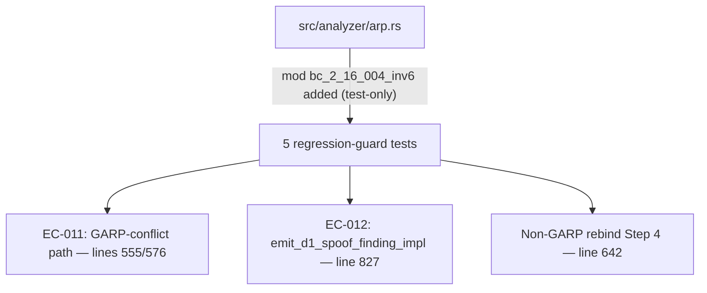
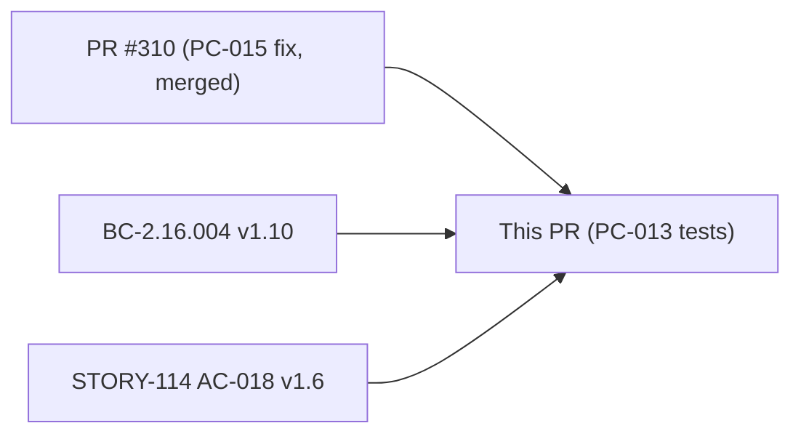
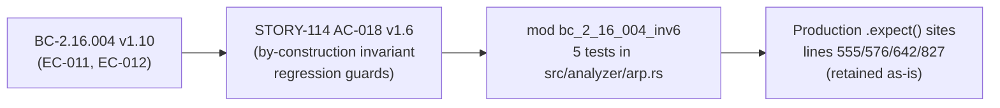

## Summary

PC-013 was originally filed as "ARP `.expect()` panic-on-malformed risk." F1 scoping + dedicated
research (`pc-013-invariant-idiom.md`) disproved the premise: all four `.expect()` sites in
`process_arp` and `emit_d1_spoof_finding_impl` are provably unreachable under single-threaded
safe Rust, and the correct idiom for this class of guarantee is to retain the loud `.expect()`
as a self-documenting tripwire — not to convert it to a silent skip (which is the fail-open
anti-pattern). The spec was corrected to BC-2.16.004 v1.10, and this PR delivers 5 white-box
regression-guard tests.

**No production code change in this PR.**

## PC-013 Investigation Outcome

**Original premise (PC-013):** The four `.expect()` calls in `process_arp` / `emit_d1_spoof_finding_impl` (arp.rs lines 555, 576, 642, 827) could panic on malformed input, causing a DoS.

**Finding after investigation:**

- All four sites are _by-construction invariants_, not input-reachable paths:
  - Lines 555/576: `has_conflict` derives from `bindings.get(&sender_ip)`; `bindings.get_mut()` executes in the same invocation with no interleaving opportunity to remove the entry. Entry is present by construction.
  - Line 642: the Step 4 MAC-update re-borrow executes after `emit_d1_spoof_finding_impl` returns; no removal can occur between those two statements in single-threaded code.
  - Line 827: Step 2 sets `first_rebind_ts = Some(timestamp_secs)` before Step 3's `.expect()` executes. Even after a flap-window reset, Step 2 immediately re-sets the field. Always `Some` at the Step 3 site.

- Rust best practice (Rust Book ch. 9.3, std docs, API Guidelines, community consensus) is to **fail loud** on broken by-construction invariants. A silent `if let` skip reclassifies a library bug as expected behavior and is the **fail-open anti-pattern** — it masks logic errors and produces partial/incorrect output with no signal.

- Research decision D-223: keep the `.expect()` calls as loud tripwires. The originally-planned silent-skip refactor was rejected. Spec corrected to BC-2.16.004 v1.10 (EC-011 / EC-012).

**Resolution:** No production code change. Spec corrected. 5 regression-guard tests added.

## Architecture Changes

_No production code changed. All changes are in `#[cfg(test)]` blocks._

## Story Dependencies

Part of bundle `fix-pc-013-014-015`. PC-015 (PR #310) already merged to `develop`.

## Spec Traceability

## Test Evidence

| Test name | EC | Lines exercised | Assertion |
|-----------|-----|-----------------|-----------|
| `test_BC_2_16_004_expect_site_no_panic_on_missing_entry` | EC-011 | 555, 576 | GARP-conflict → 2 findings (D2 MEDIUM + D1 MEDIUM), MAC updated |
| `test_BC_2_16_004_garp_conflict_two_findings_regression_guard` | EC-011 | 555, 576 | Two distinct GARPs → exactly 2 findings, correct severities |
| `test_BC_2_16_004_garp_no_prior_binding_regression_guard` | EC-011 | — | GARP on unseen IP → 0 spoof findings (first observation guard) |
| `test_BC_2_16_004_expect_site_rebind_ts_always_some` | EC-012 | 827 | Step 2 → Step 3 ordering: `first_rebind_ts` always Some, correct D1 finding emitted |
| `test_BC_2_16_004_non_garp_rebind_step4_mac_update` | — | 642 | Non-GARP rebind → MAC updated correctly (Step 4 re-borrow exercised) |

All 5 tests pass: `cargo test --all-targets` green.

## Holdout Evaluation

N/A — evaluated at wave gate.

## Adversarial Review

N/A — evaluated at Phase 5.

## Security Review

**No security findings.**

This PR adds only `#[cfg(test)]` code. Security review scope:

- No new production input-parsing paths introduced
- No new API surface exposed
- Test constants (`IP_A`, `MAC_A`, etc.) are synthetic test data with no sensitive information
- Test helpers (`make_reply`, `make_garp`) construct `ArpFrame` structs directly — no external input parsing
- The retained `.expect()` calls in production are provably unreachable by-construction (single-threaded safe Rust, entry presence established in same invocation). The DoS concern (CWE-400) that motivated PC-013 was a false positive — these sites are not reachable by untrusted input. Decision D-223 documents this conclusion.

Verdict: **PASS — no security issues.** No CRITICAL/HIGH/MEDIUM findings.

## Risk Assessment

| Dimension | Assessment |
|-----------|-----------|
| Blast radius | Minimal — test-only change, `#[cfg(test)]` blocks only |
| Performance impact | None — no production code changed |
| Breaking change | No |
| Rollback | Trivially safe — reverting adds no risk, removing tests degrades coverage only |

## AI Pipeline Metadata

| Field | Value |
|-------|-------|
| Pipeline mode | Feature (fix-mode, test-only delivery) |
| Models used | claude-sonnet-4-6 |
| Cycle | fix-pc-013-014-015 |
| Open item | PC-013 |
| Research doc | `.factory/cycles/fix-pc-013-014-015/research/pc-013-invariant-idiom.md` |

## Pre-Merge Checklist

- [x] `cargo test --all-targets` passes (5 new tests green)
- [x] `cargo clippy --all-targets -- -D warnings` passes
- [x] `cargo fmt --check` passes
- [x] No production code changed
- [x] BC-2.16.004 v1.10 traceability chain complete (BC → AC → Test)
- [x] Research-backed decision D-223 documented
- [x] CI green (all 10 checks pass: Semantic PR, Fuzz build, Action pin gate, Audit, Clippy, Deny, Format, Help-provenance gate, Test, Trust-boundary)
- [x] Security review complete (no findings — test-only code)
- [x] PR reviewer approval (convergence: 0 blocking findings)
