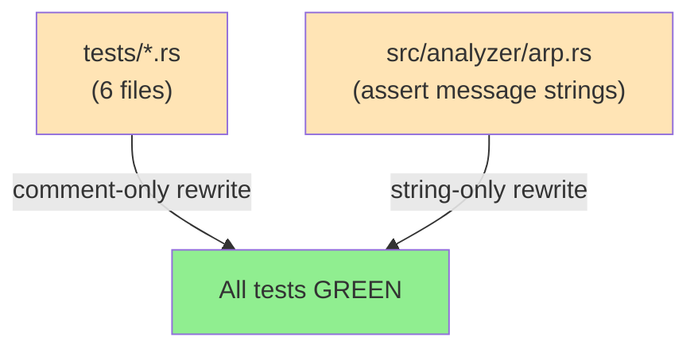
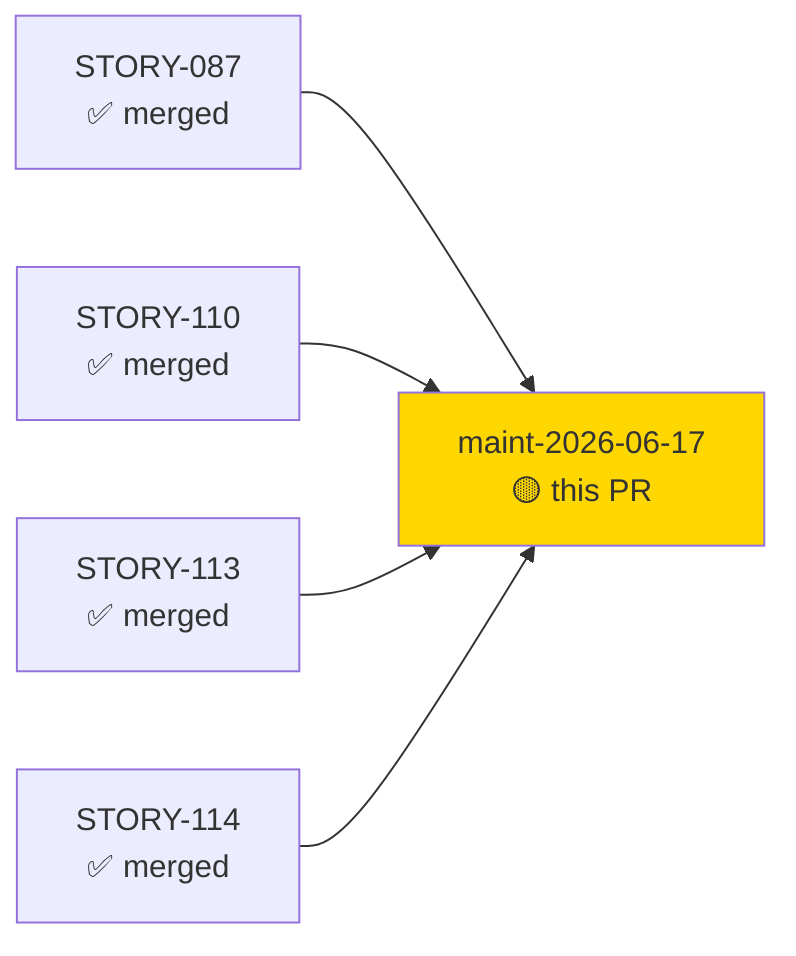
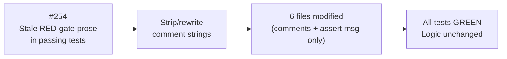
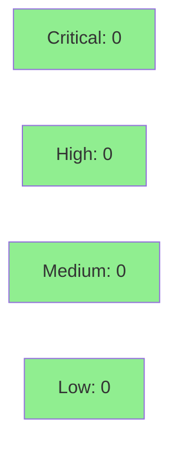

## Summary

This maintenance PR strips all stale RED-gate prose from comments and `assert!`/`panic!` message strings in passing tests. It closes #254.

**Zero logic change:** no test logic, assertions, behavioral code, or test counts were modified — only comment text and panic/assert message strings. Every changed test was already GREEN before this PR; the RED-gate annotations were left-over TDD scaffolding from prior implementation waves (waves 42–43, STORY-087, STORY-110, STORY-113, STORY-114).

**Maintenance run:** `maint-2026-06-17`

**Local CI (pre-push):** `cargo test --all-targets`, `cargo clippy -- -D warnings`, `cargo fmt --check` — all green.

**AI code review:** 2-pass review completed — final verdict APPROVE, logic-integrity PASS, all follow-up RED-prose cleaned.

Closes #254

---

## Architecture Changes



**Nature of change:** Comment strings and panic/assert message strings only. No code paths, data structures, or behavioral logic modified.

<details>
<summary><strong>Architecture Decision Record</strong></summary>

### ADR: Strip stale RED-gate prose on delivery

**Context:** During TDD red-green cycles, tests are annotated with "RED GATE", "panics via todo!()", and similar prose to signal the test is intentionally failing. After the implementation is delivered, these annotations become misleading — they falsely suggest tests are still failing.

**Decision:** Remove or rewrite all RED-gate prose in passing tests to accurately describe the current GREEN state.

**Rationale:** Stale RED-gate prose creates confusion for readers and automated documentation tools. Clearing it is low-risk (comment-only) and improves test maintainability.

**Alternatives Considered:**
1. Leave as-is — rejected because it misleads future developers about test status.
2. Rename entire test files — rejected as disproportionate to a comment-only cleanup.

**Consequences:**
- Test files accurately reflect their current GREEN status
- No behavioral or logical change to any test or implementation

</details>

---

## Story Dependencies



All upstream stories are already merged into `develop`.

---

## Spec Traceability



This is a maintenance fix, not a new behavioral contract. Traceability is to GitHub issue #254.

---

## Test Evidence

### Coverage Summary

| Metric | Value | Threshold | Status |
|--------|-------|-----------|--------|
| Changed tests | 0 new / 0 removed | — | N/A (comment-only) |
| Existing test suite | All pass (cargo test --all-targets) | 100% | PASS |
| Coverage delta | 0% | neutral | PASS |
| Mutation kill rate | No change (no logic modified) | — | N/A |
| Holdout satisfaction | N/A — evaluated at wave gate | — | N/A |

**Local CI (pre-push, 2 commits):**
- `cargo test --all-targets` — PASS
- `cargo clippy --all-targets -- -D warnings` — PASS
- `cargo fmt --check` — PASS

<details>
<summary><strong>Files Modified</strong></summary>

| File | Lines Removed | Lines Added | Type |
|------|---------------|-------------|------|
| `src/analyzer/arp.rs` | 19 | 10 | assert message strings rewritten |
| `tests/bc_2_15_110_dnp3_dispatcher_tests.rs` | 71 | 17 | module-level doc comment + inline RED prose |
| `tests/cli_story_087_tests.rs` | 5 | 2 | inline RED prose removed |
| `tests/dnp3_detection_tests.rs` | ~27 | ~10 | RED GATE header + inline prose |
| `tests/dnp3_f5_remediation_tests.rs` | ~100 | ~45 | RED GATE header + inline prose |
| `tests/dnp3_flow_state_tests.rs` | ~6 | ~4 | inline RED prose |

Net: 138 deletions, 88 additions (comment/string text only).

</details>

---

## Holdout Evaluation

N/A — evaluated at wave gate. This maintenance PR introduces no new behavioral contracts.

---

## Adversarial Review

| Pass | Verdict | Findings | Critical | High | Status |
|------|---------|----------|----------|------|--------|
| 1 | REQUEST_CHANGES | follow-up RED prose missed | 0 | 0 | Fixed in commit 2 |
| 2 | APPROVE | 0 | 0 | 0 | Clean |

**Convergence:** APPROVE after 2 passes. Logic-integrity: PASS. All follow-up RED-prose cleaned.

---

## Security Review



Comment-only change. No code paths, input handling, authentication, or data processing modified. Security review: N/A — no attack surface changed.

<details>
<summary><strong>Security Scan Details</strong></summary>

### SAST
- No code logic changed — no SAST findings applicable.

### Dependency Audit
- No dependency changes in this PR.

### Formal Verification
- No invariants affected — comment-only change.

</details>

---

## Risk Assessment & Deployment

### Blast Radius
- **Systems affected:** None — comment and string-only change
- **User impact:** None if anything goes wrong (worst case: revert a comment edit)
- **Data impact:** None
- **Risk Level:** LOW

### Performance Impact
| Metric | Before | After | Delta | Status |
|--------|--------|-------|-------|--------|
| Binary size | no change | no change | 0 | OK |
| Runtime | no change | no change | 0 | OK |

<details>
<summary><strong>Rollback Instructions</strong></summary>

**Immediate rollback (< 1 min):**
```bash
git revert <MERGE_COMMIT_SHA>
git push origin develop
```

This is a comment/string-only change — rollback has zero behavioral impact.

</details>

### Feature Flags
None — no feature flags involved.

---

## Traceability

| Requirement | Story AC | Test | Verification | Status |
|-------------|----------|------|--------------|--------|
| #254 — strip RED-gate prose | maint-2026-06-17 | All existing tests GREEN | cargo test --all-targets | PASS |

---

## AI Pipeline Metadata

<details>
<summary><strong>Pipeline Details</strong></summary>

```yaml
ai-generated: true
pipeline-mode: maintenance
factory-version: "1.0.0"
pipeline-stages:
  maintenance-sweep: completed
  ai-code-review: 2-pass, APPROVE
  pr-lifecycle: in-progress
maintenance-run: maint-2026-06-17
issue-closed: "#254"
generated-at: "2026-06-17"
models-used:
  builder: claude-sonnet-4-6
  reviewer: claude-sonnet-4-6
```

</details>

---

## Pre-Merge Checklist

- [x] All CI status checks passing (pre-push local: test, clippy, fmt)
- [x] Coverage delta is neutral (comment-only, no logic change)
- [x] No critical/high security findings unresolved (N/A — no code change)
- [x] Rollback procedure validated (trivial revert)
- [x] AI code review: 2-pass APPROVE, logic-integrity PASS
- [x] Issue #254 referenced (Closes #254 in summary)
