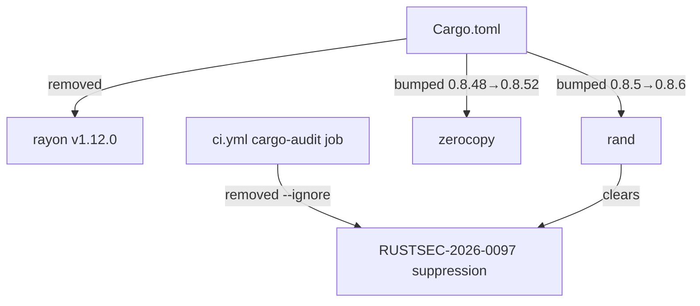
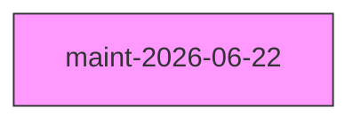
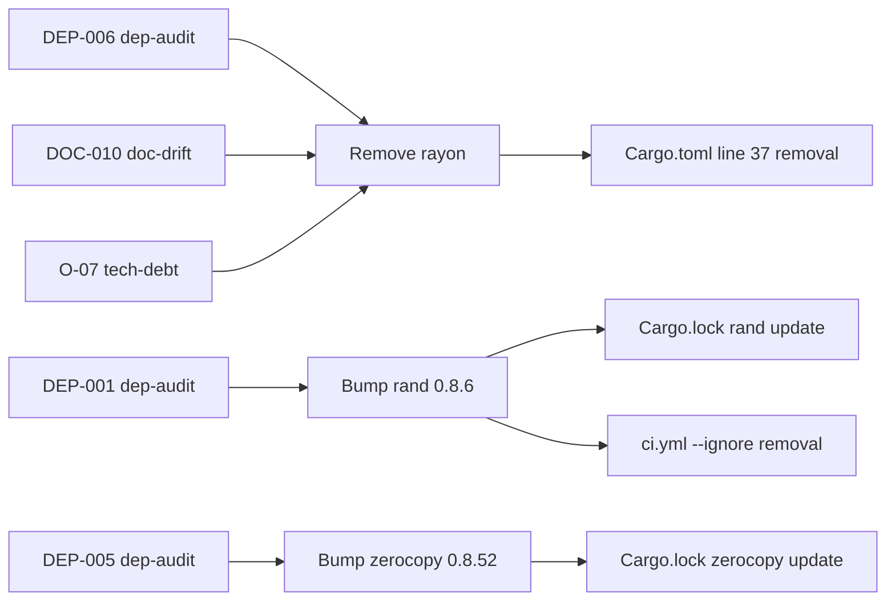

## Summary

Dependency hygiene sweep for maintenance run maint-2026-06-22. Three independent sweeps (DEP-006/DOC-010/O-07) identified `rayon` as a dead direct dependency with zero usage across `src/`, `benches/`, and tests. This PR removes it, clears a pending security advisory (RUSTSEC-2026-0097) by bumping `rand` 0.8.5→0.8.6, and applies a precautionary `zerocopy` 0.8.48→0.8.52 bump. The now-unnecessary CI advisory ignore flag is removed.

**Changes:**
- Remove `rayon = "1"` from `Cargo.toml` (dead direct dep, triple-sweep convergence signal: DEP-006/DOC-010/O-07)
- Bump `rand` 0.8.5→0.8.6 (clears RUSTSEC-2026-0097/CWE-119; build-dep only, not CLI-reachable)
- Bump `zerocopy` 0.8.48→0.8.52 (precautionary; no active advisory; soundness track-record history)
- Remove `--ignore RUSTSEC-2026-0097` from `.github/workflows/ci.yml` (`cargo audit` now runs clean)

## Architecture Changes

No runtime behavior changes. All changes are to the dependency graph and build pipeline only.

## Story Dependencies

This is a standalone maintenance sweep PR. No story dependencies. No upstream PRs required.

## Spec Traceability

## Test Evidence

Pre-push gate evidence (verified by implementer on branch `chore/deps-maint-2026-06-22`):

| Check | Result |
|-------|--------|
| `cargo build` | PASS |
| `cargo test --all-targets` | PASS |
| `cargo clippy --all-targets -- -D warnings` | PASS |
| `cargo fmt --check` | PASS |
| `cargo audit` | PASS — exit 0, 0 advisories |

All checks performed in worktree `/Users/zious/Documents/GITHUB/wirerust/.worktrees/maint-deps`.

## Holdout Evaluation

N/A — evaluated at wave gate. This is a dependency hygiene PR with no behavioral contract changes.

## Adversarial Review

Pending — dispatched as part of this PR lifecycle (see review cycle below).

## Security Review

Pending — dispatched as part of this PR lifecycle. This PR is security-relevant due to RUSTSEC-2026-0097/CWE-119 advisory clearance.

**Advisory context (DEP-001):**
- Advisory: RUSTSEC-2026-0097
- CWE: CWE-119 (Improper Restriction of Operations within Bounds of a Memory Buffer — soundness/UB category)
- Dependency chain: `rand 0.8.5 ← phf_generator 0.11.3 ← phf_codegen 0.11.3 ← tls-parser 0.12.2 [build-dep] ← wirerust`
- CLI-reachable: NO (build-time only; rand does not appear in production binary)
- Exploit condition: requires custom global logger calling `rand::rng()` + concurrent thread reseed race — neither condition present in wirerust
- Resolution: `cargo update -p rand` bumps to 0.8.6 which resolves RUSTSEC-2026-0097

## Risk Assessment

| Dimension | Assessment |
|-----------|-----------|
| Blast radius | Minimal — dependency graph cleanup only; no src/ changes |
| Runtime impact | None — rayon removal confirmed by zero `use rayon` / `rayon::` grep in src/benches/tests |
| Supply-chain risk | Reduced — removes unused dep, clears active advisory |
| Performance impact | None |
| Behavioral change | None |
| CI impact | cargo-audit job now runs without `--ignore` flags; all action pins UNCHANGED |

## AI Pipeline Metadata

| Field | Value |
|-------|-------|
| Pipeline mode | Maintenance sweep (maint-2026-06-22) |
| Maintenance run | maint-2026-06-22 |
| Base commit | dd3b069 (develop) |
| Branch | `chore/deps-maint-2026-06-22` |
| Worktree | `/Users/zious/Documents/GITHUB/wirerust/.worktrees/maint-deps` |
| Sweep finding IDs | DEP-001, DEP-005, DEP-006, DOC-010, O-07 |

## Pre-Merge Checklist

- [x] `cargo build` passes
- [x] `cargo test --all-targets` passes
- [x] `cargo clippy --all-targets -- -D warnings` passes
- [x] `cargo fmt --check` passes
- [x] `cargo audit` passes (exit 0, 0 advisories)
- [x] No `rayon::` usage in `src/` confirmed (3 independent sweeps)
- [x] All GH Actions SHA-pins UNCHANGED (ci.yml edit only modifies `run:` step body, not `uses:` lines)
- [ ] PR review clean (pr-reviewer APPROVE)
- [ ] Security review clean
- [ ] Adversarial review clean
- [ ] CI green (all jobs)
- [ ] Human merge approval (auto_merge: false per maintenance-config.yaml)
