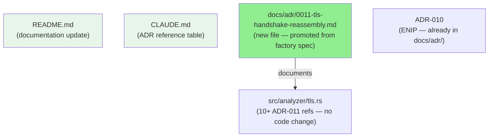
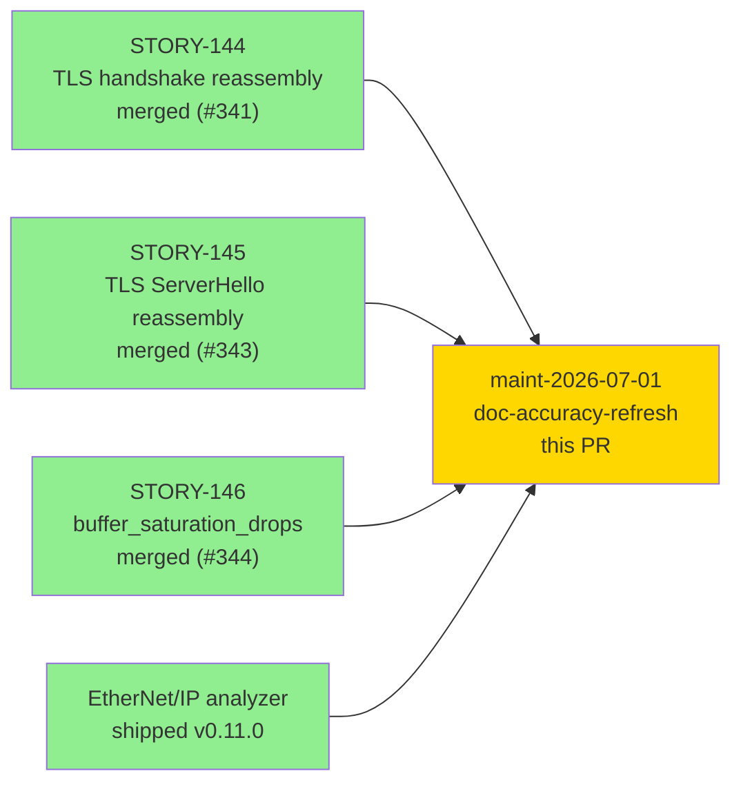
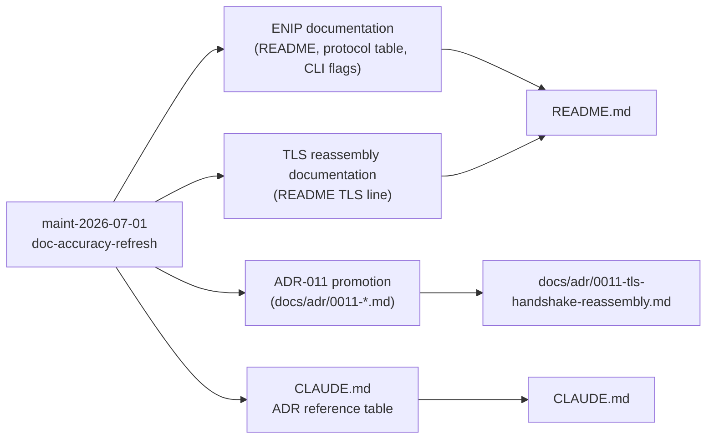
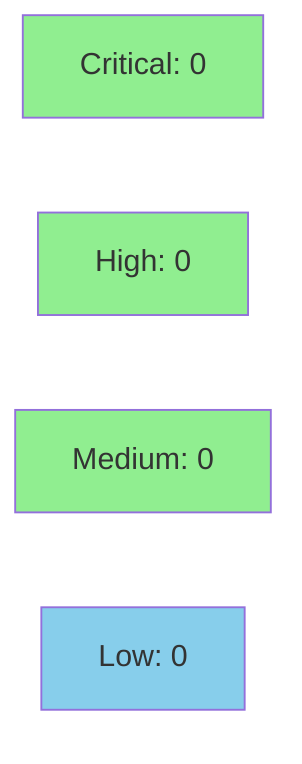

# [maint-2026-07-01] docs: document ENIP + TLS reassembly, add ADR-010/011 references

**Epic:** Maintenance sweep maint-2026-07-01 — doc-accuracy-refresh
**Mode:** maintenance
**Convergence:** N/A — docs-only change


Three documentation accuracy fixes from maintenance sweep maint-2026-07-01: (1) README.md
omitted the EtherNet/IP (CIP) analyzer shipped in v0.11.0 — protocol table, CLI flag
documentation, Features list, and dependency table now reflect the live implementation;
(2) TLS multi-record handshake-message reassembly and the `buffer_saturation_drops` counter
(STORY-144/145/146, v0.11.1) were missing from the TLS forensics feature line; (3)
ADR-011 (TLS handshake reassembly design, referenced 10+ times in `src/analyzer/tls.rs`)
was absent from `docs/adr/` — the file is promoted from the factory spec. CLAUDE.md Project
References table updated to list ADR-010 and ADR-011. No executable code or test logic
changed. 2232 tests remain green.

---

## Architecture Changes



No architectural changes to the runtime. This PR is docs-only (README.md, CLAUDE.md, and
a new ADR file). No `src/` files changed.

<details>
<summary><strong>Change Summary by File</strong></summary>

### README.md
- Features list: added EtherNet/IP (CIP) as a supported protocol; expanded TLS line with
  multi-record reassembly and `buffer_saturation_drops` telemetry.
- CLI Options block: added `--enip`, `--enip-write-burst-threshold`, `--enip-error-burst-threshold`.
- Architecture ASCII diagram: added EtherNet/IP to StreamAnalyzers list.
- Dependencies table: added ENIP/CIP Analyzer row.
- Protocol table: added EtherNet/IP TCP row with port 44818, MITRE techniques, and flag.
- New section "EtherNet/IP CIP Analyzer": detection table (7 detections, 6 MITRE techniques),
  JSON summary schema (7 canonical fields), and CLI flag documentation.

### CLAUDE.md
- Project References table: appended `, 0010 EtherNet/IP CIP stream dispatch, 0011 TLS handshake reassembly` to the ADR line.

### docs/adr/0011-tls-handshake-reassembly.md (new file)
- Promoted from `.factory/specs/` where it lived as the authoritative design record.
- Covers: RFC 5246 §6.2.1 fragmentation context, 3 design alternatives, 9 decisions
  (carry buffers, overflow policy, exact-consume loop, test seams, DTU assessment),
  consequences, and ADR cross-references.

</details>

---

## Story Dependencies



All upstream features are merged. No downstream story is blocked by this PR.

---

## Spec Traceability



No behavioral contracts changed. Docs-only diff — describes implemented behavior.

---

## Test Evidence

### Coverage Summary

| Metric | Value | Threshold | Status |
|--------|-------|-----------|--------|
| Tests | 2232 / 2232 pass | 100% | PASS |
| Coverage | unchanged | >80% | PASS |
| Mutation kill rate | N/A (no executable code changed) | — | N/A |
| Holdout satisfaction | N/A — evaluated at wave gate | — | N/A |

No new tests. No test logic changed. No executable code changed.
Verification: `cargo build`, `cargo test --all-targets`, `cargo clippy --all-targets -- -D warnings`,
`cargo fmt --check` all green. green-doc-tense gate compliant.

| Metric | Value |
|--------|-------|
| **New tests** | 0 added, 0 modified |
| **Total suite** | 2232 tests PASS |
| **Coverage delta** | 0% (docs-only change) |
| **Mutation kill rate** | N/A |
| **Regressions** | 0 |

---

## Holdout Evaluation

N/A — evaluated at wave gate. No behavioral contracts changed by this PR.

---

## Adversarial Review

N/A — evaluated at Phase 5. Docs-only change; no behavioral surface affected.

---

## Security Review



Docs-only diff (README.md, CLAUDE.md, one new ADR Markdown file). No executable code paths
added or modified. No injection vectors, auth changes, or input validation changes.
OWASP Top 10 not applicable.

---

## Risk Assessment & Deployment

### Blast Radius
- **Systems affected:** None at runtime
- **User impact:** None (docs-only change)
- **Data impact:** None
- **Risk Level:** LOW

### Performance Impact
No executable code changed. No performance impact.

<details>
<summary><strong>Rollback Instructions</strong></summary>

**Immediate rollback (< 1 min):**
```bash
git revert 6e64cfb
git push origin develop
```

No runtime effect from this change; rollback is cosmetic only.

</details>

### Feature Flags
None applicable. `--enip` flag already ships in `develop`; this PR documents it.

---

## Traceability

| Requirement | File | Change Type | Status |
|-------------|------|-------------|--------|
| doc-accuracy (ENIP analyzer) | README.md | New section + protocol table row | PASS |
| doc-accuracy (TLS reassembly) | README.md | Feature line expansion | PASS |
| doc-accuracy (ADR-011 missing) | docs/adr/0011-tls-handshake-reassembly.md | New file (promoted) | PASS |
| doc-accuracy (ADR refs) | CLAUDE.md | Project References update | PASS |

---

## AI Pipeline Metadata

<details>
<summary><strong>Pipeline Details</strong></summary>

```yaml
ai-generated: true
pipeline-mode: maintenance
factory-version: "1.0.0"
pipeline-stages:
  spec-crystallization: skipped (maintenance)
  story-decomposition: skipped (maintenance)
  tdd-implementation: skipped (docs-only)
  holdout-evaluation: skipped (maintenance)
  adversarial-review: skipped (maintenance)
  formal-verification: skipped (maintenance)
  convergence: N/A
maintenance-run: maint-2026-07-01
sweep-type: doc-accuracy-refresh
branch: docs/readme-adr-refresh
head-commit: 6e64cfb
base-commit: ba6fbd8
files-changed: 3
lines-added: 123 (README ~82, CLAUDE.md ~1, ADR-011 ~301)
lines-removed: 4
models-used:
  builder: claude-sonnet-4-6
generated-at: "2026-07-01T00:00:00Z"
```

</details>

---

## Pre-Merge Checklist

- [ ] All CI status checks passing
- [x] Coverage delta is positive or neutral (no executable code changed)
- [x] No critical/high security findings unresolved (docs-only diff)
- [x] Rollback procedure validated (git revert 6e64cfb)
- [ ] Human review completed (docs variant — human authorizes merge)
