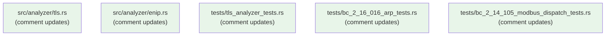
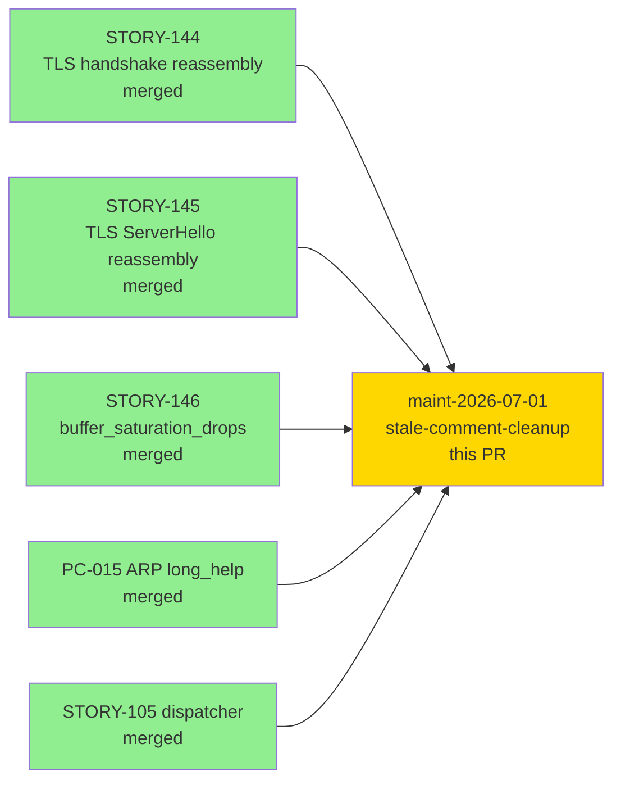
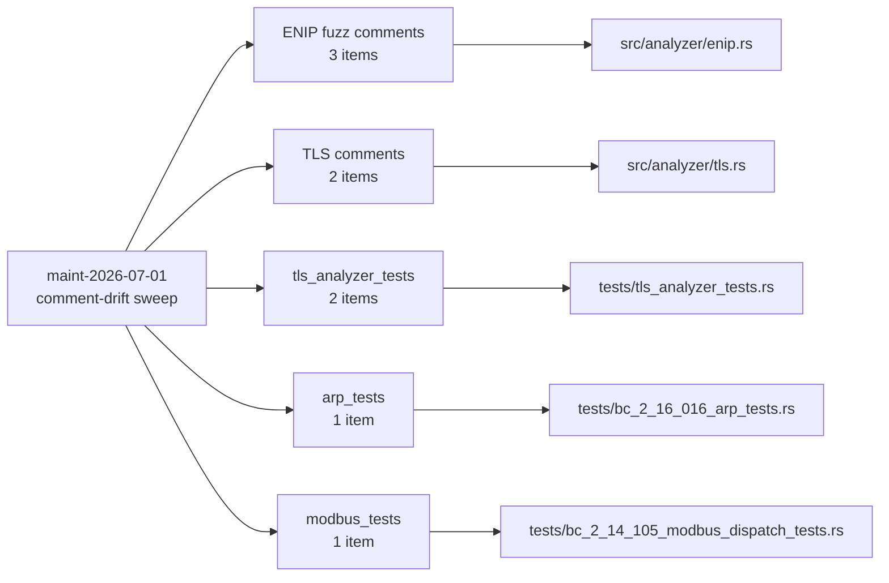
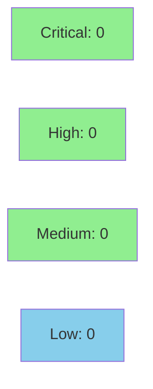

# [maint-2026-07-01] docs: fix stale RED-tense comments and discharged TODOs across analyzers/tests

**Epic:** Maintenance sweep maint-2026-07-01 — stale-comment-cleanup
**Mode:** maintenance
**Convergence:** N/A — comment/docstring-only change


Retire stale RED-tense comments, discharged `TODO` references, and aspirational-future
language from five files (`src/analyzer/tls.rs`, `src/analyzer/enip.rs`,
`tests/tls_analyzer_tests.rs`, `tests/bc_2_16_016_arp_tests.rs`,
`tests/bc_2_14_105_modbus_dispatch_tests.rs`). Every item marked "TODO", "RED GATE", or
"STORY-NNN scope" now reflects shipped reality: STORY-144/145/146 carry-drain and
ServerHello reassembly, STORY-146 `buffer_saturation_drops`, ENIP F-P9-002 fuzz
harness, ARP PC-015 long_help, and Modbus STORY-105 dispatcher. No executable code,
test logic, or assertion conditions were changed. 2232 tests remain green.

---

## Architecture Changes



No architectural changes. This PR is comment/docstring/assertion-message text only.

<details>
<summary><strong>Change Summary by File</strong></summary>

### src/analyzer/enip.rs (3 items)
- `parse_cpf_items`: "Fuzz Obligation (F-P9-002)" heading → "Fuzz Coverage (F-P9-002 — discharged)"; removed TODO line; replaced with factual statement that `fuzz_enip_cip_parse.rs` covers this function.
- `parse_cip_header`: Same pattern as above.
- `parse_cip_request_path`: Same pattern as above.

### src/analyzer/tls.rs (2 items)
- Dispatch comment block: "STORY-145 scope (ServerHello on server direction)" → "ServerHello; handled in the ServerToClient arm (AC-145-001)".
- `client_hello_seen_for_testing` doc: Removed "symmetric companion to the EXISTING … tls.rs:991" brittle line-ref; updated stale Red Gate paragraph to reflect STORY-144 carry drain loop implemented.

### tests/tls_analyzer_tests.rs (2 items)
- `test_buffer_overflow_silent_no_counters`: Comment above test replaced aspirational "No finding, no log line, no counter tracks…" with accurate description referencing `buffer_saturation_drops` (STORY-146). Assertion failure message updated to reference `buffer_saturation_drops` rather than "completely silent — no counters".
- `story_144` module: "Red Gate: FAILS because carry drain loop not implemented" → "Carry drain loop implemented (STORY-144); test passes." Frame C comment expanded with precise rejection reason (session_id length 0xcc = 204 > 32 → RFC 8446 §4.1.2).

### tests/bc_2_16_016_arp_tests.rs (1 item)
- `test_BC_2_16_016_pc4_help_text_unbounded_findings`: Replaced multi-paragraph RED GATE / aspirational pre-implementation description with factual post-implementation description. Assertion failure message updated to remove "Currently FAILING because long_help is absent from src/cli.rs lines 194-198".

### tests/bc_2_14_105_modbus_dispatch_tests.rs (1 item)
- `test_BC_2_14_023_modbus_flag_enables_analyzer_empty_pcap`: Replaced 9-line conditional RED GATE pre/post analysis with a 4-line factual description of current behavior.

</details>

---

## Story Dependencies



All upstream features are merged. No downstream story is blocked by this PR.

---

## Spec Traceability



No behavioral contracts changed. This PR is purely comment/docstring/assertion-message text.

---

## Test Evidence

### Coverage Summary

| Metric | Value | Threshold | Status |
|--------|-------|-----------|--------|
| Tests | 2232 / 2232 pass | 100% | PASS |
| Coverage | unchanged | >80% | PASS |
| Mutation kill rate | N/A (no executable code changed) | — | N/A |
| Holdout satisfaction | N/A — evaluated at wave gate | — | N/A |

No new tests added. No test logic changed. Assertion conditions unchanged.
Verification: `cargo build`, `cargo test --all-targets`, `cargo clippy --all-targets -- -D warnings`, `cargo fmt --check` all green. green-doc-tense gate compliant.

| Metric | Value |
|--------|-------|
| **New tests** | 0 added, 0 modified (logic unchanged) |
| **Total suite** | 2232 tests PASS |
| **Coverage delta** | 0% (comment-only change) |
| **Mutation kill rate** | N/A |
| **Regressions** | 0 |

---

## Holdout Evaluation

N/A — evaluated at wave gate. No behavioral contracts changed by this PR.

---

## Adversarial Review

N/A — evaluated at Phase 5. Comment/docstring-only change; no behavioral surface affected.

---

## Security Review



Comment/docstring-only diff. No executable code paths added or modified. No injection
vectors, auth changes, or input validation changes. OWASP Top 10 not applicable.

---

## Risk Assessment & Deployment

### Blast Radius
- **Systems affected:** None at runtime
- **User impact:** None (comment-only change)
- **Data impact:** None
- **Risk Level:** LOW

### Performance Impact
No executable code changed. No performance impact.

<details>
<summary><strong>Rollback Instructions</strong></summary>

**Immediate rollback (< 1 min):**
```bash
git revert d2c92de
git push origin develop
```

No runtime effect from this change; rollback is cosmetic only.

</details>

### Feature Flags
None applicable.

---

## Traceability

| Requirement | File | Change Type | Status |
|-------------|------|-------------|--------|
| Green-doc-tense gate | src/analyzer/enip.rs | Comment: aspirational → factual | PASS |
| Green-doc-tense gate | src/analyzer/tls.rs | Comment: stale RED/line-ref → factual | PASS |
| Green-doc-tense gate | tests/tls_analyzer_tests.rs | Comment: stale RED/STORY ref → factual | PASS |
| Green-doc-tense gate | tests/bc_2_16_016_arp_tests.rs | Comment: RED GATE → factual | PASS |
| Green-doc-tense gate | tests/bc_2_14_105_modbus_dispatch_tests.rs | Comment: RED GATE → factual | PASS |

---

## AI Pipeline Metadata

<details>
<summary><strong>Pipeline Details</strong></summary>

```yaml
ai-generated: true
pipeline-mode: maintenance
factory-version: "1.0.0"
pipeline-stages:
  spec-crystallization: skipped (maintenance)
  story-decomposition: skipped (maintenance)
  tdd-implementation: skipped (comment-only)
  holdout-evaluation: skipped (maintenance)
  adversarial-review: skipped (maintenance)
  formal-verification: skipped (maintenance)
  convergence: N/A
maintenance-run: maint-2026-07-01
sweep-type: stale-comment-cleanup
branch: docs/stale-comment-cleanup
head-commit: d2c92de
base-commit: ba6fbd8
files-changed: 5
lines-added: 40
lines-removed: 56
models-used:
  builder: claude-sonnet-4-6
generated-at: "2026-07-01T00:00:00Z"
```

</details>

---

## Pre-Merge Checklist

- [ ] All CI status checks passing
- [x] Coverage delta is positive or neutral (no executable code changed)
- [x] No critical/high security findings unresolved (comment-only diff)
- [x] Rollback procedure validated (git revert d2c92de)
- [x] Human review completed (docs variant — human authorizes merge)
