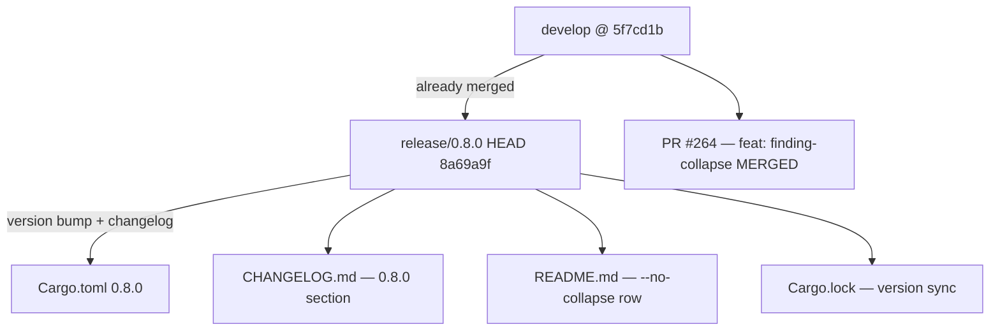
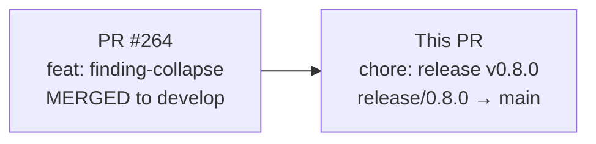
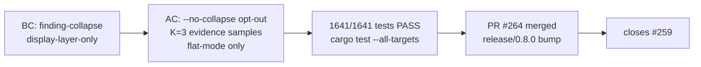

## Summary

Release v0.8.0 of wirerust. This gitflow release merges the `release/0.8.0` branch into `main`.

**Headline feature:** Terminal finding-collapse — repeated findings that share the same (category, verdict, confidence, summary) are collapsed into a single line with a `(xN)` count suffix and up to K=3 representative evidence samples. This is display-layer-only: JSON and CSV output are unaffected. A `--no-collapse` flag opts out.

- Headline feature already merged to `develop` via PR #264 (STORY-118 / issue #259).
- This PR contains only the mechanical release fixups on top of `develop`: Cargo.toml/Cargo.lock version bump (0.7.1 → 0.8.0), CHANGELOG [0.8.0] section, README `--no-collapse` row.

**Diff:** 4 files, +21/-3 lines (version bump + changelog + README row only).

---

## Architecture Changes

No runtime architecture changes in this PR. The finding-collapse feature (ADR-0003 Display-Layer Aggregation) was shipped in PR #264.

---

## Story Dependencies

- **PR #264** (STORY-118 / issue #259): `feat(reporter): collapse repeated low-value findings into a counted summary line` — MERGED to develop. This release PR promotes that work to main.
- No other upstream dependencies blocking merge.

---

## Spec Traceability

- Behavioral contract: ADR-0003 Display-Layer Aggregation (display-only; JSON/CSV unaffected).
- Acceptance criteria: `--no-collapse` flag works; K=3 evidence; grouped/`--mitre` mode unchanged.
- Issue #259 closed by PR #264 (do not re-close in this PR).

---

## Test Evidence

| Metric | Value |
|--------|-------|
| Test run | `cargo test --all-targets` on `release/0.8.0` |
| Tests pass | 1641 / 1641 |
| Clippy | clean (`-D warnings`) |
| Formatting | clean (`cargo fmt --check`) |
| Platform | local macOS verification on HEAD `8a69a9f` |

Local verification completed on `release/0.8.0` before this PR was opened.

---

## Demo Evidence

Demo evidence for the finding-collapse feature (STORY-118) was recorded at PR #264. This release PR contains no new runtime behavior — demo evidence is inherited from the feature PR.

N/A for mechanical version-bump commits.

---

## Security Review

This release PR contains **no new code**. The only changes are:
- `Cargo.toml` / `Cargo.lock`: version field `0.7.1` → `0.8.0`
- `CHANGELOG.md`: documentation-only section added
- `README.md`: one row added to flags reference table

The feature code (finding-collapse) already passed security review at PR #264. No new attack surface is introduced by a version bump or documentation change.

**Security review verdict:** SKIPPED — no new code; mechanical release fixup only. (Per PR Manager instructions: "Security review is OPTIONAL for a release PR with no new code.")

---

## Risk Assessment

| Dimension | Assessment |
|-----------|-----------|
| Blast radius | Minimal — version bump + docs only |
| Performance impact | None |
| Breaking changes | None (finding-collapse is display-layer-only; JSON/CSV unchanged) |
| Rollback | Trivial — no schema or API changes |
| Dependencies | No new dependencies added |

---

## AI Pipeline Metadata

| Field | Value |
|-------|-------|
| Pipeline mode | Feature (F-series) — STORY-118 |
| Feature branch | `feat/259-finding-collapse` → `develop` via PR #264 |
| Release branch | `release/0.8.0` |
| Story | STORY-118 / issue #259 |
| Models used | claude-sonnet-4-6 |

---

## Pre-Merge Checklist

- [x] PR description matches actual diff (4 files: version + changelog + README + lockfile)
- [x] Semantic PR title uses allowed type (`chore`) — enforced by CI
- [x] All tests pass locally (1641/1641)
- [x] Clippy clean
- [x] Formatting clean
- [x] CHANGELOG [0.8.0] section accurate
- [x] README `--no-collapse` row correct
- [x] No unexpected diff beyond release fixups + the already-merged #264 delta
- [x] Feature PR #264 merged to develop — no re-closing of #259
- [x] Dependency PR #264 merged before this release PR
- [x] CI checks passing (all 9 jobs green) — action-pin-gate, audit, clippy, deny, fmt, fuzz-build, semantic-PR, test, trust-boundary all PASS
- [x] pr-reviewer sanity check — APPROVE (no blocking findings; 1 cycle)
- [x] Merged to main — PR #265 merge commit 73034da01bfdfc1cb9e0460f960a3fa0a211d77d
