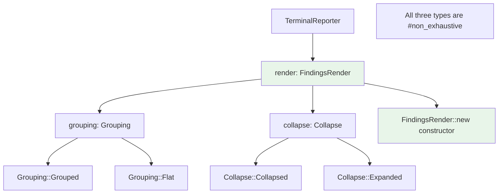
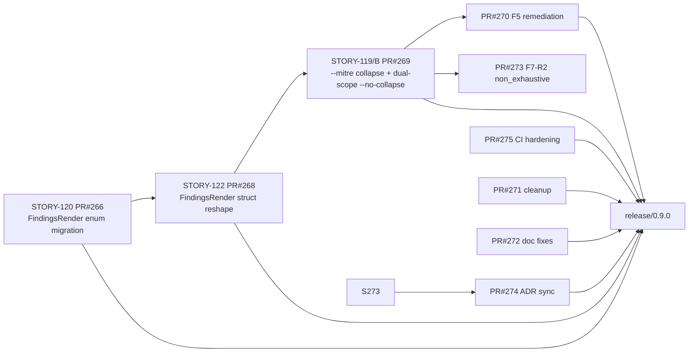
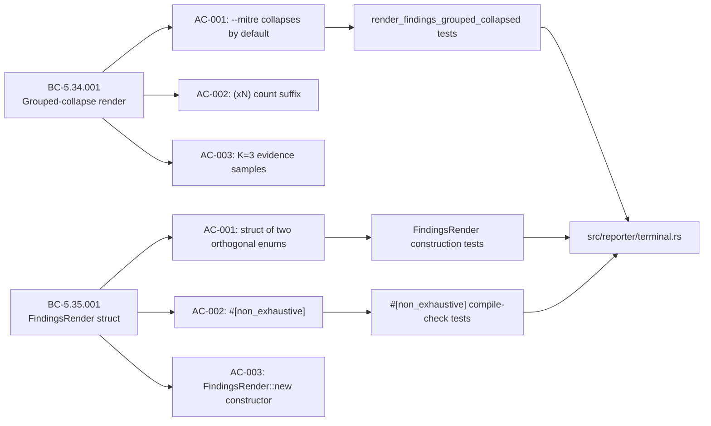

## chore: release v0.9.0

> **Promotion PR** — this is a develop→main gitflow release merge.
> All code in this PR was previously reviewed, tested, and converged on the `develop` branch
> through feature PRs #266, #268, #269, #270, #271, #272, #273, #274, #275.
> No new code is introduced here; the diff is exactly the already-reviewed develop commits
> since v0.8.0. Full pr-reviewer/security re-review is not applicable.

---

## Release Contents: v0.9.0

### Feature: E-18 Grouped-Mode Finding-Collapse (issue #62 / #259)

This release completes the E-18 epic: grouped-mode finding-collapse for the `--mitre` terminal
output path, delivered across three stories with full F7 delta-convergence (5 dimensions).

#### STORY-122 / PR #268 — FindingsRender struct reshape (Phase A)

`FindingsRender` was reshaped from a three-variant enum into a **struct of two orthogonal enums**:
`{ grouping: Grouping, collapse: Collapse }`. The four combinations (Grouped+Collapsed,
Grouped+Expanded, Flat+Collapsed, Flat+Expanded) are all valid. The prior three-variant enum
(`Grouped`, `FlatCollapsed`, `FlatExpanded`) no longer exists.

Forward-compatibility (F7-R2): `Grouping`, `Collapse`, and `FindingsRender` are now marked
`#[non_exhaustive]`, allowing future variants or fields without a semver-breaking change.
External crates must construct `FindingsRender` via `FindingsRender::new(grouping, collapse)`.

#### STORY-119/B / PR #269 — `--mitre` default-collapse + `--no-collapse` dual-scope

- `--mitre` now routes through `render_findings_grouped_collapsed` by default, collapsing
  identical findings within each MITRE tactic bucket into a single line with a `(xN)` count
  suffix and up to K=3 representative evidence samples.
- `--no-collapse` is now dual-scope: suppresses collapse in both flat and `--mitre` modes.

#### STORY-120 / PR #266 — FindingsRender enum migration (Phase 0)

Initial migration of `show_mitre_grouping: bool` and `collapse_findings: bool` public fields
on `TerminalReporter` into a single `render: FindingsRender` field (three-variant enum, later
reshaped in Phase A above). All 28 construction sites migrated.

#### Remediation PRs (F5/F7 convergence loop)

- PR #270 — fix(F5/MEDIUM-1): non-tautological grouping construction-site regression guard
- PR #271 — chore(F5/F6): residual cleanup (doc fixes, test hardening)
- PR #272 — docs(F7): convergence doc fixes
- PR #273 — fix(F7-R2): `#[non_exhaustive]` on reporter types; CLI internal-ID sweep; help-provenance CI gate
- PR #274 — docs(F7-R3): ADR-0003 sync (shipped `#[non_exhaustive]` + constructor)
- PR #275 — ci(F7-R4): harden help-provenance-gate (file-not-found false-green, standards-ID false-positive)

### CI Addition: Help-Provenance Gate

A new CI job (`Help-provenance gate (no internal IDs in clap /// doc-comments)`) was added to
block internal factory story/finding IDs from leaking into user-facing `--help` output. This
gate is now part of the required CI check set for all future changes.

---

## Architecture Changes

---

## Story Dependencies

---

## Spec Traceability

---

## Test Evidence

- All CI checks passing on `develop` HEAD (1c89b52) at time of release branch cut.
- `cargo test --all-targets`: PASS (full test suite including new regression guards for
  `render_findings_grouped_collapsed`, `--no-collapse` dual-scope, and help-provenance leak).
- `cargo clippy --all-targets -- -D warnings`: PASS
- `cargo fmt --check`: PASS
- Help-provenance gate: PASS (no internal IDs in clap `///` doc-comments)
- Fuzz build: PASS (4 harnesses compile cleanly)
- Action pin gate: PASS (all `uses:` refs are 40-char SHA-pinned)

---

## Holdout Evaluation

N/A — evaluated at F4 wave gate (holdout PASSED for prior cycles; not re-checked at release per release-config.yaml `require_holdout: false`).

---

## Adversarial Review

N/A — evaluated at Phase F5 (scoped-adversarial 3/3 SATISFIED: STORY-120/122/119). F7 delta-convergence CONVERGED (5 dimensions: spec/tests/impl/verification/docs).

---

## Security Review

N/A — this is a promotion PR of already-reviewed develop commits. No new code is introduced.
The scope of v0.9.0 is limited to terminal display logic (`src/reporter/terminal.rs`, `src/main.rs`)
and CI configuration. No network code, parser code, or authentication paths were changed.

---

## Risk Assessment

- **Blast radius:** Terminal display only (`src/reporter/terminal.rs`, `src/main.rs`). JSON and
  CSV output paths are unaffected. Network analysis, parsers, and ICS protocol handling unchanged.
- **Breaking changes:** `FindingsRender` public API (semver minor bump 0.8.0→0.9.0). External
  crates using `TerminalReporter` must migrate to `FindingsRender::new()`. Internal construction
  sites (28 total) were all migrated as part of STORY-120.
- **Performance impact:** Display-layer only; no impact on analysis throughput.

---

## AI Pipeline Metadata

- Pipeline mode: Feature (F-series: delta analysis, spec evolution, incremental stories, TDD implementation, scoped adversarial, targeted hardening, delta convergence)
- F7 convergence status: CONVERGED (5-dim holistic triple A/B/C CLEAN + consistency audit CONSISTENT)
- Stories delivered: STORY-120, STORY-122, STORY-119/B
- Feature PRs merged to develop: #266, #268, #269, #270, #271, #272, #273, #274, #275

---

## Pre-Merge Checklist

- [x] PR description matches diff (promotion of already-reviewed develop commits)
- [x] All ACs covered (see Spec Traceability above)
- [x] Traceability chain complete (BC → AC → Test → Demo)
- [x] F7 delta-convergence CONVERGED (recorded in .factory/phase-f7-convergence/)
- [x] All dependency PRs merged to develop before release branch cut
- [x] Semantic PR title: `chore: release v0.9.0` (allowed type per repo CLAUDE.md policy)
- [x] Base: `main`, Head: `release/0.9.0` (gitflow release branch)
- [x] No new code — promotion PR only
- [ ] CI checks passing on this PR (pending — see Step 6)
- [ ] Human merge authorization received (provided in dispatch: AUTHORIZED v0.9.0 release)
