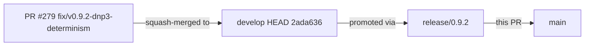
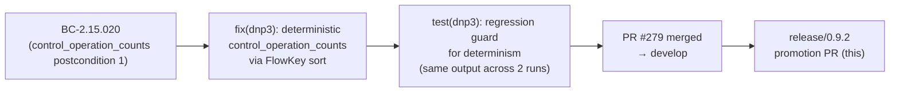

## chore: release v0.9.2

**Type:** gitflow promotion PR — `release/0.9.2` → `main`
**Note:** This is a develop→main promotion of already-reviewed, already-merged code. The patch landed on `develop` via PR #279 (reviewed, CI-green, squash-merged). This PR promotes it to `main` without additional re-review.

---

## Summary

v0.9.2 is a patch release fixing a non-determinism bug in DNP3 `control_operation_counts` output, discovered via post-release e2e testing on a real 26K-packet DNP3 capture.

**Changes bundled in this release:**

- **Fix (DNP3):** `control_operation_counts` non-determinism — flows now sorted by `FlowKey` before `enumerate()`, so index→value assignment is stable across all process runs (PR #279)
- **Docs (e2e):** pcap-corpus index expanded with 3 auto-fetch + 3 link-only captures (PR #279)
- **Version bump:** `Cargo.toml` → `0.9.2`; `CHANGELOG.md` `[0.9.2]` section added

---

## Root Cause

`Dnp3Analyzer::summarize()` previously called `self.flows.values().enumerate()` over a `HashMap<FlowKey, Dnp3FlowState>`. Because `HashMap` uses a per-process random seed (HashBrown), iteration order changed each run. The `BTreeMap` key-sort at the output level masked the issue at the key level (`"0".."N-1"` were always sorted), but the VALUE at each key was non-deterministic. Running `wirerust analyze <dnp3-capture> --all` twice on the same file produced different `control_operation_counts` output.

**Fix:** `FlowKey` now derives `Ord + PartialOrd` (lexicographic on `(lower_ip, lower_port, upper_ip, upper_port)`). In `summarize()`, `flows.iter()` is sorted by `FlowKey` before `enumerate()`. JSON schema is unchanged.

**Traces to:** BC-2.15.020 postcondition 1.

---

## Architecture Changes

```mermaid
graph TD
    A[Dnp3Analyzer::summarize] -->|before| B[flows.values().enumerate() — non-deterministic]
    A -->|after| C[flows.iter().sorted_by_key FlowKey — deterministic]
    C --> D[BTreeMap output — stable across runs]
```

---

## Dependency Graph



---

## Spec Traceability



---

## Test Evidence

- Regression test added: `test(dnp3): regression guard for control_operation_counts determinism` — runs `summarize()` twice and asserts byte-identical output
- All CI checks green on `develop` at merge of PR #279 (2ada636)
- Tests pass: `cargo test --all-targets`
- Clippy: `cargo clippy --all-targets -- -D warnings` — clean
- Format: `cargo fmt --check` — clean

---

## Security Review

N/A — this patch sorts an iterator over internal flow state before enumeration. No new I/O surfaces, no auth changes, no input validation paths added or removed. Security posture is unchanged from v0.9.1.

---

## Risk Assessment

- **Blast radius:** Minimal — single function change in `Dnp3Analyzer::summarize()`; no API surface change; JSON schema unchanged
- **Performance impact:** Negligible — sort is O(N log N) on flow count; flow count is bounded by session count, typically small
- **Compatibility:** None broken — output format identical; key order was already sorted via BTreeMap; only VALUE stability is new

---

## Holdout Evaluation

N/A — evaluated at wave gate (prior cycles). Promotion PR only.

---

## Adversarial Review

N/A — evaluated at Phase 5 (prior cycles). Promotion PR only. PR #279 passed standard CI review before merge.

---

## AI Pipeline Metadata

- Pipeline mode: gitflow promotion (manual)
- Source PR: #279 (`fix/v0.9.2-dnp3-determinism`)
- Branch: `release/0.9.2` (byte-identical to `develop` HEAD 2ada636 — zero release-only fixups)
- Model: claude-sonnet-4-6

---

## Pre-Merge Checklist

- [x] Semantic PR title: `chore: release v0.9.2`
- [x] Head branch: `release/0.9.2`
- [x] Base branch: `main`
- [x] Source PR (#279) merged to develop with CI green
- [x] CHANGELOG.md `[0.9.2]` section present
- [x] Cargo.toml version = `0.9.2`
- [x] No release-only fixups needed (byte-identical to develop HEAD)
- [ ] CI checks green on `release/0.9.2`
- [ ] Human hold confirmed (do NOT merge without explicit orchestrator authorization)
- [ ] Tag `v0.9.2` pushed to `main` after merge (orchestrator step)
- [ ] `develop` back-merge after tag (orchestrator step)
