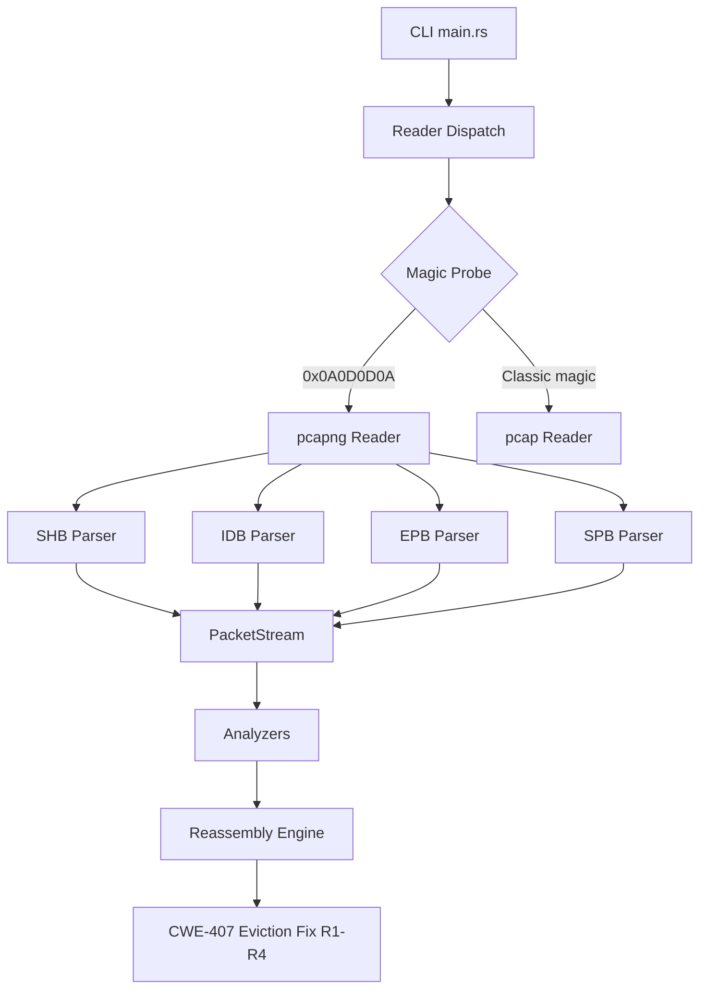
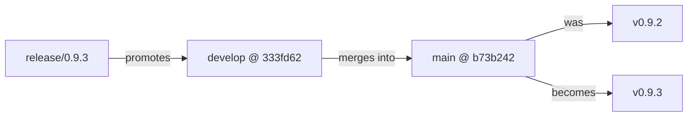

## chore: release v0.9.3

**Gitflow develop → main release promotion.** This PR merges the `release/0.9.3` branch
into `main`, advancing the stable branch from v0.9.2 to v0.9.3. All code in the 108-commit
develop delta was reviewed and CI-verified when it merged to `develop`; the only content
unique to this PR is the version bump and changelog.

---

## Release Summary

| Field | Value |
|-------|-------|
| Version bump | 0.9.2 → 0.9.3 |
| Branch | `release/0.9.3` → `main` |
| Flow | gitflow develop→main release |
| crates.io publish | DISABLED |
| Post-merge tag | `v0.9.3` on `main` (after human approval) |
| Binary artifacts | 4 targets built on the tag (x86_64-linux, aarch64-linux, x86_64-macos, aarch64-macos) |

---

## What's in This Release

### Headline Feature — pcapng Capture-Format Reader

wirerust now reads pcapng files natively in addition to classic pcap.

- **Magic-byte detection** — format identified from the first 4 bytes (`0x0A0D0D0A` SHB
  magic), so pcapng files are accepted regardless of extension, including in directory
  batch mode.
- **Block types parsed:** SHB (big- and little-endian), IDB (up to 65,535 interfaces),
  EPB (with per-interface `if_tsresol` timestamp reconstruction), SPB (no timestamp).
- **Skipped silently:** NRB, ISB, DSB, OPB, unknown block types.
- **Multi-section rejection:** second SHB returns E-INP-012; use `mergecap`/`editcap` to
  re-save as single-section.
- **Same 5 link types** as classic pcap: Ethernet (1), Raw IP (101), Linux Cooked/SLL
  (113), IPv4 (228), IPv6 (229).
- **`PcapSource::is_pcapng` field** for zero-packet notice wording.
- **Per-file error isolation** in batch mode: one bad file does not abort the batch.

### Security Fix — TCP Reassembly CWE-407 DoS (PR #298)

A null-eviction storm in the TCP flow table caused quadratic O(F² log F) behavior on
captures with frozen or duplicate timestamps. A 120,000-flow frozen-timestamp capture
went from ~75 s to ~0.76 s after three mitigations:

- **R1 (CWE-401 zombie segments):** segments below the flush cursor are now rejected.
- **R2 (null-eviction fix):** break condition changed `<= max_flows` → `< max_flows`,
  ensuring at least one eviction per call.
- **R3 (batch eviction to headroom):** evicts to 90% of `max_flows` in one call,
  amortizing the sort cost.
- **R4 (packet-index cadence expiry):** packet-count-based sweep reclaims idle flows
  even on frozen-timestamp captures.

### F6 Hardening — New Input-Validation Guards E-INP-010..015

| Code | Condition |
|------|-----------|
| E-INP-010 | pcapng block framing rejection |
| E-INP-011 | Multi-IDB link-type conflict |
| E-INP-012 | Second SHB (multi-section file) |
| E-INP-013 | IDB after first packet block |
| E-INP-014 | File too large (> 4 GiB) |
| E-INP-015 | Interface table cap exceeded (> 65,535 IDBs) |

Additional hardening:
- CWE-835 forward-progress guard on the block-walk loop.
- CWE-367 TOCTOU window closed: file-size gate now uses `fstat` on the open fd.
- pcapng IDB options TLV now decoded with section endianness (not fixed little-endian).
- `read_magic` short-read race fixed: uses `read_exact()`.
- Block sequence counter uses `saturating_add` (SEC-005).

### E2E Corpus Tests

New `tests/e2e_corpus_smoke_tests.rs` — 7-capture pcapng block-diversity E2E suite plus
analyzer-gap captures covering HTTP, DNS-tunnel, pcapng SPB/multi-IDB, and IP-frag.

---

## CHANGELOG Reference

See [CHANGELOG.md §0.9.3](CHANGELOG.md#0.9.3---2026-06-22) for the full entry with
detailed descriptions of every change.

---

## Release Correctness

- [x] `Cargo.toml` version == `0.9.3`
- [x] `Cargo.lock` updated consistently (`wirerust` package version = `0.9.3`)
- [x] `CHANGELOG.md` `[0.9.3]` section present, dated 2026-06-22, well-formed
- [x] No stray/unexpected file changes beyond the develop delta + 2 release commits
- [x] Diff base is correct: `main` (b73b242 = v0.9.2)

---

## Architecture Changes

---

## Dependency Graph

---

## Pre-Merge Checklist

- [x] Version bump verified (Cargo.toml + Cargo.lock)
- [x] CHANGELOG [0.9.3] section present and accurate
- [x] No stray file changes
- [x] Diff base correct (main)
- [ ] CI checks passing (to be confirmed)
- [ ] Human pause-before-publish gate approved (REQUIRED BEFORE MERGE)
- [ ] Tag v0.9.3 created on main AFTER merge

---

## Post-Merge Actions (Human-Gated)

1. Approve this PR (pause-before-publish gate).
2. Merge PR → `main`.
3. Create tag `v0.9.3` on `main` HEAD.
4. Merge `main` back into `develop` to keep branches in sync.
5. Trigger binary artifact build on the tag (4 targets).
6. crates.io publish: DISABLED for this release.
