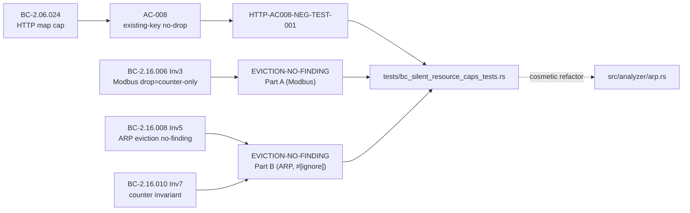
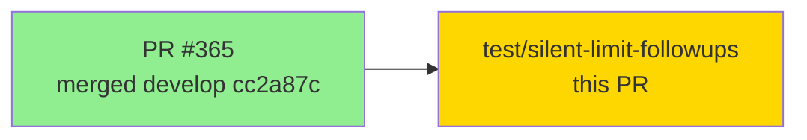

## Silent-limit LOW follow-ups: negative regression tests + ARP eviction cosmetic refactor

**Source:** Non-blocking LOW findings from PR #365 review (feat(analyzers): surface silently-dropped/evicted state via observability counters)
**Severity:** LOW (non-blocking)
**Type:** test + cosmetic refactor (no behavior change)

This PR addresses the 3 non-blocking LOW follow-up items raised during the PR #365 review cycle.
No user-facing behavior changes; all changes are test additions and an internal cosmetic refactor.

---

## What Changed

### Commit 1 — `30a26b6` test(analyzers): negative regression tests (HTTP-AC008-NEG-TEST-001 + EVICTION-NO-FINDING-NEG-TEST-001)

Two negative-path regression tests added to `tests/bc_silent_resource_caps_tests.rs` guarding
already-correct shipped behavior:

**HTTP-AC008-NEG-TEST-001** (BC-2.06.024 AC-008 negative)
- Asserts that repeated requests reusing existing Host/User-Agent keys do **not** increment
  `HttpAnalyzer::dropped_map_entries`. Only refused NEW keys at the `MAX_MAP_ENTRIES=50_000`
  cap may touch that counter.
- Guards BC-2.06.024 AC-008: map-hit (existing key) must not be treated as a drop.

**EVICTION-NO-FINDING-NEG-TEST-001** (BC-2.16.006 Inv3 / BC-2.16.008 Inv5 / BC-2.16.010 Inv7)
- Part A (live, fast): after saturating the 256-slot Modbus pending table, the overflow
  request increments `dropped_transactions` but produces zero `Finding` entries — drop events
  are COUNTER-ONLY (no finding emitted).
- Part B (`#[ignore]`, ARP, ~8 s): fills `MAX_ARP_BINDINGS=65_536` distinct IPs then inserts
  one more; asserts the eviction call returns 0 findings and increments `bindings_evicted`.
  Run with: `cargo test ...arp_eviction_emits_no_finding -- --ignored`

### Commit 2 — `0c520da` refactor(arp): ARP-BINDINGS-EVICT-PRECHECK-COSMETIC-001

Pure cosmetic refactor: fold eviction detection into `insert_binding_lru` (returns `bool`),
deduplicating the two identical `if self.bindings.len() >= MAX_ARP_BINDINGS` call sites.

Before: two callers each checked length before calling `insert_binding_lru` (void).
After: `insert_binding_lru` returns `true` when an LRU eviction occurred; callers increment
`bindings_evicted` on `true`. Behavior is identical — verified by the `--ignored` increment tests.

---

## Spec Traceability

---

## Test Evidence

| Suite | Result | Notes |
|-------|--------|-------|
| `cargo test --all-targets` | All pass (0 failed) | Full suite including new tests |
| `cargo test -- --ignored` (5 tests) | All 5 pass | Includes both `#[ignore]` ARP eviction tests |
| `cargo clippy --all-targets -- -D warnings` | Clean | No warnings |
| `cargo fmt --check` | Clean | No formatting issues |

New tests added:
- `bc_silent_resource_caps::http_ac008_neg_test_001_existing_key_no_drop_increment`
- `bc_silent_resource_caps::eviction_no_finding_neg_test_001_modbus_drop_counter_only` (live)
- `bc_silent_resource_caps::eviction_no_finding_neg_test_001_arp_eviction_emits_no_finding` (`#[ignore]`)

---

## Demo Evidence

N/A — tests and cosmetic refactor, no user-facing behavior change.

---

## Security Review

N/A — no security-relevant changes. Refactor is internal to `src/analyzer/arp.rs`; tests are
in `tests/`. No new public API surface, no input handling changes, no auth/authz changes.

---

## Story Dependencies

Depends on: PR #365 (merged, develop cc2a87c) — provides the observability counters under test.

---

## Risk Assessment

- **Blast radius:** Minimal. One test file added, one internal function signature changed (returns `bool` instead of `void`).
- **Behavior change:** None. The refactor is semantically equivalent; verified by existing + new tests.
- **Performance impact:** None.

---

## AI Pipeline Metadata

- Pipeline mode: feature (follow-up / fix-PR)
- Model: claude-sonnet-4-6
- No stubs/Red-Gate/wave-gate (fix-PR flow)
- No demo recording (no behavior change)

---

## Pre-Merge Checklist

- [x] Branch `test/silent-limit-followups` pushed to origin
- [x] PR description populated
- [x] No demo evidence required (tests + cosmetic refactor)
- [x] `cargo test --all-targets` — all pass
- [x] `cargo test -- --ignored` (5 tests) — all pass
- [x] `cargo clippy --all-targets -- -D warnings` — clean
- [x] `cargo fmt --check` — clean
- [ ] PR created
- [ ] Security review complete
- [ ] pr-reviewer approved
- [ ] CI green
- [ ] Merged
